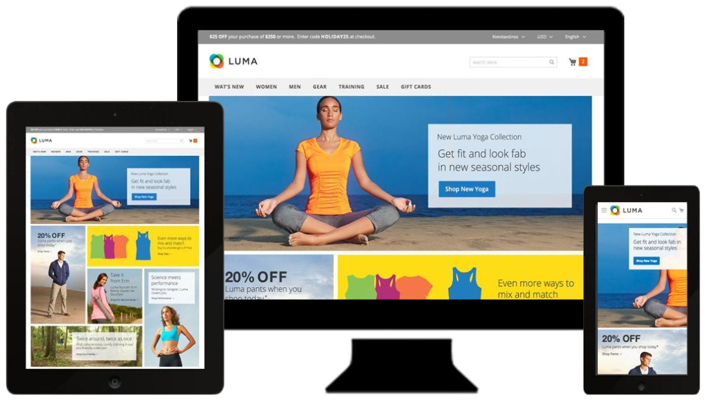
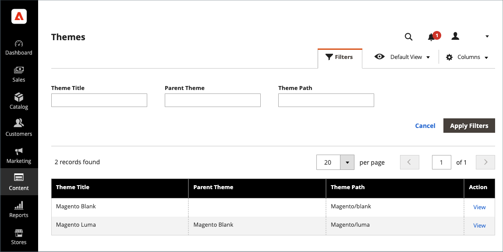
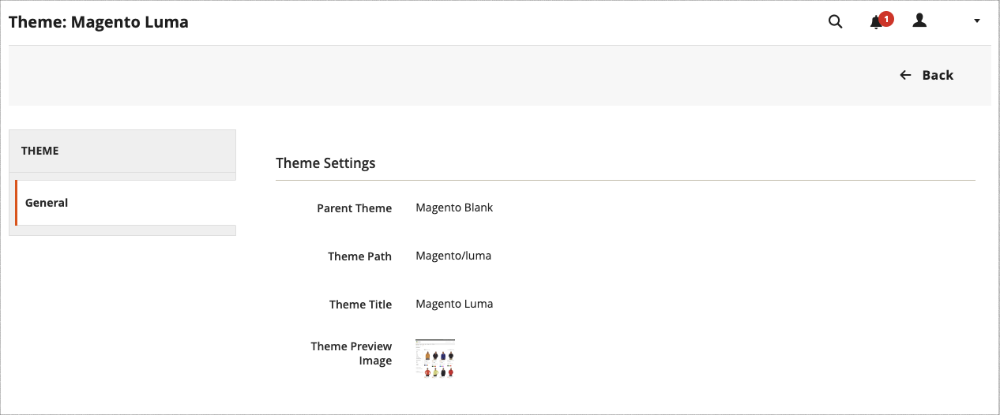
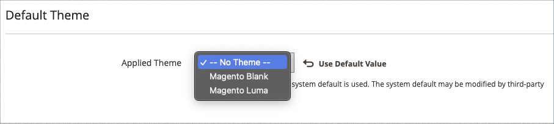
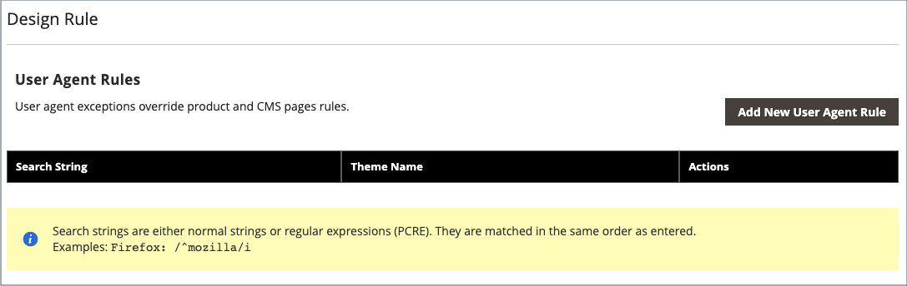

# テーマ

テーマは、ストアの視覚的なプレゼンテーションを決定するファイルのコレクションです。 [!DNL Commerce]を最初にインストールすると、ストアのデザイン要素は&#x200B;_Default_ テーマに基づきます。 [!DNL Commerce]のインストールに付属する初期のデフォルトテーマに加えて、_を_&#x200B;として使用したり、ニーズに合わせて変更したりできる、さまざまなテーマがあります。

レスポンシブテーマは、デバイスのビューポートに合わせてページレイアウトを調整します。 サンプル _Luma_&#x200B;のテーマには、デスクトップ、タブレット、モバイルデバイスから表示できる、柔軟でレスポンシブなレイアウトが用意されています。

[!DNL Commerce]個のテーマには、レイアウトファイル、テンプレートファイル、翻訳ファイル、スキンが含まれます。 スキンとは、対応するCSS、画像、JavaScript ファイルのコレクションで、お客様がストアを訪問したときに体験する視覚的なプレゼンテーションとインタラクションを作成します。 テーマとスキンは、Commerceのテーマデザインを理解し、サーバーにアクセスできる開発者やデザイン担当者が変更およびカスタマイズできます。 詳しくは、[_フロントエンド開発者ガイド_](https://developer.adobe.com/commerce/frontend-core/guide/themes/)を参照してください。

{width="600" zoomable="yes"}

## デフォルトテーマ

`Magento Blank` レスポンシブ テーマは、様々なデバイス向けにストアフロントの表示をレンダリングし、デスクトップ、テーブル、モバイルデバイス向けのベストプラクティスを組み込んでいます。 一部のテーマは、特定のデバイスでのみ使用できるように設計されています。 [!DNL Commerce]が特定のブラウザーIDまたはユーザーエージェントを検出すると、特定のブラウザー用に設定されたテーマが使用されます。 検索文字列には、Perl互換の正規表現（PCRE）を含めることもできます。

{width="700" zoomable="yes"}

### テーマグリッドをフィルタリング

1. _管理者_ サイドバーで、**[!UICONTROL Content]** > _[!UICONTROL Design]_>**[!UICONTROL Themes]**に移動します。

1. **[!UICONTROL Filters]**&#x200B;をクリックします。

1. ID範囲、テーマ名（またはタイトル）、フォルダーパス、または親テーマを入力します。

1. **[!UICONTROL Apply Filters]**&#x200B;をクリックしてテーマのリストを更新します。

## 現在のテーマ設定の表示

1. _管理者_ サイドバーで、**[!UICONTROL Content]** > _[!UICONTROL Design]_>**[!UICONTROL Themes]**に移動します。

1. インストールされたテーマのリストで、調べたいテーマを見つけ、行をクリックして設定を表示します。

1. サンプルページを表示するには、**[!UICONTROL Theme Preview Image]**&#x200B;をクリックします。

{width="600" zoomable="yes"}

## デフォルトのテーマの適用

1. _管理者_ サイドバーで、**[!UICONTROL Content]** > _[!UICONTROL Design]_>**[!UICONTROL Configuration]**に移動します。

1. 設定するストアビューを見つけ、_[!UICONTROL Action]_列の&#x200B;**[!UICONTROL Edit]**をクリックします。

1. _[!UICONTROL Default Theme]_で、**[!UICONTROL Applied Theme]**を現在のビューに使用するビューに設定します。

   {width="600" zoomable="yes"}

1. 完了したら、**[!UICONTROL Save Configuration]**&#x200B;をクリックします。

## ユーザーエージェントルールの追加

1. _管理者_ サイドバーで、**[!UICONTROL Content]** > _[!UICONTROL Design]_>**[!UICONTROL Configuration]**に移動します。

1. _[!UICONTROL Design Rule]_で、**[!UICONTROL Add New User Agent Rule]**をクリックします。

   {width="600" zoomable="yes"}

1. **[!UICONTROL Search String]**&#x200B;に、特定のデバイスのブラウザーIDを入力します。

   検索文字列は、入力された順序で一致します。 例えば、Firefoxの場合は次のように入力します。

   `/^mozilla/i`

1. 追加のデバイスを入力するには、このプロセスを繰り返します。

1. 完了したら、**[!UICONTROL Save Configuration]**&#x200B;をクリックします。
