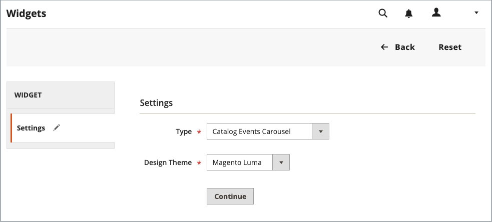

# カタログイベントカルーセルウィジェット

{{ee-feature}}

カタログイベントカルーセルウィジェットには、今後のイベントのスライダーと各イベントのカウントダウンティッカーが表示されます。 カルーセルを表示するページとページレイアウトの領域を選択し、一度に表示するイベントの幅と数を制御することができます。 取得する結果は、テーマ、ページ上での表示位置、選択したオプションによって異なります。

{width="700" zoomable="yes"}

## 手順 1：カタログカルーセルウィジェットを有効にする

開始する前に、[ 手順 ](../merchandising-promotions/event-configure.md) に従って _カタログイベント_ ウィジェットを設定し、ストアフロントに対して有効にします。

{width="500" zoomable="yes"}

## 手順 2：ウィジェットの作成

1. _管理者_ サイドバーで、**[!UICONTROL Content]**/_[!UICONTROL Elements]_/**[!UICONTROL Widgets]**&#x200B;に移動します。

1. 右上隅の「**[!UICONTROL Add Widget]**」をクリックします。

1. _[!UICONTROL Settings]_&#x200B;セクションで、次の操作を行います。

   - **[!UICONTROL Type]** を `Catalog Events Carousel` に設定します。

   - ストアで使用される **[!UICONTROL Design Theme]** を選択します。

1. 「**[!UICONTROL Continue]**」をクリックします。

   {width="500" zoomable="yes"}

1. _[!UICONTROL Storefront Properties]_&#x200B;セクションで、次の操作を行います。

   - **[!UICONTROL Widget Title]** しくは、ウィジェットのわかりやすいタイトルを入力します。

     このタイトルは、_管理者_ からのみ表示されます。

   - **[!UICONTROL Assign to Store Views]**：ウィジェットを表示するストア表示を選択します。

     特定のストア表示を選択することも、`All Store Views` を選択することもできます。 複数のビューを選択するには、Ctrl キー（PC）または Command キー（Mac）を押したまま、各オプションをクリックします。

   - （オプション） **[!UICONTROL Sort Order]** の場合は、数字を入力して、この項目がページの同じ部分に他の項目と共に表示される順序を決定します。 （`0` = 1 番目、`1` = 2 番目、`3` = 3 番目など）。

     {width="600" zoomable="yes"}

## 手順 3：場所の選択

1. 「_レイアウトの更新_」セクションで、「**[!UICONTROL Add Layout Update]**」をクリックします。

1. **[!UICONTROL Display On]** を `Specified Page` に設定します。

1. **[!UICONTROL Page]** を `CMS Home Page` に設定します。

1. 次のいずれか **[!UICONTROL Container]** 設定します。

   - `Main Content Area`
   - `Sidebar Additional`
   - `Sidebar Main`

   >[!NOTE]
   >
   >結果は、テーマやページのレイアウトによって異なります。 また、カテゴリ設定で _[!UICONTROL Catalog Events Carousel Default Template]_&#x200B;を指定する必要があります。

1. イベントカルーセルをストアフロントの別の場所に表示する場合は、「**[!UICONTROL Add Layout Update]**」をクリックし、その場所に対してこれらの手順を繰り返します。

   {width="600" zoomable="yes"}

1. 「**[!UICONTROL Save and Continue Edit]**」をクリックします。

   現時点では、メッセージを無視してキャッシュを更新できます。

## 手順 4：オプションの設定

1. 左側のパネルで「**[!UICONTROL Widget Options]**」を選択します。

1. **[!UICONTROL Frame Size]**：スライダーに同時にリストするイベントの数を入力します。

   一度に 1 つのイベントのみを表示するには、`1` と入力します。

1. **[!UICONTROL Scroll]**: クリックごとにスクロールするイベントの一覧の数を入力します。

   次のイベントまでスクロールするには、`1` と入力します。

1. カスタムの幅の場合は、**[!UICONTROL Block Custom Width]** のピクセル数を入力します。

   次のサンプルページでは、カスタムの幅を 250 ピクセルに設定しています。

   {width="400" zoomable="yes"}

1. 完了したら、「**[!UICONTROL Save]**」をクリックします。

1. キャッシュを更新するように求めるプロンプトが表示されたら、ページ上部のメッセージに記載されているリンクをクリックし、指示に従います。
