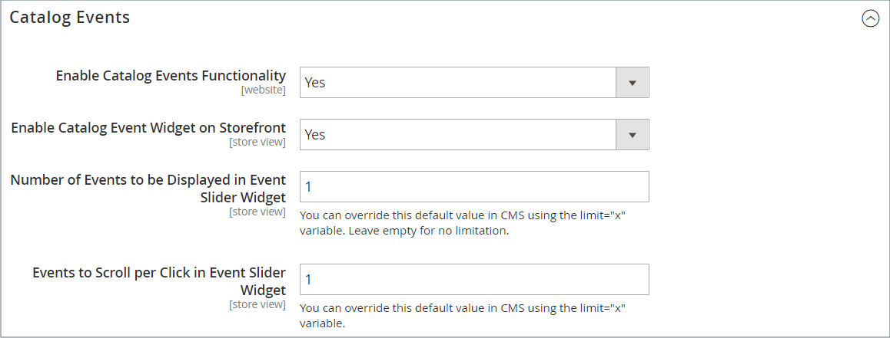
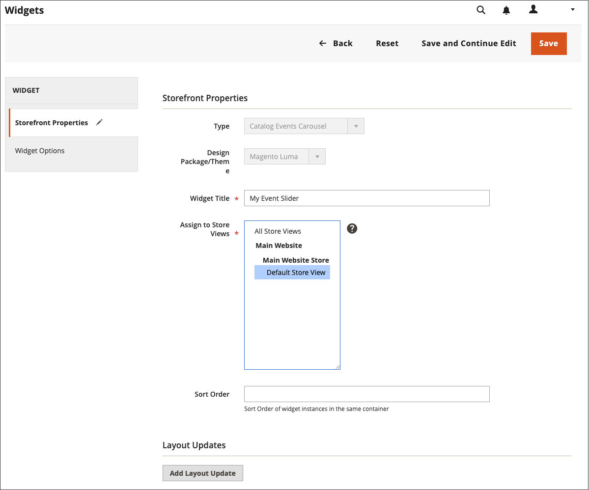
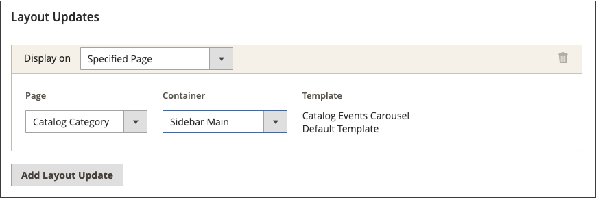
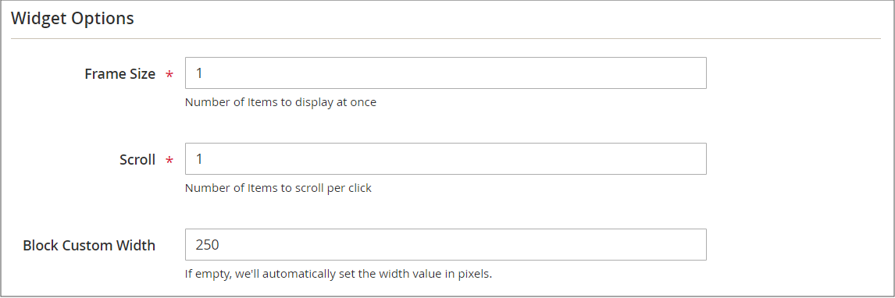

# カタログイベントカルーセルウィジェット

{{ee-feature}}

カタログイベントカルーセルウィジェットには、今後のイベントのスライダーと、各イベントのカウントダウンティッカーが表示されます。 カルーセルを表示するページレイアウトのページと領域を選択し、一度に表示されるイベントの幅と数を制御できます。 結果は、テーマ、ページ上に表示される場所、選択したオプションによって異なります。

{width="700" zoomable="yes"}

## 手順1：カタログカルーセルウィジェットを有効にする

開始する前に、[手順](../merchandising-promotions/event-configure.md)に従って、_カタログイベント_ ウィジェットを設定し、ストアフロントで有効にします。

{width="500" zoomable="yes"}

## 手順2：ウィジェットの作成

1. _管理者_ サイドバーで、**[!UICONTROL Content]** > _[!UICONTROL Elements]_>**[!UICONTROL Widgets]**&#x200B;に移動します。

1. 右上隅の「**[!UICONTROL Add Widget]**」をクリックします。

1. _[!UICONTROL Settings]_&#x200B;セクションで、次の操作を行います。

   - **[!UICONTROL Type]**&#x200B;を`Catalog Events Carousel`に設定します。

   - ストアで使用されている&#x200B;**[!UICONTROL Design Theme]**&#x200B;を選択します。

1. **[!UICONTROL Continue]**&#x200B;をクリックします。

   {width="500" zoomable="yes"}

1. _[!UICONTROL Storefront Properties]_&#x200B;セクションで、次の操作を行います。

   - 「**[!UICONTROL Widget Title]**」に、ウィジェットの説明的なタイトルを入力します。

     このタイトルは&#x200B;_管理者_&#x200B;からのみ表示されます。

   - **[!UICONTROL Assign to Store Views]**&#x200B;で、ウィジェットを表示するストアビューを選択します。

     特定のストアビュー、または`All Store Views`を選択できます。 複数のビューを選択するには、Ctrl キー（PC）またはCommand キー（Mac）を押しながら、各オプションをクリックします。

   - （オプション） **[!UICONTROL Sort Order]**&#x200B;の場合、ページの同じ部分で他のユーザーと一緒にこの項目を表示する順序を決定する番号を入力します。 （`0` = first, `1` = second, `3` = thirdなど）

     {width="600" zoomable="yes"}

## 手順3：場所の選択

1. _レイアウトの更新_ セクションで、**[!UICONTROL Add Layout Update]**&#x200B;をクリックします。

1. **[!UICONTROL Display On]**&#x200B;を`Specified Page`に設定します。

1. **[!UICONTROL Page]**&#x200B;を`CMS Home Page`に設定します。

1. 次のいずれかを&#x200B;**[!UICONTROL Container]**&#x200B;に設定します。

   - `Main Content Area`
   - `Sidebar Additional`
   - `Sidebar Main`

   >[!NOTE]
   >
   >テーマやページレイアウトによって結果は異なります。 また、カテゴリ設定で&#x200B;_[!UICONTROL Catalog Events Carousel Default Template]_&#x200B;を指定する必要があります。

1. イベントカルーセルをストアフロントの別の場所に表示する場合は、**[!UICONTROL Add Layout Update]**&#x200B;をクリックし、その場所に対してこれらの手順を繰り返します。

   {width="600" zoomable="yes"}

1. **[!UICONTROL Save and Continue Edit]**&#x200B;をクリックします。

   現時点では、キャッシュを更新するメッセージを無視できます。

## 手順4：オプションの設定

1. 左側のパネルで、**[!UICONTROL Widget Options]**&#x200B;を選択します。

1. **[!UICONTROL Frame Size]**&#x200B;に対して、同時にスライダーに一覧表示するイベントの数を入力します。

   一度に1つのイベントのみを表示するには、`1`と入力します。

1. **[!UICONTROL Scroll]**&#x200B;の場合、クリックごとにスクロールするイベントリストの数を入力します。

   次のイベントまでスクロールするには、`1`と入力します。

1. カスタム幅の場合は、**[!UICONTROL Block Custom Width]**&#x200B;のピクセル数を入力します。

   次のサンプルページでは、カスタム幅は250 ピクセルに設定されています。

   {width="400" zoomable="yes"}

1. 完了したら、**[!UICONTROL Save]**&#x200B;をクリックします。

1. キャッシュの更新を求めるメッセージが表示されたら、ページの上部にあるメッセージ内のリンクをクリックし、指示に従います。
