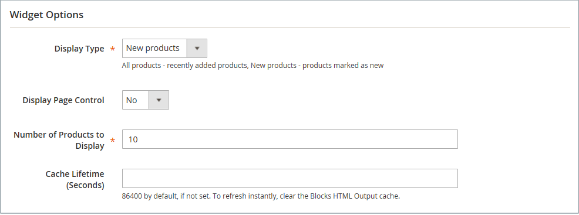

# 新製品リストウィジェット

新製品のリストは動的コンテンツの例であり、製品カタログから取得したライブデータで構成されています。 デフォルトでは、_新製品_ リストには、最近追加された製品の最初の 8 つが含まれています。 ただし、指定した日付範囲内の製品のみを含めるように設定することもできます。

{width="700" zoomable="yes"}

## 手順 1：各製品を新規製品として設定

 この手順はMagento Open Sourceにのみ適用されます。

Adobe Commerce ストアの場合は、[&#x200B; 更新のスケジュール &#x200B;](content-staging-scheduled-update.md) を参照し、このページの手順 2 に進みます。

日付範囲 _[!UICONTROL Set Product as New]_、スケジュールされた更新でのみ設定できます。

製品を「新規」に設定すると、その製品は _新製品_ リストに追加されます。 リストに含めたくない場合は、いつでも設定を戻すことができます。

1. _管理者_ サイドバーで、**[!UICONTROL Catalog]**/**[!UICONTROL Products]** に移動します。

1. 機能させる各製品を見つけて、編集モードで開きます。

1. **[!UICONTROL Set Product as New]** しくは、製品を新製品として設定するかどうかをオプションで切り替えます。

   {width="400" zoomable="yes"}

1. 完了したら、「**[!UICONTROL Save]**」をクリックします。

1. ページキャッシュを再インデックス化して更新するように求めるプロンプトが表示されたら、ページ上部のリンクをクリックし、指示に従います。

## 手順 2：ウィジェットの作成

新製品リストの内容とストア内での配置を決定するコードは、ウィジェットツールによって生成されます。

1. _管理者_ サイドバーで、**[!UICONTROL Content]**/_[!UICONTROL Elements]_/**[!UICONTROL Widgets]**&#x200B;に移動します。

1. 右上隅の「**[!UICONTROL Add Widget]**」をクリックします。

1. _[!UICONTROL Settings]_&#x200B;セクションで、次の操作を行います。

   - **[!UICONTROL Type]** を `Catalog New Products List` に設定します。

   - ストアで使用される **[!UICONTROL Design Theme]** を選択します。

1. 「**[!UICONTROL Continue]**」をクリックします。

   {width="600" zoomable="yes"}

1. _[!UICONTROL Storefront Properties]_&#x200B;セクションで、次の操作を行います。

   - **[!UICONTROL Widget Title]** しくは、ウィジェットのわかりやすいタイトルを入力します。 （このタイトルは、_管理者_ からのみ表示されます。）

   - **[!UICONTROL Assign to Store Views]**：ウィジェットを表示するストア表示を選択します。

     特定のストア表示を選択することも、`All Store Views` を選択することもできます。 複数のビューを選択するには、Ctrl キー（PC）または Command キー（Mac）を押したまま、各オプションをクリックします。

   - （オプション） **[!UICONTROL Sort Order]** の場合は、数字を入力して、この項目がページの同じ部分に他の項目と共に表示される順序を決定します。 （`0` = 1 番目、`1` = 2 番目、`3` = 3 番目など）。

   {width="600" zoomable="yes"}

## 手順 3：場所の選択

1. 「_[!UICONTROL Layout Updates]_」セクションで、「**[!UICONTROL Add Layout Update]**」をクリックします。

1. **[!UICONTROL Display On]** を `Specified Page.` に設定

1. **[!UICONTROL Page]** を `CMS Home Page` に設定します。

1. **[!UICONTROL Block Reference]** を `Main Content Area` に設定します。

1. **[!UICONTROL Template]** を次のいずれかに設定します。

   - `New Product List Template`
   - `New Products Grid Template`

     {width="600" zoomable="yes"}

1. 「**[!UICONTROL Save and Continue Edit]**」をクリックします。

   現時点では、メッセージを無視してキャッシュを更新できます。

## 手順 4：リストの設定

1. 左側のパネルで「**[!UICONTROL Widget Options]**」を選択します。

1. **[!UICONTROL Display Products]** を次のいずれかに設定します。

   - `All Products` – 最後に追加された製品から順に製品を一覧表示します。
   - `New Products` - _新規_ として識別される製品のみを一覧表示します。 製品は、_[!UICONTROL Set Product As New From/To]_&#x200B;で指定された日付範囲で、新規と見なされます。 新しい製品が定義されずに日付範囲が期限切れになった場合、リストは空になります。

1. 複数のページを含むリストのナビゲーション制御を提供するには、**[!UICONTROL Display Page Control]** を `Yes` に設定します。

   **[!UICONTROL Number of Products per Page]**：各ページに表示する製品の数を入力します。

1. 「**[!UICONTROL Number of Products to Display]**」オプションを、リストに含める新製品の数に設定します。

   デフォルト設定は `10` です。

1. **[!UICONTROL Cache Lifetime (Seconds)]** しくは、新製品のリストを更新する頻度を選択します。

   デフォルトでは、キャッシュは 86,400 秒（24 時間）に設定されています。

   {width="600" zoomable="yes"}

1. 完了したら、「**[!UICONTROL Save]**」をクリックします。

1. キャッシュを更新するように求めるプロンプトが表示されたら、ページ上部のメッセージに記載されているリンクをクリックし、指示に従います。

## 手順 5：作業のプレビュー

1. _管理者_ サイドバーで、**[!UICONTROL Content]**/_[!UICONTROL Elements]_/**[!UICONTROL Pages]**&#x200B;に移動します。

1. _新製品_ リストが表示されるグリッドでページを見つけ、「_[!UICONTROL Action]_」列の「**[!UICONTROL Preview]**」リンクをクリックします。
