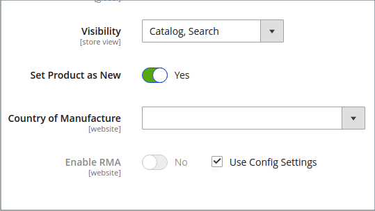

# 新製品リストウィジェット

この新製品リストは、動的コンテンツの一例であり、製品カタログから取得したライブデータで構成されています。 デフォルトでは、_新製品_ リストには、最近追加された製品の最初の8つが含まれます。 ただし、指定した日付範囲内の商品のみを含めるように設定することもできます。

{width="700" zoomable="yes"}

## ステップ 1：各製品を新製品として設定する

この手順は、Magento Open Sourceにのみ適用されます。

 Adobe Commerce ストアの場合は、[更新のスケジュール &#x200B;](content-staging-scheduled-update.md)を参照し、このページの手順2に進んでください。

_[!UICONTROL Set Product as New]_&#x200B;日付範囲の設定は、スケジュールされた更新でのみ設定できます。

製品を新規製品として設定すると、製品が&#x200B;_新規製品_ リストに追加されます。 リストに含めたくない場合は、任意の時点で設定を元に戻すことができます。

1. _管理者_ サイドバーで、**[!UICONTROL Catalog]** > **[!UICONTROL Products]**&#x200B;に移動します。

1. フィーチャーしたい各商品を見つけ、編集モードで開きます。

1. **[!UICONTROL Set Product as New]**&#x200B;の場合、製品を新しい製品として設定するかどうかのオプションを切り替えます。

   {width="400" zoomable="yes"}

1. 完了したら、**[!UICONTROL Save]**&#x200B;をクリックします。

1. ページキャッシュのインデックス再作成と更新を求めるメッセージが表示されたら、ページの上部にあるリンクをクリックし、指示に従います。

## 手順2：ウィジェットの作成

新製品リストの内容とストア内の配置を決定するコードは、ウィジェットツールによって生成されます。

1. _管理者_ サイドバーで、**[!UICONTROL Content]** > _[!UICONTROL Elements]_>**[!UICONTROL Widgets]**&#x200B;に移動します。

1. 右上隅の「**[!UICONTROL Add Widget]**」をクリックします。

1. _[!UICONTROL Settings]_&#x200B;セクションで、次の操作を行います。

   - **[!UICONTROL Type]**&#x200B;を`Catalog New Products List`に設定します。

   - ストアで使用されている&#x200B;**[!UICONTROL Design Theme]**&#x200B;を選択します。

1. **[!UICONTROL Continue]**&#x200B;をクリックします。

   {width="600" zoomable="yes"}

1. _[!UICONTROL Storefront Properties]_&#x200B;セクションで、次の操作を行います。

   - 「**[!UICONTROL Widget Title]**」に、ウィジェットの説明的なタイトルを入力します。 （このタイトルは&#x200B;_管理者_&#x200B;からのみ表示されます）。

   - **[!UICONTROL Assign to Store Views]**&#x200B;で、ウィジェットが表示されているストアビューを選択します。

     特定のストアビュー、または`All Store Views`を選択できます。 複数のビューを選択するには、Ctrl キー（PC）またはCommand キー（Mac）を押しながら、各オプションをクリックします。

   - （オプション） **[!UICONTROL Sort Order]**&#x200B;の場合、ページの同じ部分で他のユーザーと一緒にこの項目を表示する順序を決定する番号を入力します。 （`0` = first, `1` = second, `3` = thirdなど）

   {width="600" zoomable="yes"}

## 手順3：場所の選択

1. _[!UICONTROL Layout Updates]_&#x200B;セクションで、**[!UICONTROL Add Layout Update]**&#x200B;をクリックします。

1. **[!UICONTROL Display On]**&#x200B;を`Specified Page.`に設定

1. **[!UICONTROL Page]**&#x200B;を`CMS Home Page`に設定します。

1. **[!UICONTROL Block Reference]**&#x200B;を`Main Content Area`に設定します。

1. **[!UICONTROL Template]**&#x200B;を次のいずれかに設定します：

   - `New Product List Template`
   - `New Products Grid Template`

     {width="600" zoomable="yes"}

1. **[!UICONTROL Save and Continue Edit]**&#x200B;をクリックします。

   現時点では、キャッシュを更新するメッセージを無視できます。

## 手順4：リストの設定

1. 左側のパネルで、**[!UICONTROL Widget Options]**&#x200B;を選択します。

1. **[!UICONTROL Display Products]**&#x200B;を次のいずれかに設定します：

   - `All Products` – 最後に追加された製品から順番に製品を一覧表示します。
   - `New Products` - _new_&#x200B;として識別された製品のみを一覧表示します。 _[!UICONTROL Set Product As New From/To]_&#x200B;で指定された日付範囲内に、製品が新しいものと見なされます。 新しい製品が定義されないまま日付範囲が期限切れになる場合、リストは空になります。

1. 複数のページを含むリストのナビゲーション制御を提供するには、**[!UICONTROL Display Page Control]**&#x200B;を`Yes`に設定します。

   **[!UICONTROL Number of Products per Page]**&#x200B;に、各ページに表示する製品数を入力します。

1. **[!UICONTROL Number of Products to Display]** オプションを、リストに含める新製品の数に設定します。

   デフォルト設定は`10`です。

1. **[!UICONTROL Cache Lifetime (Seconds)]**&#x200B;について、新製品のリストを更新する頻度を選択します。

   デフォルトでは、キャッシュは86,400秒（24時間）に設定されています。

   {width="600" zoomable="yes"}

1. 完了したら、**[!UICONTROL Save]**&#x200B;をクリックします。

1. キャッシュの更新を求めるメッセージが表示されたら、ページの上部にあるメッセージ内のリンクをクリックし、指示に従います。

## 手順5：作業のプレビュー

1. _管理者_ サイドバーで、**[!UICONTROL Content]** > _[!UICONTROL Elements]_>**[!UICONTROL Pages]**&#x200B;に移動します。

1. _新製品_ リストが表示されるグリッドでページを見つけ、_[!UICONTROL Action]_&#x200B;列の&#x200B;**[!UICONTROL Preview]**&#x200B;リンクをクリックします。
