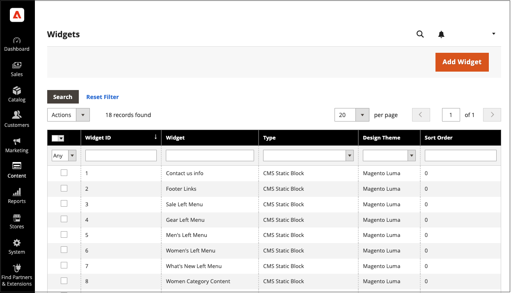

# 新しい製品リストウィジェット

新しい製品のリストは動的コンテンツの例で、製品カタログから取り込まれたライブデータで構成されます。 デフォルトでは、 _新製品_ リストには、最近追加された製品の最初の 8 つが含まれます。 ただし、指定した日付範囲の製品のみを含めるように設定することもできます。

{width="700" zoomable="yes"}

## 手順 1：各製品を新規として設定する

 この手順は、Magento Open Sourceのみに適用されます。

 Adobe Commerceストアについては、 [更新のスケジュール](content-staging-scheduled-update.md) 次に、このページの手順 2 に進みます。

_[!UICONTROL Set Product as New]_日付範囲の設定は、スケジュールされた更新でのみ設定できます。

製品を新規として設定すると、製品が _新製品_ リスト。 設定をリストに含めなくなった時点で、いつでも設定を元に戻すことができます。

1. 次の日： _管理者_ サイドバー、移動 **[!UICONTROL Catalog]** > **[!UICONTROL Products]**.

1. 機能させる各製品を見つけ、編集モードで開きます。

1. の場合 **[!UICONTROL Set Product as New]**、「 」オプションを切り替えて、製品を新しい製品として設定するかどうかを指定します。

   {width="400" zoomable="yes"}

1. 完了したら、「 **[!UICONTROL Save]**.

1. ページキャッシュのインデックスを再作成して更新するよう求められたら、ページ上部のリンクをクリックし、指示に従います。

## 手順 2：ウィジェットを作成する

「新規製品」リストの内容とストア内での配置を決定するコードは、ウィジェットツールによって生成されます。

1. 次の日： _管理者_ サイドバー、移動 **[!UICONTROL Content]** > _[!UICONTROL Elements]_>**[!UICONTROL Widgets]**.

1. 右上隅で、 **[!UICONTROL Add Widget]**.

1. Adobe Analytics の _[!UICONTROL Settings]_セクションで、以下の操作を実行します。

   - 設定 **[!UICONTROL Type]** から `Catalog New Products List`.

   - を選択します。 **[!UICONTROL Design Theme]** それは店で使われている。

1. クリック **[!UICONTROL Continue]**.

   {width="600" zoomable="yes"}

1. Adobe Analytics の _[!UICONTROL Storefront Properties]_セクションで、以下の操作を実行します。

   - の場合 **[!UICONTROL Widget Title]**」で、ウィジェットの説明的なタイトルを入力します。 ( このタイトルは、 _管理者_.)

   - の場合 **[!UICONTROL Assign to Store Views]**」で、ウィジェットを表示するストア表示回数を選択します。

     特定のストア表示を選択するか、 `All Store Views`. 複数のビューを選択するには、Ctrl キー (PC) または Command キー (Mac) を押しながら各オプションをクリックします。

   - （オプション）の場合 **[!UICONTROL Sort Order]**」、数値を入力して、この項目がページの同じ部分に他の項目と共に表示される順序を決定します。 (`0` =最初 `1` =秒 `3` = 3 番目、など )

   {width="600" zoomable="yes"}

## 手順 3：場所の選択

1. Adobe Analytics の _[!UICONTROL Layout Updates]_セクションで、**[!UICONTROL Add Layout Update]**.

1. 設定 **[!UICONTROL Display On]** から `Specified Page.`

1. 設定 **[!UICONTROL Page]** から `CMS Home Page`.

1. 設定 **[!UICONTROL Block Reference]** から `Main Content Area`.

1. 設定 **[!UICONTROL Template]** を次のいずれかに変更します。

   - `New Product List Template`
   - `New Products Grid Template`

     {width="600" zoomable="yes"}

1. クリック **[!UICONTROL Save and Continue Edit]**.

   現時点では、メッセージを無視してキャッシュを更新できます。

## 手順 4：リストの設定

1. 左側のパネルで、を選択します。 **[!UICONTROL Widget Options]**.

1. 設定 **[!UICONTROL Display Products]** を次のいずれかに変更します。

   - `All Products`  — 最後に追加された製品を順にリストします。
   - `New Products`  — として識別された製品のみをリストします _新規_. 製品は、 _[!UICONTROL Set Product As New From/To]_. 日付範囲が新しい製品が定義されずに期限切れになる場合、リストは空になります。

1. 複数のページを持つリストにナビゲーションコントロールを提供するには、 **[!UICONTROL Display Page Control]** から `Yes`.

   の場合 **[!UICONTROL Number of Products per Page]**」に、各ページに表示する製品数を入力します。

1. を設定します。 **[!UICONTROL Number of Products to Display]** オプションを選択して、リストに含める新規製品の数を指定します。

   デフォルト設定はです。 `10`.

1. の場合 **[!UICONTROL Cache Lifetime (Seconds)]**」で、新しい製品のリストを更新する頻度を選択します。

   デフォルトでは、キャッシュは 86,400 秒（24 時間）に設定されています。

   {width="600" zoomable="yes"}

1. 完了したら、「 **[!UICONTROL Save]**.

1. キャッシュを更新するよう求められたら、ページ上部のメッセージに表示されるリンクをクリックし、指示に従います。

## 手順 5：作業内容をプレビューする

1. 次の日： _管理者_ サイドバー、移動 **[!UICONTROL Content]** > _[!UICONTROL Elements]_>**[!UICONTROL Pages]**.

1. グリッド内のページで、 _新製品_ リストが表示され、 **[!UICONTROL Preview]** リンクを _[!UICONTROL Action]_列。
