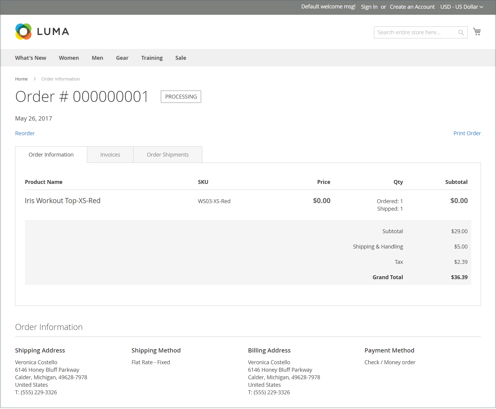

# 注文と返品ウィジェット

The _注文件数と返品数_ ウィジェットを使用すると、ゲストは注文のステータスを確認し、請求書を印刷し、出荷をトラッキングできます。 ウィジェットをストアフロントに追加すると、ゲストと、自分のアカウントにログインしていない顧客に対してのみ表示されます。 ゲストは、注文 ID、請求の姓、電子メールアドレスまたは郵便番号を指定することで、注文を検索できます。

{width="600" zoomable="yes"}

## ストアフロントの注文と戻りウィジェット

1. 顧客が **[!UICONTROL Find Order By]** オプションを使用して、次の順序の検索に使用するパラメーターの 1 つを選択します。

   - 電子メールアドレス
   - 郵便番号

1. 顧客が **[!UICONTROL Order ID]** および **[!UICONTROL Billing Last Name]**.

1. 請求を入力 **[!UICONTROL Email Address]** または **[!UICONTROL ZIP Code]** を含める必要があります。

1. クリック数 **[!UICONTROL Search]** をクリックして注文を取得します。

   {width="700" zoomable="yes"}

## 注文と返品ウィジェットの設定

1. 次の日： _管理者_ サイドバー、移動 **[!UICONTROL Content]** > _[!UICONTROL Elements]_>**[!UICONTROL Widgets]**.

1. 右上隅で、 **[!UICONTROL Add Widget]**.

1. Adobe Analytics の _[!UICONTROL Settings]_セクションで、以下の操作を実行します。

   - 設定 **[!UICONTROL Type]** から `Orders and Returns`.

   - を選択します。 **[!UICONTROL Design Theme]** それは店で使われている。

1. クリック **[!UICONTROL Continue]**.

1. Adobe Analytics の _[!UICONTROL Storefront Properties]_セクションで、以下の操作を実行します。

   - の場合 **[!UICONTROL Widget Title]**」で、ウィジェットの説明的なタイトルを入力します。

     このタイトルは管理者からのみ表示されます。

   - の場合 **[!UICONTROL Assign to Store Views]**」で、ウィジェットを表示するストア表示回数を選択します。

     特定のストア表示を選択するか、 `All Store Views`. 複数のビューを選択するには、Ctrl キー (PC) または Command キー (Mac) を押しながら各オプションをクリックします。

   - （オプション）の場合 **[!UICONTROL Sort Order]**」、数値を入力して、この項目がページの同じ部分に他の項目と共に表示される順序を決定します。 (`0` =最初 `1` =秒 `3` = 3 番目、など )

1. Adobe Analytics の _[!UICONTROL Layout Updates]_セクションで、**[!UICONTROL Add Layout Update]**次の操作を実行します。

   - 設定 **[!UICONTROL Display On]** を、ウィジェットを表示するページのタイプに追加します。

   - ウィジェットがページ上のどこに表示されるかを決定するには、残りのレイアウト更新情報を入力します。

1. 完了したら、「 **[!UICONTROL Save]**.

1. キャッシュを更新するよう求められたら、ページ上部のメッセージに表示されるリンクをクリックし、指示に従います。
