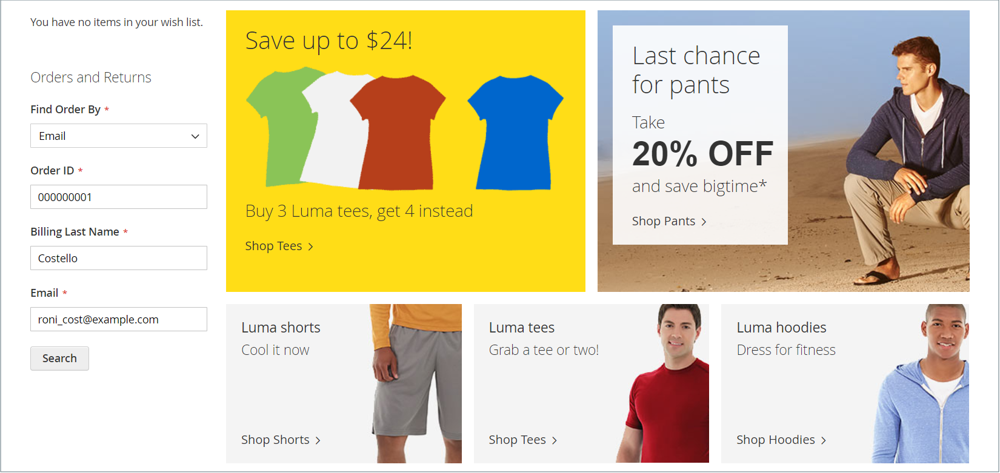

# 注文と返品のウィジェット

_注文と返品_ ウィジェットを使用すると、ゲストは注文のステータスを確認し、請求書を印刷し、配送を追跡できます。 ウィジェットがストアフロントに追加されると、ゲストとアカウントにログインしていない顧客にのみ表示されます。 ご注文の際には、注文ID、請求先姓、メールアドレスまたは郵便番号を入力します。

{width="600" zoomable="yes"}

## ストアフロントの注文と返品のウィジェット

1. お客様は、**[!UICONTROL Find Order By]** オプションを使用して、注文を検索するために使用する次のいずれかのパラメーターを選択できます。

   - メールアドレス
   - 郵便番号

1. お客様が&#x200B;**[!UICONTROL Order ID]**&#x200B;と&#x200B;**[!UICONTROL Billing Last Name]**&#x200B;にエントリします。

1. 注文に関連付けられている請求&#x200B;**[!UICONTROL Email Address]**&#x200B;または&#x200B;**[!UICONTROL ZIP Code]**&#x200B;のいずれかを入力します。

1. **[!UICONTROL Search]**&#x200B;をクリックして注文を取得します。

   {width="700" zoomable="yes"}

## 注文と返品ウィジェットの設定

1. _管理者_ サイドバーで、**[!UICONTROL Content]** > _[!UICONTROL Elements]_>**[!UICONTROL Widgets]**&#x200B;に移動します。

1. 右上隅の「**[!UICONTROL Add Widget]**」をクリックします。

1. _[!UICONTROL Settings]_&#x200B;セクションで、次の操作を行います。

   - **[!UICONTROL Type]**&#x200B;を`Orders and Returns`に設定します。

   - ストアで使用されている&#x200B;**[!UICONTROL Design Theme]**&#x200B;を選択します。

1. **[!UICONTROL Continue]**&#x200B;をクリックします。

1. _[!UICONTROL Storefront Properties]_&#x200B;セクションで、次の操作を行います。

   - 「**[!UICONTROL Widget Title]**」に、ウィジェットの説明的なタイトルを入力します。

     このタイトルは、管理者からのみ表示されます。

   - **[!UICONTROL Assign to Store Views]**&#x200B;で、ウィジェットが表示されているストアビューを選択します。

     特定のストアビュー、または`All Store Views`を選択できます。 複数のビューを選択するには、Ctrl キー（PC）またはCommand キー（Mac）を押しながら、各オプションをクリックします。

   - （オプション） **[!UICONTROL Sort Order]**&#x200B;の場合、ページの同じ部分で他のユーザーと一緒にこの項目を表示する順序を決定する番号を入力します。 （`0` = first, `1` = second, `3` = thirdなど）

1. _[!UICONTROL Layout Updates]_&#x200B;セクションで、**[!UICONTROL Add Layout Update]**&#x200B;をクリックし、次の操作を行います。

   - **[!UICONTROL Display On]**&#x200B;を、ウィジェットを表示するページの種類に設定します。

   - ウィジェットがページ上のどこに表示されるかを判断するには、残りのレイアウト更新情報を完了します。

1. 完了したら、**[!UICONTROL Save]**&#x200B;をクリックします。

1. キャッシュの更新を求めるメッセージが表示されたら、ページの上部にあるメッセージ内のリンクをクリックし、指示に従います。
