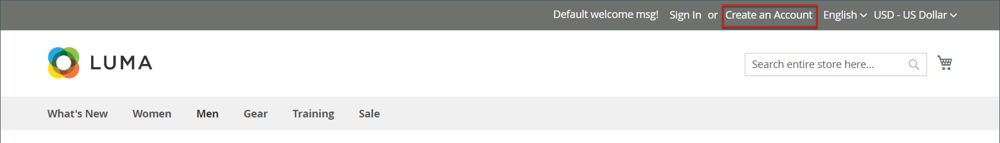
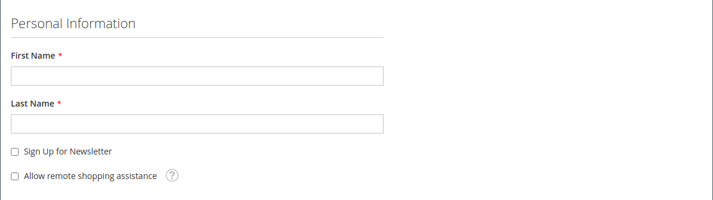

# 個々の顧客アカウントの作成

ストアへの訪問者はアカウントを開いて、購入とアクティビティを管理できます。 顧客は通常、ストアから独自のアカウントを作成します。 ただし、管理者から直接カスタマーアカウントを作成することもできます。これは、電話を介して顧客を支援するのに役立ちます。

以下の手順は、デフォルトの顧客アカウント設定を表しています。 フォーム内の一部のフィールドの選択と動作を変更するには、を参照してください。 [顧客アカウントの設定](../customers/customer-account-scope.md).

ストア管理者は、 [新規アカウントオプション](../customers/account-options-new.md) 新規登録済みの顧客に確認メールを送信します。これは、登録済みのアカウントが有効であることを確認するのに役立ちます。

>[!NOTE]
>
>バージョン 2.4.7 以降、ブラウザーに関係なく、メールによる確認後にアカウントにログインするには、メールとパスワードを再入力する必要があります。

## ストアフロントからアカウントを作成

店舗顧客がストアフロントでアカウントを作成します。

1. ストアフロントから、をクリックします **[!UICONTROL Create an Account]** ヘッダーの右上隅

   {width="700" zoomable="yes"}

1. 次の下 **[!UICONTROL Personal Information]**、がを入力 **[!UICONTROL First Name]** および **[!UICONTROL Last Name]**.

   {width="600" zoomable="yes"}

1. 名前とメールアドレスをニュースレター購読者のリストに追加する場合、顧客は次の購読者を選択します **[!UICONTROL Sign Up for Newsletter]** チェックボックス。

   >[!INFO]
   >
   > このオプションは、ストアがニュースレターを公開していない場合でも表示されます。

1. 店舗サポートスタッフに次のことを行わせたい場合 [彼らが見るものを見る](../customers/login-as-customer.md) リモート アシスタンスを提供する場合、お客様は次の項目を選択します **[!UICONTROL Allow remote shopping assistance]** チェックボックス。

1. 次の下 **[!UICONTROL Sign-in Information]**、がを入力 **[!UICONTROL Email]** 住所。

   >[!INFO]
   >
   > このメールアドレスは、ログイン資格情報の一部になり、他のカスタマーアカウントに関連付けることはできません。

   {width="600" zoomable="yes"}

1. エントリ数：a **[!UICONTROL Password]** これには、次の 3 種類の情報が含まれます。

   - 小文字
   - 大文字
   - 数値
   - 特殊文字

   押した後 **[!UICONTROL Enter]**&#x200B;の場合、パスワードの強度が評価され、フィールドの下に表示されます。 パスワードが _弱_&#x200B;として評価されるまで別のを試します _強_.

   {width="600" zoomable="yes"}

1. その後、顧客は次の目的で再度入力します **[!UICONTROL Confirm Password]**.

1. 必要に応じて、クリックします **[!UICONTROL Show Password]** をクリックして、入力したパスワードを表示します。

1. 完了したら、をクリックします **アカウントの作成**.

この場合、顧客はメールアドレスとパスワードを次の目的で使用できます [ログイン](../customers/customer-sign-in.md) をユーザーのアカウントに送信し、アドレス情報を入力します。

## 管理者からのアカウントの作成

マーチャントは、管理者から顧客アカウントを作成できます。

1. 日 _Admin_ サイドバー、に移動 **[!UICONTROL Customers]** > **[!UICONTROL All Customers]**.

1. クリック **[!UICONTROL Add New Customer]**.

### 手順 1：アカウント情報の入力

{width="700" zoomable="yes"}

1. が含まれる **[!UICONTROL Account Information]** セクションで、次の操作を行います。

   - マルチサイトインストールの場合、次のように設定します **[!UICONTROL Associate to Website]** を顧客アカウントが適用される web サイトに追加します。
   - 該当する場合、顧客を別のに割り当てます **[!UICONTROL Customer Group]**.
   - を使用している場合 [VAT ID の検証](../stores-purchase/vat.md) そして、次の操作を行います **[!UICONTROL Disable Automatic Group Change Based on VAT ID]**&#x200B;を選択し、「」チェックボックスをオンにします。

1. 必須フィールドに入力します。

   - **[!UICONTROL First Name]**
   - **[!UICONTROL Last Name]**
   - **[!UICONTROL Email]**

1. 必要に応じて、オプションのフィールドに入力します。

   - **[!UICONTROL Name Prefix]**
   - **[!UICONTROL Middle Name/Initial]**
   - **[!UICONTROL Name Suffix]**
   - **[!UICONTROL Date of Birth]**
   - **[!UICONTROL Tax/VAT Number]**
   - **[!UICONTROL Gender]**

   >[!WARNING]
   >
   >現在のセキュリティおよびプライバシーのベストプラクティスに従い、顧客の完全な生年月日（月、日、年）を他の個人識別子と保存することに関連して、法的およびセキュリティ上の潜在的なリスクがあることを認識しておいてください。 顧客の完全な生年月日の保存を制限し、代わりに顧客の生年月日を使用することをお勧めします。

1. を設定 **[!UICONTROL Send Welcome Email From]** をストア表示に追加します _ようこそ_ メールが送信されます。

   >[!INFO]
   >
   > ストアが別ののビューを持つ場合 [languages](../stores-purchase/store-localize.md)この設定によって、「ようこそ」のメールの言語が決まります。

1. クリック **[!UICONTROL Save and Continue Edit]** ページの上部

   >[!INFO]
   >
   >顧客アカウントを保存すると、すべてのオプションが左側のパネルとページ上部のメニューに表示されます。 この _[!UICONTROL Customer View]_tab キーを押すと、アカウントの概要が表示されます。

   {width="600" zoomable="yes"}

### 手順 2：アドレス情報の入力

1. 左パネルで、を選択します。 **[!UICONTROL Addresses]** をクリックして、 **[!UICONTROL Add New Addresses]**.

1. 請求と発送の両方に同じ住所が使用されている場合は、両方のオプションを切り替えます。

   - **[!UICONTROL Default Billing Address]**
   - **[!UICONTROL Default Shipping Address]**

   {width="600" zoomable="yes"}

1. 下にスクロールして、2 番目の列の必須のアドレスフィールドに入力します。

   - **[!UICONTROL Street Address]**
   - **[!UICONTROL City]**
   - **[!UICONTROL Country]**
   - **[!UICONTROL State/Province]**
   - **[!UICONTROL ZIP/Postal Code]**

1. を入力 **[!UICONTROL Phone Number]** この住所に対して。

1. 該当する場合、 **[!UICONTROL VAT Number]** 顧客に関連付けられます。

1. このアドレスがアカウントに必要な唯一のアドレスである場合、 **[!UICONTROL Save]**.

   それ以外の場合は、 **[!UICONTROL Save and Continue Edit]** ここまでの手順を繰り返して、アドレスを追加します。

   新しいアドレスがに表示されます。 [!UICONTROL Addresses] が選択されたページ _[!UICONTROL Default Billing]_および_[!UICONTROL Default Shipping]_ 完全なリストより上のアドレス。

   {width="600" zoomable="yes"}

### 手順 3：パスワードのリセット

管理者から作成された顧客アカウントには、最初にパスワードが割り当てられていません。

1. グリッドで新しい顧客アカウントを見つけます。

1. クリック **[!UICONTROL Edit]** が含まれる _[!UICONTROL Action]_列。

1. ページ上部のメニューバーで、 **[!UICONTROL Reset Password]**.

1. パスワードの設定手順を記載した通知がアカウント所有者に送信されます。

## ボタンバー

プロファイルを初めて保存するときに、追加のボタンが使用可能になります。 詳しくは、 [顧客プロファイルの更新](../customers/update-account.md).

| ボタン | 説明 |
|--- |--- |
| **[!UICONTROL Back]** | に戻ります。 _[!UICONTROL Customers]_変更を保存しないページ。 |
| **[!UICONTROL Delete Customer]** | 現在の顧客を削除します。 顧客に関連付けられている完了済み注文は削除されません。 |
| **[!UICONTROL Reset]** | 顧客フォーム内の未保存の変更をすべて以前の値にリセットします。 |
| **[!UICONTROL Create Order]** | 顧客の注文を作成します。 |
| **[!UICONTROL Reset Password]** | を送信 [パスワードをリセット](../customers/password-reset.md) メールで顧客にリンクします。 |
| **[!UICONTROL Force Sign-in]** | 顧客アカウントに関連付けられている OAuth アクセストークンを失効させます。 この関数は、web API の一部として OAuth トークンが割り当てられている顧客アカウントでのみ使用できます [統合](../systems/integrations.md). 詳しくは、 [OAuth ベースの認証](https://developer.adobe.com/commerce/webapi/get-started/authentication/gs-authentication-oauth/) 開発者向けドキュメント |
| **[!UICONTROL Manage Shopping Cart]** | 管理者は、顧客の買い物かごを管理できます。 |
| **[!UICONTROL Save and Continue Edit]** | 変更を保存し、顧客プロファイルを開いたままにします。 |
| **[!UICONTROL Save Customer]** | 変更を保存し、顧客プロファイルを閉じます。 |

{style="table-layout:auto"}

## フィールドの説明

### [!UICONTROL Account Information]

| フィールド | 説明 |
|--- |--- |
| **[!UICONTROL Associate to Website]** | 顧客アカウントに関連付けられている web サイトを識別します。 |
| **[!UICONTROL Group]** | は、 [顧客グループ](../customers/customer-groups.md) 顧客がメンバーである場合。 該当する場合は、チェックボックスを選択して、VAT に基づく自動グループ変更を無効にします。 |
| **[!UICONTROL Name Prefix]** | 使用する場合は、顧客の名前に関連付けられたプレフィックス（Mr.、Ms.、Dr.など）。 プレフィックスの値は [設定](../configuration-reference/customers/customer-configuration.md). 設定に応じて、入力コントロールはテキストフィールドまたはオプションのリストになります。 |
| **[!UICONTROL First Name]** | 顧客の名。 |
| **[!UICONTROL Middle Name / Initial]** | 顧客のミドルネームまたはイニシャル。 このフィールドは、 [設定](../configuration-reference/customers/customer-configuration.md) トピック。 |
| **[!UICONTROL Last Name]** | 顧客の姓。 |
| **[!UICONTROL Name Suffix]** | 使用する場合、顧客の名前に関連付けられたサフィックス （Jr.、Sr.、III など）。 サフィックスの値は、 [設定](../configuration-reference/customers/customer-configuration.md). 設定に応じて、入力コントロールはテキストフィールドまたはオプションのドロップダウンリストになります。 |
| **[!UICONTROL Email]** | 顧客の電子メールアドレス。 |
| **[!UICONTROL Date of Birth]** | 顧客の生年月日。 に指定されている場合、生年月日も含まれます。 [設定](../configuration-reference/customers/customer-configuration.md) トピック。   現在のセキュリティおよびプライバシーのベストプラクティスに従い、顧客の完全な生年月日（月、日、年）を他の個人識別子と保存することに関連して、法的およびセキュリティ上の潜在的なリスクがあることを認識しておいてください。 顧客の完全な生年月日の保存を制限し、代替として顧客の生年月日の使用を提案することをお勧めします。 |
| **[!UICONTROL Tax / VAT Number]** | 顧客の税金または付加価値税番号（該当する場合）。 |
| **[!UICONTROL Gender]** | 顧客の性別を識別します。 で指定されている場合、性別が含まれます [設定](../configuration-reference/customers/customer-configuration.md). オプション： `Male` / `Female` / `Not Specified` |
| **[!UICONTROL Send Welcome Email From]** | 複数のストア表示がある場合、この設定によって、ようこそメッセージの送信元となるストア表示が識別されます。 異なる言語でストア表示を使用する場合は、この設定によってようこそメールの言語が決まります。 |

### [!UICONTROL Addresses]

| フィールド | 説明 |
|--- |--- |
| **[!UICONTROL New Addresses]** | 新しいアドレスのタイプを識別します。 オプション： `Default Billing Address` / `Default Shipping Address` |
| **[!UICONTROL Add New Addresses]** | 入力する住所の種類を識別する別の [ 新しい住所 ] セクションを表示します。 |
| **[!UICONTROL Company]** | この住所に該当する場合は、会社名。 |
| **[!UICONTROL Street Address]** | 顧客の住所。 番地の 2 行目は、 [設定](../configuration-reference/customers/customer-configuration.md) トピック。 |
| **[!UICONTROL City]** | 顧客の住所がある市区町村。 |
| **[!UICONTROL Country]** | 顧客の住所がある国。 |
| **[!UICONTROL State/Province]** | 顧客の住所がある都道府県。 |
| **[!UICONTROL Zip/Postal Code]** | 顧客の住所の郵便番号。 |
| **[!UICONTROL Phone Number]** | 住所に関連付けられている顧客の電話番号。 |
| **[!UICONTROL VAT Number]** | 該当する場合、この住所の顧客に適用される付加価値税番号。 |
