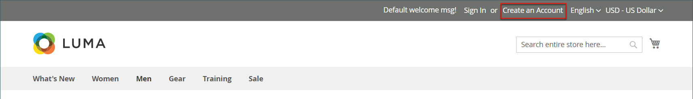
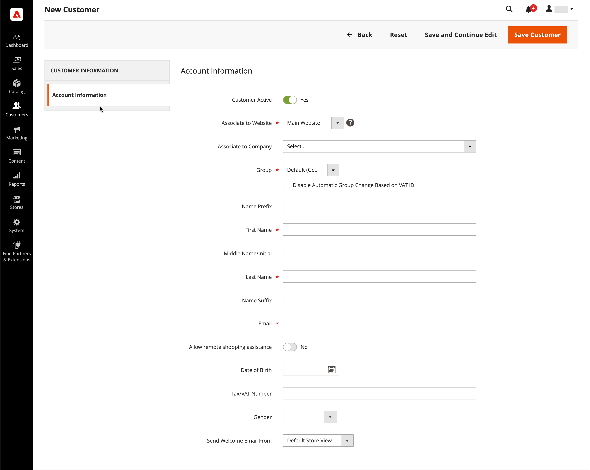
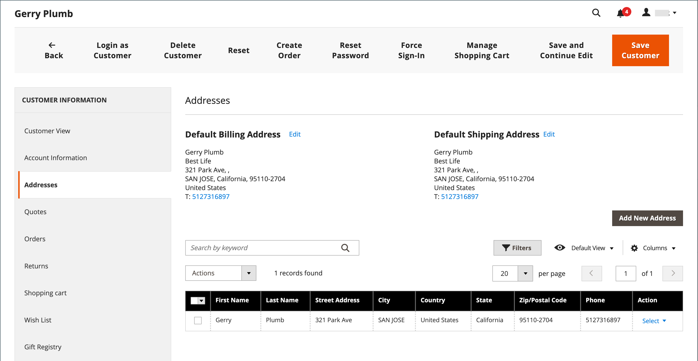

# 個々の顧客アカウントの作成

ストアを訪れた訪問者は、アカウントを開設して購入やアクティビティを管理できます。 顧客は通常、ストアから独自のアカウントを作成します。 ただし、管理者から直接顧客アカウントを作成することもできます。これは、電話での顧客支援に役立ちます。

次の手順は、デフォルトの顧客アカウント設定を示しています。 フォーム内の一部のフィールドの選択と動作を変更するには、[顧客アカウントの設定](../customers/customer-account-scope.md)を参照してください。

ストア管理者は、[新しいアカウントオプション &#x200B;](../customers/account-options-new.md)を設定して、新しい登録済み顧客に確認メールを送信することもできます。これは、登録アカウントが有効であることを確認するのに役立ちます。

>[!NOTE]
>
>バージョン 2.4.7以降、お客様は、ブラウザーに関係なく、メール確認後にアカウントにログインするために、メールとパスワードを再入力する必要があります。

## ストアフロントからアカウントを作成する

ストアフロントでアカウントを作成するストアユーザー。

1. ストアフロントから、ヘッダーの右上隅にある&#x200B;**[!UICONTROL Create an Account]**&#x200B;をクリックします。

   {width="700" zoomable="yes"}

1. **[!UICONTROL Personal Information]**&#x200B;の下に、**[!UICONTROL First Name]**&#x200B;と&#x200B;**[!UICONTROL Last Name]**&#x200B;を入力します。

   {width="600" zoomable="yes"}

1. ニュースレター購読者のリストに名前と電子メールアドレスを追加する場合、顧客は「**[!UICONTROL Sign Up for Newsletter]**」チェックボックスを選択します。

   >[!INFO]
   >
   > このオプションは、ストアがニュースレターを公開しない場合でも表示されます。

1. ストアサポートスタッフに[表示されたものを確認して](../customers/login-as-customer.md) リモートサポートを提供する場合、お客様は&#x200B;**[!UICONTROL Allow remote shopping assistance]** チェックボックスを選択します。

1. **[!UICONTROL Sign-in Information]**&#x200B;の下に、**[!UICONTROL Email]**&#x200B;のアドレスを入力します。

   >[!INFO]
   >
   > このメールアドレスはログイン資格情報の一部となり、他の顧客アカウントに関連付けることはできません。

   {width="600" zoomable="yes"}

1. 次の3種類の情報を含む&#x200B;**[!UICONTROL Password]**&#x200B;を入力します。

   - 小文字
   - 大文字
   - 数値
   - 特殊文字

   **[!UICONTROL Enter]**&#x200B;を押すと、パスワードの強度が評価され、フィールドの下に表示されます。 パスワードが&#x200B;_Weak_&#x200B;と見なされる場合は、_Strong_&#x200B;と評価されるまで別のパスワードを試してください。

   {width="600" zoomable="yes"}

1. 次に、お客様が再度&#x200B;**[!UICONTROL Confirm Password]**&#x200B;に入力します。

1. 必要に応じて、**[!UICONTROL Show Password]**&#x200B;をクリックして、入力したパスワードを表示します。

1. 完了したら、**アカウントの作成**&#x200B;をクリックします。

その後、お客様は電子メールアドレスとパスワードを使用して、アカウントに[&#x200B; ログイン &#x200B;](../customers/customer-sign-in.md)し、アドレス情報を入力できます。

## 管理者からアカウントを作成

販売者は、管理者から顧客アカウントを作成できます。

1. _管理者_ サイドバーで、**[!UICONTROL Customers]** > **[!UICONTROL All Customers]**&#x200B;に移動します。

1. **[!UICONTROL Add New Customer]**&#x200B;をクリックします。

### 手順1：アカウント情報の入力

{width="700" zoomable="yes"}

1. **[!UICONTROL Account Information]** セクションで、次の操作を行います。

   - マルチサイト インストールの場合は、顧客アカウントが適用されるweb サイトに&#x200B;**[!UICONTROL Associate to Website]**&#x200B;を設定します。
   - 該当する場合は、顧客を別の&#x200B;**[!UICONTROL Customer Group]**&#x200B;に割り当てます。
   - [VAT ID検証](../stores-purchase/vat.md)を使用していて&#x200B;**[!UICONTROL Disable Automatic Group Change Based on VAT ID]**&#x200B;を希望する場合は、チェックボックスを選択します。

1. 必須フィールドに入力します。

   - **[!UICONTROL First Name]**
   - **[!UICONTROL Last Name]**
   - **[!UICONTROL Email]**

1. 必要に応じて、オプションのフィールドに入力します。

   - **[!UICONTROL Name Prefix]**
   - **[!UICONTROL Middle Name/Initial]**
   - **[!UICONTROL Name Suffix]**
   - **[!UICONTROL Date of Birth]**
   - **[!UICONTROL Tax/VAT Number]**
   - **[!UICONTROL Gender]**

   >[!WARNING]
   >
   >現在のセキュリティとプライバシーのベストプラクティスに従って、顧客の生年月日（月、日、年）を他の個人識別子と保管することに関連する潜在的な法的およびセキュリティリスクを認識してください。 お客様の完全な生年月日の保存を制限し、お客様の生年月日を代替手段として使用することをお勧めします。

1. **[!UICONTROL Send Welcome Email From]**&#x200B;を、_ようこそ_&#x200B;電子メールの送信元となるストアビューに設定します。

   >[!INFO]
   >
   > ストアに異なる[言語](../stores-purchase/store-localize.md)のビューがある場合、この設定によってウェルカムメールの言語が決まります。

1. ページの上部にある「**[!UICONTROL Save and Continue Edit]**」をクリックします。

   >[!INFO]
   >
   >顧客アカウントを保存すると、オプションの完全なセットが左側のパネルとページ上部のメニューに表示されます。 「_[!UICONTROL Customer View]_」タブには、アカウントの概要が表示されます。

   {width="600" zoomable="yes"}

### 手順2：アドレス情報の入力

1. 左側のパネルで、**[!UICONTROL Addresses]**&#x200B;を選択し、**[!UICONTROL Add New Addresses]**&#x200B;をクリックします。

1. 請求と配送の両方に同じ住所が使用されている場合は、両方のオプションを切り替えます。

   - **[!UICONTROL Default Billing Address]**
   - **[!UICONTROL Default Shipping Address]**

   {width="600" zoomable="yes"}

1. 下にスクロールして、2番目の列の必須アドレスフィールドに入力します。

   - **[!UICONTROL Street Address]**
   - **[!UICONTROL City]**
   - **[!UICONTROL Country]**
   - **[!UICONTROL State/Province]**
   - **[!UICONTROL ZIP/Postal Code]**

1. このアドレスの&#x200B;**[!UICONTROL Phone Number]**&#x200B;を入力してください。

1. 該当する場合は、顧客に関連付けられている&#x200B;**[!UICONTROL VAT Number]**&#x200B;を入力します。

1. このアドレスのみがアカウントに必要なアドレスである場合は、**[!UICONTROL Save]**&#x200B;をクリックします。

   それ以外は、**[!UICONTROL Save and Continue Edit]**&#x200B;をクリックし、前の手順を繰り返してアドレスを追加します。

   新しいアドレスが[!UICONTROL Addresses] ページに表示され、選択した&#x200B;_[!UICONTROL Default Billing]_&#x200B;と_[!UICONTROL Default Shipping]_&#x200B;のアドレスがリスト全体の上に表示されます。

   {width="600" zoomable="yes"}

### 手順3：パスワードのリセット

管理者から作成されたお客様のアカウントには、最初にパスワードが割り当てられていません。

1. 新しい顧客アカウントを見つけます。

1. _[!UICONTROL Action]_&#x200B;列の&#x200B;**[!UICONTROL Edit]**&#x200B;をクリックします。

1. ページ上部のメニューバーで、**[!UICONTROL Reset Password]**&#x200B;をクリックします。

1. パスワードの設定手順を記載した通知がアカウント所有者に送信されます。

## ボタンバー

プロファイルが初めて保存されると、追加のボタンが使用できるようになります。 詳しくは、[顧客プロファイルの更新](../customers/update-account.md)を参照してください。

| ボタン | 説明 |
|--- |--- |
| **[!UICONTROL Back]** | 変更を保存せずに&#x200B;_[!UICONTROL Customers]_&#x200B;ページに戻ります。 |
| **[!UICONTROL Delete Customer]** | 現在の顧客を削除します。 お客様に関連付けられている完了した注文は削除されません。 |
| **[!UICONTROL Reset]** | 顧客フォームの未保存の変更を以前の値にリセットします。 |
| **[!UICONTROL Create Order]** | 顧客の注文を作成します。 |
| **[!UICONTROL Reset Password]** | [&#x200B; パスワードのリセット &#x200B;](../customers/password-reset.md) リンクを電子メールでお客様に送信します。 |
| **[!UICONTROL Force Sign-in]** | 顧客アカウントに関連付けられているOAuth アクセストークンを取り消します。 この関数は、Web API [統合](../systems/integrations.md)の一部としてOAuth トークンが割り当てられている顧客アカウントでのみ使用できます。 詳しくは、開発者ドキュメントの[OAuth ベースの認証](https://developer.adobe.com/commerce/webapi/get-started/authentication/gs-authentication-oauth/)を参照してください。 |
| **[!UICONTROL Manage Shopping Cart]** | 管理者が顧客のショッピングカートを管理できるようにします。 |
| **[!UICONTROL Save and Continue Edit]** | 変更を保存し、顧客プロファイルをオープンな状態に保ちます。 |
| **[!UICONTROL Save Customer]** | 変更を保存し、顧客プロファイルを閉じます。 |

{style="table-layout:auto"}

## フィールドの説明

### [!UICONTROL Account Information]

| フィールド | 説明 |
|--- |--- |
| **[!UICONTROL Associate to Website]** | 顧客アカウントに関連付けられているweb サイトを識別します。 |
| **[!UICONTROL Group]** | 顧客がメンバーである[顧客グループ &#x200B;](../customers/customer-groups.md)を識別します。 該当する場合は、チェックボックスを選択して、VATに基づく自動グループ変更を無効にします。 |
| **[!UICONTROL Name Prefix]** | 使用する場合は、お客様の名前に関連付けられているプレフィックス（Mr、Ms、Drなど）。 接頭辞の値は、[設定](../configuration-reference/customers/customer-configuration.md)によって決まります。 設定に応じて、入力コントロールはテキストフィールドまたはオプションのリストになります。 |
| **[!UICONTROL First Name]** | 顧客の名前（名）。 |
| **[!UICONTROL Middle Name / Initial]** | 顧客のミドルネームまたはイニシャル。 このフィールドは、[設定](../configuration-reference/customers/customer-configuration.md) トピックで指定された場合にのみ含まれます。 |
| **[!UICONTROL Last Name]** | 顧客の姓。 |
| **[!UICONTROL Name Suffix]** | 使用する場合は、お客様の名前に関連付けられている接尾辞（Jr.、Sr.、IIIなど）。 サフィックス値は、[設定](../configuration-reference/customers/customer-configuration.md)によって決まります。 設定に応じて、入力コントロールはテキストフィールドまたはオプションのドロップダウンリストになります。 |
| **[!UICONTROL Email]** | 顧客のメールアドレス。 |
| **[!UICONTROL Date of Birth]** | 顧客の生年月日。 生年月日は、[設定](../configuration-reference/customers/customer-configuration.md) トピックで指定されている場合に含まれます。   現在のセキュリティとプライバシーのベストプラクティスに従って、お客様の生年月日（月、日、年）を他の個人識別子と共に保存することに関連する法的およびセキュリティ上の潜在的なリスクを認識してください。 お客様の生年月日の保存を制限し、お客様の生年月日を代替手段として使用することをお勧めします。 |
| **[!UICONTROL Tax / VAT Number]** | お客様の税金または付加価値税番号（該当する場合）。 |
| **[!UICONTROL Gender]** | 顧客の性別の特定： 性別は、[設定](../configuration-reference/customers/customer-configuration.md)で指定した場合に含まれます。 オプション：`Male` / `Female` / `Not Specified` |
| **[!UICONTROL Send Welcome Email From]** | 複数のストアビューがある場合、この設定は、ウェルカムメッセージの送信元となるストアビューを識別します。 ストアビューを異なる言語で使用する場合、この設定によってウェルカムメールの言語が決まります。 |

### [!UICONTROL Addresses]

| フィールド | 説明 |
|--- |--- |
| **[!UICONTROL New Addresses]** | 新しいアドレスのタイプを識別します。 オプション：`Default Billing Address` / `Default Shipping Address` |
| **[!UICONTROL Add New Addresses]** | 入力するアドレスのタイプを識別する別の「新しいアドレス」セクションを表示します。 |
| **[!UICONTROL Company]** | この住所に該当する場合は、会社名。 |
| **[!UICONTROL Street Address]** | 顧客の住所。 住所の2行目は、[設定](../configuration-reference/customers/customer-configuration.md) トピックで指定されている場合に使用できます。 |
| **[!UICONTROL City]** | お客様の住所がある都市。 |
| **[!UICONTROL Country]** | お客様の住所が所在する国。 |
| **[!UICONTROL State/Province]** | 顧客の住所がある州または都道府県。 |
| **[!UICONTROL Zip/Postal Code]** | 顧客の住所がある郵便番号。 |
| **[!UICONTROL Phone Number]** | 住所に関連付けられている顧客の電話番号。 |
| **[!UICONTROL VAT Number]** | 該当する場合、この住所のお客様に適用される付加価値税番号。 |
