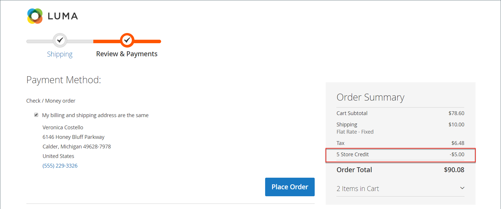

# 顧客アカウントダッシュボードにクレジットを保存

{{ee-feature}}

The _[!UICONTROL Store Credit]_顧客アカウントダッシュボードのページには、将来の購入に適用できる返品額と返金額が一覧表示されます。 お客様は、ギフトカードから価値を引き換えることもできます。

{width="700" zoomable="yes"}

## チェックアウト時に店舗クレジットを適用

1. 顧客が、利用可能な店舗クレジットの額を決定します。

   期間 _レビューと支払い_ 手順を実行すると、使用可能な量が次の場所に表示されます。 **[!UICONTROL Store Credit]**.

1. 金額を注文に適用するには、顧客がクリックします **[!UICONTROL Use Store Credit]**.

   {width="600" zoomable="yes"}

1. 注文の合計が再計算され、適用される店舗クレジットの額が注文要約に表示されます。

   {width="600" zoomable="yes"}

1. 準備が整ったら、クリックします **[!UICONTROL Place Order]**.

## 店舗クレジット残高と履歴の表示

クレジット残高と履歴を表示する方法は 2 つあります。

メソッド 1: **顧客アカウントダッシュボードから**

1. ストアフロントから、顧客がログインしてアカウントを設定します。

1. 選択 **[!UICONTROL Store Credit]** をクリックします。

方法 2: **次から： _レビューと支払い_ ページ**

1. 顧客が買い物かごに製品を追加します。

1. 「チェックアウト」ページに進みます。

1. を渡します。 **[!UICONTROL Shipping]** 手順

1. 店舗クレジットが使用可能な場合、顧客は **店舗クレジットを使用**.

1. 顧客がストアクレジットの使用に関する考えを変更した場合は、「 **[!UICONTROL Remove]** （内） _[!UICONTROL Order Summary]_」セクションに入力します。
