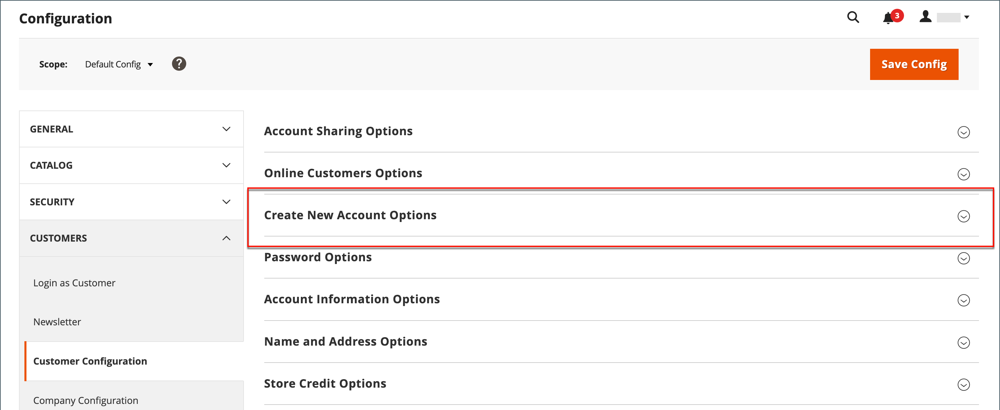

# 新規顧客アカウントオプション

設定の&#x200B;_[!UICONTROL Create New Account Options]_セクションでは、基本的なアカウントオプションと、VAT ID検証とカスタム統合に関連する高度なオプションが組み合わされています。 次の手順では、最も頻繁に使用されるオプションのみを説明します。 顧客グループの自動割り当てについて詳しくは、[VAT検証](../stores-purchase/vat.md)を参照してください。

{width="600" zoomable="yes"}

## 基本的な顧客アカウントオプションの設定

1. _管理者_ サイドバーで、**[!UICONTROL Stores]** > _[!UICONTROL Settings]_>**[!UICONTROL Configuration]**に移動します。

1. 左側のパネルで、**[!UICONTROL Customers]**&#x200B;を展開し、**[!UICONTROL Customer Configuration]**&#x200B;を選択します。

1. 「**[!UICONTROL Create New Account Options]**」セクションを展開します。

   {width="600" zoomable="yes"}

1. ストアフロントでサポートする必要がある顧客体験に応じて、各オプションを設定します。

   - アカウントの作成時に新規顧客に割り当てられる顧客グループに&#x200B;**[!UICONTROL Default Group]**&#x200B;を設定します。

   - _付加価値税_&#x200B;の番号があり、それを顧客に表示する場合は、**[!UICONTROL Show VAT Number on Storefront]**&#x200B;を`Yes`に設定します。

   - 顧客の管理者注文作成中に顧客の電子メールを要求するには、**[!UICONTROL Email is required field for Admin order creation]**&#x200B;を`Yes`に設定します。

   - ストアの&#x200B;**[!UICONTROL Default Email Domain]**&#x200B;を入力します（`mystore.com`など）

   - **[!UICONTROL Default Welcome Email]**&#x200B;を、新規顧客に送信されるようこそメールに使用されるテンプレートに設定します。

   - ストアでアカウントを開くリクエストを顧客に確認してもらうには、**[!UICONTROL Require Emails Confirmation]**&#x200B;を`Yes`に設定します。 次に、確認メールに使用するテンプレートに&#x200B;**[!UICONTROL Confirmation Link Email]**&#x200B;を設定します。

     >[!NOTE]
     >
     >バージョン 2.4.7以降、お客様は、ブラウザーに関係なく、メール確認後にアカウントにログインするために、メールとパスワードを再入力する必要があります。

   - アカウントの確認後に送信されるようこそメッセージに使用されるテンプレートに&#x200B;**[!UICONTROL Welcome Email]**&#x200B;を設定します。

   - パスワードを持たない顧客アカウントの作成時に使用されるテンプレートに&#x200B;**[!UICONTROL Default Welcome Email without Password]**&#x200B;を設定します。 例えば、管理者から作成された顧客アカウントには、まだパスワードが割り当てられていません。

   - ようこそ電子メールの送信者として表示されるストア連絡先に&#x200B;**[!UICONTROL Email Sender]**&#x200B;を設定します。

   - ストアでアカウントを開くリクエストを顧客に確認してもらうには、**[!UICONTROL Require Emails Confirmation]**&#x200B;を`Yes`に設定します。 次に、確認メールに使用するテンプレートに&#x200B;**[!UICONTROL Confirmation Link Email]**&#x200B;を設定します。

   {width="600" zoomable="yes"}

   この設定オプションセットで使用できる各オプションについて詳しくは、_新しいアカウントオプションの作成_ [設定リファレンス ](../configuration-reference/customers/customer-configuration.md)を参照してください。

1. 完了したら、**[!UICONTROL Save Config]**&#x200B;をクリックします。
