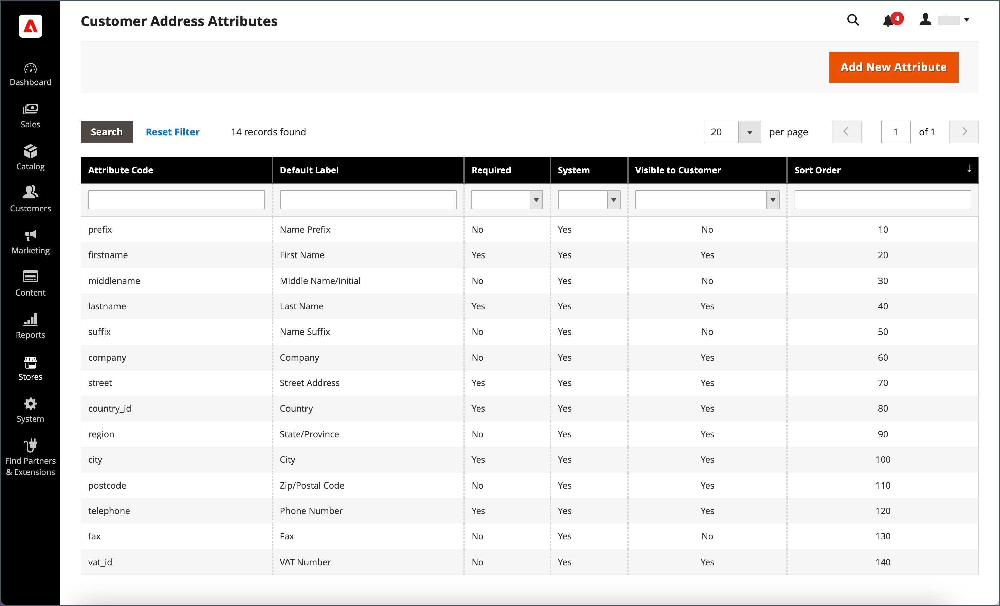

# 顧客アドレス属性

{{ee-feature}}

顧客アドレス属性セットは、顧客のアカウントまたは[ チェックアウト ](../stores-purchase/checkout-process.md)中に[ アドレス帳](account-dashboard-address-book.md)に入力された住所のプロパティを決定します。

カスタムのアドレス属性を設定して、オプションのメールアドレス、Skype アカウント、代替電話番号、建物、郡などの追加情報を提供できます。 カスタム属性は、販売文書の作成に使用される[ アドレステンプレート ](address-templates.md)に組み込むことができます。 カスタムアドレス属性を作成するプロセスは、[顧客属性](attribute-properties.md)を作成するのとほぼ同じです。

顧客アドレス属性は、次のフォームで使用されます。

- [顧客アドレス登録](account-create.md)
- [顧客アカウントのアドレス](account-dashboard-address-book.md)

{width="700" zoomable="yes"}

## 手順1：属性のプロパティを完了する

1. _管理者_ サイドバーで、**[!UICONTROL Stores]** > _[!UICONTROL Attributes]_>**[!UICONTROL Customer Address]**に移動します。

1. 右上隅の「**[!UICONTROL Add New Attribute]**」をクリックします。

   {width="600" zoomable="yes"}

1. **[!UICONTROL Attribute Properties]** セクションで、次の操作を行います。

   - データ入力時に属性を識別する&#x200B;**[!UICONTROL Default Label]**&#x200B;を入力します。

   - システム内の属性を識別する&#x200B;**[!UICONTROL Attribute Code]**&#x200B;を入力します。

     属性コードは文字で始まる必要があり、小文字（a ～ z）と数字（0 ～ 9）の任意の組み合わせを含めることができます。 コードの長さは30文字未満である必要があり、特殊文字やスペースを含めることはできません。 アンダースコア文字（_）は、スペースを示すために使用できます。

     >[!TIP]
     >
     >**_Shortcut:_**&#x200B;必須フィールドのみを完了するには、[!UICONTROL Storefront Properties]までスクロールし、[!UICONTROL Sort Order]を入力して保存します。

1. データ入力に使用する入力制御の種類を判断するには、**[!UICONTROL Input Type]**&#x200B;を次のいずれかに設定します。

   - `Text Field` -1行のテキストフィールド。
   - `Text Area` – 複数行のテキスト領域。
   - `Multiple Line` – 複数行の住所と同様に、属性に複数のテキスト行を作成します。 データ入力行の数は、2から20までです。 `Default Value`を使用して、フィールドの初期値を指定します。
   - `Date` - ポップアップカレンダーを含む日付フィールドを表示します。 追加のプロパティ：`Default Value`を使用して、フィールドの初期値を指定します。  入力できる最も早い日付を指定するには、`Minimal Value`を使用します。  `Maximum Value`を使用して、入力できる最新の日付を指定します。
   - `Dropdown` – 選択する値を1つだけ受け入れるドロップダウンリスト。
   - `Multiple Select` – 複数の値を選択できるドロップダウンリスト。
   - `Yes/No` - `Yes`または`No`の値の選択肢のみを提供するフィールド。
   - `File (attachment)` - ファイルをアップロードし、添付ファイルとして顧客属性に関連付けることができるフィールド。
   - `Image File` – 画像をギャラリーにアップロードし、顧客属性に関連付けることができるフィールド。

1. お客様がフィールドに値を入力する必要がある場合は、**[!UICONTROL Values Required]**&#x200B;を`Yes`に設定します。

1. フィールドに初期値を割り当てるには、**[!UICONTROL Default Value]**&#x200B;を入力します。

1. レコードを保存する前に、フィールドに入力されたデータが正確かどうかを確認するには、**[!UICONTROL Input Validation]**&#x200B;をフィールドで許可されるデータのタイプに設定します。 使用可能な値は、指定された&#x200B;_[!UICONTROL Input Type]_によって異なります。

   - `None` - データ入力中にフィールドに入力検証がありません。
   - `Alphanumeric` - データ入力時に、数字（0 ～ 9）とアルファベット文字（a ～ z、A ～ Z）の組み合わせを受け入れます。 特殊文字を含めるには、次の手順の[!UICONTROL Escape HTML Entities]を参照してください。
   - `Alphanumeric with Space` - データ入力時に、数字（0 ～ 9）、アルファベット文字（a ～ z、A ～ Z）、およびスペースの任意の組み合わせを受け入れます。
   - `Numeric Only` - データ入力時に数値（0 ～ 9）のみを受け入れます。
   - `Alpha Only` - データ入力時に使用できるのは、アルファベット文字（a ～ z、A ～ Z）のみです。
   - `URL` - データ入力時にURLのみを受け入れます。
   - `Email` - データ入力時に電子メールアドレスのみを受け入れます。
   - `Length Only` - フィールドに入力されたデータの長さに基づいて、入力を検証します。

   >[!NOTE]
   >
   >システム定義の顧客アドレス属性（_Telephone_、_City_、_Street_&#x200B;など）の場合、Commerceでは、**[!UICONTROL Input Validation]**&#x200B;設定に関係なく、組み込みのサーバーサイド検証が適用されます。 これらのデフォルトのルールでは、各フィールドで許可される文字を制限します（たとえば、電話番号には数字、スペース、特定の記号のみを含めることができます）。 **[!UICONTROL Input Validation]**&#x200B;設定では、さらに制限が追加されますが、組み込みの検証を上書きすることはできません。この検証は、管理UIで無効にすることはできません。

1. テキストフィールド、テキスト領域、または複数行の入力タイプで入力された値に前処理フィルターを適用するには、**[!UICONTROL Input/Output Filter]**&#x200B;を次のいずれかに設定します。

   - `None` - フィールドに入力されたテキストにフィルターを適用しません。
   - `Strip HTML Tags` - テキストからHTML タグを削除します。 このフィルターは、HTML タグを含む別のソースからフィールドに貼り付けられたデータをクリーンアップするのに役立ちます。
   - `Escape  HTML Entities` - テキスト内に見つかった特殊文字を、`&;`などの有効なHTML エスケープ シーケンスに変換します。 エスケープシーケンスは、アンパサンドとセミコロンの間に囲まれており、タイポグラファーのスマート引用符、著作権、商標シンボルに頻繁に使用されます。 エスケープシーケンスは、（`<`）より小さい記号や（`>`）より大きい記号、コードでも使用されているアンパサンド文字などの文字を識別するためにも使用されます。 このフィルターは、ワードプロセッサーからデータベースのフィールドに貼り付けられることのある特殊文字をクリーンアップするのに役立ちます。

1. 顧客グリッドとセグメントのプロパティを完了します。

   - 顧客グリッドに列を含めるには、**[!UICONTROL Add to Column Options]**&#x200B;を`Yes`に設定します。

   - この属性で顧客グリッドをフィルタリングするには、**[!UICONTROL Use in Filter Options]**&#x200B;を`Yes`に設定します。

   - フィルターに一致する条件が異なるテキスト属性で顧客グリッドをフィルターするには、**[!UICONTROL Grid Filter Condition Type]**&#x200B;を`Partial Match`、`Prefix Match`または`Full Match`に設定します。 グリッドの&#x200B;_キーワードによる検索_ フィールドには影響しません。

   - この属性で顧客グリッドを検索するには、**[!UICONTROL Use in Search Options]**&#x200B;を`Yes`に設定します。

   - この属性を[顧客セグメント ](customer-segments.md)で使用できるようにするには、**[!UICONTROL Use in Customer Segment]**&#x200B;を`Yes`に設定します。

## ステップ 2：ストアフロントのプロパティを完了する

1. **[!UICONTROL Storefront Properties]** セクションまでスクロールします。

   {width="600" zoomable="yes"}

1. 属性を顧客に表示するには、**[!UICONTROL Show on Storefront]**&#x200B;を`Yes`に設定します。

1. **[!UICONTROL Sort Order]** フィールドに数値を入力します。このフィールドは、他の属性と共に表示されるときの外観の順序を決定します。

1. 属性を含める各フォームに&#x200B;**[!UICONTROL Forms to Use]**&#x200B;を設定します。

   両方のオプションを選択するには、Ctrl キー（PC）またはCommand キー（Mac）を押しながら各フォームをクリックします。

   - [顧客アドレス登録](account-create.md)
   - [顧客アカウントのアドレス](account-dashboard-address-book.md)

## ステップ 3：ラベルを完成させ、保存する

1. 左側のパネルで、**[!UICONTROL Manage Labels/Options]**&#x200B;を選択します。

1. **[!UICONTROL Manage Titles]**&#x200B;の下にラベルを入力して、各[ ストアビュー](../getting-started/websites-stores-views.md)の属性を識別します。

1. 完了したら、**[!UICONTROL Save Attribute]**&#x200B;をクリックします。

   {width="600" zoomable="yes"}

## フィールドの説明

### [!UICONTROL Attribute Properties]

| フィールド | 説明 |
|--- |--- |
| [!UICONTROL Default Label] | 管理者とストアフロントの属性を識別するデフォルトのラベル。 |
| [!UICONTROL Attribute Code] | システム内の属性を識別する一意のコード。 コードの長さは最大21文字までで、スペースや特殊文字を含めることはできません。 スペースの代わりにアンダースコア記号を使用できます。 |
| [!UICONTROL Input Type] | データ入力に使用される[入力コントロール ](../catalog/attributes-input-types.md)を決定します。 オプション： **`Text Field`**-1行のテキストフィールド。 **`Text Area`** – 複数行のテキスト領域。 **`Multiple Line`**– 複数行の住所と同様に、属性に複数のテキスト行を作成します。 個別のデータ入力行の数は、2 ～ 20の範囲で指定できます。 **`Date`** - ポップアップカレンダーを含む日付フィールドを表示します。 **`Dropdown`**– 選択する値を1つだけ受け入れるドロップダウンリスト。 **`Multiple Select`** – 複数の値を選択できるドロップダウンリスト。 **`Yes/No`**- `Yes`または`No`個の値の選択肢のみを提供するフィールド。 **`File (attachment)`** - ファイルをアップロードし、添付ファイルとして顧客属性に関連付けることができるフィールド。 **`Image File`**– 画像をギャラリーにアップロードし、顧客属性に関連付けることができるフィールド。 |
| [!UICONTROL Values Required] | 値をフィールドに入力する必要があるかどうかを指定します。 オプション：`Yes` / `No` |
| [!UICONTROL Default Value] | 属性の初期値を指定します。 |
| [!UICONTROL Input Validation] | オプションの選択は、入力タイプによって決まります。 オプション： **`None`**- データ入力中にフィールドに入力検証がありません。 **`Alphanumeric`** - データ入力時に、数字（0 ～ 9）とアルファベット文字（a ～ z、A ～ Z）の組み合わせを受け入れます。 **`Alphanumeric with Space`**– 住所のスペースがキャリアの最大長の要件を満たすようにします。 チェックアウト時に、レター（a～z、A～Z）、数字（0～9）、スペースを入力することができます。 アドレスを保存すると、余分なスペースがトリミングされます。 **`Numeric Only`** - データ入力時に数値（0-9）のみを受け入れます。 **`Alpha Only`**- データ入力時に使用できるのは、アルファベット文字（a ～ z、A ～ Z）のみです。 ** URL **- データ入力時にURLのみを受け入れます。 **`Email`** - データ入力時に電子メールアドレスのみを受け入れます。 **`Length Only`**- フィールドに入力されたデータの長さに基づいて、入力を検証します。  ** メモ：**_電話_、_都市_、_通り_などのシステム定義の属性の場合、組み込みのサーバーサイド検証は常に&#x200B;**[!UICONTROL Input Validation]**設定に加えて適用されます。 これらのデフォルトのルールは、各フィールドに許可されている文字を制限し、上書きすることはできません。**[!UICONTROL Input Validation]**設定では、さらに制約が追加されるだけです。 |
| [!UICONTROL Input/Output Filter] | レコードを保存する前に、テキストフィールド、テキスト領域、または複数行の入力タイプに入力された値に前処理フィルターを適用します。 オプション： **`None`**- フィールドに入力されたテキストにフィルターを適用しません。 **`Strip HTML Tags`** - テキストからHTML タグを削除します。 このフィルターは、HTML タグを含む別のソースからフィールドに貼り付けられたデータをクリーンアップするのに役立ちます。 **`Escape HTML Entities`**- テキスト内に見つかった特殊文字を、`amp;`などの有効なHTML エスケープ シーケンスに変換します。 エスケープシーケンスは、アンパサンドとセミコロンの間に囲まれ、タイポグラファーのスマート引用符、著作権記号、商標記号に頻繁に使用されます。 エスケープシーケンスは、（`<`）より小さい記号や（`>`）より大きい記号、コードでも使用されているアンパサンド文字などの文字を識別するためにも使用されます。 このフィルターは、ワードプロセッサーからデータベースのフィールドに貼り付けられることのある特殊文字をクリーンアップするのに役立ちます。 |
| [!UICONTROL Add to Column Options] | 属性を[顧客](./customers-all.md) グリッドの列として含めるかどうかを指定します。 オプション：`Yes` / `No` |
| フィルターオプションで使用 | 属性をグリッドからの検索操作のフィルターとして使用できるかどうかを指定します。 オプション：`Yes` / `No` |
| [!UICONTROL Grid Filter Condition Type] | グリッドからの検索操作の属性に対するフィルター一致の条件を指定します。 グリッドの&#x200B;_[!UICONTROL Search by keyword]_フィールドには影響しません。 オプション：`Partial Match` / `Prefix Match` / `Full Match` |
| [!UICONTROL Use in Search Options] | 属性値を検索操作でキーワードとして使用できるかどうかを指定します。 オプション：`Yes` / `No` |
| [!UICONTROL Use in Customer Segment] | 属性が[顧客セグメント ](./customer-segments.md)条件に含まれているかどうかを判断します。 オプション：`Yes` / `No` |

### [!UICONTROL Storefront Properties]

| フィールド | 説明 |
|--- |--- |
| [!UICONTROL Show on Storefront] | ストアフロントの顧客情報に属性がフィールドとして表示されるかどうかを指定します。 オプション：`Yes` / `No` |
| [!UICONTROL Sort Order] | 他の顧客属性に関連するこの属性の並べ替え順序を指定します。 並べ替え順序は、キーボードナビゲーションを使用する際に、データ入力中にフィールドがフォーカスを受け取る順序を決定します。 |
| [!UICONTROL Forms to Use in] | 属性が表示されるデータ入力フォームを含むページを指定します。 オプション： [`Customer Address Registration`](account-create.md)  [`Customer Account Address`](account-dashboard-address-book.md) |
