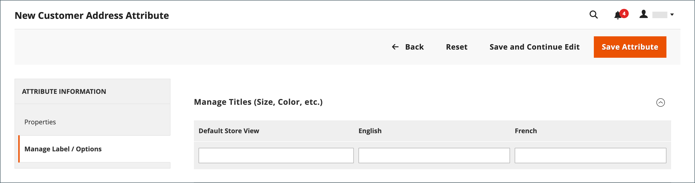

# 顧客の住所属性

{{ee-feature}}

顧客住所属性セットは、に入力される住所のプロパティを決定します。 [アドレス帳](account-dashboard-address-book.md) 顧客の口座から、または [チェックアウト](../stores-purchase/checkout-process.md).

カスタム アドレス属性は、オプションの E メール アドレス、Skype アカウント、代替電話番号、建物、郡などの追加情報を提供するように設定できます。 カスタム属性は、に組み込むことができます [住所テンプレート](address-templates.md) 販売ドキュメントの作成に使用されます。 カスタムアドレス属性を作成するプロセスは、 [顧客属性](attribute-properties.md).

顧客の住所属性は、次の形式で使用されます。

- [顧客の住所の登録](account-create.md)
- [顧客アカウントの住所](account-dashboard-address-book.md)

{width="700" zoomable="yes"}

## 手順 1：属性プロパティの完了

1. 日 _Admin_ サイドバー、に移動 **[!UICONTROL Stores]** > _[!UICONTROL Attributes]_>**[!UICONTROL Customer Address]**.

1. 右上隅のをクリックします。 **[!UICONTROL Add New Attribute]**.

   {width="600" zoomable="yes"}

1. が含まれる **[!UICONTROL Attribute Properties]** セクションで、次の操作を行います。

   - を入力 **[!UICONTROL Default Label]** データ入力時に属性を識別します。

   - を入力 **[!UICONTROL Attribute Code]** は、システム内の属性を識別します。

     属性コードは文字で始まる必要があり、小文字（a ～ z）と数字（0 ～ 9）を任意に組み合わせることができます。 コードの長さは 30 文字未満にする必要があり、特殊文字やスペースを含めることはできません。 アンダースコア文字（_）はスペースを示すために使用できます。

     >[!TIP]
     >
     >**_ショートカット：_** 必須フィールドのみに入力するには、以下までスクロールします。 [!UICONTROL Storefront Properties]を入力します [!UICONTROL Sort Order]を選択して保存します。

1. データ入力に使用される入力コントロールの種類を決定するには、次のように設定します **[!UICONTROL Input Type]** を次のいずれかに変更します。

   - `Text Field` - 1 行のテキストフィールド。
   - `Text Area`  – 複数行テキスト領域。
   - `Multiple Line`  – 複数行の住所と同様に、属性に対して複数行のテキストを作成します。 個別のデータ入力行の数は、2 ～ 20 の範囲で指定できます。 の使用 `Default Value` フィールドの初期値を指定します。
   - `Date`  – 日付フィールドとポップアップカレンダーを表示します。 その他のプロパティ：使用 `Default Value` フィールドの初期値を指定します。  使用方法 `Minimal Value` 入力できる最も早い日付を指定します。  使用方法 `Maximum Value` 入力できる最新の日付を指定します。
   - `Dropdown`  – 値の選択を 1 つだけ受け入れるドロップダウンリスト。
   - `Multiple Select`  – 複数の値の選択を受け入れるドロップダウンリスト。
   - `Yes/No`  – 次の選択肢のみを提供するフィールド `Yes` または `No` 値。
   - `File (attachment)` - ファイルをアップロードし、顧客属性に添付ファイルとして関連付けることができるフィールド。
   - `Image File`  – 画像をギャラリーにアップロードし、顧客属性に関連付けることができるフィールド。

1. 顧客がフィールドに値を入力する必要がある場合は、 **[!UICONTROL Values Required]** 対象： `Yes`.

1. フィールドに初期値を割り当てるには、 **[!UICONTROL Default Value]**.

1. レコードを保存する前に、フィールドに入力されたデータの正確性を確認するには、次のように設定します **[!UICONTROL Input Validation]** をフィールドで許可されるデータのタイプに変更します。 使用できる値は、 _[!UICONTROL Input Type]_指定します。

   - `None` - フィールドには、データ入力時の入力検証はありません。
   - `Alphanumeric` - データ入力時に数字（0 ～ 9）と英字（a ～ z、A ～ Z）の任意の組み合わせを使用できます。 特殊文字を含めるには、を参照してください [!UICONTROL Escape HTML Entities] 次の手順で行います。
   - `Alphanumeric with Space`  – 数字（0 ～ 9）、英字（a ～ z、A ～ Z）、スペースを任意に組み合わせてデータを入力できます。
   - `Numeric Only` - データ入力時に使用できるのは数値（0 ～ 9）のみです。
   - `Alpha Only` - データ入力時に使用できる文字は、英字（a ～ z、A ～ Z）のみです。
   - `URL` - データ入力時に URL のみを受け入れます。
   - `Email` - データ入力時にメールアドレスのみを受け入れます。
   - `Length Only` - フィールドに入力されたデータの長さに基づいて入力を検証します。

1. テキストフィールド、テキスト領域、または複数行入力タイプに入力された値に前処理フィルターを適用するには、を設定します。 **[!UICONTROL Input/Output Filter]** を次のいずれかに変更します。

   - `None` - フィールドに入力されたテキストにフィルターを適用しません。
   - `Strip HTML Tags` - テキストからHTMLタグを削除します。 このフィルターは、HTMLタグを含む別のソースからフィールドに貼り付けられたデータをクリーンアップするのに役立ちます。
   - `Escape  HTML Entities`  - テキスト内の特殊文字を、有効なHTMLエスケープシーケンス（など）に変換します `&;`. エスケープシーケンスは、アンパサンドとセミコロンで囲まれ、タイポグラファーのスマート引用符、著作権、商標の記号によく使用されます。 エスケープシーケンスは、より小さい（`<`）およびより大きい（`>`）、およびコード内でも使用されるアンパサンド文字。 このフィルタは、ワード プロセッサからデータベース フィールドに貼り付けられる特殊文字をクリーンアップするのに役立ちます。

1. 顧客グリッドとセグメントのプロパティを入力します。

   - 顧客グリッドに列を含めるには、次のように設定します **[!UICONTROL Add to Column Options]** 対象： `Yes`.

   - 顧客グリッドをこの属性でフィルタリングするには、次のように設定します **[!UICONTROL Use in Filter Options]** 対象： `Yes`.

   - 異なるフィルター一致条件を使用してテキスト属性で顧客グリッドをフィルタリングするには、を設定します **[!UICONTROL Grid Filter Condition Type]** 対象： `Partial Match`, `Prefix Match`、または `Full Match`. に影響しません。 _キーワードで検索_ グリッドのフィールド。

   - この属性で顧客グリッドを検索するには、次のように設定します **[!UICONTROL Use in Search Options]** 対象： `Yes`.

   - この属性を次のユーザーが使用できるようにします [顧客セグメント](customer-segments.md)、設定 **[!UICONTROL Use in Customer Segment]** 対象： `Yes`.

## 手順 2：ストアフロントのプロパティを完了する

1. にスクロール ダウンします。 **[!UICONTROL Storefront Properties]** セクション。

   {width="600" zoomable="yes"}

1. 顧客に属性を表示するには、次のように設定します **[!UICONTROL Show on Storefront]** 対象： `Yes`.

1. に数値を入力してください **[!UICONTROL Sort Order]** フィールド。他の属性と共にリストされる場合の表示順序を決定します。

1. を設定 **[!UICONTROL Forms to Use]** を属性を含む各フォームに送信します。

   両方を選択するには、Ctrl キー（PC）または Command キー（Mac）を押しながら各フォームをクリックします。

   - [顧客の住所の登録](account-create.md)
   - [顧客アカウントの住所](account-dashboard-address-book.md)

## 手順 3：ラベルを完成させて保存する

1. 左側のパネルで、を選択します。 **[!UICONTROL Manage Labels/Options]**.

1. 次の下 **[!UICONTROL Manage Titles]**、それぞれの属性を識別するラベルを入力します [ストア表示](../getting-started/websites-stores-views.md).

1. 完了したら、 **[!UICONTROL Save Attribute]**.

   {width="600" zoomable="yes"}

## フィールドの説明

### [!UICONTROL Attribute Properties]

| フィールド | 説明 |
|--- |--- |
| [!UICONTROL Default Label] | 管理者およびストアフロントで属性を識別するデフォルトのラベル。 |
| [!UICONTROL Attribute Code] | システム内の属性を識別する一意のコード。 コードの長さは最大 21 文字で、スペースや特殊文字を含めることはできません。 アンダースコア記号はスペースの代わりに使用できます。 |
| [!UICONTROL Input Type] | は [入力制御](../catalog/attributes-input-types.md) データ入力に使用します。 オプション：  **`Text Field`**- 1 行のテキストフィールド。 **`Text Area`**  – 複数行テキスト領域。  **`Multiple Line`**– 複数行の住所と同様に、属性に対して複数行のテキストを作成します。 個別のデータ入力行の数は、2 ～ 20 の範囲で指定できます。 **`Date`**  – 日付フィールドとポップアップカレンダーを表示します。 **`Dropdown`**– 値の選択を 1 つだけ受け入れるドロップダウンリスト。 **`Multiple Select`**  – 複数の値の選択を受け入れるドロップダウンリスト。  **`Yes/No`**– 次の選択肢のみを提供するフィールド `Yes` または `No` 値。 **`File (attachment)`** - ファイルをアップロードし、顧客属性に添付ファイルとして関連付けることができるフィールド。  **`Image File`**– 画像をギャラリーにアップロードし、顧客属性に関連付けることができるフィールド。 |
| [!UICONTROL Values Required] | フィールドに値を入力する必要があるかどうかを決定します。 オプション： `Yes` / `No` |
| [!UICONTROL Default Value] | 属性の初期値を指定します。 |
| [!UICONTROL Input Validation] | オプションの選択は、入力タイプによって決まります。 オプション：  **`None`**- フィールドには、データ入力時の入力検証はありません。 **`Alphanumeric`** - データ入力時に数字（0 ～ 9）と英字（a ～ z、A ～ Z）の任意の組み合わせを使用できます。  **`Alphanumeric with Space`**– 配送業者の最大長の要件に準拠するために、番地内のスペースを使用できます。 チェックアウト時に、お客様は数字（0 ～ 9）、英字（a ～ z、A ～ Z）、および受信者と送信者の住所のスペースを任意に組み合わせて入力できます。 アドレスを保存する際、余分なスペースは削除されます。 **`Numeric Only`** - データ入力時に使用できるのは数値（0 ～ 9）のみです。  **`Alpha Only`**- データ入力時に使用できる文字は、英字（a ～ z、A ～ Z）のみです。 ** URL **- データ入力時に URL のみを受け入れます。 **`Email`** - データ入力時にメールアドレスのみを受け入れます。  **`Length Only`**- フィールドに入力されたデータの長さに基づいて入力を検証します。 |
| [!UICONTROL Input/Output Filter] | レコードを保存する前に、テキスト フィールド、テキスト領域、または複数行の入力タイプに入力された値に前処理フィルタを適用します。 オプション：  **`None`**- フィールドに入力されたテキストにフィルターを適用しません。 **`Strip HTML Tags`** - テキストからHTMLタグを削除します。 このフィルターは、HTMLタグを含む別のソースからフィールドに貼り付けられたデータをクリーンアップするのに役立ちます。  **`Escape HTML Entities`**- テキスト内の特殊文字を、有効なHTMLエスケープシーケンス（など）に変換します `amp;`. エスケープシーケンスは、アンパサンドとセミコロンで囲まれ、タイポグラファーのスマート引用符、著作権記号、商標記号によく使用されます。 エスケープシーケンスは、より小さい（`<`）およびより大きい（`>`）、およびコード内でも使用されるアンパサンド文字。 このフィルタは、ワード プロセッサからデータベース フィールドに貼り付けられる特殊文字をクリーンアップするのに役立ちます。 |
| [!UICONTROL Add to Column Options] | 属性がの列として含まれるかどうかを指定します。 [顧客](./customers-all.md) グリッド。 オプション： `Yes` / `No` |
| フィルターオプションで使用 | 属性をグリッドからの検索操作のフィルターとして使用できるかどうかを指定します。 オプション： `Yes` / `No` |
| [!UICONTROL Grid Filter Condition Type] | グリッドからの検索操作で、属性のフィルター一致条件を指定します。 に影響しません。 _[!UICONTROL Search by keyword]_グリッドのフィールド。 オプション： `Partial Match` / `Prefix Match` / `Full Match` |
| [!UICONTROL Use in Search Options] | 属性値を検索操作でキーワードとして使用できるかどうかを指定します。 オプション： `Yes` / `No` |
| [!UICONTROL Use in Customer Segment] | 属性がに含まれているかどうかを判断します。 [顧客セグメント](./customer-segments.md) 条件。 オプション： `Yes` / `No` |

### [!UICONTROL Storefront Properties]

| フィールド | 説明 |
|--- |--- |
| [!UICONTROL Show on Storefront] | 属性がストアフロントの顧客情報にフィールドとして表示されるかどうかを決定します。 オプション： `Yes` / `No` |
| [!UICONTROL Sort Order] | 他の顧客属性に対するこの属性の並べ替え順を指定します。 並べ替え順序は、キーボードナビゲーションを使用する際に、データ入力中にフィールドがフォーカスを受け取るシーケンスを決定します。 |
| [!UICONTROL Forms to Use in] | 属性が表示されるデータ入力フォームを含むページを決定します。 オプション：  [`Customer Address Registration`](account-create.md)  [`Customer Account Address`](account-dashboard-address-book.md) |
