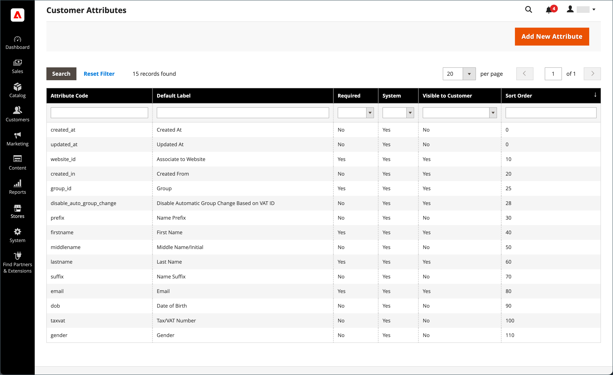
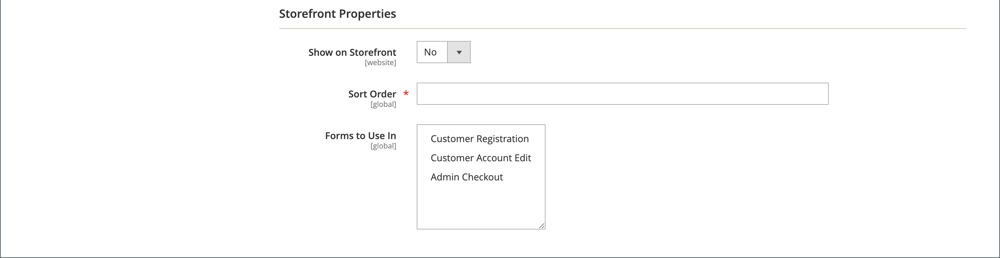

# 顧客属性プロパティ

{{ee-feature}}

顧客属性は、注文、受け渡し、顧客管理の各プロセスをサポートするために必要な情報を提供します。 ビジネスは一意なので、システムから提供されるデフォルトの項目に加えて、フィールドが必要になる場合があります。 顧客のアカウントの「アカウント情報」、「アドレス帳」、「請求情報」の各セクションにカスタム属性を追加できます。 顧客 [ 住所の属性 ](address-attributes.md) は、チェックアウト時、またはゲストがアカウントに登録したときに _請求情報_ セクションでも使用できます。

{width="700" zoomable="yes"}

## 手順 1：属性プロパティの入力

1. _管理者_ サイドバーで、**[!UICONTROL Stores]**/_[!UICONTROL Attributes]_/**[!UICONTROL Customer]**&#x200B;に移動します。

1. 右上隅の「**[!UICONTROL Add New Attribute]**」をクリックします。

   {width="600" zoomable="yes"}

1. **[!UICONTROL Attribute Properties]** セクションで、次の操作を行います。

   - データ入力時に属性を識別する **[!UICONTROL Default Label]** を入力します。

   - システム内の属性を識別する **[!UICONTROL Attribute Code]** を入力します。

   属性コードは文字で始まる必要があり、小文字（a ～ z）と数字（0 ～ 9）を任意に組み合わせることができます。 コードの長さは 30 文字未満にする必要があり、特殊文字やスペースを含めることはできません。 アンダースコア文字（`_`）を使用してスペースを示すことができます。

   >[!TIP]
   >
   >**ショートカット：** 必須フィールドのみを入力するには、下にスクロールして _[!UICONTROL Storefront Properties]_&#x200B;に移動し、_[!UICONTROL Sort Order]_ を入力して保存します。

1. 次のデータ入力プロパティを入力します。

   - データ入力に使用される入力コントロールの種類を決定するには、**[!UICONTROL Input Type]** を次のいずれかに設定します。

     | タイプ | 説明 |
     |----|-----------|
     | `Text Field` | 1 行のテキストフィールド。 |
     | `Text Area` | 製品の説明など、テキストの段落を入力するための複数行の入力フィールド。 WYSIWYG エディターを使用して、HTMLタグでテキストの書式を設定したり、テキストにタグを直接入力したりできます。 |
     | `Multiple Line` | 複数行の番地と同様に、属性に複数行のテキスト行を作成します。 個別のデータ入力行の数は、2 ～ 20 の範囲で指定できます。 フィールドの初期値を指定するには、`Default Value` を使用します。 |
     | `Date` | 日付の値を優先日付形式およびタイムゾーンで表示します。 日付値は、リストまたはカレンダー（）から選択できます。   **_メモ：_**&#x200B;システムの設定に応じて、_ 管理者 _ユーザーはフィールドに日付を直接入力したり、カレンダーやリストから日付を選択したりできます。 日付と時刻の値を指定する方法については、[ 日付と時刻のオプション ](../catalog/attributes-input-types.md#date-and-time-options) を参照してください。 |
     | `Yes/No` | `Yes` と `No` の定義済みオプションを含むドロップダウン リストを表示します。 |
     | `Dropdown` | 1 つの選択のみを受け入れる値のドロップダウン リストを表示します。 ドロップダウン入力タイプは、[ 設定可能な製品 ](../catalog/product-create-configurable.md) の主要コンポーネントです。 |
     | `Multiple Select` | 複数の値の選択を受け入れるドロップダウンリスト。 |
     | `File (attachment)` | ファイルをアップロードし、顧客属性に添付ファイルとして関連付けることができるフィールド。 |
     | `Image File` | 画像をギャラリーにアップロードし、顧客属性に関連付けることができるフィールド。 |

   - 顧客がフィールドに値を入力する必要がある場合は、**[!UICONTROL Values Required]** を `Yes` に設定します。

   - フィールドに初期値を割り当てるには、**[!UICONTROL Default Value]** を入力します。

   - レコードを保存する前に、フィールドに入力されたデータの正確性を確認するには、**[!UICONTROL Input Validation]** をフィールドで許可されるデータのタイプに設定します。 使用できる値は、指定した [!UICONTROL Input Type] によって異なります。

     | 値 | 説明 |
     |-----|-----------|
     | `None` | フィールドには、データ入力時の入力検証はありません。 |
     | `Alphanumeric` | データ入力時に数字（0 ～ 9）と英字（a ～ z、A ～ Z）の任意の組み合わせを使用できます。 特殊文字を含めるには、_HTMLエンティティのエスケープ_ を参照してください。 |
     | `Alphanumeric with Space` | データ入力時に数字（0 ～ 9）、英字（a ～ z、A ～ Z）、スペースの任意の組み合わせを使用できます。 |
     | `Numeric Only` | データ入力時に使用できるのは数値（0 ～ 9）のみです。 |
     | `Alpha Only` | データ入力時に使用できる文字は、英字（a ～ z、A ～ Z）のみです。 |
     | `URL` | データ入力時に URL のみを受け入れます。 |
     | `Email` | データ入力時にメールアドレスのみを受け入れます。 |
     | `Length Only` | フィールドに入力されたデータの長さに基づいて入力を検証します。 |

   - テキストフィールドとテキスト領域の入力タイプのサイズを制限するには、**[!UICONTROL Minimum Text Length]** と **[!UICONTROL Maximum Text Length]** を入力します。

   - テキストフィールド、テキスト領域、または複数行の入力タイプに入力された値に前処理フィルターを適用するには、**[!UICONTROL Input/Output Filter]** を次のいずれかに設定します。

     | 値 | 説明 |
     |-----|-----------|
     | `None` | フィールドに入力されたテキストにフィルターを適用しません。 |
     | `Strip HTML Tags` | テキストからHTMLタグを削除します。 このフィルターは、HTMLタグを含む別のソースからフィールドに貼り付けられたデータをクリーンアップするのに役立ちます。 |
     | `Escape  HTML Entities` | テキスト内の特殊文字を有効なHTMLエスケープシーケンス（`&;` など）に変換します。 エスケープシーケンスは、アンパサンドとセミコロンで囲まれ、タイポグラファーのスマート引用符、著作権、商標の記号によく使用されます。 エスケープシーケンスは、より小さい（`<`）記号や大きい（`>`）記号などの文字、およびコードでも使用されるアンパサンド文字の識別にも使用されます。 このフィルタは、ワード プロセッサからデータベース フィールドに貼り付けられる特殊文字をクリーンアップするのに役立ちます。 |

1. 顧客グリッドとセグメントのプロパティを入力します。

   - 顧客グリッドに列を含めるには、**[!UICONTROL Add to Column Options]** を `Yes` に設定します。

   - 顧客グリッドをこの属性でフィルタリングするには、**[!UICONTROL Use in Filter Options]** を `Yes` に設定します。

   - 異なるフィルター一致条件を持つテキスト属性で顧客グリッドをフィルタリングするには、**[!UICONTROL Grid Filter Condition Type]** を `Partial Match`、`Prefix Match` または `Full Match` に設定します。 グリッドの _キーワードで検索_ フィールドには影響しません。

   - この属性で顧客グリッドを検索するには、**[!UICONTROL Use in Search Options]** を `Yes` に設定します。

   - この属性を [ 顧客セグメント ](customer-segments.md) で使用できるようにするには、**[!UICONTROL Use in Customer Segment]** を `Yes` に設定します。

## 手順 2：ストアフロントのプロパティを完了する

1. **[!UICONTROL Storefront Properties]** セクションまで下にスクロールします。

   {width="600" zoomable="yes"}

1. 顧客に属性を表示するには、**[!UICONTROL Show on Storefront]** を `Yes` に設定します。

1. **[!UICONTROL Sort Order]** フィールドに数値を入力します。この数値は、他の属性と共にリストされるときの表示順序を決定します。

1. 属性を含める各フォームに **[!UICONTROL Forms to Use]** を設定します。 複数のオプションを選択するには、Ctrl キーを押しながら各フォームをクリックします。

   - [&#39;顧客登録&#39;](customer-sign-in.md)
   - [&#39;顧客アカウントの編集&#39;](account-create.md)
   - [&#39;管理者チェックアウト&#39;](../stores-purchase/checkout-process.md)

## 手順 3：ラベルを完成させて保存する

1. 左側のパネルで「**[!UICONTROL Manage Labels/Options]**」を選択します。

1. **[!UICONTROL Manage Titles]** の下に、各 [ ストア表示 ](../getting-started/websites-stores-views.md) の属性を識別するラベルを入力します。

1. 完了したら、「**[!UICONTROL Save Attribute]**」をクリックします。

   {width="600" zoomable="yes"}

## フィールドの説明

### [!UICONTROL Attribute Properties]

| フィールド | 説明 |
|--- |--- |
| [!UICONTROL Default Label] | 管理者およびストアフロントで属性を識別するデフォルトのラベル。 |
| [!UICONTROL Attribute Code] | システム内の属性を識別する一意のコード。 コードの長さは最大 60 文字で、スペースや特殊文字を含めることはできません。 アンダースコア記号はスペースの代わりに使用できます。 |
| [!UICONTROL Input Type] | データ入力に使用する入力コントロールを決定します。 オプション： **`Text Field`**- 1 行のテキストフィールド。 **`Text Area`** – 複数行のテキスト領域。  **`Multiple Line`**– 複数行の住所のように、属性に対して複数のテキスト行を作成します。 個別のデータ入力行の数は、2 ～ 20 の範囲で指定できます。 **`Date`** – 日付フィールドとポップアップカレンダーを表示します。 **`Dropdown`**– 値の選択を 1 つだけ受け入れるドロップダウンリスト。 **`Multiple Select`** – 複数の値の選択を受け入れるドロップダウンリスト。  **`Yes/No`**- `Yes` 値または `No` 値の選択のみを提供するフィールド。 **`File (attachment)`** - ファイルをアップロードし、顧客属性に添付ファイルとして関連付けることができるフィールド。  **`Image File`**– 画像をギャラリーにアップロードし、顧客属性に関連付けることができるフィールド。 |
| [!UICONTROL Values Required] | フィールドに値を入力する必要があるかどうかを決定します。 オプション：`Yes` / `No` |
| [!UICONTROL Default Value] | 属性の初期値を指定します。 |
| [!UICONTROL Input Validation] | オプションの選択は、入力タイプによって決まります。 オプション： **`None`**- フィールドには、データ入力時に入力検証はありません。 **`Alphanumeric`** - データ入力時に数字（0 ～ 9）と英字（a ～ z、A ～ Z）の任意の組み合わせを使用できます。  **`Alphanumeric with Space`**– 配送業者の最大長の要件に準拠するために、番地内のスペースを許可します。 チェックアウト時に、お客様は数字（0 ～ 9）、英字（a ～ z、A ～ Z）、および受信者と送信者の住所のスペースを任意に組み合わせて入力できます。 アドレスを保存する際、余分なスペースは削除されます。 **`Numeric Only`** - データ入力中は数字（0 ～ 9）のみを使用できます。  **`Alpha Only`**- データ入力時に使用できる文字は、英字（a ～ z、A ～ Z）のみです。 **`URL`** - データ入力時に URL のみを受け入れます。  **`Email`**- データ入力時にメールアドレスのみを受け入れます。 **`Length Only`** - フィールドに入力されたデータの長さに基づいて入力を検証します。 |
| [!UICONTROL Input/Output Filter] | レコードを保存する前に、テキスト フィールド、テキスト領域、または複数行の入力タイプに入力された値に前処理フィルタを適用します。 オプション： **`None`**- フィールドに入力されたテキストにフィルターを適用しません。 **`Strip HTML Tags`** - テキストからHTMLタグを削除します。 このフィルターは、HTMLタグを含む別のソースからフィールドに貼り付けられたデータをクリーンアップするのに役立ちます。  **`Escape HTML Entities`**- テキスト内の特殊文字を、`amp;` などの有効なHTMLエスケープシーケンスに変換します。 エスケープシーケンスは、アンパサンドとセミコロンで囲まれ、タイポグラファーのスマート引用符、著作権記号、商標記号によく使用されます。 エスケープシーケンスは、より小さい（`<`）記号や大きい（`>`）記号などの文字、およびコードでも使用されるアンパサンド文字の識別にも使用されます。 このフィルタは、ワード プロセッサからデータベース フィールドに貼り付けられる特殊文字をクリーンアップするのに役立ちます。 |
| [!UICONTROL Add to Column Options] | 属性が [Customers](customers-all.md) グリッドの列として含まれるかどうかを指定します。 オプション：`Yes` / `No` |
| [!UICONTROL Use in Filter Options] | 属性をグリッドからの検索操作のフィルターとして使用できるかどうかを指定します。 オプション：`Yes` / `No` |
| [!UICONTROL Grid Filter Condition Type] | グリッドからの検索操作の属性のフィルター一致条件を指定します。 グリッドの _キーワードで検索_ フィールドには影響しません。 オプション：`Partial Match`/`Prefix Match`/`Full Match` |
| [!UICONTROL Use in Search Options] | 属性値を検索操作でキーワードとして使用できるかどうかを指定します。 オプション：`Yes` / `No` |
| [!UICONTROL Use in Customer Segment] | 属性が [ 顧客セグメント ](customer-segments.md) 条件に含まれるかどうかを決定します。 オプション：`Yes` / `No` |

### [!UICONTROL Storefront Properties]

| フィールド | 説明 |
|--- |--- |
| [!UICONTROL Show on Storefront] | 属性がストアフロントの顧客情報にフィールドとして表示されるかどうかを決定します。 オプション：`Yes` / `No` |
| [!UICONTROL Sort Order] | 他の顧客属性に対するこの属性の並べ替え順を指定します。 並べ替え順序は、キーボードナビゲーションを使用する際に、データ入力中にフィールドがフォーカスを受け取るシーケンスを決定します。 |
| [!UICONTROL Forms to Use in] | 属性が表示されるデータ入力フォームを含むページを決定します。 オプション： [`Customer Registration`](account-dashboard-account-information.md)  [`Customer Account Edit`](account-create.md)  [`Admin Checkout`](../stores-purchase/checkout-process.md) |

## デフォルトの顧客属性

| 属性コード | 説明 |
| --------------- | ------------------ |
| `created_at` | 顧客アカウントが作成された日付。 |
| `updated_at` | 顧客アカウントが最後に更新された日付。 |
| `website_id` | 顧客アカウントが作成されたサイトの Web サイト ID。 |
| `store_id` | 顧客アカウントが作成されたサイトのストア ID。 |
| `created_in` | アカウントが作成されたストア表示。 |
| `group_id` | 顧客が割り当てられている顧客グループの ID。 |
| `disable_auto_group_change` | [VAT ID 検証 ](../stores-purchase/vat.md#configure-vat-id-validation) 中に顧客グループを動的に割り当てることができるかどうかを決定します。 |
| `prefix` | お客様の名前に使用されるプレフィックス（Mr.、Ms.、Dr.など）。 |
| `firstname` | 顧客の名。 |
| `middlename` | 顧客のミドルネームまたはミドルイニシャル。 |
| `lastname` | 顧客の姓。 |
| `suffix` | 顧客名で使用されるサフィックス。 （Jr.、Sr.、Esquire など） |
| `email` | 顧客の電子メールアドレス。 |
| `dob` | 顧客の生年月日。    **_重要：_**&#x200B;現在のセキュリティおよびプライバシーのベストプラクティスに従い、顧客の完全な生年月日（月、日、年）を他の個人識別子と保存することに関連して、潜在的な法的およびセキュリティリスクがあることを認識しておいてください。 顧客の完全な生年月日の保存を制限し、代替として顧客の生年月日の使用を提案することをお勧めします。 |
| `taxvat` | 顧客に割り当てられた付加価値税（VAT） ID。 この属性のデフォルトのラベルは `VAT Number` です。 VAT 番号フィールドは、管理者から表示すると、常にすべての配送先顧客および請求先顧客の住所に表示されますが、必須フィールドではありません。 |
| `gender` | 顧客の性別。 |

## 顧客属性のデモ

顧客属性の作成のデモについては、次のビデオをご覧ください。

>[!VIDEO](https://video.tv.adobe.com/v/343661?quality=12&learn=on)
