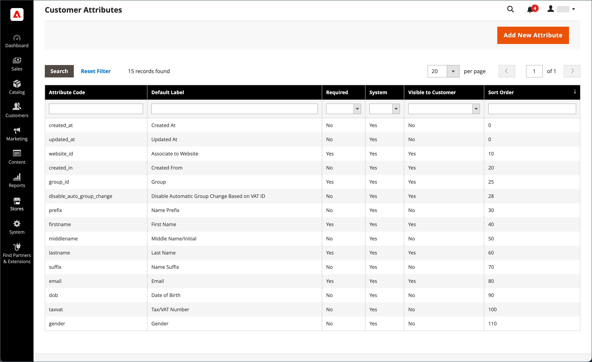

# 顧客属性プロパティ

{{ee-feature}}

顧客属性は、注文、フルフィルメント、顧客管理のプロセスをサポートするために必要な情報を提供します。 ビジネスは一意であるため、システムが提供するデフォルトの項目に加えて、フィールドが必要になる場合があります。 カスタム属性は、お客様のアカウントの「アカウント情報」、「アドレス帳」、「請求情報」の各セクションに追加できます。 お客様[&#x200B; アドレス属性](address-attributes.md)は、チェックアウト時、またはゲストがアカウントに登録する際に、_請求情報_ セクションでも使用できます。

{width="700" zoomable="yes"}

## 手順1：属性プロパティの完了

1. _管理者_ サイドバーで、**[!UICONTROL Stores]** > _[!UICONTROL Attributes]_>**[!UICONTROL Customer]**&#x200B;に移動します。

1. 右上隅の「**[!UICONTROL Add New Attribute]**」をクリックします。

   {width="600" zoomable="yes"}

1. **[!UICONTROL Attribute Properties]** セクションで、次の操作を行います。

   - データ入力時に属性を識別する&#x200B;**[!UICONTROL Default Label]**&#x200B;を入力します。

   - システム内の属性を識別する&#x200B;**[!UICONTROL Attribute Code]**&#x200B;を入力します。

   属性コードは文字で始まる必要があり、小文字（a ～ z）と数字（0 ～ 9）の任意の組み合わせを含めることができます。 コードの長さは30文字未満である必要があり、特殊文字やスペースを含めることはできません。 アンダースコア文字（`_`）は、スペースを示すために使用できます。

   >[!TIP]
   >
   >**ショートカット：**&#x200B;必須フィールドのみを完了するには、_[!UICONTROL Storefront Properties]_&#x200B;までスクロールし、_[!UICONTROL Sort Order]_&#x200B;を入力して保存します。

1. データ入力プロパティを完了します。

   - データ入力に使用する入力制御の種類を判断するには、**[!UICONTROL Input Type]**&#x200B;を次のいずれかに設定します。

     | タイプ | 説明 |
     |----|-----------|
     | `Text Field` | 1行のテキストフィールド |
     | `Text Area` | 製品説明などのテキストの段落を入力するための複数行入力フィールド。 WYSIWYG エディターを使用して、HTML タグを使用してテキストを書式設定したり、タグをテキストに直接入力したりできます。 |
     | `Multiple Line` | 複数行の住所と同様に、属性に複数のテキスト行を作成します。 データ入力ラインの数は、2から20の範囲で指定できます。 `Default Value`を使用して、フィールドの初期値を指定します。 |
     | `Date` | 日付の値を優先日付形式とタイムゾーンで表示します。 日付値は、リストまたはカレンダー（）から選択できます。   **_Note:_**&#x200B;システム構成に応じて、_&#x200B;管理者_ ユーザーは日付をフィールドに直接入力するか、カレンダーまたはリストから日付を選択できます。 日付と時刻の値の指定について詳しくは、[日付と時刻のオプション &#x200B;](../catalog/attributes-input-types.md#date-and-time-options)を参照してください。 |
     | `Yes/No` | `Yes`と`No`の事前定義済みオプションを含むドロップダウンリストを表示します。 |
     | `Dropdown` | 1つの選択のみを受け入れる値のドロップダウンリストを表示します。 ドロップダウン入力タイプは、[設定可能な製品](../catalog/product-create-configurable.md)の主要コンポーネントです。 |
     | `Multiple Select` | 複数の値を選択できるドロップダウンリスト。 |
     | `File (attachment)` | ファイルをアップロードし、添付ファイルとして顧客属性に関連付けることができるフィールド。 |
     | `Image File` | 画像をギャラリーにアップロードし、顧客属性に関連付けることができるフィールド。 |

   - お客様がフィールドに値を入力する必要がある場合は、**[!UICONTROL Values Required]**&#x200B;を`Yes`に設定します。

   - フィールドに初期値を割り当てるには、**[!UICONTROL Default Value]**&#x200B;を入力します。

   - レコードを保存する前に、フィールドに入力されたデータが正確かどうかを確認するには、**[!UICONTROL Input Validation]**&#x200B;をフィールドで許可されるデータのタイプに設定します。 使用可能な値は、指定された[!UICONTROL Input Type]によって異なります。

     | 値 | 説明 |
     |-----|-----------|
     | `None` | データ入力時に、フィールドに入力の検証がありません。 |
     | `Alphanumeric` | データ入力時に、数字（0 ～ 9）とアルファベット文字（a ～ z、A ～ Z）の組み合わせを受け入れます。 特殊文字を含めるには、_HTML エンティティのエスケープ_&#x200B;を参照してください。 |
     | `Alphanumeric with Space` | データ入力時に、数字（0 ～ 9）、アルファベット文字（a ～ z）、およびスペースの任意の組み合わせを受け入れます。 |
     | `Numeric Only` | データ入力時に数値（0 ～ 9）のみを使用します。 |
     | `Alpha Only` | データ入力時に使用できるのは、アルファベット文字（a ～ z、A ～ Z）のみです。 |
     | `URL` | データ入力時にはURLのみを受け入れます。 |
     | `Email` | データ入力時にメールアドレスのみを受け付けます。 |
     | `Length Only` | フィールドに入力されたデータの長さに基づいて、入力を検証します。 |

   - テキストフィールドとテキストエリアの入力タイプのサイズを制限するには、**[!UICONTROL Minimum Text Length]**&#x200B;と&#x200B;**[!UICONTROL Maximum Text Length]**&#x200B;を入力します。

   - テキストフィールド、テキスト領域、または複数行の入力タイプで入力された値に前処理フィルターを適用するには、**[!UICONTROL Input/Output Filter]**&#x200B;を次のいずれかに設定します。

     | 値 | 説明 |
     |-----|-----------|
     | `None` | フィールドに入力したテキストにフィルターを適用しません。 |
     | `Strip HTML Tags` | テキストからHTML タグを削除します。 このフィルターは、HTML タグを含む別のソースからフィールドに貼り付けられたデータをクリーンアップするのに役立ちます。 |
     | `Escape  HTML Entities` | テキスト内の特殊文字を、`&;`などの有効なHTML エスケープ シーケンスに変換します。 エスケープシーケンスは、アンパサンドとセミコロンの間に囲まれており、タイポグラファーのスマート引用符、著作権、商標シンボルに頻繁に使用されます。 エスケープシーケンスは、（`<`）より小さい記号や（`>`）より大きい記号、コードでも使用されているアンパサンド文字などの文字を識別するためにも使用されます。 このフィルターは、ワードプロセッサーからデータベースのフィールドに貼り付けられることのある特殊文字をクリーンアップするのに役立ちます。 |

1. 顧客グリッドとセグメントのプロパティを完了します。

   - 顧客グリッドに列を含めるには、**[!UICONTROL Add to Column Options]**&#x200B;を`Yes`に設定します。

   - この属性で顧客グリッドをフィルタリングするには、**[!UICONTROL Use in Filter Options]**&#x200B;を`Yes`に設定します。

   - フィルターに一致する条件が異なるテキスト属性で顧客グリッドをフィルターするには、**[!UICONTROL Grid Filter Condition Type]**&#x200B;を`Partial Match`、`Prefix Match`または`Full Match`に設定します。 グリッドの&#x200B;_キーワードによる検索_ フィールドには影響しません。

   - この属性で顧客グリッドを検索するには、**[!UICONTROL Use in Search Options]**&#x200B;を`Yes`に設定します。

   - この属性を[顧客セグメント &#x200B;](customer-segments.md)で使用できるようにするには、**[!UICONTROL Use in Customer Segment]**&#x200B;を`Yes`に設定します。

## ステップ 2：ストアフロントのプロパティを完了する

1. **[!UICONTROL Storefront Properties]** セクションまでスクロールします。

   {width="600" zoomable="yes"}

1. 属性を顧客に表示するには、**[!UICONTROL Show on Storefront]**&#x200B;を`Yes`に設定します。

1. **[!UICONTROL Sort Order]** フィールドに数値を入力します。このフィールドは、他の属性と共に表示されるときの外観の順序を決定します。

1. 属性を含める各フォームに&#x200B;**[!UICONTROL Forms to Use]**&#x200B;を設定します。 複数のオプションを選択するには、Ctrl キーを押しながら各フォームをクリックします。

   - [`Customer Registration`](customer-sign-in.md)
   - [`Customer Account Edit`](account-create.md)
   - [`Admin Checkout`](../stores-purchase/checkout-process.md)

## ステップ 3：ラベルを完成させ、保存する

1. 左側のパネルで、**[!UICONTROL Manage Labels/Options]**&#x200B;を選択します。

1. **[!UICONTROL Manage Titles]**&#x200B;の下にラベルを入力して、各[&#x200B; ストアビュー](../getting-started/websites-stores-views.md)の属性を識別します。

1. 完了したら、**[!UICONTROL Save Attribute]**&#x200B;をクリックします。

   {width="600" zoomable="yes"}

## フィールドの説明

### [!UICONTROL Attribute Properties]

| フィールド | 説明 |
|--- |--- |
| [!UICONTROL Default Label] | 管理者とストアフロントの属性を識別するデフォルトのラベル。 |
| [!UICONTROL Attribute Code] | システム内の属性を識別する一意のコード。 コードの長さは最大60文字までです。スペースや特殊文字を含めることはできません。 スペースの代わりにアンダースコア記号を使用できます。 |
| [!UICONTROL Input Type] | データ入力に使用する入力コントロールを指定します。 オプション： **`Text Field`**-1行のテキストフィールド。 **`Text Area`** – 複数行のテキスト領域。 **`Multiple Line`**– 複数行の住所と同様に、属性に複数のテキスト行を作成します。 個別のデータ入力行の数は、2 ～ 20の範囲で指定できます。 **`Date`** - ポップアップカレンダーを含む日付フィールドを表示します。 **`Dropdown`**– 選択する値を1つだけ受け入れるドロップダウンリスト。 **`Multiple Select`** – 複数の値を選択できるドロップダウンリスト。 **`Yes/No`**- `Yes`または`No`個の値の選択肢のみを提供するフィールド。 **`File (attachment)`** - ファイルをアップロードし、添付ファイルとして顧客属性に関連付けることができるフィールド。 **`Image File`**– 画像をギャラリーにアップロードし、顧客属性に関連付けることができるフィールド。 |
| [!UICONTROL Values Required] | 値をフィールドに入力する必要があるかどうかを指定します。 オプション：`Yes` / `No` |
| [!UICONTROL Default Value] | 属性の初期値を指定します。 |
| [!UICONTROL Input Validation] | オプションの選択は、入力タイプによって決まります。 オプション： **`None`**- データ入力中にフィールドに入力検証がありません。 **`Alphanumeric`** - データ入力時に、数字（0 ～ 9）とアルファベット文字（a ～ z、A ～ Z）の組み合わせを受け入れます。 **`Alphanumeric with Space`**– 住所のスペースがキャリアの最大長の要件に準拠できるようにします。 チェックアウト時に、顧客は受信者と送信者の住所に、数字（0～9）、アルファベット文字（a～z、A～Z）、スペースを任意の組み合わせで入力できます。 アドレスが保存されると、余分なスペースはトリミングされます。 **`Numeric Only`** - データ入力時に数値（0 ～ 9）のみを受け入れます。 **`Alpha Only`**- データ入力時に使用できるのは、アルファベット文字（a ～ z、A ～ Z）のみです。 **`URL`** - データ入力時にURLのみを受け入れます。 **`Email`**- データ入力時に電子メールアドレスのみを受け入れます。 **`Length Only`** - フィールドに入力されたデータの長さに基づいて、入力を検証します。 |
| [!UICONTROL Input/Output Filter] | レコードを保存する前に、テキストフィールド、テキスト領域、または複数行の入力タイプに入力された値に前処理フィルターを適用します。 オプション： **`None`**- フィールドに入力されたテキストにフィルターを適用しません。 **`Strip HTML Tags`** - テキストからHTML タグを削除します。 このフィルターは、HTML タグを含む別のソースからフィールドに貼り付けられたデータをクリーンアップするのに役立ちます。 **`Escape HTML Entities`**- テキスト内に見つかった特殊文字を、`amp;`などの有効なHTML エスケープ シーケンスに変換します。 エスケープシーケンスは、アンパサンドとセミコロンの間に囲まれ、タイポグラファーのスマート引用符、著作権記号、商標記号に頻繁に使用されます。 エスケープシーケンスは、（`<`）より小さい記号や（`>`）より大きい記号、コードでも使用されているアンパサンド文字などの文字を識別するためにも使用されます。 このフィルターは、ワードプロセッサーからデータベースのフィールドに貼り付けられることのある特殊文字をクリーンアップするのに役立ちます。 |
| [!UICONTROL Add to Column Options] | 属性を[顧客](customers-all.md) グリッドの列として含めるかどうかを指定します。 オプション：`Yes` / `No` |
| [!UICONTROL Use in Filter Options] | 属性をグリッドからの検索操作のフィルターとして使用できるかどうかを指定します。 オプション：`Yes` / `No` |
| [!UICONTROL Grid Filter Condition Type] | グリッドからの検索操作の属性のフィルター一致条件を指定します。 グリッドの&#x200B;_キーワードによる検索_ フィールドには影響しません。 オプション：`Partial Match` / `Prefix Match` / `Full Match` |
| [!UICONTROL Use in Search Options] | 属性値を検索操作でキーワードとして使用できるかどうかを指定します。 オプション：`Yes` / `No` |
| [!UICONTROL Use in Customer Segment] | 属性が[顧客セグメント &#x200B;](customer-segments.md)条件に含まれているかどうかを判断します。 オプション：`Yes` / `No` |

### [!UICONTROL Storefront Properties]

| フィールド | 説明 |
|--- |--- |
| [!UICONTROL Show on Storefront] | ストアフロントの顧客情報に属性がフィールドとして表示されるかどうかを指定します。 オプション：`Yes` / `No` |
| [!UICONTROL Sort Order] | 他の顧客属性に関連するこの属性の並べ替え順序を指定します。 並べ替え順序は、キーボードナビゲーションを使用する際に、データ入力中にフィールドがフォーカスを受け取る順序を決定します。 |
| [!UICONTROL Forms to Use in] | 属性が表示されるデータ入力フォームを含むページを指定します。 オプション： [`Customer Registration`](account-dashboard-account-information.md)  [`Customer Account Edit`](account-create.md)  [`Admin Checkout`](../stores-purchase/checkout-process.md) |

## デフォルトの顧客属性

| 属性コード | 説明 |
| --------------- | ------------------ |
| `created_at` | 顧客アカウントの作成日。 |
| `updated_at` | 顧客アカウントの最終更新日。 |
| `website_id` | 顧客アカウントが作成されたサイトのweb サイト ID。 |
| `store_id` | 顧客アカウントが作成されたサイトのストア ID。 |
| `created_in` | アカウントが作成されたストアビュー。 |
| `group_id` | 顧客が割り当てられている顧客グループのID。 |
| `disable_auto_group_change` | [VAT ID検証中](../stores-purchase/vat.md#configure-vat-id-validation)に顧客グループを動的に割り当てることができるかどうかを決定します。 |
| `prefix` | お客様の名前で使用される接頭辞（Mr、Ms、Drなど）。 |
| `firstname` | 顧客の名前。 |
| `middlename` | 顧客のミドルネームまたはミドルイニシャル。 |
| `lastname` | 顧客の姓。 |
| `suffix` | 顧客名で使用されるサフィックス。 （Jr.、Sr.、Esquireなど） |
| `email` | 顧客のメールアドレス。 |
| `dob` | 顧客の生年月日。   **_Important:_**&#x200B;現在のセキュリティとプライバシーのベストプラクティスに従って、お客様の生年月日（月、日、年）を他の個人IDと共に保存することに関連する潜在的な法的およびセキュリティ上のリスクを認識してください。 お客様の生年月日の保存を制限し、お客様の生年月日を代替手段として使用することをお勧めします。 |
| `taxvat` | 顧客に割り当てられる付加価値税（VAT） ID。 この属性の既定のラベルは`VAT Number`です。 VAT番号フィールドは、管理者から表示される場合、すべての送料および請求先顧客アドレスに常に存在しますが、必須フィールドではありません。 |
| `gender` | 顧客の性別： |

## 顧客属性のデモ

顧客属性の作成方法については、次の動画をご覧ください。

>[!VIDEO](https://video.tv.adobe.com/v/343661?quality=12&learn=on)
