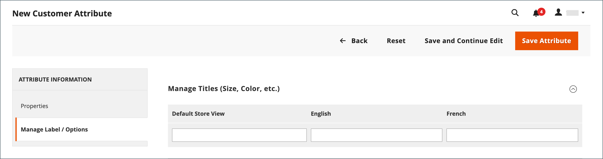

# 顧客属性プロパティ

{{ee-feature}}

顧客属性は、注文、達成、顧客管理プロセスをサポートするために必要な情報を提供します。 ビジネスは一意なので、システムが提供するデフォルトの項目に加えて、フィールドが必要になる場合があります。 顧客のアカウントの「アカウント情報」、「アドレス帳」、「請求情報」の各セクションにカスタム属性を追加できます。 顧客 [住所属性](address-attributes.md) また、 _請求情報_ セクションをチェックアウト中、またはゲストがアカウントに登録したとき。

{width="700" zoomable="yes"}

## 手順 1：属性プロパティの設定

1. 次の日： _管理者_ サイドバー、移動 **[!UICONTROL Stores]** > _[!UICONTROL Attributes]_>**[!UICONTROL Customer]**.

1. 右上隅で、 **[!UICONTROL Add New Attribute]**.

   {width="600" zoomable="yes"}

1. Adobe Analytics の **[!UICONTROL Attribute Properties]** セクションで、以下の操作を実行します。

   - を入力します。 **[!UICONTROL Default Label]** は、データ入力時に属性を識別します。

   - を入力します。 **[!UICONTROL Attribute Code]** は、システム内の属性を識別します。

   属性コードは、文字で始まる必要があり、小文字 (a ～ z) と数字 (0 ～ 9) の任意の組み合わせを含めることができます。 コードの長さは 30 文字未満にする必要があり、特殊文字やスペースを含めることはできません。 アンダースコア文字 (`_`) は、スペースを示すために使用します。

   >[!TIP]
   >
   >**ショートカット：** 必須フィールドのみを入力するには、下にスクロールして _[!UICONTROL Storefront Properties]_、_[!UICONTROL Sort Order]_、をクリックして保存します。

1. 次のデータ入力プロパティを設定します。

   - データ入力に使用される入力コントロールの種類を判断するには、 **[!UICONTROL Input Type]** を次のいずれかに変更します。

     | タイプ | 説明 |
     |----|-----------|
     | `Text Field` | 1 行のテキストフィールドです。 |
     | `Text Area` | 製品の説明など、テキストの段落を入力する複数行の入力フィールド。 WYSIWYG エディターを使用して、テキストをHTMLタグで書式設定したり、テキストに直接タグを入力したりできます。 |
     | `Multiple Line` | 複数行の番地に似た、属性に複数のテキスト行を作成します。 別のデータ入力行の数は、2 ～ 20 にすることができます。 以下を使用します。 `Default Value` をクリックして、フィールドの初期値を指定します。 |
     | `Date` | 日付値を希望の日付形式とタイムゾーンで表示します。 日付値は、リストまたはカレンダー (  ) をクリックします。   **_注意：_**システム構成に応じて、_管理者&#x200B;_ユーザーは、フィールドに日付を直接入力したり、カレンダーやリストから日付を選択したりできます。 日付と時刻の値の指定について詳しくは、 [日付と時間のオプション](../catalog/attributes-input-types.md#date-and-time-options). |
     | `Yes/No` | 次の定義済みオプションを含むドロップダウンリストを表示します。 `Yes` および `No`. |
     | `Dropdown` | 1 つの選択のみを受け入れる値のドロップダウンリストを表示します。 ドロップダウン入力タイプは、 [設定可能な製品](../catalog/product-create-configurable.md). |
     | `Multiple Select` | 複数の値を選択できるドロップダウンリスト。 |
     | `File (attachment)` | ファイルをアップロードし、顧客属性に添付ファイルとして関連付けることを許可するフィールド。 |
     | `Image File` | 画像をギャラリーにアップロードし、顧客属性に関連付けることを許可するフィールド。 |

   - 顧客がフィールドに値を入力する必要がある場合は、 **[!UICONTROL Values Required]** から `Yes`.

   - 初期値をフィールドに割り当てるには、 **[!UICONTROL Default Value]**.

   - レコードを保存する前に、フィールドに入力されたデータが正確かどうかを確認するには、 **[!UICONTROL Input Validation]** を「 」フィールドに入力します。 使用可能な値は、 [!UICONTROL Input Type] 指定済み

     | 値 | 説明 |
     |-----|-----------|
     | `None` | データ入力中に、フィールドに入力検証が実行されません。 |
     | `Alphanumeric` | データ入力時に、数字 (0 ～ 9) と英字 (a ～ z、A ～ Z) の組み合わせを受け付けます。 特殊文字を含めるには、 _エスケープHTMLエンティティ_. |
     | `Alphanumeric with Space` | データ入力時に、数字 (0 ～ 9)、英字 (a ～ z、A ～ Z)、およびスペースの任意の組み合わせを受け入れます。 |
     | `Numeric Only` | データの入力時には数値 (0 ～ 9) のみを使用できます。 |
     | `Alpha Only` | データ入力時には英字 (a ～ z、A ～ Z) のみを使用できます。 |
     | `URL` | データ入力時には URL のみを受け入れます。 |
     | `Email` | データ入力時に電子メールアドレスのみを受け入れます。 |
     | `Length Only` | フィールドに入力されたデータの長さに基づいて入力を検証します。 |

   - テキストフィールドとテキスト領域の入力タイプのサイズを制限するには、 **[!UICONTROL Minimum Text Length]** および **[!UICONTROL Maximum Text Length]**.

   - テキストフィールド、テキスト領域、または複数行の入力タイプに入力した値に前処理フィルターを適用するには、 **[!UICONTROL Input/Output Filter]** を次のいずれかに変更します。

     | 値 | 説明 |
     |-----|-----------|
     | `None` | フィールドに入力されたテキストにフィルターを適用しません。 |
     | `Strip HTML Tags` | テキストからHTMLタグを削除します。 このフィルターは、HTMLタグを含む別のソースからフィールドに貼り付けられたデータをクリーンアップするのに役立ちます。 |
     | `Escape  HTML Entities` | テキスト内の特殊文字を、次のような有効なHTMLエスケープシーケンスに変換します。 `&;`. エスケープシーケンスは、アンパサンドとセミコロンで囲まれ、タイポグラフのスマート引用符、著作権、商標記号によく使用されます。 エスケープシーケンスは、より小さい (`<`) およびより大きい (`>`) 記号と、コード内でも使用されるアンパサンド文字。 このフィルタは、ワードプロセッサからデータベースフィールドに貼り付けられる特殊文字をクリーンアップするのに役立ちます。 |

1. 顧客グリッドおよびセグメントのプロパティを入力します。

   - 顧客グリッドに列を含めるには、 **[!UICONTROL Add to Column Options]** から `Yes`.

   - この属性で顧客グリッドをフィルターするには、 **[!UICONTROL Use in Filter Options]** から `Yes`.

   - 様々なフィルター一致条件を持つテキスト属性で顧客グリッドをフィルターするには、 **[!UICONTROL Grid Filter Condition Type]** から `Partial Match`, `Prefix Match`または `Full Match`. これは、 _キーワードで検索_  グリッドのフィールド。

   - この属性で顧客グリッドを検索するには、 **[!UICONTROL Use in Search Options]** から `Yes`.

   - この属性を次の場所で使用できるようにするには： [顧客セグメント](customer-segments.md)，設定 **[!UICONTROL Use in Customer Segment]** から `Yes`.

## 手順 2：ストアフロントのプロパティを完了する

1. 下にスクロールして、 **[!UICONTROL Storefront Properties]** 」セクションに入力します。

   {width="600" zoomable="yes"}

1. 属性を顧客に表示するには、 **[!UICONTROL Show on Storefront]** から `Yes`.

1. 数値を **[!UICONTROL Sort Order]** フィールド：他の属性と共に表示される際の出現順序を決定します。

1. 設定 **[!UICONTROL Forms to Use]** 属性を含める各フォームに追加します。 複数のオプションを選択するには、Ctrl キーを押しながら各フォームをクリックします。

   - [&#39;顧客登録&#39;](customer-sign-in.md)
   - [&#39;顧客アカウントの編集&#39;](account-create.md)
   - [&#39;管理チェックアウト&#39;](../stores-purchase/checkout-process.md)

## 手順 3：ラベルを入力して保存する

1. 左側のパネルで、を選択します。 **[!UICONTROL Manage Labels/Options]**.

1. の下 **[!UICONTROL Manage Titles]**、各属性を識別するラベルを入力します [ストア表示](../getting-started/websites-stores-views.md).

1. 完了したら、「 **[!UICONTROL Save Attribute]**.

   {width="600" zoomable="yes"}

## フィールドの説明

### [!UICONTROL Attribute Properties]

| フィールド | 説明 |
|--- |--- |
| [!UICONTROL Default Label] | Admin および Storefront で属性を識別するデフォルトのラベル。 |
| [!UICONTROL Attribute Code] | システム内の属性を識別する一意のコード。 コードの長さは 60 文字までで、スペースや特殊文字は使用できません。 スペースの代わりにアンダースコア記号を使用できます。 |
| [!UICONTROL Input Type] | データ入力に使用する入力コントロールを決定します。 オプション：  **`Text Field`**- 1 行のテキストフィールド。 **`Text Area`**  — 複数行のテキスト領域。  **`Multiple Line`**— 複数行の番地に似た、属性に対して複数のテキスト行を作成します。 データ入力行の数は、2 ～ 20 の範囲で指定できます。 **`Date`**  — ポップアップカレンダー付きの日付フィールドを表示します。 **`Dropdown`**- 1 つの値のみを選択できるドロップダウンリスト。 **`Multiple Select`**  — 複数の値を選択できるドロップダウンリスト。  **`Yes/No`**— 選択肢のみを提供するフィールド `Yes` または `No` 値。 **`File (attachment)`**  — ファイルをアップロードし、顧客属性を添付ファイルとして関連付けることを許可するフィールド。  **`Image File`**— 画像をギャラリーにアップロードし、顧客属性に関連付けることを許可するフィールド。 |
| [!UICONTROL Values Required] | 値をフィールドに入力する必要があるかどうかを決定します。 オプション： `Yes` / `No` |
| [!UICONTROL Default Value] | 属性の初期値を指定します。 |
| [!UICONTROL Input Validation] | オプションの選択は、入力タイプによって決まります。 オプション：  **`None`**— データ入力時の入力検証がフィールドにありません。 **`Alphanumeric`**  — データ入力時に、数字 (0 ～ 9) と英字 (a ～ z、A ～ Z) の組み合わせを使用できます。  **`Alphanumeric with Space`**— 通りの住所のスペースを使用して、通信事業者の最大長要件に準拠できます。 チェックアウト時に、顧客は任意の数字の組み合わせ (0 ～ 9)、英字 (a ～ z、A ～ Z)、および受信者と送信者の住所のスペースを入力できます。 アドレスを保存すると、余分なスペースは削除されます。 **`Numeric Only`**  — データ入力時には数値 (0 ～ 9) のみを使用できます。  **`Alpha Only`**— データ入力時には英字 (a ～ z、A ～ Z) のみを使用できます。 **`URL`**  — データ入力時に URL のみを受け入れます。  **`Email`**— データ入力時に電子メールアドレスのみを受け入れます。 **`Length Only`**  — フィールドに入力されたデータの長さに基づいて入力を検証します。 |
| [!UICONTROL Input/Output Filter] | レコードを保存する前に、テキストフィールド、テキスト領域、または複数行の入力タイプに入力した値に前処理フィルターを適用します。 オプション：  **`None`**— フィールドに入力されたテキストにフィルターを適用しません。 **`Strip HTML Tags`**  — テキストからHTMLタグを削除します。 このフィルターは、HTMLタグを含む別のソースからフィールドに貼り付けられたデータをクリーンアップするのに役立ちます。  **`Escape HTML Entities`**— テキスト内の特殊文字を、次のような有効なHTMLエスケープシーケンスに変換します。 `amp;`. エスケープシーケンスは、アンパサンドとセミコロンで囲まれ、タイポグラフのスマート引用符、著作権記号、商標記号によく使用されます。 エスケープシーケンスは、より小さい (`<`) およびより大きい (`>`) 記号と、コード内でも使用されるアンパサンド文字。 このフィルタは、ワードプロセッサからデータベースフィールドに貼り付けられる特殊文字をクリーンアップするのに役立ちます。 |
| [!UICONTROL Add to Column Options] | 属性が [顧客](customers-all.md) グリッド。 オプション： `Yes` / `No` |
| [!UICONTROL Use in Filter Options] | 属性をグリッドから検索操作のフィルターとして使用できるかどうかを指定します。 オプション： `Yes` / `No` |
| [!UICONTROL Grid Filter Condition Type] | グリッドからの検索操作の属性のフィルタ一致条件を指定します。 これは、 _キーワードで検索_ グリッドのフィールド。 オプション： `Partial Match` / `Prefix Match` / `Full Match` |
| [!UICONTROL Use in Search Options] | 属性値を検索操作でキーワードとして使用できるかどうかを指定します。 オプション： `Yes` / `No` |
| [!UICONTROL Use in Customer Segment] | 属性が [顧客セグメント](customer-segments.md) 条件。 オプション： `Yes` / `No` |

### [!UICONTROL Storefront Properties]

| フィールド | 説明 |
|--- |--- |
| [!UICONTROL Show on Storefront] | 属性がストアフロントの顧客情報のフィールドとして表示されるかどうかを指定します。 オプション： `Yes` / `No` |
| [!UICONTROL Sort Order] | 他の顧客属性との関連で、この属性の並べ替え順を指定します。 並べ替え順は、キーボードナビゲーションを使用する際に、データ入力中にフィールドがフォーカスを受け取る順序を決定します。 |
| [!UICONTROL Forms to Use in] | 属性が表示されるデータ入力フォームを持つページを決定します。 オプション：  [`Customer Registration`](account-dashboard-account-information.md)  [`Customer Account Edit`](account-create.md)  [`Admin Checkout`](../stores-purchase/checkout-process.md) |

## デフォルトの顧客属性

| 属性コード | 説明 |
| --------------- | ------------------ |
| `created_at` | 顧客アカウントが作成された日付。 |
| `updated_at` | 顧客アカウントが最後に更新された日付。 |
| `website_id` | 顧客アカウントが作成されたサイトの Web サイト ID。 |
| `store_id` | 顧客アカウントが作成されたサイトのストア ID。 |
| `created_in` | アカウントが作成されたストア表示。 |
| `group_id` | 顧客が割り当てられている顧客グループの ID。 |
| `disable_auto_group_change` | 次の期間中に顧客グループを動的に割り当てることができるかどうかを決定 [VAT ID の検証](../stores-purchase/vat.md#configure-vat-id-validation). |
| `prefix` | 顧客名と共に使用されるプレフィックス（Mr.、Ms.、Dr.など）。 |
| `firstname` | 顧客の名。 |
| `middlename` | 顧客のミドルネームまたはミドルネーム。 |
| `lastname` | 顧客の姓。 |
| `suffix` | 顧客名で使用されるサフィックス。 （Jr.、Sr.、Esquire など） |
| `email` | 顧客の電子メールアドレス。 |
| `dob` | 顧客の生年月日。    **_重要：_**現在のセキュリティおよびプライバシーのベストプラクティスに従って、顧客の生年月日（月、日、年）と他の個人識別子を含むストレージに関連する、法的リスクおよびセキュリティリスクの可能性を認識しておきます。 顧客の完全な生年月日の保存を制限し、顧客の生年月日を代替として使用することをお勧めします。 |
| `taxvat` | 顧客に割り当てられる付加価値税 (VAT)ID。 この属性のデフォルトのラベルは、です。 `VAT Number`. 「VAT 番号」フィールドは、管理者から閲覧した場合、すべての配送先住所と請求先の顧客住所に常に表示されますが、必須フィールドではありません。 |
| `gender` | 顧客の性別。 |

## 顧客属性デモ

顧客属性の作成のデモについては、次のビデオをご覧ください。

>[!VIDEO](https://video.tv.adobe.com/v/343661?quality=12)
