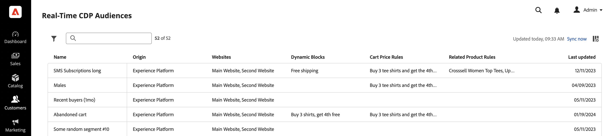
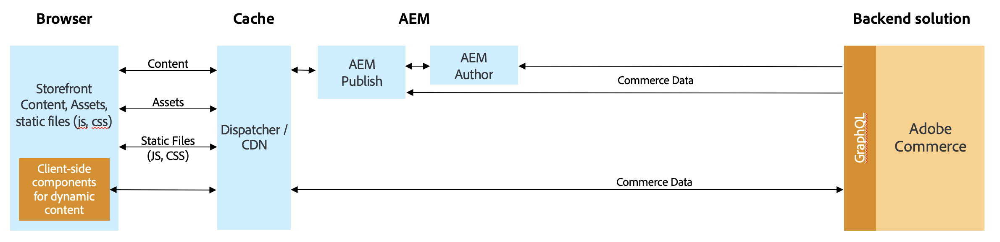

# [!DNL Audience Activation]

[!DNL Audience Activation]拡張機能を使用すると、Adobe CommerceでReal-Time CDP オーディエンスをアクティブ化して、カート内に一意のオファーを作成できます。 これらのオファーとインセンティブには、_buy 2 get 1 free_&#x200B;などの一般的なコマースマーチャンダイジング手法、その顧客を対象としたヒーローバナー、さまざまなオファーを通じた商品価格の変更などが含まれます。 Real-Time CDP内で構築されるオーディエンスは、ERP （Enterprise Resource Planning）、CRM （Customer Relationship Management）、POS、マーケティングシステムなど、様々なエンタープライズシステムからのデータにもとづいています。 顧客セグメント情報は常に更新されるため、顧客がストアで買い物をするときに、セグメントに関連付けられたり、関連付けられなかったりする可能性があります。

Luma ストアフロントまたは[ ヘッドレス ](#headless-support) ストアフロントでオーディエンスをアクティブ化できます。 Luma ストアフロントでは、Commerce側のCookieにオーディエンス情報（セグメントメンバーシップ）が保存されます。 ヘッドレスストアフロントでは、オーディエンス情報は、次の名前のパラメーターとしてGraphQL API ヘッダーに渡されます：`aep-segments-membership`。

## リリースノート

この節では、Audience Activation拡張機能のアップデートに関する情報を説明します。次の内容を含みます。

 – 新機能
 – 修正と改善
 – 既知の問題

リリーススケジュールとサポートについて詳しくは、[今後のリリース ](https://experienceleague.adobe.com/docs/commerce-operations/release/planning/schedule.html)を参照してください。

製品互換性について詳しくは、[開発者向けドキュメントを参照してください](https://experienceleague.adobe.com/docs/commerce-operations/release/product-availability.html)。

## サポートされているサービス更新

これらのリリースノートでは、Audience Activationで使用される拡張機能に関連する機能変更と修正について説明します。

+++サポートされているサービス更新

_2023年8月15日_

 - [Real-Time CDP Audiences ダッシュボード ](#real-time-cdp-audiences-dashboard)を更新して、フィルタリングを簡素化しました。

_2023年6月27日_

 - PHP 8.2のサポートを`magento/module-data-services-graphql` パッケージに追加しました。

_2023年5月30日_

 - [Real-Time CDP オーディエンスダッシュボード ](#real-time-cdp-audiences-dashboard)を更新し、Adobe Commerce インスタンス内のアクティブなオーディエンスを並べ替え、検索、フィルタリングできるようになりました。

+++

### 2.4.0

[!BADGE 互換性]{type=Informative tooltip="互換性"} Adobe Commerce バージョン 2.4.4以降

_2025年3月24日_

 - PHP 8.4のサポートを追加しました。

### 2.3.1

[!BADGE 互換性]{type=Informative tooltip="互換性"} Adobe Commerce バージョン 2.4.4以降

_2024年11月12日_

 – 使用可能なReal-Time CDP オーディエンスをフィルタリングする際の問題を修正しました。

### 2.3.0

[!BADGE 互換性]{type=Informative tooltip="互換性"} Adobe Commerce バージョン 2.4.4以降

_2024年7月29日_

 - コマンドライン構文を追加しました。これにより、[資格情報](#validate-the-connection)をテストして、Adobe Experience Platformからオーディエンスデータを取得するために更新する必要があるかどうかを判断できます。

### 2.2.0

[!BADGE 互換性]{type=Informative tooltip="互換性"} Adobe Commerce バージョン 2.4.4以降

_2024年6月12日_

 - オーディエンスから通知された[関連製品ルール ](../merchandising-promotions/product-related-rule-create.md)のGA リリース。

### 2.1.1

[!BADGE 互換性]{type=Informative tooltip="互換性"} Adobe Commerce バージョン 2.4.4以降

_2024年4月4日_

 - PHP 8.3のサポートを追加しました。

### 2.2.0-beta1

[!BADGE 互換性]{type=Informative tooltip="互換性"} Adobe Commerce バージョン 2.4.4以降

_2024年2月16日_

 - ベータ版に参加する場合は、`composer.json` ファイルのルートレベルが` "minimum-stability": "beta"`であることを確認してください。
 - （**Beta**）オーディエンスから通知された[関連商品ルール ](../merchandising-promotions/product-related-rule-create.md)を作成する機能を追加しました。

### 2.1.0

[!BADGE 互換性]{type=Informative tooltip="互換性"} Adobe Commerce バージョン 2.4.4以降

_2024年1月24日_

 - [Real-Time CDP Audiences ダッシュボード ](#real-time-cdp-audiences-dashboard)を更新して、オーディエンスを含むweb サイトを含め、これらのオーディエンスを使用するように設定されている動的ブロックとカート価格ルールを指定しました。

### 2.0.1

[!BADGE 互換性]{type=Informative tooltip="互換性"} Adobe Commerce バージョン 2.4.4以降

_2023年11月16日_

 – 安定性が向上しました。

### 2.0.0

[!BADGE 互換性]{type=Informative tooltip="互換性"} Adobe Commerce バージョン 2.4.4以降

_2023年10月10日_

 - Audience Activation拡張機能を[configure](#configure-the-extension)すると、OAuth 2.0のサポートが追加されました。
 – 安定性が向上しました。

### 1.2.0

[!BADGE 互換性]{type=Informative tooltip="互換性"} Adobe Commerce バージョン 2.4.4以降

_2023年8月15日_

 - UI コンポーネントのバージョンを更新しました。

### 1.1.0

_2023年5月30日_

[!BADGE 互換性]{type=Informative tooltip="互換性"} Adobe Commerce バージョン 2.4.4以降

 - ヘッドレスストアフロントで[動的ブロック ](#headless-support)のサポートを追加しました。

### 1.0.1

_2023年5月11日_

[!BADGE 互換性]{type=Informative tooltip="互換性"} Adobe Commerce バージョン 2.4.4以降

 – 動的ブロックまたはカート価格ルールがストアフロントに適用されない問題を修正しました。
 – 販売者が動的ブロックを作成または更新しようとしたときに、Audience Activation拡張機能の未設定のインストールでエラーが発生する問題を修正しました。

### 1.0.0

_2023年3月31日_

[!BADGE 互換性]{type=Informative tooltip="互換性"} Adobe Commerce バージョン 2.4.4以降

 – 一般公開リリース

## 導入

次のタスクは、Lumaとヘッドレスストアフロントの両方の実装に適用されます。 Adobe Commerceでオーディエンスをアクティベートするには、次の手順に従う必要があります。

- Adobe Commerce バージョン 2.4.4以降をインストールする
- [Adobe CommerceをReal-Time CDPの宛先としてアクティブ化](https://experienceleague.adobe.com/docs/experience-platform/destinations/catalog/personalization/adobe-commerce.html)
- [管理者の[!DNL Audience Activation]拡張機能を](#install-the-extension) インストールします
- [管理者の[!DNL Audience Activation]拡張機能を](#configure-the-extension)設定

### 拡張機能のインストール

[marketplace](https://commercemarketplace.adobe.com/magento-audiences.html)から[!DNL Audience Activation]拡張機能をインストールするか、次のコマンドを実行します。

```bash
composer require magento/audiences
```

### 拡張機能の設定

[!DNL Audience Activation]拡張機能をインストールしたら、Commerce管理者にログインして、次の操作を行う必要があります。

1. _管理者_ サイドバーで、**[!UICONTROL System]** > _[!UICONTROL Services]_>**[!UICONTROL Commerce Services Connector]**に移動します。

1. [Adobe アカウントに](https://experienceleague.adobe.com/docs/commerce/user-guides/integration-services/saas.html#organizationid) ログインし、組織IDを選択します。

1. _管理者_ サイドバーで、**[!UICONTROL System]** > _[!UICONTROL Services]_>**[!UICONTROL [!DNL Data Connection]]**に移動します。

1. **[!UICONTROL Datastream ID]** フィールドに、[Adobe CommerceをReal-Time CDPの宛先としてアクティブ化したときに作成したデータストリームのIDを貼り付けます。](https://experienceleague.adobe.com/docs/experience-platform/destinations/catalog/personalization/adobe-commerce.html#parameters)

   このデータストリームは、Commerceのweb サイトからReal-Time CDPにデータを送信し、買い物客がオーディエンスに属しているかどうかを判断します。 まだデータストリームを作成していない場合は、Experience Platformで[作成](https://experienceleague.adobe.com/docs/experience-platform/datastreams/configure.html#create)し、[追加](https://experienceleague.adobe.com/docs/experience-platform/destinations/catalog/personalization/adobe-commerce.html)してReal-Time CDPのCommerceの宛先に追加し、管理者の[[!DNL Data Connection]](https://experienceleague.adobe.com/docs/commerce/data-connection/fundamentals/connect-data.html#data-collection)拡張機能に追加します。

   >[!NOTE]
   >
   >データストリーム IDを指定すると、[!DNL Data Connection]拡張機能で[特定のweb サイト ](https://experienceleague.adobe.com/docs/commerce/data-connection/fundamentals/connect-data.html#data-collection)に関連付けることができます。 Commerce ストアに複数のweb サイトがある場合は、[Real-Time CDPでweb サイトごとに宛先](https://experienceleague.adobe.com/docs/experience-platform/destinations/ui/connect-destination.html)を作成し、それぞれに異なるデータストリーム IDを使用します。

1. _管理者_ サイドバーで、**[!UICONTROL Stores]** > _[!UICONTROL Settings]_>**[!UICONTROL Configuration]**に移動します。

1. **[!UICONTROL Services]**&#x200B;を展開し、**[!UICONTROL [!DNL Data Connection]]**&#x200B;を選択します。

1. [ サービスアカウントと資格情報の詳細を](https://experienceleague.adobe.com/docs/commerce/data-connection/fundamentals/connect-data.html#add-service-account-and-credential-details)追加します。

## CommerceのReal-Time CDP オーディエンスの使用方法

[!DNL Audience Activation]拡張機能を有効にすると、次のことが可能になります。

- オーディエンスから通知された[ カート価格ルール ](../merchandising-promotions/price-rules-cart-create.md#use-real-time-cdp-audiences-to-set-a-condition)を作成します
- オーディエンスから通知された[動的ブロックを作成](../content-design/dynamic-blocks.md#use-real-time-cdp-audiences-in-dynamic-blocks)
- オーディエンスから通知された[関連製品ルールを作成](../merchandising-promotions/product-related-rule-create.md)

>[!TIP]
>
>[!DNL Commerce] データをReal-Time CDPに書き出し、オーディエンスを構築し、そのオーディエンスを[!DNL Commerce]にアクティベートする方法に関するエンドツーエンドの完全なユースケースについては、[ イベントデータ ](https://experienceleague.adobe.com/en/docs/commerce/data-connection/use-cases/create-audience)を使用してReal-Time CDPでオーディエンスを作成するを参照してください。 [!DNL Commerce] 

## Real-Time CDP audiences dashboard

**Real-Time CDP Audiences** ダッシュボードを使用して、Adobe Commerce インスタンス内でパーソナライズ可能なすべての[ アクティブな](https://experienceleague.adobe.com/docs/experience-platform/destinations/ui/activate/activate-edge-personalization-destinations.html) オーディエンスを表示できます。

**Real-Time CDP Audiences** ダッシュボードにアクセスするには、_管理者_ サイドバーに移動し、**[!UICONTROL Customers]** > **[!UICONTROL Real-time CDP Audience]**&#x200B;に移動します。

{width="700" zoomable="yes"}

ダッシュボードには、次のフィールドが含まれます。

| 列 | 説明 |
|--- |--- |
| `Hide filters` | ダッシュボードに適用できるフィルターを表示または非表示にできます。 現在、適用できるフィルターは`Last updated`のみです。 このフィルターを使用すると、オーディエンスが最後に更新された日時に基づいて、オーディエンスの日付範囲を選択できます。 |
| `Search` | Commerce インスタンス内のアクティブなオーディエンスを検索できます。 |
| `Name` | Real-Time CDPのオーディエンスに付けられた名前。 |
| `Origin` | オーディエンスがどこから来たのかを示します（`Experience Platform`）。 |
| `Websites` | オーディエンスを使用するように設定されているweb サイトを示します。 |
| `Dynamic Blocks` | オーディエンスを使用するように設定されている動的ブロックを示します。 |
| `Cart Price Rules` | オーディエンスを使用するように設定されているカート価格ルールを示します。 |
| `Related Product Rules` | オーディエンスを使用するように設定されている関連製品ルールを示します。 |
| `Last updated` | Real-Time CDPでオーディエンスがいつ変更されたかを示します。 |
| `Sync now` | Real-Time CDPから新しいオーディエンスまたは更新されたオーディエンスを取得します。 |
| `Customize table` | `Origin`、`Websites`、`Dynamic Blocks`、`Cart Price Rules`および`Last updated`列を表示または非表示にできます。 |

{style="table-layout:auto"}

## ヘッドレスのサポート

AEMやPWAなどのヘッドレスAdobe Commerceインスタンスでオーディエンスをアクティベートし、オーディエンスにもとづいて、カートの価格ルール、関連商品ルール、動的ブロックを表示できます。

### カートの価格ルールと関連商品のルール

買い物かごの価格ルールと関連商品ルールの場合、ヘッドレスストアフロントは[Commerce integration framework（CIF） ](https://experienceleague.adobe.com/docs/experience-manager-cloud-service/content/content-and-commerce/integrations/magento.html)を通じてExperience Platformと通信します。 このフレームワークは、GraphQLを使用して実装されたサーバーサイド APIを提供します。 買い物客のセグメントなどのオーディエンス情報は、次の名前のGraphQL ヘッダーパラメーターを通じてCommerceに渡されます：`aep-segments-membership`。

全体的なアーキテクチャは次のとおりです。

{width="700" zoomable="yes"}

拡張機能を[ インストール ](#install-the-extension)および[設定](#configure-the-extension)した後、Experience Platform Web SDKには、セグメント メンバーシップの形式でオーディエンス情報が含まれます。

SDKからこれらのセグメントメンバーシップを取得するには、この[ コードスニペット ](https://experienceleague.adobe.com/docs/experience-platform/destinations/catalog/personalization/custom-personalization.html#example-response-for-custom-personalization-with-attributes)を参照してください。

取得したセグメントは、GraphQL ヘッダー内でCommerceに渡すことができます。 例：

```bash
curl 'http://magento.config/graphql' -H 'Authorization: Bearer abc123' -H 'aep-segments-membership: urlencoded_list_of_segments' -H 'Content-Type: application/json' --data-binary '{"query":"query {\ncustomer {\nfirstname\nlastname\nemail\n}\n}"}'
```

### 動的ブロック

動的ブロックの場合、GraphQL `dynamicBlocks` クエリには`audience_id`の入力属性を含めることができます。 `dynamicBlocks` クエリで1つ以上の`audience_id`値を指定すると、それらのオーディエンスに割り当てられた動的ブロックのリストが返されます。

#### 使用例

次のクエリは、複数のオーディエンス IDに関連付けられたすべての動的ブロックを返します。

**要求：**

```graphql
{
  dynamicBlocks(input:
  {
    type: SPECIFIED
    audience_id: {
      in: [
        "cd29a789-9be8-40ad-a1ef-640c33b3742e"
        "92c3e14d-c72b-40d0-96b7-b96801dcc135"
      ]
    }
  })
  {
    items {
      uid
      audience_id
      content {
        html
      }
    }
    page_info {
      current_page
      page_size
      total_pages
    }
    total_count
  }
}
```

**応答：**

```json
{
  "data": {
    "dynamicBlocks": {
      "items": [
        {
          "uid": "MQ==",
          "audience_id": [
            "cd29a789-9be8-40ad-a1ef-640c33b3742e"
          ],
          "content": {
            "html": "<h2><strong>SAVE 20%</strong></h2>\r\n<p>(some restrictions apply)</p>\r\n<p>&nbsp;</p>"
          }
        },
        {
          "uid": "Mg==",
          "audience_id": [
            "cd29a789-9be8-40ad-a1ef-640c33b3742e",
            "92c3e14d-c72b-40d0-96b7-b96801dcc135"
          ],
          "content": {
            "html": "<p></p>"
          }
        }
      ],
      "page_info": {
        "current_page": 1,
        "page_size": 20,
        "total_pages": 1
      },
      "total_count": 2
    }
  }
}
```

`dynamicBlocks` GraphQL クエリについて詳しくは、[開発者ドキュメント ](https://developer.adobe.com/commerce/webapi/graphql/schema/store/queries/dynamic-blocks/)を参照してください。

## Adobe Experience Platform Mobile SDKを使用したオーディエンスの取得

Real-Time CDP オーディエンスは、Adobe Experience Platform Mobile SDKを使用して取得できます。

1. Audience Activation拡張機能を[ インストール ](#install-the-extension)。
1. [ モバイル Commerce サイト用のSDKをインストールして設定します](https://experienceleague.adobe.com/docs/commerce/data-connection/fundamentals/mobile-sdk-epc.html)。

>[!IMPORTANT]
>
>Adobe Experience Platform Mobile SDK iOS版は、iOS 11以降をサポートしています。

設定が完了したら、モバイル SDKの操作を使用してオーディエンスデータを取得します。 例：

```swift
Edge.sendEvent(experienceEvent: experienceEvent) { (handles: [EdgeEventHandle]) in
    for handle in handles {
        if handle.type == "activation:pull" {
        let payloadItems = handle.payload ?? []
            for payloadItem in payloadItems {
                if let segments = payloadItem["segments"] as? any Sequence {
                    var segmentsArr = [Any]()
                    for segment in segments {
                        let response = segment as AnyObject?
                        segmentsArr.append(response?.object(forKey: "id")! ?? "")
                    }
                    print("Saving segments ->  \(segments)")
                    storage.set(segmentsArr, forKey: "segments")
                    print("End saving segments")
                }

                // Show segments
                let rSegments = storage.object(forKey: "segments") ?? nil;
                print("Retrieving segments -> \(rSegments)")
            }
        }
    }
}
```

データを取得した後、Commerce アプリで、オーディエンス情報に基づいた[ カート価格ルール ](../merchandising-promotions/price-rules-cart-create.md#set-a-condition-using-real-time-cdp-audiences)、[動的ブロック ](../content-design/dynamic-blocks.md#use-real-time-cdp-audiences-in-dynamic-blocks)、[関連商品ルール ](../merchandising-promotions/product-related-rule-create.md)を作成するために使用できます。

## Commerceにはオーディエンスは表示されません

Real-Time CDP オーディエンスがCommerceに表示されない場合は、次が原因である可能性があります。

- 無効な接続
- **データ接続**&#x200B;設定ページで正しくない認証タイプが選択されました
- 生成されたトークンに対する権限が不十分

次の節では、これらの問題のトラブルシューティング方法について説明します。

### 接続の検証

Adobe Experience Platformからの資格情報と応答を検証するには、次のコマンドを実行します。

```bash
bin/magento audiences:config:status
```

このコマンドは、接続ステータスを返します。 詳細な説明を提供するために`-v` フラグを追加します。

```
./bin/magento audiences:config:status -v
```

例：

```
+----------------------------------+---------------+---------------------------------------------+---------------------------------------------------------+--------------+
| Client ID                        | Client secret | Technical account ID                        | Technical account email                                 | Sandbox name |
+----------------------------------+---------------+---------------------------------------------+---------------------------------------------------------+--------------+
| 1234bd57fac8497d8933327c535347d8 | *****         | 12341E116638D6B00A495C80@techacct.adobe.com | 12345-b95b-4894-a41c-a4130d26bd80@techacct.adobe.com | dev          |
```

### 設定で選択された認証タイプが正しくありません

1. Commerce インスタンスを開きます。
1. _管理者_ サイドバーで、**[!UICONTROL Stores]** > _[!UICONTROL Settings]_>**[!UICONTROL Configuration]**に移動します。
1. **[!UICONTROL Services]**&#x200B;を展開し、**[!UICONTROL [!DNL Data Connection]]**&#x200B;を選択します。
1. **[!UICONTROL Authentication Type]** フィールドで指定したサーバー間の承認方法が正しいことを確認します。 Adobeでは、**OAuth**&#x200B;を使用することをお勧めします。 [JWTは非推奨となりました](https://experienceleague.adobe.com/en/docs/experience-manager-65/content/security/jwt-credentials-deprecation-in-adobe-developer-console)。現在のすべての証明書の有効期限は2026年3月1日です。

### 生成されたトークンに対する権限が不十分

この問題は、生成されたトークンに対するAPI権限が不十分であることが原因で発生する可能性があります。 トークンに適切な権限を付与するには、次の手順を実行します。

1. 組織内のAdobe Experience Platformのシステム管理者を特定します。
1. 使用するプロジェクトと資格情報を見つけます。
1. テクニカルアカウントの電子メール （例：`fe3c9476-1234-1234-abcd-2a51a785009a@techacct.adobe.com`）を特定します。
1. Adobe Experience Platformを起動し、**[!UICONTROL Permissions]** -> **[!UICONTROL Users]** -> **[!UICONTROL API credentials]**&#x200B;に移動します。
1. 上記のテクニカルアカウントメールを使用して、変更する資格情報を検索します。
1. 資格情報を開き、**[!UICONTROL Roles]** -> **[!UICONTROL Add roles]**&#x200B;を選択します。
1. **[!UICONTROL Manage destinations]**&#x200B;権限を含む役割を追加します。
1. **[!UICONTROL Save]**&#x200B;をクリックします。
1. [ コンソールでアクセストークンを](https://experienceleague.adobe.com/docs/experience-platform/landing/platform-apis/api-authentication.html#generate-access-token)再生成します。
1. トークンが[Target Connections API](https://developer.adobe.com/experience-platform-apis/references/destinations/#tag/Target-connections/operation/getTargetConnections)を使用して有効な応答を提供していることを確認します。
