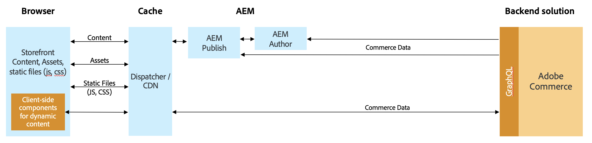

# [!DNL Audience Activation]

The [!DNL Audience Activation] 拡張機能を使用すると、Adobe CommerceでReal-Time CDPオーディエンスをアクティブ化して、買い物かご内の一意のオファーを作成できます。 これらのオファーとインセンティブには、次のような一般的な e コマースマーチャンダイジング技法が含まれます。 _2 を無料で購入する_、ヒーローバナーはその顧客に合わせて設定され、様々なオファーを通じて製品の価格を変更しました。 Real-Time CDPに組み込まれたオーディエンスは、企業リソース計画 (ERP)、顧客関係管理 (CRM)、POS、マーケティングシステムなど、様々な企業システムからのデータに基づいています。 顧客セグメント情報は常に更新されるので、顧客は、ストアで買い物をする際に、セグメントに関連付けられたり、セグメントから関連付けが解除されたりすることができます。

Luma ストアフロントでオーディエンスをアクティブ化することも、 [頭のない](#headless-support) ストアフロント。 Luma ストアフロントでは、オーディエンス情報（セグメントメンバーシップ）は、コマース側の cookie に保存されます。 ヘッドレスストアフロントでは、オーディエンス情報は、GraphQL API ヘッダーで次の名前のパラメーターとして渡されます。 `aep-segments-membership`.

## リリースノート

この節には、拡張機能の更新に関する情報が含まれ、以下がAudience Activationされます。

  — 新機能
  — 修正点および改善点
  — 既知の問題

詳しくは、 [今後のリリース](https://experienceleague.adobe.com/docs/commerce-operations/release/planning/schedule.html) を参照してください。

開発者向けドキュメントを参照してください。 [製品の互換性の詳細](https://experienceleague.adobe.com/docs/commerce-operations/release/product-availability.html).

## サポートされるサービスの更新

これらのリリースノートでは、Audience Activationで使用される拡張機能に関する機能の変更と修正について説明します。

+++サポートされるサービスの更新

_2023 年 8 月 16 日_

  — 更新された [Real-Time CDP Audiences ダッシュボード](#real-time-cdp-audiences-dashboard) フィルタリングを簡単にする。

_2023 年 6 月 28 日_

 - PHP 8.2 のサポートを `magento/module-data-services-graphql` パッケージ。

_2023 年 5 月 31 日_

  — 更新された [Real-Time CDP Audiences ダッシュボード](#real-time-cdp-audiences-dashboard) :Adobe Commerceインスタンス内のアクティブなオーディエンスを並べ替え、検索、フィルタリングする機能を含めます。

+++

### 2.2.0-beta1

[!BADGE 互換性]{type=Informative tooltip="互換性"}

_2024 年 2 月 17 日_

  — ベータ版に参加している場合は、 `composer.json` ファイルのルートレベルは次のようになります。 ` "minimum-stability": "beta"`.
 - (**ベータ版**) を作成する機能を追加しました。 [関連製品ルール](../merchandising-promotions/product-related-rule-create.md) オーディエンスから情報を得た。

### 2.1.0

[!BADGE 互換性]{type=Informative tooltip="互換性"}

_2024 年 1 月 25 日_

  — 更新された [Real-Time CDP Audiences ダッシュボード](#real-time-cdp-audiences-dashboard) ：オーディエンスを含む web サイトを含め、それらのオーディエンスを使用するように設定される動的ブロックおよび買い物かごの価格ルールを指定します。

### 2.0.1

[!BADGE 互換性]{type=Informative tooltip="互換性"}

_2023 年 11 月 17 日_

  — 安定性が向上。

### 2.0.0

[!BADGE 互換性]{type=Informative tooltip="互換性"}

_2023 年 10 月 11 日_

  — 次の場合に、OAuth 2.0 のサポートが追加されました。 [設定](#configure-the-extension) Audience Activation拡張。
  — 安定性が向上。

### 1.2.0

[!BADGE 互換性]{type=Informative tooltip="互換性"}

_2023 年 8 月 16 日_

 - UI コンポーネントのバージョンを更新しました。

### 1.1.0

_2023 年 5 月 31 日_

[!BADGE 互換性]{type=Informative tooltip="互換性"}

  — のサポートを追加しました [動的ブロック](#headless-support) ヘッドレスな店の前に

### 1.0.1

_2023 年 5 月 12 日_

[!BADGE 互換性]{type=Informative tooltip="互換性"}

  — 動的ブロックまたは買い物かごの価格ルールがストアフロントに適用されない問題を修正しました。
  — マーチャントが動的ブロックを作成または更新しようとすると、Audience Activation拡張機能の未設定のインストールでエラーが発生する問題を修正しました。

### 1.0.0

_2023 年 3 月 31 日_

[!BADGE 互換性]{type=Informative tooltip="互換性"}

  — 一般リリース (GA)

## 実装

以下のタスクは、Luma とヘッドレスストアフロントの両方の実装に適用されます。 Adobe Commerceでオーディエンスをアクティブ化するには、次の操作を行う必要があります。

- Adobe Commerceバージョン 2.4.4 以降のインストール
- [有効化](https://experienceleague.adobe.com/docs/experience-platform/destinations/catalog/personalization/adobe-commerce.html) Real-Time CDPの宛先としてのAdobe Commerce
- [インストール](#install-the-extension) の [!DNL Audience Activation] 管理者の拡張機能
- [設定](#configure-the-extension) の [!DNL Audience Activation] 管理者の拡張機能

### 拡張機能のインストール

をインストールします。 [!DNL Audience Activation] からの拡張 [marketplace](https://commercemarketplace.adobe.com/magento-audiences.html)または、次のコマンドを実行します。

```bash
composer require magento/audiences
```

### 拡張機能の設定

インストール後、 [!DNL Audience Activation] 拡張機能を使用する場合は、コマース管理者にログインし、以下の手順を実行する必要があります。

1. 次の日： _管理者_ サイドバー、移動 **[!UICONTROL System]** > _[!UICONTROL Services]_>**[!UICONTROL Commerce Services Connector]**.

1. [ログイン](https://experienceleague.adobe.com/docs/commerce-merchant-services/user-guides/integration-services/saas.html#organizationid) をAdobeアカウントに追加し、組織 ID を選択します。

1. 次の日： _管理者_ サイドバー、移動 **[!UICONTROL System]** > _[!UICONTROL Services]_>**[!UICONTROL [!DNL Data Connection]]**.

1. Adobe Analytics の **[!UICONTROL Datastream ID]** 「 」フィールドに、作成したデータストリームの ID を貼り付けます。 [有効化済み](https://experienceleague.adobe.com/docs/experience-platform/destinations/catalog/personalization/adobe-commerce.html#parameters) Adobe CommerceをReal-Time CDPの宛先に使用する。

   このデータストリームは、買い物客がオーディエンスに属しているかどうかを判断するために、コマース Web サイトからReal-Time CDPにデータを送信します。 まだデータストリームを作成していない場合は、 [作成](https://experienceleague.adobe.com/docs/experience-platform/datastreams/configure.html#create) 一人はExperience Platformで [追加](https://experienceleague.adobe.com/docs/experience-platform/destinations/catalog/personalization/adobe-commerce.html) Real-Time CDPの Commerce の宛先に、 [[!DNL Data Connection]](https://experienceleague.adobe.com/docs/commerce-merchant-services/data-connection/fundamentals/connect-data.html#data-collection) 拡張機能を使用して、管理者で設定できます。

   >[!NOTE]
   >
   >データストリーム ID を指定する場合、 [特定の Web サイトに関連付ける](https://experienceleague.adobe.com/docs/commerce-merchant-services/data-connection/fundamentals/connect-data.html#data-collection) （内） [!DNL Data Connection] 拡張子。 コマースストアに複数の Web サイトがある場合、 [宛先の作成](https://experienceleague.adobe.com/docs/experience-platform/destinations/ui/connect-destination.html) をReal-Time CDPの各 web サイトに対して設定し、それぞれに異なるデータストリーム ID を使用します。

1. 次の日： _管理者_ サイドバー、移動 **[!UICONTROL Stores]** > _[!UICONTROL Settings]_>**[!UICONTROL Configuration]**.

1. 展開 **[!UICONTROL Services]** を選択し、 **[!UICONTROL [!DNL Data Connection]]**.

1. [追加](https://experienceleague.adobe.com/docs/commerce-merchant-services/data-connection/fundamentals/connect-data.html#add-service-account-and-credential-details) サービスアカウントと資格情報の詳細。

## コマースでReal-Time CDPオーディエンスを使用する場所

を使用 [!DNL Audience Activation] 拡張機能を有効にすると、次の操作を実行できます。

- [買い物かごの価格ルールの作成](../merchandising-promotions/price-rules-cart-create.md#set-a-condition-using-real-time-cdp-audiences) 聴衆から情報を得る
- [ダイナミックブロックを作成する](../content-design/dynamic-blocks.md#use-real-time-cdp-audiences-in-dynamic-blocks) 聴衆から情報を得る
- [(**ベータ版**) 関連する製品ルールの作成](../merchandising-promotions/product-related-rule-create.md) 聴衆から情報を得る

## Real-Time CDP audiences ダッシュボード

すべてを表示できます [アクティブ](https://experienceleague.adobe.com/docs/experience-platform/destinations/ui/activate/activate-edge-personalization-destinations.html) Adobe Commerceインスタンス内で、 **Real-Time CDP Audiences** ダッシュボード。

次の手順で **Real-Time CDP Audiences** ダッシュボードに移動します。 _管理者_ サイドバー、次に移動 **[!UICONTROL Customers]** > **[!UICONTROL Real-time CDP Audience]**.

{width="700" zoomable="yes"}

ダッシュボードには、次のフィールドが含まれます。

| 列 | 説明 |
|--- |--- |
| `Hide filters` | ダッシュボードに適用できるフィルターの表示/非表示を切り替えることができます。 現在、適用できるフィルターは次のみです。 `Last updated`. このフィルターを使用すると、オーディエンスが最後に更新された日時に基づいてオーディエンスの日付範囲を選択できます。 |
| `Search` | コマースインスタンス内のアクティブなオーディエンスを検索できます。 |
| `Name` | Real-Time CDPでオーディエンスに与えられた名前。 |
| `Origin` | オーディエンスがどこから来たかを示します（例： ）。 `Experience Platform`. |
| `Websites` | オーディエンスを使用するように設定されている Web サイトを示します。 |
| `Dynamic Blocks` | オーディエンスを使用するように設定されている動的ブロックを示します。 |
| `Cart Price Rules` | オーディエンスを使用するように設定されている買い物かごの価格ルールを示します。 |
| `Last updated` | オーディエンスがReal-Time CDPで変更された日時を示します。 |
| `Sync now` | Real-Time CDPから新しいオーディエンスまたは更新されたオーディエンスを取得します。 |
| `Customize table` | 表示/非表示を切り替える `Origin`, `Websites`, `Dynamic Blocks`, `Cart Price Rules`、および `Last updated` 列。 |

{style="table-layout:auto"}

## ヘッドレスサポート

AEMやPWAなどのヘッドレスAdobe Commerceインスタンスでオーディエンスをアクティブ化して、買い物かごの価格ルール、関連する製品ルール、オーディエンスに基づく動的ブロックを表示できます。

### 買い物かごの価格ルールと関連製品ルール

買い物かごの価格ルールおよび関連する製品ルールの場合、ヘッドレスストアフロントは、 [COMMERCE INTEGRATION FRAMEWORK(CIF)](https://experienceleague.adobe.com/docs/experience-manager-cloud-service/content/content-and-commerce/integrations/magento.html). このフレームワークは、GraphQLを使用して実装されたサーバー側 API を提供します。 買い物客のセグメントなどのオーディエンス情報は、次の名前のGraphQLヘッダーパラメーターを通じてコマースに渡されます。 `aep-segments-membership`.

全体的なアーキテクチャは次のとおりです。

{width="700" zoomable="yes"}

後で [install](#install-the-extension) および [設定](#configure-the-extension) 拡張機能の場合、Experience PlatformWeb SDK には、オーディエンス情報がセグメントメンバーシップの形式で含まれます。

SDK からこれらのセグメントメンバーシップを取り込むには、次を参照してください [コードスニペット](https://experienceleague.adobe.com/docs/experience-platform/destinations/catalog/personalization/custom-personalization.html#example-response-for-custom-personalization-with-attributes).

取得したセグメントは、GraphQLヘッダー内の Commerce に渡すことができます。 例：

```bash
curl 'http://magento.config/graphql' -H 'Authorization: Bearer abc123' -H 'aep-segments-membership: urlencoded_list_of_segments' -H 'Content-Type: application/json' --data-binary '{"query":"query {\ncustomer {\nfirstname\nlastname\nemail\n}\n}"}'
```

### 動的ブロック

動的ブロックの場合、GraphQL `dynamicBlocks` クエリには、 `audience_id` 入力属性。 1 つ以上の `audience_id` の値 `dynamicBlocks` クエリの場合は、これらのオーディエンスに割り当てられた動的ブロックのリストが返されます。

#### 使用例

次のクエリは、複数のオーディエンス ID に関連付けられているすべての動的ブロックを返します。

**リクエスト：**

```graphql
{
  dynamicBlocks(input:
  {
    type: SPECIFIED
    audience_id: {
      in: [
        "cd29a789-9be8-40ad-a1ef-640c33b3742e"
        "92c3e14d-c72b-40d0-96b7-b96801dcc135"
      ]
    }
  })
  {
    items {
      uid
      audience_id
      content {
        html
      }
    }
    page_info {
      current_page
      page_size
      total_pages
    }
    total_count
  }
}
```

**応答：**

```json
{
  "data": {
    "dynamicBlocks": {
      "items": [
        {
          "uid": "MQ==",
          "audience_id": [
            "cd29a789-9be8-40ad-a1ef-640c33b3742e"
          ],
          "content": {
            "html": "<h2><strong>SAVE 20%</strong></h2>\r\n<p>(some restrictions apply)</p>\r\n<p>&nbsp;</p>"
          }
        },
        {
          "uid": "Mg==",
          "audience_id": [
            "cd29a789-9be8-40ad-a1ef-640c33b3742e",
            "92c3e14d-c72b-40d0-96b7-b96801dcc135"
          ],
          "content": {
            "html": "<p></p>"
          }
        }
      ],
      "page_info": {
        "current_page": 1,
        "page_size": 20,
        "total_pages": 1
      },
      "total_count": 2
    }
  }
}
```

詳しくは、 `dynamicBlocks` GraphQLクエリ [開発者向けドキュメント](https://developer.adobe.com/commerce/webapi/graphql/schema/store/queries/dynamic-blocks/).

## Adobe Experience Platform Mobile SDK を使用したオーディエンスの取得

Adobe Experience Platform Mobile SDK を使用してReal-Time CDPオーディエンスを取得する前に、次の操作を行う必要があります。 [モバイルコマースサイト用の SDK のインストールと設定](https://experienceleague.adobe.com/docs/commerce-merchant-services/data-connection/fundamentals/mobile-sdk-epc.html).

>[!IMPORTANT]
>
>Adobe Experience Platform Mobile SDK for iOSは、iOS 11 以降をサポートします。

設定が完了したら、モバイル SDK 操作を使用してオーディエンスデータを取得します。 例：

```swift
Edge.sendEvent(experienceEvent: experienceEvent) { (handles: [EdgeEventHandle]) in
    for handle in handles {
        if handle.type == "activation:pull" {
        let payloadItems = handle.payload ?? []
            for payloadItem in payloadItems {
                if let segments = payloadItem["segments"] as? any Sequence {
                    var segmentsArr = [Any]()
                    for segment in segments {
                        let response = segment as AnyObject?
                        segmentsArr.append(response?.object(forKey: "id")! ?? "")
                    }
                    print("Saving segments ->  \(segments)")
                    storage.set(segmentsArr, forKey: "segments")
                    print("End saving segments")
                }
         
                // Show segments
                let rSegments = storage.object(forKey: "segments") ?? nil;
                print("Retrieving segments -> \(rSegments)")
            }
        }
    }
}
```

データを取得したら、それを使用して、オーディエンスに知られた情報を作成できます [買い物かご価格ルール](../merchandising-promotions/price-rules-cart-create.md#set-a-condition-using-real-time-cdp-audiences), [動的ブロック](../content-design/dynamic-blocks.md#use-real-time-cdp-audiences-in-dynamic-blocks) および  [関連製品ルール](../merchandising-promotions/product-related-rule-create.md) （コマースアプリ内）をクリックします。

## Commerce にオーディエンスが表示されない

Real-Time CDPオーディエンスが Commerce に表示されない場合は、次の原因が考えられます。

- 次の項目で選択された認証タイプが正しくありません： **データ接続** 設定ページ
- 生成されたトークンに対する権限が不十分です

次の 2 つの節で、どちらの場合のトラブルシューティング方法について説明します。

### 設定で選択された認証タイプが正しくありません

1. コマースインスタンスを開きます。
1. 次の日： _管理者_ サイドバー、移動 **[!UICONTROL Stores]** > _[!UICONTROL Settings]_>**[!UICONTROL Configuration]**.
1. 展開 **[!UICONTROL Services]** を選択し、 **[!UICONTROL [!DNL Data Connection]]**.
1. サーバー間認証方法が、 **[!UICONTROL Authentication Type]** フィールドが正しい。 Adobeは、 **OAuth**. JWT は非推奨（廃止予定）となりました。 [詳細情報](https://developer.adobe.com/developer-console/docs/guides/authentication/ServerToServerAuthentication/migration/).

### 生成されたトークンに対する権限が不十分です

この問題は、生成されたトークンに対する API 権限が不十分なことが原因で発生する可能性があります。 トークンに正しい権限が設定されていることを確認するには、次の手順を実行します。

1. 組織内のAdobe Experience Platformのシステム管理者を特定します。
1. 使用するプロジェクトと資格情報を見つけます。
1. テクニカルアカウントの E メールを識別します。例： `fe3c9476-1234-1234-abcd-2a51a785009a@techacct.adobe.com`.
1. システム管理者にAdobe Experience Platformを起動させ、に移動してもらう **[!UICONTROL Permissions]** -> **[!UICONTROL Users]** -> **[!UICONTROL API credentials]**.
1. 上記のテクニカルアカウント電子メールを使用して、変更する資格情報を検索します。
1. 資格情報を開き、「 」を選択します。 **[!UICONTROL Roles]** -> **[!UICONTROL Add roles]**.
1. 追加 **実稼動環境へのすべてのアクセス**.
1. クリック **[!UICONTROL Save]**.
1. [再生成](https://experienceleague.adobe.com/docs/experience-platform/landing/platform-apis/api-authentication.html#generate-access-token) コンソールのアクセストークン。
1. を使用して、トークンが有効な応答を提供していることを確認します。 [Target 接続 API](https://developer.adobe.com/experience-platform-apis/references/destinations/#tag/Target-connections/operation/getTargetConnections).
