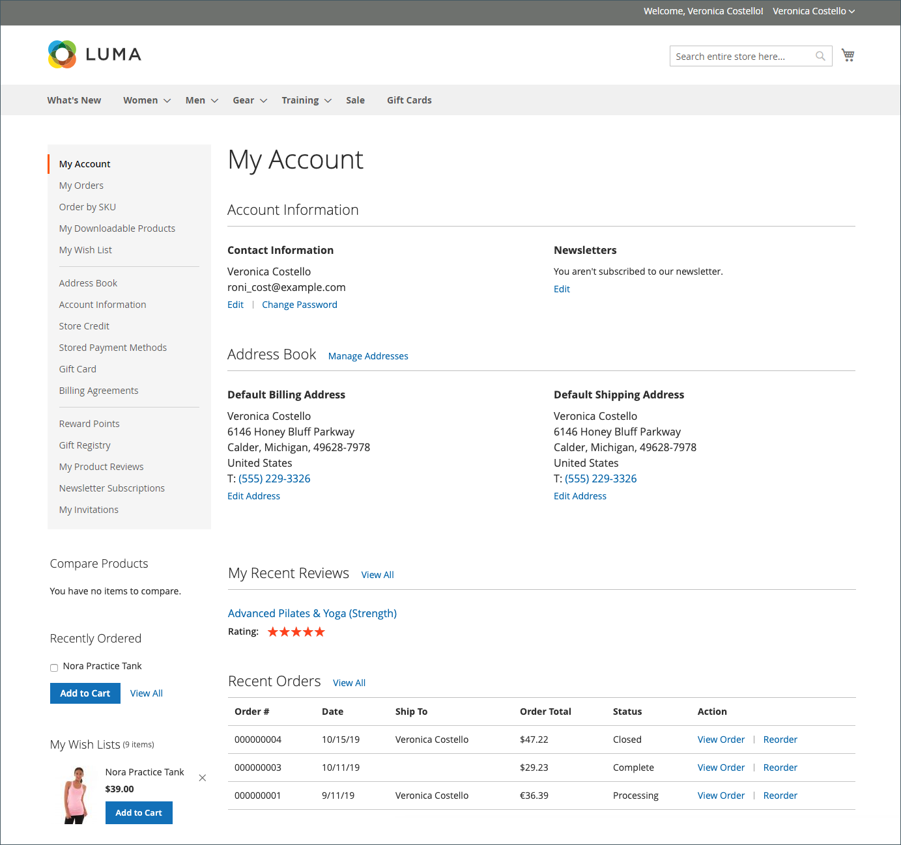

# 顧客アカウントの範囲

ストア内のすべてのページのヘッダーには、買い物客の招待が表示され、ストアのアカウントに&#x200B;_ログインまたは登録_&#x200B;できます。 口座を開設するお客様には、次のような様々な利点があります。

* **顧客アカウントの作成** – 訪問者は、ストアフロントを登録済み顧客として使用できるように、顧客アカウントを作成できます。
* **会社アカウントの作成**&#x200B;設定に応じて、ストアの訪問者が会社アカウントの作成を選択できます。 詳しくは、[Adobe Commerce B2B](../b2b/introduction.md)を参照してください。
* **チェックアウトを高速化** – 登録済みの顧客は、多くの情報が既にアカウントに登録されているため、チェックアウトを高速に進めます。
* **セルフサービス** – 登録済みのお客様は、情報を更新したり、注文状況を確認したり、アカウントから再注文したりできます。

お客様は、ストアのヘッダーにある&#x200B;**[!UICONTROL My Account]** リンクをクリックして、自分のアカウントにアクセスできます。 顧客は、アカウントから、過去と現在の住所、請求と配送の設定、ニュースレターの購読、ウィッシュリストなどの情報を表示し、変更することができます。

{width="600" zoomable="yes"}

## 顧客アカウントの範囲の設定

顧客アカウントの範囲は、アカウントが作成されたweb サイトに限定するか、ストア階層のすべてのweb サイトとストアと共有できます。

>[!NOTE]
>
>お客様グループからWeb サイトを除外する場合、お客様アカウントの範囲がWeb サイトに限定されている場合、またはすべてのWeb サイトと共有されている場合、お客様はWeb サイトにログインできません。 グループからweb サイトを除外する方法について詳しくは、[顧客グループを作成](customer-groups.md#create-a-customer-group)を参照してください。

1. _管理者_ サイドバーで、**[!UICONTROL Stores]** > [!UICONTROL _[!UICONTROL Settings]_] > **[!UICONTROL Configuration]**&#x200B;に移動します。

1. 左側のパネルで、**[!UICONTROL Customers]**&#x200B;を展開し、**[!UICONTROL Customer Configuration]**&#x200B;を選択します。

1. **[!UICONTROL Account Sharing Options]** セクションを展開します。

   {width="600" zoomable="yes"}

1. **[!UICONTROL Share Customer Accounts]**&#x200B;を次のいずれかに設定します：

   | オプション | 説明 |
   | --- | --- |
   | `Global` | お客様のアカウント情報を、インストール内のすべてのweb サイトとストアと共有します。 |
   | `Per Website` | 顧客アカウント情報を、アカウントが作成されたweb サイトに制限します。 |

   {style="table-layout:auto"}

   >[!INFO]
   >
   > 必要に応じて、**[!UICONTROL User system value]** チェックボックスをオフにして、変更を行います。

1. 完了したら、**[!UICONTROL Save Config]**&#x200B;をクリックします。

   >[!NOTE]
   >
   >`Global`を選択すると、**マイアカウント**&#x200B;の顧客情報（住所、連絡先情報など）が共有されます。
