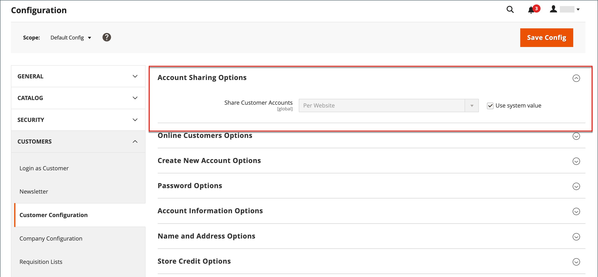

# 顧客アカウントの範囲

ストア内のすべてのページのヘッダーは、買い物客の招待を次まで拡張します。 _ログインまたは登録_ ストアのアカウントの場合。 アカウントを開設するお客様には、次のような様々なメリットがあります。

* **顧客アカウントを作成**  – 訪問者は顧客アカウントを作成して、ストアフロントを登録顧客として使用できます。
* **会社アカウントの作成** 設定に応じて、ストアへの訪問者が会社アカウントの作成を選択できます。 詳しくは、を参照してください [Adobe Commerce B2B](../b2b/introduction.md).
* **チェックアウトの迅速化**  – 登録顧客は、多くの情報が既にアカウントに含まれているため、チェックアウトをより迅速に進めることができます。
* **セルフサービス**  – 登録されたお客様は、情報の更新、注文のステータスの確認、アカウントからの並べ替えなどを行うことができます。

顧客は、 **[!UICONTROL My Account]** ストアのヘッダー内のリンク。 顧客は自分のアカウントから、過去や現在の住所、請求や配送の環境設定、ニュースレターの購読、ウィッシュリストなどの情報を表示および変更できます。

{width="600" zoomable="yes"}

## 顧客アカウントの範囲の設定

顧客アカウントの範囲は、アカウントが作成された web サイトに限定することも、ストア階層内のすべての web サイトやストアと共有することもできます。

>[!NOTE]
>
>Web サイトを顧客グループから除外した場合、顧客アカウントの範囲を Web サイトに限定したり、すべての Web サイトと共有したりすると、顧客は Web サイトにログインできなくなります。 参照： [顧客グループの作成](customer-groups.md#create-a-customer-group) web サイトをグループから除外する方法の詳細については、こちらを参照してください。

1. 日 _Admin_ サイドバー、に移動 **[!UICONTROL Stores]** > [!UICONTROL _[!UICONTROL Settings]_] > **[!UICONTROL Configuration]**.

1. 左側のパネルで、を展開します **[!UICONTROL Customers]** を選択します **[!UICONTROL Customer Configuration]**.

1. を展開します。 **[!UICONTROL Account Sharing Options]** セクション。

   {width="600" zoomable="yes"}

1. を設定 **[!UICONTROL Share Customer Accounts]** を次のいずれかに変更します。

   | オプション | 説明 |
   | --- | --- |
   | `Global` | 顧客アカウント情報をインストール内のすべての web サイトおよびストアと共有します。 |
   | `Per Website` | 顧客のアカウント情報を、そのアカウントが作成された web サイトに制限します。 |

   {style="table-layout:auto"}

   >[!INFO]
   >
   > 必要に応じて、 **[!UICONTROL User system value]** 変更するチェックボックス。

1. 完了したら、 **[!UICONTROL Save Config]**.

   >[!NOTE]
   >
   >条件 `Global` で顧客情報が選択されています **マイアカウント** （住所やアカウント情報（連絡先の詳細など）を共有します。
