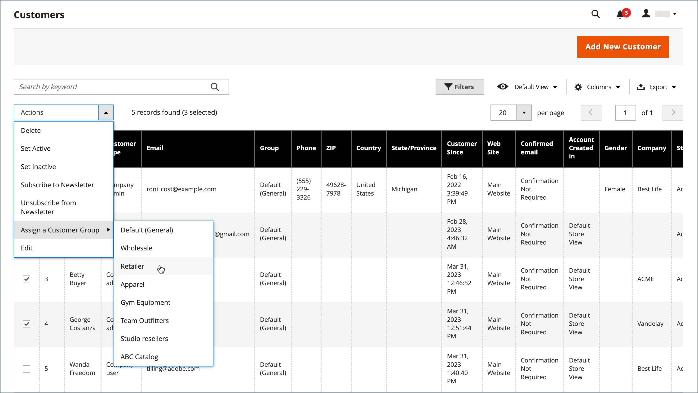

# 顧客グループ

顧客グループによって、使用可能な割引と、そのグループに関連付けられている税区分が決定されます。 デフォルトの顧客グループは、`General`、`Not Logged In`、`Wholesale` です。

{width="700" zoomable="yes"}

## [!UICONTROL Customer Groups] リストのフィルタリング

1. _管理者_ サイドバーで、**[!UICONTROL Customers]**/**[!UICONTROL Customer Groups]** に移動します。

1. 「**[!UICONTROL Filters]**」をクリックします。

1. ID、グループ、税区分の範囲など、グループを検索する基準を入力します。

   {width="600" zoomable="yes"}

1. 完了したら、「**[!UICONTROL Apply Filters]**」をクリックします。

## 顧客グループの作成

>[!NOTE]
>
>管理者ユーザーは、すべての web サイトにアクセスできない（「カスタム」 [!UICONTROL Role Scope] ーザーを持つ役割が割り当てられている）場合、顧客グループを作成、変更または削除することはできません。

1. _管理者_ サイドバーで、**[!UICONTROL Customers]**/**[!UICONTROL Customer Groups]** に移動します。

1. 「**[!UICONTROL Add New Customer Group]**」をクリックします。

1. [!DNL **Group Name]**&#x200B;の場合、グループを識別するための一意の名前を 32 文字未満で入力します。

1. グループに適用する **[!UICONTROL Tax Class]** を選択します。

   {width="600" zoomable="yes"}

1. グループから除外する **[!UICONTROL Excluded Website(s)]** を選択します。

   >[!IMPORTANT]
   >
   >Web サイトを除外すると、除外された web サイトのインデックスが作成されなくなるので、製品価格とカタログルールのインデックス作成時間が短縮される可能性があります。 顧客グループを保存して web サイトの除外を追加すると、製品価格、カタログルールおよびカタログ検索インデックスが無効になります。 製品、web サイトおよび顧客グループが多数ある場合は、顧客グループから web サイトを除外するまで再インデックス処理を一時停止することをお勧めします。

   デフォルトで除外される web サイトはありません。 複数の値を選択するには、_Ctrl_ キー（PC）または _Command_ キー（Mac）を押したまま、各オプションをクリックします。

1. 完了したら、「**[!UICONTROL Save Customer Group]**」をクリックします。

## 顧客グループの編集

1. _管理者_ サイドバーで、**[!UICONTROL Customers]**/**[!UICONTROL Customer Groups]** に移動します。

1. レコードを編集モードで開きます。

1. 必要な変更を加えます。

1. 完了したら、「**[!UICONTROL Save Customer Group]**」をクリックします。

## 顧客を別のグループに割り当てる

>[!NOTE]
>
>会社グループを変更した後、会社のユーザーはログアウトしてストアフロントにログインして、カタログに新しい価格を表示する必要があります。

1. _管理者_ サイドバーで、**[!UICONTROL Customers]**/**[!UICONTROL All Customers]** に移動します。

1. リストで顧客を見つけ、最初の列のチェックボックスを選択します。

1. **アクション** コントロールを `Assign a Customer Group` に設定し、メニューからグループを選択します。

   {width="600" zoomable="yes"}

1. 確認を求めるメッセージが表示されたら、「**OK**」をクリックします。

## 顧客グループと特定の割引を関連付けます

1. _管理者_ サイドバーで、**[!UICONTROL Marketing]**/_プロモーション_/**[!UICONTROL Cart Price Rules]** に移動します。

1. 適用された割引のグループを関連付ける買い物かご価格ルールを選択するか、[ 価格ルールを作成 ](../merchandising-promotions/price-rules-catalog.md) します。

1. ルールを適用する顧客グループを選択します。

   {width="600" zoomable="yes"}

1. 「**[!UICONTROL Save]**」をクリックします。

>[!NOTE]
>
> また、Advance pricing を使用して、顧客グループに製品割引を適用することもできます。 [ 詳細価格 ](../catalog/product-price-group.md) を参照してください。

## 顧客グループの削除

1. _管理者_ サイドバーで、**[!UICONTROL Customers]**/**[!UICONTROL Customer Groups]** に移動します。

1. レコードを編集モードで開きます。

1. ボタン バーで、[**[!UICONTROL Delete Customer Group]**] をクリックします。

1. 確認を求めるメッセージが表示されたら、「**OK**」をクリックします。

## 顧客グループのデモ

このデモを見て、顧客グループを作成する方法を学びます。

>[!VIDEO](https://video.tv.adobe.com/v/343660/?quality=12&learn=on)
