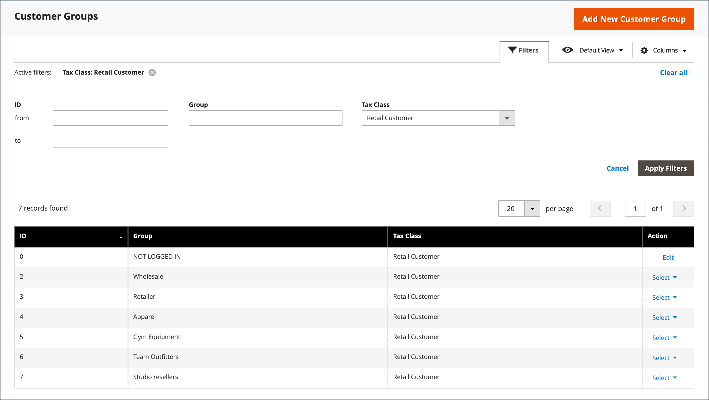

# 顧客グループ

顧客グループは、使用可能な割引と、そのグループに関連付けられている税区分を決定します。 既定の顧客グループは`General`、`Not Logged In`、`Wholesale`です。

{width="700" zoomable="yes"}

## [!UICONTROL Customer Groups] リストをフィルター

1. _管理者_ サイドバーで、**[!UICONTROL Customers]** > **[!UICONTROL Customer Groups]**&#x200B;に移動します。

1. **[!UICONTROL Filters]**&#x200B;をクリックします。

1. ID、グループ、税区分などの範囲を含む、グループを検索するための条件を入力します。

   {width="600" zoomable="yes"}

1. 完了したら、**[!UICONTROL Apply Filters]**&#x200B;をクリックします。

## 顧客グループの作成

>[!NOTE]
>
>すべてのWeb サイトにアクセスできない管理者ユーザー（「カスタム」 [!UICONTROL Role Scope]を持つ役割を割り当てられている）は、顧客グループを作成、変更、または削除できません。

1. _管理者_ サイドバーで、**[!UICONTROL Customers]** > **[!UICONTROL Customer Groups]**&#x200B;に移動します。

1. **[!UICONTROL Add New Customer Group]**&#x200B;をクリックします。

1. [!DNL **Group Name]**&#x200B;の場合、グループを識別するには、32文字未満の一意の名前を入力してください。

1. グループに適用される&#x200B;**[!UICONTROL Tax Class]**&#x200B;を選択します。

   {width="600" zoomable="yes"}

1. グループから除外する&#x200B;**[!UICONTROL Excluded Website(s)]**&#x200B;を選択します。

   >[!IMPORTANT]
   >
   >除外されたweb サイトにはインデックスが作成されないため、web サイトを除外すると、製品価格とカタログルールのインデックス作成時間が短縮される可能性があります。 追加されたweb サイト除外を使用して顧客グループを保存すると、製品価格、カタログルール、カタログ検索インデックスが無効になります。 製品、web サイト、および顧客グループが多数ある場合は、顧客グループからweb サイトを除外するまで、インデックス再作成プロセスを一時停止することをお勧めします。

   デフォルトでは、Web サイトは除外されません。 複数の値を選択するには、_Ctrl_ キー（PC）または&#x200B;_Command_ キー（Mac）を押しながら、各オプションをクリックします。

1. 完了したら、**[!UICONTROL Save Customer Group]**&#x200B;をクリックします。

## 顧客グループの編集

1. _管理者_ サイドバーで、**[!UICONTROL Customers]** > **[!UICONTROL Customer Groups]**&#x200B;に移動します。

1. レコードを編集モードで開きます。

1. 必要な変更を加えます。

1. 完了したら、**[!UICONTROL Save Customer Group]**&#x200B;をクリックします。

## 顧客を別のグループに割り当てる

>[!NOTE]
>
>会社グループを変更した後、会社ユーザーはログアウトしてストアフロントにログインし、カタログに新しい価格を表示する必要があります。
>お客様が会社に割り当てられた後、お客様グループは読み取り専用になり、管理者ユーザーは更新できません。

1. _管理者_ サイドバーで、**[!UICONTROL Customers]** > **[!UICONTROL All Customers]**&#x200B;に移動します。

1. リストで顧客を見つけ、最初の列のチェックボックスを選択します。

1. **アクション** コントロールを`Assign a Customer Group`に設定し、メニューからグループを選択します。

   {width="600" zoomable="yes"}

1. 確認を求められたら、**OK**&#x200B;をクリックします。

## 顧客グループを特定の割引に関連付ける

1. _管理者_ サイドバーで、**[!UICONTROL Marketing]** > _プロモーション_ > **[!UICONTROL Cart Price Rules]**&#x200B;に移動します。

1. 適用された割引にグループを関連付けるカート価格ルールを選択するか、[価格ルールを作成](../merchandising-promotions/price-rules-catalog.md)します。

1. ルールが適用される顧客グループを選択します。

   {width="600" zoomable="yes"}

1. **[!UICONTROL Save]**&#x200B;をクリックします。

>[!NOTE]
>
> また、事前価格を利用して、顧客グループに商品割引を適用することもできます。 [詳細価格](../catalog/product-price-group.md)を参照してください。

## 顧客グループの削除

1. _管理者_ サイドバーで、**[!UICONTROL Customers]** > **[!UICONTROL Customer Groups]**&#x200B;に移動します。

1. レコードを編集モードで開きます。

1. ボタンバーで、**[!UICONTROL Delete Customer Group]**&#x200B;をクリックします。

1. 確認を求められたら、**OK**&#x200B;をクリックします。

## 顧客グループのデモ

デモを見て顧客グループを作成する方法を学びましょう。

>[!VIDEO](https://video.tv.adobe.com/v/3410171/?captions=jpn&quality=12&learn=on)
