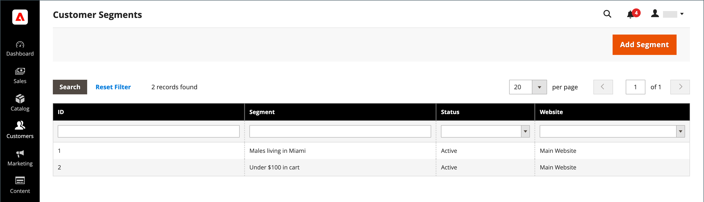
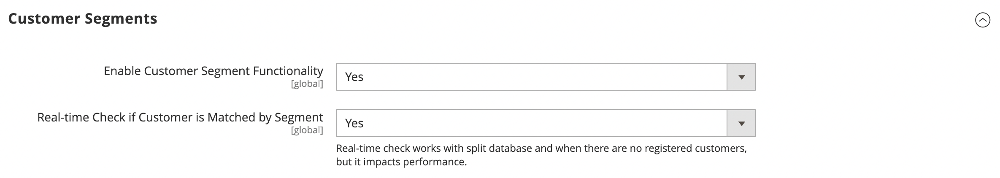
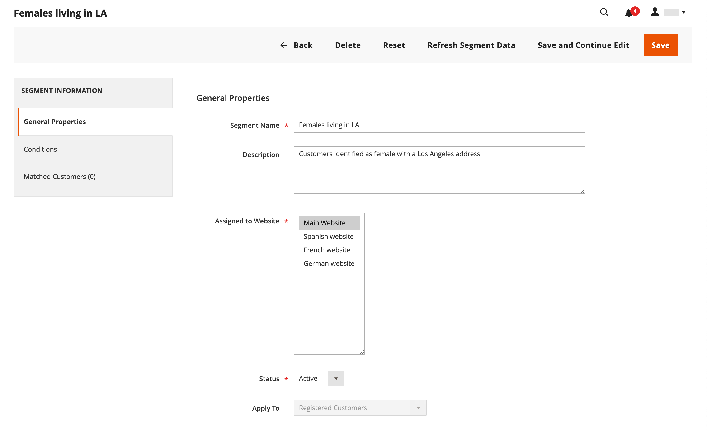
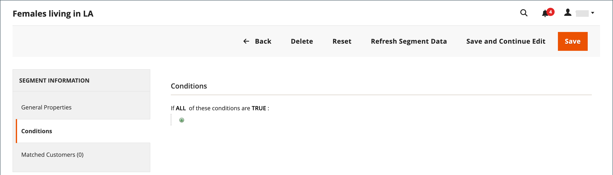
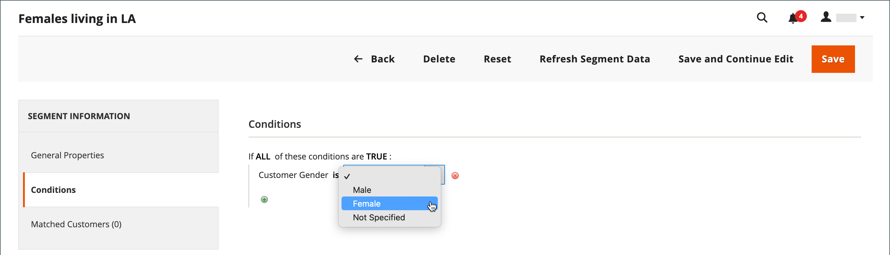
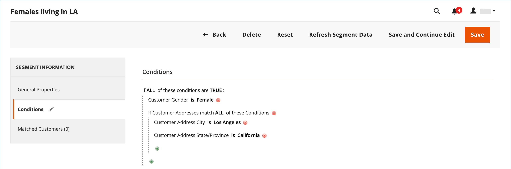
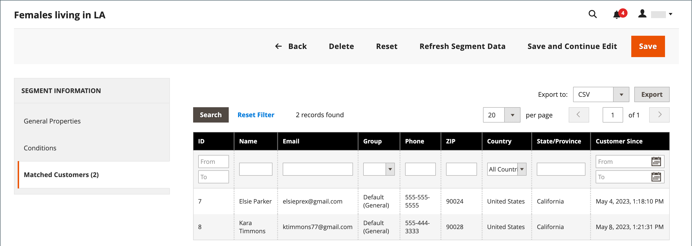

# 顧客セグメントの作成と削除

{{ee-feature}}

顧客セグメントの作成は、[買い物かご価格ルール ](../merchandising-promotions/price-rules-cart.md)の作成に似ていますが、オプションには[顧客セグメント固有の属性](../customers/customer-segments.md)が含まれます。

{width="700" zoomable="yes"}

_**[!UICONTROL Customer Segments]グリッド&#x200B;**_

| 列 | 説明 |
|--- |--- |
| **[!UICONTROL ID]** | 顧客セグメントの一意のID |
| **[!UICONTROL Segment]** | 顧客セグメント名。 |
| **[!UICONTROL Status]** | 顧客セグメントが&#x200B;_[!UICONTROL Active]_か_[!UICONTROL Inactive]_&#x200B;かを示します。 |
| **[!UICONTROL Website]** | 顧客セグメントが属するweb サイトを示します。 |

{style="table-layout:auto"}

## 前提条件：顧客セグメントを有効にする

1. _管理者_ サイドバーで、**[!UICONTROL Stores]** > _[!UICONTROL Settings]_>**[!UICONTROL Configuration]**に移動します。

1. 左側のパネルで、**[!UICONTROL Customers]**&#x200B;を展開し、**[!UICONTROL Customer Configuration]**&#x200B;を選択します。

1. **[!UICONTROL Customer Segments]** セクションを展開します。

1. **[!UICONTROL Enable Customer Segment Functionality]**&#x200B;が`Yes`に設定されていることを確認します。

   {width="600" zoomable="yes"}

1. （オプション）顧客セグメントのリアルタイム検証を無効にするには、**[!UICONTROL Real-time Check if Customer is Matched by Segment]**&#x200B;を`No`に設定します。

   リアルタイム検証を無効にすると、顧客セグメントは、単一の複合条件SQL クエリによって検証されます。 この機能を無効にすると、システムに顧客セグメントが多い場合に、セグメント検証のパフォーマンスが向上します。 ただし、検証は、分割データベースや登録済みの顧客がない場合には機能しません。

1. 完了したら、**[!UICONTROL Save Config]**&#x200B;をクリックします。

## セグメントの作成

次の手順では、ロサンゼルスの女性顧客をターゲットとする顧客セグメントを作成する例を示します。

### 手順1：顧客セグメントの追加

1. _管理者_ サイドバーで、**[!UICONTROL Customers]** > **[!UICONTROL Segments]**&#x200B;に移動します。

1. 右上隅の「**[!UICONTROL Add Segment]**」をクリックします。

1. 管理者で作業する際に顧客セグメントを識別する&#x200B;**[!UICONTROL Segment Name]**&#x200B;を入力します。

1. セグメントの目的を説明する概要&#x200B;**[!UICONTROL Description]**&#x200B;を入力します。

1. 顧客セグメントを使用できるWeb サイトに&#x200B;**[!UICONTROL Assigned to Website]**&#x200B;を設定します。

1. **[!UICONTROL Status]**&#x200B;を&#x200B;_アクティブ_&#x200B;または&#x200B;_非アクティブ_&#x200B;に設定します。

1. セグメントの適用に使用する顧客タイプを特定するには、**[!UICONTROL Apply to]**&#x200B;を次のいずれかに設定します。

   - `Visitors and Registered Customers` - アカウントにログインしているかどうかに関係なく、すべての買い物客が含まれます。
   - `Registered Customers` - アカウントにログインしている買い物客のみが含まれます。
   - `Visitors` - アカウントにログインしていない買い物客のみが含まれます。

   >[!TIP]
   >
   >顧客アカウントに保存されている顧客属性に基づいてセグメントを作成する場合は、登録された顧客にのみセグメントを適用することをお勧めします。

   >[!NOTE]
   >
   > セグメントが`Visitors and Registered Customers`に適用される場合、[!UICONTROL Matched Customers]には`Registered Customers`のみが表示されます。 これは、訪問者に適用される条件に基づいて訪問者をターゲットにできる場合でも同様です。 `Visitors`個のセグメントの場合、「`Matched Customers`」タブは表示されません。

1. **[!UICONTROL Save and Continue Edit]**&#x200B;をクリックします。

   セグメント _[!UICONTROL General Properties]_を保存すると、左側のパネルに追加のオプションが表示されます。

   {width="600" zoomable="yes"}

**_[!UICONTROL General Properties]_**

| フィールド | 説明 |
|--- |---|
| **[!UICONTROL Segment Name]** | 内部参照用のセグメントを識別する名前。 |
| **[!UICONTROL Description]** | 内部参照用のセグメントの目的を説明する簡単な説明。 |
| **[!UICONTROL Assigned to Website]** | セグメントを使用できる単一のweb サイト。 |
| **[!UICONTROL Status]** | セグメントをアクティブ化および非アクティブ化します。 セグメントが無効になっている場合、関連する価格ルールとバナーは無効になります。 オプション：`Active` / `Inactive` |
| **[!UICONTROL Apply to]** | セグメントを適用する顧客タイプを定義します。 選択は、セグメントの作成に使用できる条件のセットに影響します。 セグメントを保存した後は、設定を変更できません。 |

{style="table-layout:auto"}

### 手順2：条件の定義

>[!NOTE]
>
> 買い物かごの条件（買い物かご小計、買い物かご商品、買い物かご商品の数量）、商品ルール（買い物かご内の商品および商品履歴）、およびこれらの商品の組み合わせのみが適用されます。 訪問者と登録済み顧客の両方にセグメントを適用する必要がある場合、訪問者はリストされた条件のみに基づいて追跡されます。

可能な条件は、次のグループに整理されています。

| グループ | 説明 |
|--- |--- |
| **[!UICONTROL Customer]** | 顧客アカウントの属性にもとづく条件。 セグメントが登録済みの顧客に適用される場合にのみ使用できます。 |
| **[!UICONTROL Shopping Cart]** | ショッピングカートの内容に基づく条件。 これらの条件はすべてのセグメントタイプで使用できます。 |
| **[!UICONTROL Products]** | ショッピングカート内の商品や商品の閲覧履歴にもとづく条件。 これらの条件はすべてのセグメントタイプで使用できます。 |
| **[!UICONTROL **Sales]** | 完了した注文に基づく条件。 セグメントが登録済みの顧客に適用される場合にのみ使用できます。 |

1. 左側のウィンドウで、**[!UICONTROL Conditions]**&#x200B;をクリックします。

   デフォルトの条件は、ページの&#x200B;_[!UICONTROL If ALL of these conditions are TRUE:]_から始まります。

   {width="600" zoomable="yes"}

1. 女性顧客をターゲットとする条件を作成します。

   - **[!UICONTROL Add]** アイコンをクリックして条件のリストを表示し、`Gender`を選択します。

   - デフォルトの&#x200B;**is**&#x200B;条件制御オプションを残します。

   - **...**&#x200B;をクリックし、`female`を選択します。

   {width="600" zoomable="yes"}

1. ロサンゼルス在住の方を対象とした条件を作成します。

   - 次の行で、**[!UICONTROL Add]** アイコンをクリックし、`Customer Address`を選択します。

     このアクションは、一致する1つ以上のアドレスフィールドを定義できる親条件を作成します。

   - **[!UICONTROL Add]** アイコンをクリックしてアドレス フィールドのリストを表示し、`City`を選択します。

   - **is**&#x200B;をクリックして、条件制御オプションを表示し、`contains`を選択します。

   - 「**...**」をクリックし、`Los Angeles`と入力します。

   - 次の行で、**[!UICONTROL Add]** アイコンをクリックし、`State/Province`を選択します。

   - デフォルトの&#x200B;**is**&#x200B;条件制御オプションを残します。

   - **...**&#x200B;をクリックし、`United States > California`を選択します。

   {width="600" zoomable="yes"}

1. **[!UICONTROL Save and Continue Edit]**&#x200B;をクリックします。

### 手順3：一致した顧客のリストの確認

1. 左側のウィンドウで、**[!UICONTROL Matched Customers]**&#x200B;をクリックして、条件に一致するすべての顧客を表示します。

   {width="600" zoomable="yes"}

1. 顧客のリストが目標を達成した場合は、**[!UICONTROL Save]**&#x200B;をクリックして顧客セグメントを完了します。

1. 顧客セグメントを、ターゲティングプロモーション、コンテンツ、郵送に使用できるようになりました。

_**[!UICONTROL Matched Customers]グリッド&#x200B;**_

| 列 | 説明 |
|--- |--- |
| **[!UICONTROL ID]** | 登録済み顧客の顧客ID。 |
| **[!UICONTROL Name]** | 登録済みの顧客の名前。 |
| **[!UICONTROL Email]** | 登録済みのお客様の電子メールアドレス。 |
| **[!UICONTROL Group]** | 顧客が割り当てられている顧客グループ。 |
| **[!UICONTROL Phone]** | 顧客の電話番号。 |
| **[!UICONTROL ZIP]** | お客様の郵便番号。 |
| **[!UICONTROL Country]** | 顧客が所在する国。 |
| **[!UICONTROL State / Province]** | 顧客が所在する州または都道府県。 |
| **[!UICONTROL Customer Since]** | 顧客アカウントが作成された日時。 |

{style="table-layout:auto"}

## 顧客セグメントの削除

1. _管理者_ サイドバーで、**[!UICONTROL Customers]** > **[!UICONTROL Segments]**&#x200B;に移動します。

1. 削除するセグメントを見つけて選択します。

1. メニューバーで、**[!UICONTROL Delete]** ボタンをクリックします。

1. アクションを確認するには、**[!UICONTROL OK]**&#x200B;をクリックします。

## ボタンバー

| ボタン | 説明 |
|--- |--- |
| **[!UICONTROL Back]** | 変更を保存せずに&#x200B;_[!UICONTROL Customer Segments]_ページに戻ります。 |
| **[!UICONTROL Delete]** | 現在の顧客セグメントを削除します。 セグメント内の顧客に関連付けられている顧客または完了した注文は削除されません。 |
| **[!UICONTROL Reset]** | 顧客セグメントフォームの未保存の変更を以前の値にリセットします。 |
| **[!UICONTROL Refresh Segment Data]** | セグメントデータを直近に保存された値に更新します。 セグメントデータが利用できないか、古い場合に関連します。 |
| **[!UICONTROL Save and Continue Edit]** | 変更を保存し、顧客セグメントをオープンな状態に保ちます。 |
| **[!UICONTROL Save]** | 変更を保存し、顧客セグメントを閉じます。 |

{style="table-layout:auto"}

## 顧客セグメントのデモ

顧客セグメントの作成方法については、次の動画をご覧ください。

>[!VIDEO](https://video.tv.adobe.com/v/343659/?quality=12&learn=on)
