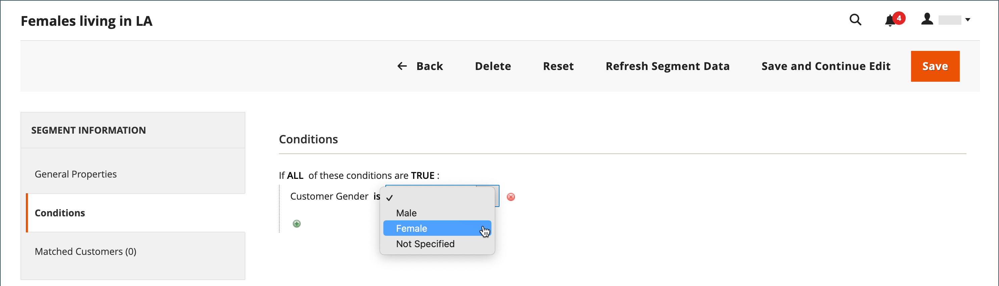

# 顧客セグメントの作成と削除

{{ee-feature}}

顧客セグメントの作成は、 [買い物かごの価格ルール](../merchandising-promotions/price-rules-cart.md)を除き、オプションは [顧客セグメント固有の属性](../customers/customer-segments.md).

{width="700" zoomable="yes"}

_**[!UICONTROL Customer Segments]グリッド&#x200B;**_

| 列 | 説明 |
|--- |--- |
| **[!UICONTROL ID]** | 顧客セグメントの一意の ID。 |
| **[!UICONTROL Segment]** | 顧客セグメントの名前。 |
| **[!UICONTROL Status]** | 顧客セグメントが _[!UICONTROL Active]_または_[!UICONTROL Inactive]_. |
| **[!UICONTROL Website]** | 顧客セグメントが属する Web サイトを示します。 |

{style="table-layout:auto"}

## 前提条件：顧客セグメントの有効化

1. 次の日： _管理者_ サイドバー、移動 **[!UICONTROL Stores]**  > _[!UICONTROL Settings]_>**[!UICONTROL Configuration]**.

1. 左側のパネルで、を展開します。 **[!UICONTROL Customers]** を選択します。 **[!UICONTROL Customer Configuration]**.

1. を展開します。 **[!UICONTROL Customer Segments]** 」セクションに入力します。

1. を確認します。 **[!UICONTROL Enable Customer Segment Functionality]** が `Yes`.

   {width="600" zoomable="yes"}

1. （オプション）顧客セグメントのリアルタイム検証を無効にするには、 **[!UICONTROL Real-time Check if Customer is Matched by Segment]** から `No`.

   リアルタイム検証を無効にすると、顧客セグメントは、単一の組み合わせ条件 SQL クエリによって検証されます。 この関数を無効にすると、システムに多数の顧客セグメントがある場合に、セグメント検証のパフォーマンスが向上します。 ただし、分割データベースの場合や、登録されている顧客がいない場合は、検証は機能しません。

1. 完了したら、「 **[!UICONTROL Save Config]**.

## セグメントの作成

次の手順では、ロサンゼルスの女性顧客をターゲットにする顧客セグメントを作成する例を使用します。

### 手順 1：顧客セグメントの追加

1. 次の日： _管理者_ サイドバー、移動 **[!UICONTROL Customers]** > **[!UICONTROL Segments]**.

1. 右上隅で、 **[!UICONTROL Add Segment]**.

1. を入力します。 **[!UICONTROL Segment Name]** は、管理で作業する際に顧客セグメントを識別するものです。

1. 概要を入力 **[!UICONTROL Description]** セグメントの目的を説明する

1. 設定 **[!UICONTROL Assigned to Website]** 顧客セグメントを使用できる web サイトに追加します。

1. を設定します。 **[!UICONTROL Status]** から _アクティブ_ または _非アクティブ_.

1. セグメントの適用に使用する顧客タイプを特定するには、 **[!UICONTROL Apply to]** を次のいずれかに変更します。

   - `Visitors and Registered Customers`  — アカウントにログインしているかどうかに関係なく、すべての買い物客が含まれます。
   - `Registered Customers`  — アカウントにログインしている買い物客のみが含まれます。
   - `Visitors`  — アカウントにログインしていない買い物客のみが含まれます。

   >[!TIP]
   >
   >顧客アカウントに保存されている顧客属性に基づいてセグメントを作成する場合は、そのセグメントを登録済みの顧客にのみ適用することをお勧めします。

   >[!NOTE]
   >
   > セグメントが次に適用される場合： `Visitors and Registered Customers`、 [!UICONTROL Matched Customers] 表示のみ `Registered Customers`. これは、訪問者に適用される条件に基づいて訪問者をターゲット設定できる場合でも同様です。 の場合 `Visitors` セグメントのみ、いいえ `Matched Customers` 」タブが表示されます。

1. クリック **[!UICONTROL Save and Continue Edit]**.

   セグメントの保存後 _[!UICONTROL General Properties]_の場合、左のパネルで追加のオプションを使用できるようになります。

   {width="600" zoomable="yes"}

**_[!UICONTROL General Properties]_**

| フィールド | 説明 |
|--- |---|
| **[!UICONTROL Segment Name]** | 内部参照用のセグメントを識別する名前。 |
| **[!UICONTROL Description]** | 内部参照用のセグメントの目的を説明する簡単な説明。 |
| **[!UICONTROL Assigned to Website]** | セグメントを使用できる単一の Web サイト。 |
| **[!UICONTROL Status]** | セグメントをアクティブ化または非アクティブ化します。 セグメントが無効化されると、関連する価格ルールとバナーが非アクティブ化されます。 オプション： `Active` / `Inactive` |
| **[!UICONTROL Apply to]** | セグメントを適用する顧客タイプを定義します。 選択は、セグメントの作成に使用できる条件のセットに影響します。 セグメントを保存した後は、設定を変更できません。 |

{style="table-layout:auto"}

### 手順 2：条件の定義

>[!NOTE]
>
> 訪問者には、買い物かごの条件（買い物かごの小計額、買い物かごの品目、買い物かごの製品数量）、製品ルール（買い物かごと製品履歴にある製品）、およびこれらの品目の組み合わせのみが適用されます。 セグメントを訪問者と登録顧客の両方に適用する必要がある場合、訪問者はリストに表示された条件に基づいてのみ追跡されます。

1. 左側のウィンドウで、 **[!UICONTROL Conditions]**.

   デフォルトの条件は次の値で始まります。 _[!UICONTROL If ALL of these conditions are TRUE:]_」という名前に変更されます。

   {width="600" zoomable="yes"}

1. 女性の顧客をターゲットにする条件を作成します。

   - 次をクリック： **[!UICONTROL Add]** アイコン：条件のリストを表示し、「 」を選択します。 `Gender`.

   - デフォルトのままにする **次に該当** 条件制御オプション。

   - クリック **...** を選択し、 `female`.

   {width="600" zoomable="yes"}

1. ロサンゼルス在住者をターゲットにする別の条件を作成します。

   - 次の行で、 **[!UICONTROL Add]** アイコンと選択 `Customer Address`.

     この操作により、親条件が作成され、照合する 1 つ以上の住所フィールドを定義できます。

   - 次をクリック： **[!UICONTROL Add]** アイコン：アドレスフィールドのリストを表示し、「 」を選択します。 `City`.

   - クリック **次に該当** 条件制御オプションを表示し、「 `contains`.

   - クリック **...** と入力します。 `Los Angeles`.

   - 次の行で、 **[!UICONTROL Add]** アイコンと選択 `State/Province`.

   - デフォルトのままにする **次に該当** 条件制御オプション。

   - クリック **...** を選択し、 `United States > California`.

   {width="600" zoomable="yes"}

1. クリック **[!UICONTROL Save and Continue Edit]**.

### 手順 3：一致した顧客のリストを確認する

1. 左側のウィンドウで、 **[!UICONTROL Matched Customers]** をクリックすると、条件に一致するすべての顧客が表示されます。

   {width="600" zoomable="yes"}

1. 顧客のリストが目標を満たしている場合は、「 **[!UICONTROL Save]** をクリックして顧客セグメントを完了します。

1. 顧客セグメントを、プロモーション、コンテンツ、メール送信のターゲティングに使用できるようになりました。

_**[!UICONTROL Matched Customers]グリッド&#x200B;**_

| 列 | 説明 |
|--- |--- |
| **[!UICONTROL ID]** | 登録顧客の顧客 ID。 |
| **[!UICONTROL Name]** | 登録顧客の名前。 |
| **[!UICONTROL Email]** | 登録顧客の電子メールアドレス。 |
| **[!UICONTROL Group]** | 顧客を割り当てる顧客グループ。 |
| **[!UICONTROL Phone]** | 顧客の電話番号。 |
| **[!UICONTROL ZIP]** | 顧客の郵便番号。 |
| **[!UICONTROL Country]** | 顧客の所在国。 |
| **[!UICONTROL State / Province]** | 顧客の所在地の都道府県。 |
| **[!UICONTROL Customer Since]** | 顧客アカウントが作成された日時。 |

{style="table-layout:auto"}

## 顧客セグメントの削除

1. 次の日： _管理者_ サイドバー、移動 **[!UICONTROL Customers]** > **[!UICONTROL Segments]**.

1. 削除するセグメントを見つけて選択します。

1. メニューバーで、 **[!UICONTROL Delete]** 」ボタンをクリックします。

1. アクションを確定するには、 **[!UICONTROL OK]**.

## ボタンバー

| ボタン | 説明 |
|--- |--- |
| **[!UICONTROL Back]** | に戻ります。 _[!UICONTROL Customer Segments]_変更を保存せずにページを保存できます。 |
| **[!UICONTROL Delete]** | 現在の顧客セグメントを削除します。 セグメント内で顧客に関連付けられた顧客または完了した注文は削除されません。 |
| **[!UICONTROL Reset]** | 顧客セグメントフォームに保存されていない変更を以前の値にリセットします。 |
| **[!UICONTROL Refresh Segment Data]** | セグメントデータを、最近保存された値に更新します。 使用できないセグメントデータや期限切れのセグメントデータがある場合に関連します。 |
| **[!UICONTROL Save and Continue Edit]** | 変更を保存し、顧客セグメントを開いたままにします。 |
| **[!UICONTROL Save]** | 変更を保存し、顧客セグメントを閉じます。 |

{style="table-layout:auto"}

## 顧客セグメントのデモ

顧客セグメントの作成のデモについては、このビデオをご覧ください。

>[!VIDEO](https://video.tv.adobe.com/v/343659/?quality=12)
