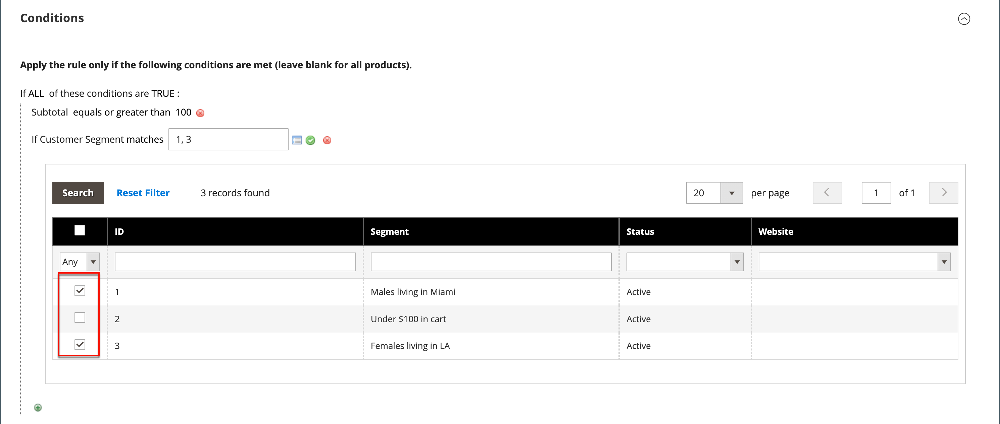

# 価格ルールの顧客セグメント

{{ee-feature}}

顧客セグメントは、[ 買い物かご価格ルール ](../merchandising-promotions/price-rules-cart.md) に関連付けることで、ターゲットプロモーションに使用できます。

{width="700" zoomable="yes"}

_**セグメントを買い物かごの価格ルールに関連付けるには：**_

1. _管理者_ サイドバーで、**[!UICONTROL Marketing]**/_プロモーション_/**[!UICONTROL Cart Price Rules]** に移動します。

1. 新規または既存のルールを開きます。

   * 新しいルールを使用するには、右上隅の **[!UICONTROL Add New Rule]** をクリックします。
   * 既存のルールを使用するには、リストでルールをクリックして、編集モードで開きます。

1. 下にスクロールして、「**[!UICONTROL Conditions]**」セクションを展開します。

1. 条件を追加します。

   * _追加_ （）アイコンをクリックして、条件のリストを表示します。 次に、「**[!UICONTROL Customer Segment]**」を選択します。

   {width="600" zoomable="yes"}

   デフォルトでは、条件は一致する条件を検索するように設定されています。 必要に応じて、**[!UICONTROL matches]** のリンクをクリックし、オペレーターを次のいずれかに変更します。

   * `does not match`
   * `is one of`
   * `is not one of`

   {width="600" zoomable="yes"}

1. 特定のセグメントをターゲットにするには、「その他の **...**」リンクをクリックして追加のオプションを表示します。 次に、_選択_ （） アイコンをクリックして、顧客セグメントのリストを表示します。

1. リストで、条件でターゲットにする各セグメントのチェックボックスを選択します。

   {width="600" zoomable="yes"}

1. 「**[!UICONTROL Select]**」をクリックして、選択した顧客セグメントを条件に配置します。

1. 必要に応じて、残りの価格ルールを完了します。

1. 完了したら、「**[!UICONTROL Save]**」をクリックします。
