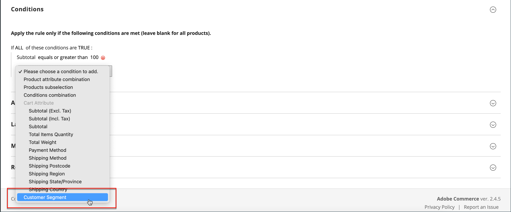

# 価格ルールの顧客セグメント

{{ee-feature}}

顧客セグメントを [買い物かごの価格ルール](../merchandising-promotions/price-rules-cart.md).

{width="700" zoomable="yes"}

_**セグメントを買い物かごの価格ルールに関連付ける手順は、次のとおりです。**_

1. 次の日： _管理者_ サイドバー、移動 **[!UICONTROL Marketing]** > _プロモーション_ > **[!UICONTROL Cart Price Rules]**.

1. 新しいルールまたは既存のルールを開きます。

   * 新しいルールを使用するには、 **[!UICONTROL Add New Rule]** をクリックします。
   * 既存のルールを使用するには、リストでルールをクリックして、編集モードで開きます。

1. 下にスクロールして、 **[!UICONTROL Conditions]** 」セクションに入力します。

1. 条件を追加します。

   * 次をクリック： _追加_ () アイコンをクリックし、条件のリストを表示します。 次に、を選択します。 **[!UICONTROL Customer Segment]**.

   {width="600" zoomable="yes"}

   デフォルトでは、条件は、一致する条件を検索するように設定されます。 必要に応じて、 **[!UICONTROL matches]** リンクをクリックし、次のいずれかの演算子に変更します。

   * `does not match`
   * `is one of`
   * `is not one of`

   {width="600" zoomable="yes"}

1. 特定のセグメントをターゲットにするには、「その他」 **...** リンクをクリックして、追加のオプションを表示します。 次に、 _選択_ () アイコンをクリックして、顧客セグメントのリストを表示します。

1. リストで、条件でターゲットにする各セグメントのチェックボックスを選択します。

   {width="600" zoomable="yes"}

1. クリック **[!UICONTROL Select]** 選択した顧客セグメントを条件に配置します。

1. 必要に応じて、残りの価格ルールを完了します。

1. 完了したら、「 **[!UICONTROL Save]**.
