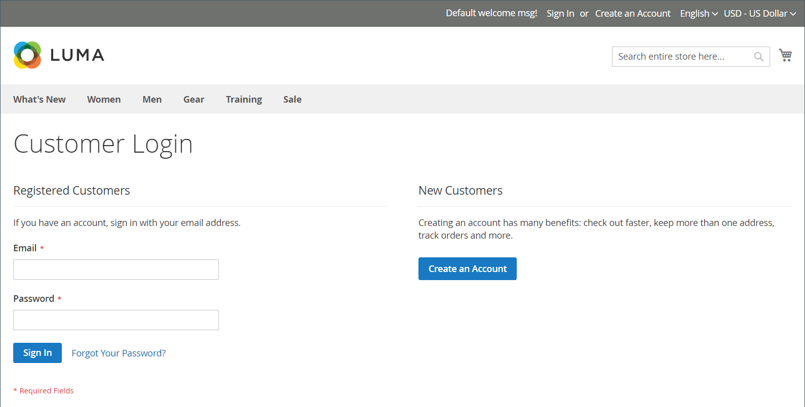

# ユーザーによるログイン

顧客は、ストア内のすべてのページから自分のアカウントに簡単にアクセスできます。 [ 設定 ](../customers/account-options-new.md) に応じて、顧客はアカウントダッシュボードにリダイレクトしたり、アカウントにログインした後で買い物を続行したりできます。

設定で [CAPTCHA](../systems/security-captcha.md) が有効になっている場合、アカウントにアクセスする前に、人間であることを確認するテストを正しく完了する必要があります。

顧客がパスワードを忘れると、リセットリンクがそのアカウントに関連付けられているメールアドレスに送信されます。 [ パスワードオプション ](../customers/password-options.md) 設定は、ログイン試行のカスタマーエクスペリエンスを制御します。

- 顧客がパスワードの入力を試みる回数
- 試行間隔（分）
- アカウントがロックされるまでの合計試行回数
- ロックアウトの長さ

{width="700" zoomable="yes"}

## 顧客アカウントにサインイン

1. ストアのヘッダーで、顧客は「**[!UICONTROL Sign in]**」をクリックします。

   {width="700" zoomable="yes"}

1. **[!UICONTROL Email]** アドレスと **[!UICONTROL Password]** を入力します。

1. **[!UICONTROL Sign in]** をクリックします。

   >[!IMPORTANT]
   >
   >パスワードを思い出せない場合は、お客様は **[!UICONTROL Forgot Your Password?]** をクリックし、[ 手順 ](../customers/password-reset.md) に従ってパスワードをリセットできます。

## カスタマーログイン後のアカウントダッシュボードへのリダイレクトの設定

ログイン後に顧客を自分のアカウントダッシュボードにリダイレクトしたり、買い物を続行させたりするように、ストアを設定できます。

1. _管理者_ サイドバーで、**[!UICONTROL Stores]**/_[!UICONTROL Settings]_/**[!UICONTROL Configuration]**&#x200B;に移動します。

1. 左側のパネルで「**[!UICONTROL Customers]**」を展開し、「**[!UICONTROL Customer Configuration]**」を選択します。

1. 「**[!UICONTROL Login Options]**」セクションを展開します。

1. **[!UICONTROL Redirect Customer to Account Dashboard after Logging in]** を次のいずれかに設定します。

   - `Yes` – 顧客が自分のアカウントにログインすると、アカウントダッシュボードが表示されます。
   - `No` – 顧客はアカウントにログインした後も買い物を続けることができます。

1. 完了したら、「**[!UICONTROL Save Config]**」をクリックします。

## Amazonでログイン

[!DNL Amazon Pay] と [!DNL Login with Amazon] の統合が設定されているストアの場合、お客様はAmazonのバイヤーアカウントにログインできます。

1. ストアのヘッダーで、顧客は「**[!UICONTROL Sign in]**」をクリックします。

1. **[!UICONTROL Login with Amazon]** をクリックします。

   {width="700" zoomable="yes"}

1. ログインを求めるメッセージが表示されたら、お客様は **[!UICONTROL email address]** を入力し、Amazon Buyer アカウントを **[!UICONTROL password]** します。

   {width="700" zoomable="yes"}

1. 購入処理時にAmazonに以下の情報をストアと共有する権限を付与するには、「**OK**」をクリックします。

   - 名前
   - メールアドレス
   - 発送先住所

   {width="700" zoomable="yes"}

## 顧客アカウントからのログアウト

1. _[!UICONTROL Welcome, Customer Name!]_&#x200B;の横にある右上隅で、顧客は「**[!UICONTROL v]**」メニューセレクターをクリックします。

1. 「**[!UICONTROL Sign Out]**」を選択します。

ログアウト後、顧客はホームページにリダイレクトされます。
