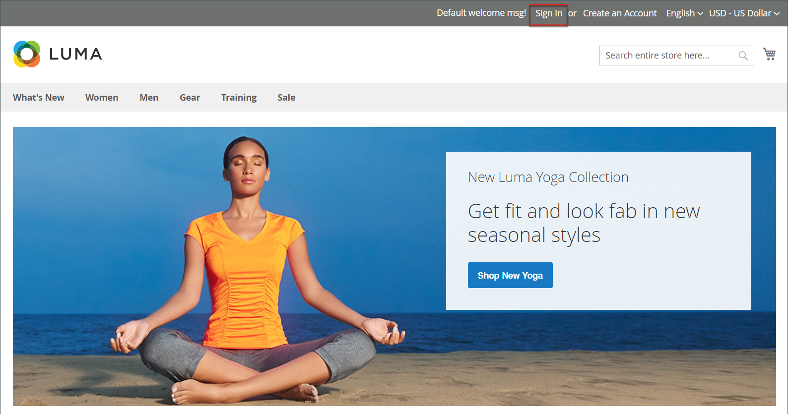
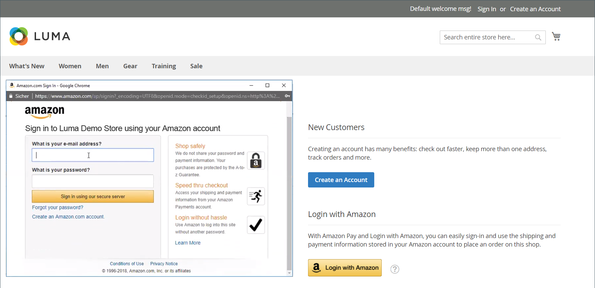

# 顧客ログイン

顧客は、ストアのあらゆるページから自分のアカウントに簡単にアクセスできます。 [設定](../customers/account-options-new.md)に応じて、お客様はアカウント ダッシュボードにリダイレクトするか、アカウントにログインした後にショッピングを続行できます。

設定で[CAPTCHA](../systems/security-captcha.md)が有効になっている場合、ユーザーはアカウントにアクセスする前に、人間であることを確認するテストを正しく完了する必要があります。

お客様がパスワードを忘れた場合、アカウントに関連付けられているメールアドレスにリセットリンクが送信されます。 [&#x200B; パスワードオプション &#x200B;](../customers/password-options.md)設定は、ログイン試行の顧客体験を制御します。

- 顧客がパスワードを入力しようとする回数
- 試行の間隔（分）
- アカウントがロックされるまでの合計試行回数
- ロックアウトの長さ

{width="700" zoomable="yes"}

## 顧客アカウントにログイン

1. ストアのヘッダーで、顧客は&#x200B;**[!UICONTROL Sign in]**&#x200B;をクリックします。

   {width="700" zoomable="yes"}

1. **[!UICONTROL Email]** アドレスと&#x200B;**[!UICONTROL Password]**&#x200B;を入力します。

1. **[!UICONTROL Sign in]**&#x200B;をクリックします。

   >[!IMPORTANT]
   >
   >パスワードを記憶できない場合、お客様は&#x200B;**[!UICONTROL Forgot Your Password?]**&#x200B;をクリックし、[手順](../customers/password-reset.md)に従ってパスワードをリセットできます。

## 顧客ログイン後にアカウントダッシュボードへのリダイレクトを設定する

ログイン後に顧客をアカウントダッシュボードにリダイレクトするか、ショッピングを続行するようにストアを設定できます。

1. _管理者_ サイドバーで、**[!UICONTROL Stores]** > _[!UICONTROL Settings]_>**[!UICONTROL Configuration]**&#x200B;に移動します。

1. 左側のパネルで、**[!UICONTROL Customers]**&#x200B;を展開し、**[!UICONTROL Customer Configuration]**&#x200B;を選択します。

1. **[!UICONTROL Login Options]** セクションを展開します。

1. **[!UICONTROL Redirect Customer to Account Dashboard after Logging in]**&#x200B;を次のいずれかに設定します：

   - `Yes` – 顧客がアカウントにログインすると、アカウントダッシュボードが表示されます。
   - `No` – お客様は、アカウントにログインした後もショッピングを続けることができます。

1. 完了したら、**[!UICONTROL Save Config]**&#x200B;をクリックします。

## Amazonでログイン

[!DNL Amazon Pay]と[!DNL Login with Amazon]の統合が設定されているストアの場合、お客様はAmazon バイヤーアカウントにログインできます。

1. ストアのヘッダーで、顧客は&#x200B;**[!UICONTROL Sign in]**&#x200B;をクリックします。

1. **[!UICONTROL Login with Amazon]**&#x200B;をクリックします。

   {width="700" zoomable="yes"}

1. ログインを求められると、お客様はAmazon バイヤーアカウントの&#x200B;**[!UICONTROL email address]**&#x200B;と&#x200B;**[!UICONTROL password]**&#x200B;を入力します。

   {width="700" zoomable="yes"}

1. 購入処理時にAmazonのアカウントから以下の情報を店舗と共有する権限を付与するには、**OK**&#x200B;をクリックします。

   - 名前
   - メールアドレス
   - 輸送先住所

   {width="700" zoomable="yes"}

## 顧客アカウントからログアウトする

1. _[!UICONTROL Welcome, Customer Name!]_&#x200B;の横の右上隅で、顧客は&#x200B;**[!UICONTROL v]**&#x200B;メニューセレクターをクリックします。

1. **[!UICONTROL Sign Out]**&#x200B;を選択してください。

サインアウト後、お客様はホームページにリダイレクトされます。
