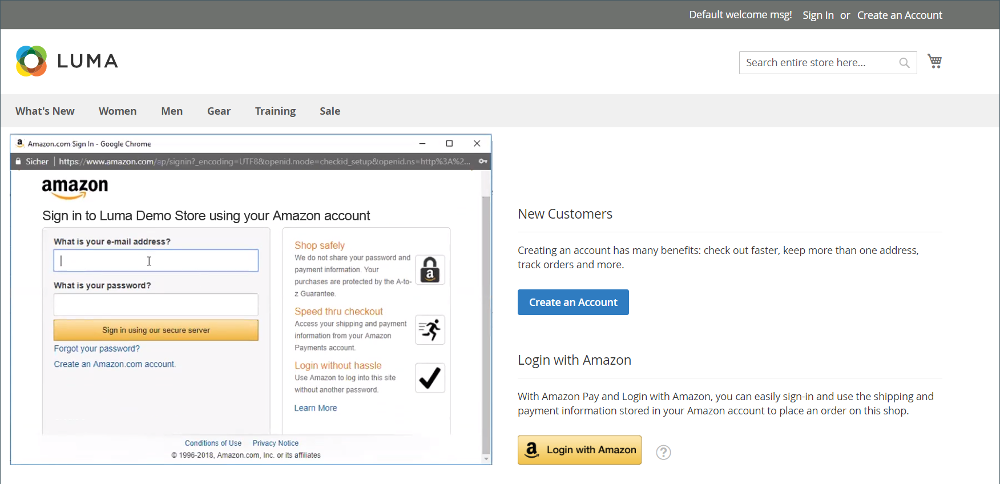

# 顧客のログイン

お客様は、ストアの各ページからアカウントに簡単にアクセスできます。 に応じて [設定](../customers/account-options-new.md)のお客様は、アカウントダッシュボードにリダイレクトされるか、アカウントにログインした後も買い物を続行することができます。

次の場合 [CAPTCHA](../systems/security-captcha.md) が設定で有効になっている場合、ユーザーは、アカウントへのアクセス権を取得する前に、自分が人間であることを検証するテストを正しく完了する必要があります。

ユーザーがパスワードを忘れた場合、リセットリンクがアカウントに関連付けられた電子メールアドレスに送信されます。 The [パスワードオプション](../customers/password-options.md) 設定は、ログイン試行の顧客体験を制御します。

- ユーザーがパスワードを入力できる回数
- 試行間隔（分）
- アカウントがロックされるまでの試行回数の合計です
- ロックアウトの長さ

{width="700" zoomable="yes"}

## 顧客アカウントにサインイン

1. ストアのヘッダーで、顧客がクリックする **[!UICONTROL Sign in]**.

   {width="700" zoomable="yes"}

1. 次に入る **[!UICONTROL Email]** 住所と住所 **[!UICONTROL Password]**.

1. クリック数 **[!UICONTROL Sign in]**.

   >[!IMPORTANT]
   >
   >パスワードを忘れた場合は、 **[!UICONTROL Forgot Your Password?]** そして、 [instructions](../customers/password-reset.md) をクリックして、パスワードをリセットします。

## 顧客ログイン後にアカウントダッシュボードにリダイレクトを設定する

ストアを設定して、ログイン後に顧客をアカウントダッシュボードにリダイレクトしたり、顧客が引き続き買い物をおこなうようにすることができます。

1. 次の日： _管理者_ サイドバー、移動 **[!UICONTROL Stores]** > _[!UICONTROL Settings]_>**[!UICONTROL Configuration]**.

1. 左側のパネルで、を展開します。 **[!UICONTROL Customers]** を選択します。 **[!UICONTROL Customer Configuration]**.

1. を展開します。 **[!UICONTROL Login Options]** 」セクションに入力します。

1. 設定 **[!UICONTROL Redirect Customer to Account Dashboard after Logging in]** を次のいずれかに変更します。

   - `Yes`  — 顧客がアカウントにログインすると、アカウントダッシュボードが表示されます。
   - `No` ：顧客は、アカウントにログインした後も買い物を続行できます。

1. 完了したら、「 **[!UICONTROL Save Config]**.

## Amazonでログイン

が設定されたストアの場合 [!DNL Amazon Pay] および [!DNL Login with Amazon] のお客様は、Amazon購入者アカウントにログインできます。

1. ストアのヘッダーで、顧客がクリックする **[!UICONTROL Sign in]**.

1. クリック数 **[!UICONTROL Login with Amazon]**.

   {width="700" zoomable="yes"}

1. ログインを求められたら、ユーザーが **[!UICONTROL email address]** および **[!UICONTROL password]** をAmazon購入者アカウントに追加する必要があります。

   {width="700" zoomable="yes"}

1. 購入を処理する際に、Amazonに対して、自分のアカウントから次の情報をストアと共有する権限を付与するには、「 」をクリックします **OK**.

   - 名前
   - 電子メールアドレス
   - 発送先住所

   {width="700" zoomable="yes"}

## 顧客アカウントからのサインアウト

1. の隣の右上隅に  _[!UICONTROL Welcome, Customer Name!]_をクリックした場合、顧客が&#x200B;**[!UICONTROL v]**メニューセレクター。

1. 選択 **[!UICONTROL Sign Out]**.

ログアウト後、顧客はホームページにリダイレクトされます。
