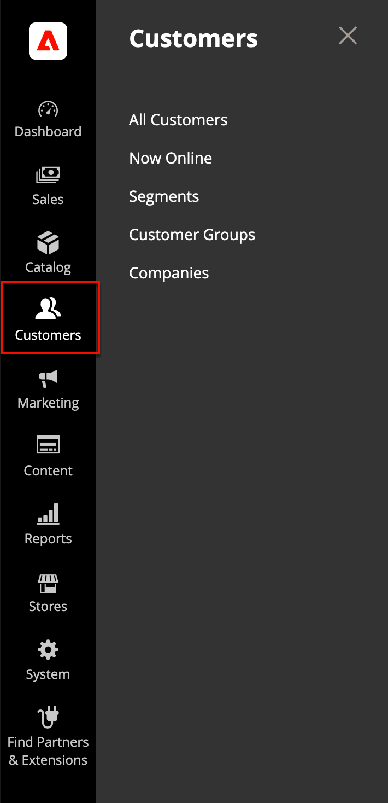

# 顧客管理の概要

_[!UICONTROL Customers]_メニューでは、顧客アカウント管理ツールにアクセスし、ストアのオンライン状態を確認できます。

>[!BEGINTABS]

>[!TAB Adobe Commerce]

[!BADGE PaaSのみ]{type=Informative url="https://experienceleague.adobe.com/en/docs/commerce/user-guides/product-solutions" tooltip="Adobe Commerce on Cloud プロジェクト（Adobeで管理されるPaaS インフラストラクチャ）とオンプレミス プロジェクトにのみ適用されます。"}

{width="300" zoomable="yes"}

>[!TAB Adobe Commerce as a Cloud Service]

[!BADGE SaaSのみ]{type=Positive url="https://experienceleague.adobe.com/en/docs/commerce/user-guides/product-solutions" tooltip="Adobe Commerce as a Cloud ServiceおよびAdobe Commerce Optimizer プロジェクト（Adobeが管理するSaaS インフラストラクチャ）にのみ適用されます。"}

{width="300" zoomable="yes"}

>[!ENDTABS]

## [!UICONTROL Customers] メニューの表示

_管理者_ サイドバーで、[!UICONTROL Customers]をクリックしてメニューオプションを表示します。

| フィールド | 説明 |
|---|---|
| [!UICONTROL All Customers] | ストアのアカウントに登録しているか、管理者によって追加されたすべての[顧客](../customers/customers-all.md)を一覧表示します。 |
| [!UICONTROL Now Online] | 現在[ オンライン ](../customers/now-online.md)であるすべての顧客と訪問者をストアに一覧表示します。 |
| [!UICONTROL Segments] | 様々なプロパティに基づいて特定の顧客にコンテンツとプロモーションを動的に表示するために使用される[顧客セグメント ](../customers/customer-segments.md)を一覧表示します。 |
| [!UICONTROL Customer Groups] | [顧客グループ ](../customers/customer-groups.md)は、買い物客が利用できる割引と購入時の税区分を決定します。 |
| [!UICONTROL Companies] | （Adobe Commerce B2Bが必要）ステータス設定に関係なく、アクティブなすべての[会社アカウント ](../b2b/account-companies.md)および保留中のリクエストを一覧表示し、[会社アカウントの作成および管理](../b2b/account-company-manage.md)に使用するツールを提供します。 |

{style="table-layout:auto"}
