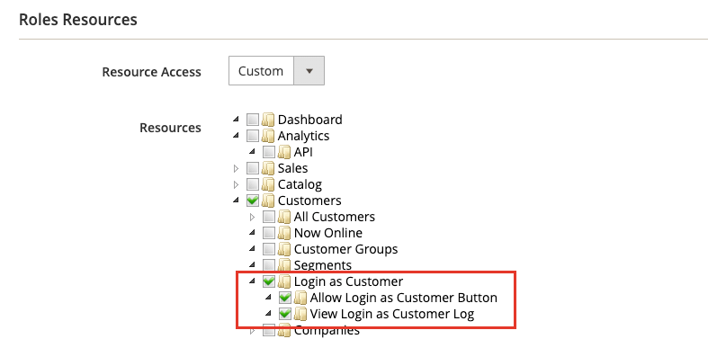
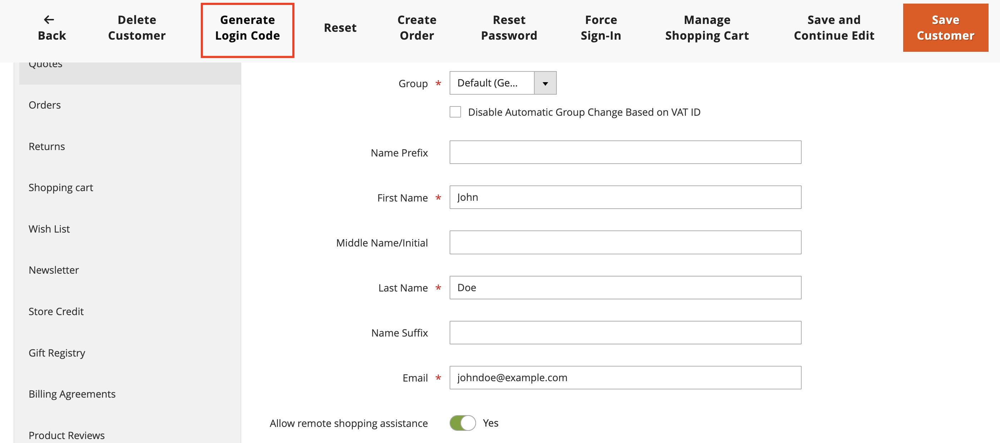

# 買い物客へのサポートの提供

時には、顧客は注文に対するサポートを必要としています。 ストア管理者は&#x200B;_お客様としてログイン_&#x200B;できます。これにより、お客様が見ているものを確認し、お客様を支援するために更新を行うことができます。

お客様としてログイン中に実行されたアクションは、実際のお客様のアカウントに適用されます。

>[!BEGINTABS]

>[!TAB Adobe Commerce]

[!BADGE PaaSのみ]{type=Informative url="https://experienceleague.adobe.com/en/docs/commerce/user-guides/product-solutions" tooltip="Adobe Commerce on Cloud プロジェクト（Adobeで管理されるPaaS インフラストラクチャ）とオンプレミス プロジェクトにのみ適用されます。"}

_管理者_ ユーザーに対して有効にすると、_[!UICONTROL Login as Customer]_&#x200B;ボタンが複数のページに表示されます。

* [顧客編集ページ](../customers/update-account.md)
* [注文表示ページ](../stores-purchase/order-processing.md)
* [請求書表示ページ](../stores-purchase/invoices.md)
* [出荷表示ページ](../stores-purchase/shipments.md)
* [クレジットメモ表示ページ](../stores-purchase/credit-memo-create.md)

{width="600" zoomable="yes"}

>[!TAB Adobe Commerce as a Cloud Service]

[!BADGE SaaSのみ]{type=Positive url="https://experienceleague.adobe.com/en/docs/commerce/user-guides/product-solutions" tooltip="Adobe Commerce as a Cloud ServiceおよびAdobe Commerce Optimizer プロジェクト（Adobeが管理するSaaS インフラストラクチャ）にのみ適用されます。"}

Adobe Commerce as a Cloud Serviceでは、お客様としてログイン機能で、ダイレクトログインの代わりに&#x200B;**ワンタイムコード（OTC）** ワークフローが使用されます。 管理者は、顧客に対して短時間のみ有効な単一の使用コードを生成します。 このコードは、GraphQLを通じて顧客アクセストークンと交換され、出品者が支援するショッピングシナリオの「顧客としてパスワードレスでログイン」できるようになります。

この機能は、次のコンポーネントで構成されます。

* **管理者UI** – 顧客の編集ページでは、管理者は顧客として直接ログインする代わりに、1回限りのコード （OTC）をリクエストできます。
* **[REST API](https://developer.adobe.com/commerce/webapi/rest/saas-integrations/login-as-customer/)** - OTC生成用のプログラマティック エンドポイントで、管理者スクリプトやサードパーティの統合に役立ちます。
* **GraphQL API** - OTCをストアフロントまたはヘッドレスコマースフロー用の顧客アクセストークンと交換するミューテーション。

>[!ENDTABS]

## 顧客としてログインを有効にする

_お客様としてログイン_&#x200B;を有効にするには、Commerce インスタンスで機能を有効にしてから、ユーザーロールの権限で管理者ユーザーのアクセスを有効にする必要があります。

### この機能を有効にする

1. 管理者サイドバーで、**[!UICONTROL Stores]** > _[!UICONTROL Settings]_>**[!UICONTROL Configuration]**&#x200B;に移動します。

1. 左側のパネルで、**[!UICONTROL Customers]**&#x200B;を展開し、**[!UICONTROL Login as Customer]**&#x200B;を選択します。

   {width="600" zoomable="yes"}

1. **[!UICONTROL Enable Login as Customer]**&#x200B;を`Yes`に設定します。

1. _（オプション）_&#x200B;管理者ユーザーが顧客としてログインしたときにページキャッシュを有効にするには、**[!UICONTROL Disable Page Cache for Admin User]**&#x200B;を`No`に設定します。

   >[!WARNING]
   >
   > ページキャッシュ （`Yes` - デフォルト）を無効にすると、お客様としてログインしたユーザーは、キャッシュされていない最新のデータを取得できます。

1. _（オプション）_ マルチサイトまたはマルチストアの設定があり、管理者ユーザーが顧客としてログインする際にストアビューを選択する場合は、**[!UICONTROL Store View to Log in]**&#x200B;を`Manual Selection`に設定します。

1. 完了したら、**[!UICONTROL Save Config]**&#x200B;をクリックします。

### 管理者ユーザーのアクセスを有効にする

1. _管理者_ サイドバーで、**[!UICONTROL System]** > _権限_ > **[!UICONTROL User Roles]**&#x200B;に移動します。

1. リスト内の役割をクリックします。

1. [!UICONTROL _役割情報_]&#x200B;の左側のパネルで、**[!UICONTROL Role Resources]**&#x200B;をクリックします。

1. ページの&#x200B;**[!UICONTROL Role Resources]**&#x200B;を`Custom`に変更します。

   >[!INFO]
   >
   > このオプションを選択すると、リソース階層がページに表示されます。

1. **[!UICONTROL Customers]**&#x200B;の親項目とその下の&#x200B;**[!UICONTROL Login as Customer]**&#x200B;項目までスクロールします。 次に、役割に対して有効にするリソースを選択します。

   * **[!UICONTROL Allow Login as Customer]** – 管理者ユーザーが&#x200B;_顧客としてログイン_&#x200B;機能を使用できるようにします。
   * **[!UICONTROL View Login as Customer Log]** – 管理者ユーザーが&#x200B;_顧客としてログイン_ ログを表示できるようにします。

   {width="400" zoomable="yes"}

1. **[!UICONTROL Save Role]**&#x200B;をクリックします。

## リモートショッピング支援のための顧客アカウント権限

管理者からストアサポートスタッフのアカウントアクセスを有効にするには、お客様がアカウントの機能を有効にする必要があります。

>[!BEGINTABS]

>[!TAB Adobe Commerce]

[!BADGE PaaSのみ]{type=Informative url="https://experienceleague.adobe.com/en/docs/commerce/user-guides/product-solutions" tooltip="Adobe Commerce on Cloud プロジェクト（Adobeで管理されるPaaS インフラストラクチャ）とオンプレミス プロジェクトにのみ適用されます。"}

1. お客様は&#x200B;**[!UICONTROL Account Information]** ページに移動します。

1. 「**[!UICONTROL Allow remote shopping assistance]**」チェックボックスを選択します。

1. お客様は&#x200B;**[!UICONTROL Save]**&#x200B;をクリックします。

{width="700" zoomable="yes"}

>[!TAB Adobe Commerce as a Cloud Service]

[!BADGE SaaSのみ]{type=Positive url="https://experienceleague.adobe.com/en/docs/commerce/user-guides/product-solutions" tooltip="Adobe Commerce as a Cloud ServiceおよびAdobe Commerce Optimizer プロジェクト（Adobeが管理するSaaS インフラストラクチャ）にのみ適用されます。"}

お客様は、`login_as_customer_assistance_allowed`拡張機能の属性を&#x200B;**2**&#x200B;に設定する必要があります。 これは、お客様を作成または編集する際に、管理者またはGraphQLの&#x200B;**お客様を編集** ページで設定できます。

>[!WARNING]
>
>この権限がないと、管理者ユーザーはこの顧客としてログインできません。

{width="600" zoomable="yes"}

この権限を既存の顧客アカウントに対してGraphQLで設定するには、[`updateCustomerV2`](https://developer.adobe.com/commerce/webapi/graphql/schema/customer/mutations/update-v2/)または[`createCustomerV2`](https://developer.adobe.com/commerce/webapi/graphql/schema/customer/mutations/create-v2/)個の変異を使用して`allow_remote_shopping_assistance`入力を`true`に設定します。

>[!ENDTABS]

## 管理者から顧客としてログイン

>[!BEGINTABS]

>[!TAB Adobe Commerce]

[!BADGE PaaSのみ]{type=Informative url="https://experienceleague.adobe.com/en/docs/commerce/user-guides/product-solutions" tooltip="Adobe Commerce on Cloud プロジェクト（Adobeで管理されるPaaS インフラストラクチャ）とオンプレミス プロジェクトにのみ適用されます。"}

1. _管理者_ サイドバーで、**[!UICONTROL Customers]** > [!UICONTROL _すべての顧客_]&#x200B;に移動します。

1. ユーザーを編集モードで開きます。

1. **[!UICONTROL Customer Information]** パネルで、**[!UICONTROL Account Information]** セクションを選択します。

1. **[!UICONTROL Allow remote shopping assistance]**&#x200B;を`Yes`に設定します。

   >[!INFO]
   >
   >管理者は、ストアフロントの権限がなくてもユーザーとしてログインできるようになりました。

>[!TAB Adobe Commerce as a Cloud Service]

[!BADGE SaaSのみ]{type=Positive url="https://experienceleague.adobe.com/en/docs/commerce/user-guides/product-solutions" tooltip="Adobe Commerce as a Cloud ServiceおよびAdobe Commerce Optimizer プロジェクト（Adobeが管理するSaaS インフラストラクチャ）にのみ適用されます。"}

>[!NOTE]
>
>RESTを使用してこの機能を実装する方法については、[お客様としてログイン &#x200B;](https://developer.adobe.com/commerce/webapi/rest/saas-integrations/login-as-customer/) REST API ドキュメントを参照してください。

### 管理者からワンタイムコード（OTC）をリクエスト

1. **[!UICONTROL Customers]**&#x200B;に移動し、顧客を選択して編集ページを開きます。

1. お客様を編集ページで、「**[!UICONTROL Generate Login Code]**」をクリックします。

   {width="600" zoomable="yes"}

1. **[!UICONTROL Reason]** （必須）を入力し、**[!UICONTROL Request]**&#x200B;をクリックします。

   理由フィールド {width="600" zoomable="yes"}を持つOTC リクエストモーダル

   >[!NOTE]
   >
   >**Reason** フィールドは必須です。 OTP生成フローに渡され、今後の監査およびイベントログ機能で使用するために予約されます。

1. 生成されたOTCがモーダルに表示されます。 このコードを、お客様の認証に`generateCustomerToken`または`exchangeOtpForCustomerToken`個のGraphQL変異と共に使用します。

   {width="300" zoomable="yes"}

>[!IMPORTANT]
>
>生成されたワンタイムコード OTCは、デフォルトで60秒間有効で、1回使用すると無効になります。 TTLは、[&#x200B; サポートチケット &#x200B;](https://experienceleague.adobe.com/home?support-tab=home#support)を送信することで設定できます。

ワンタイムコードが生成されたら、ストアフロントに移動し、次の資格情報を使用してログインすることで使用できます。

* **電子メール**：顧客の電子メールアドレス
* **パスワード**：生成されたワンタイムコード （OTC）

>[!ENDTABS]

## 顧客としてログインを使用

>[!INFO]
>
>_お客様としてログイン_&#x200B;するには、管理者が前述の手順に従って設定されていることを確認してください。

_お客様としてログイン_&#x200B;すると、お客様と同じようにサイトを表示でき、お客様のトラブルシューティングやその他のアクションを実行できます。 必要な権限を持つユーザーの役割が割り当てられている場合：

1. 前のセクションに記載されているページで&#x200B;**[!UICONTROL Login as Customer]**&#x200B;または&#x200B;**[!UICONTROL Generate Login Code]**&#x200B;をクリックできます。
1. 「顧客としてログイン」アクションは、アクションレポートで使用できます。

>[!WARNING]
>
>[!UICONTROL _お客様_]&#x200B;としてログイン中に行われたアクション（製品の追加/削除など）は、実際のお客様の注文に適用されます。 ストアフロントでは、特別な状態のリマインダーを提供するために`logged in as customer_name`になったときにバナーが表示されます。

## 顧客ログとしてログイン

{{ee-feature}}

Adobe Commerceには、_お客様としてログイン_&#x200B;操作のログが記録されます。 管理者ユーザーが機能にアクセスするすべてのセッションが一覧表示されます。 ログに記録されたアクションにアクセスするには、[管理者アクションレポート &#x200B;](../systems/action-log-report.md)に移動します。

レポート設定&#x200B;**[!UICONTROL Action Group]**&#x200B;を`Login As Customer`にフィルターして、ページの上部で&#x200B;**[!UICONTROL Search]**&#x200B;をクリックできます。

{width="700" zoomable="yes"}
