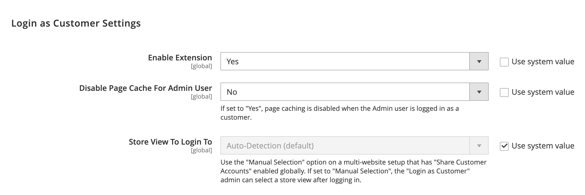

# 買い物客の支援を提供する

顧客は注文に関するサポートを必要とする場合があります。 ストア管理者は、 _顧客としてログイン_：顧客に表示される内容を確認し、顧客を支援するための更新をおこなうことができます。

顧客としてログイン中に実行されたアクションは、実際の顧客のアカウントに適用されます。

有効になっている場合は、 _管理者_ ユーザー、 _[!UICONTROL Login as Customer]_ボタンが複数のページに表示されます。

* [顧客編集ページ](../customers/update-account.md)
* [注文ビューページ](../stores-purchase/order-processing.md)
* [「請求書ビュー」ページ](../stores-purchase/invoices.md)
* [[ 出荷の表示 ] ページ](../stores-purchase/shipments.md)
* [「クレジット・メモの表示」ページ](../stores-purchase/credit-memo-create.md)

{width="600" zoomable="yes"}

## 顧客としてのログインの有効化

有効化 _顧客としてログイン_ では、コマースインスタンスでこの機能を有効にし、ユーザーロールの権限で管理者ユーザーのアクセスを有効にする必要があります。

### 機能を有効にする

1. 管理者のサイドバーで、  **[!UICONTROL Stores]** > _[!UICONTROL Settings]_>**[!UICONTROL Configuration]**.

1. 左側のパネルで、を展開します。 **[!UICONTROL Customers]** を選択します。  **[!UICONTROL Login as Customer]**.

   {width="600" zoomable="yes"}

1. 設定 **[!UICONTROL Enable Login as Customer]** から `Yes`.

1. _（オプション）_ 設定 **[!UICONTROL Disable Page Cache for Admin User]** から `No` ：管理者ユーザーが顧客としてログインしたときのページキャッシュを有効にします。

   >[!WARNING]
   >
   > ページキャッシュの無効化 (`Yes`  — デフォルト ) は、顧客としてログインするユーザーがキャッシュされていない新しいデータを取得するようにします。

1. _（オプション）_ 設定 **[!UICONTROL Store View to Log in]** から `Manual Selection` マルチサイトやマルチストアを設定していて、顧客としてログインする際に管理者ユーザーがストア表示を選択する場合。

1. 完了したら、「 **[!UICONTROL Save Config]**.

### 管理者ユーザーのアクセスを有効にする

1. 次の日： _管理者_ サイドバー、移動 **[!UICONTROL System]** > _権限_ > **[!UICONTROL User Roles]**.

1. リストで役割をクリックします。

1. Adobe Analytics の [!UICONTROL _役割情報_] 左側のパネルで、 **[!UICONTROL Role Resources]**.

1. 変更 **[!UICONTROL Role Resources]** ～するページに `Custom`.

   >[!INFO]
   >
   > このオプションを選択すると、リソース階層がページに表示されます。

1. をスクロールします。  **[!UICONTROL Customers]** 親項目と **[!UICONTROL Login as Customer]** 下の項目。 次に、ロールに対して有効にするリソースを選択します。

   * **[!UICONTROL Allow Login as Customer]**  — 管理者ユーザーが _顧客としてログイン_ 機能。
   * **[!UICONTROL View Login as Customer Log]**  — 管理者ユーザーが _顧客としてログイン_ ログ。

   {width="400" zoomable="yes"}

1. クリック **[!UICONTROL Save Role]**.

## 管理者から顧客としてログイン

1. 次の日： _管理者_ サイドバー、移動 **[!UICONTROL Customers]** > [!UICONTROL _すべての顧客_].

1. ユーザーを編集モードで開きます。

1. Adobe Analytics の **[!UICONTROL Customer Information]** パネル、を選択します。 **[!UICONTROL Account Information]** 」セクションに入力します。

1. を設定します。 **[!UICONTROL Allow remote shopping assistance]** から `Yes`.

   >[!INFO]
   >
   >管理者は、ストアフロントからの権限を持たずに、ユーザーとしてログインできるようになりました。

## リモートショッピングサポートの顧客アカウントの権限

管理者からストアサポートスタッフのアカウントアクセスを有効にするには、顧客が自分のアカウントに対して次の機能を有効にする必要があります。

1. 顧客が **[!UICONTROL Account Information]** ページに貼り付けます。

1. を選択します。 **[!UICONTROL Allow remote shopping assistance]** チェックボックス。

1. 顧客がクリックする **[!UICONTROL Save]**.

{width="700" zoomable="yes"}

>[!WARNING]
>
>この権限がないと、管理者ユーザーはこの顧客としてログインできません。

## ログインを顧客として使用

>[!INFO]
>
>次を使用するには： _顧客としてログイン_&#x200B;で、管理者が前述のように設定されていることを確認します。

_顧客としてログイン_ では、お客様と同じようにサイトを表示でき、お客様に対してトラブルシューティングをおこなったり、他のアクションを実行したりできます。 必要な権限を持つユーザーロールが割り当てられている場合：

1. 次をクリックできます。 **[!UICONTROL Login as Customer]** 前の節で説明したページに貼り付けます。
1. 「顧客としてログイン」アクションは、アクションレポートで使用できます。

>[!WARNING]
>
>ログイン中に実行されたアクション [!UICONTROL _顧客として_] （製品の追加/削除など）は、実際の顧客の注文に適用されます。 ストアフロントでは、 `logged in as customer_name` 特別な状態を知らせる。

## 顧客ログとしてログイン

{{ee-feature}}

Adobe Commerceは、 _顧客としてログイン_ アクション。 このリストには、管理者ユーザーがこの機能にアクセスするすべてのセッションが表示されます。 ログに記録されたアクションにアクセスするには、 [管理アクションレポート](../systems/action-log-report.md).

レポート設定をフィルタリングできます **[!UICONTROL Action Group]** から `Login As Customer` をクリックして、 **[!UICONTROL Search]**.

{width="700" zoomable="yes"}
