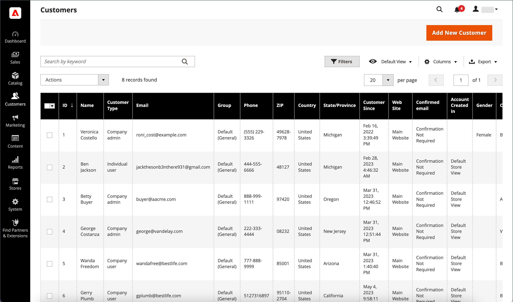

# 顧客アカウントの管理

_[!UICONTROL Customers]_&#x200B;グリッドを使用して、顧客アカウントを検索します。 標準の [ ワークスペースコントロール ](../getting-started/admin-workspace.md) を使用して、リストのフィルタリング、[ 列のレイアウト ](../getting-started/admin-grid-controls.md) の変更、ビューの保存、データの書き出しを行うことができます。 グリッドの上にある [ アクションコントロール ](../getting-started/admin-actions-control.md) を使用して、複数の顧客レコードに操作を適用できます。

{width="700" zoomable="yes"}

顧客アカウントを手動で更新する方法については、[ 顧客プロファイルの更新 ](update-account.md) を参照してください。

## 顧客アカウントのアクション

1. _管理者_ サイドバーで、**[!UICONTROL Customers]**/**[!UICONTROL All Customers]** に移動します。

1. グリッドの最初の列で、更新する各レコードのチェックボックスをオンにします。

1. 適用するアクションの手順に従います。

   >[!INFO]
   >
   >次のアクションは、1 つまたは複数のレコードに適用できます。

1. 完了したら、「**[!UICONTROL Save Config]**」をクリックします。

### ニュースレターの購読

グローバルな [ 顧客アカウント範囲 ](../customers/customer-account-scope.md) を使用したマルチストアおよびマルチサイト設定では、顧客アカウントは複数のサイトまたはストアでニュースレターを購読できます。 _購読_ アクションを顧客アカウントに適用すると、デフォルトのサイト/ストア表示に対してのみニュースレターの購読がアクティベートされます。

* **[!UICONTROL Actions]** コントロールを `Subscribe to newsletter` に設定します。

顧客のニュースレター購読の管理について詳しくは、[ 購読者の管理 ](../merchandising-promotions/newsletter-subscribers.md) を参照してください。

### ニュースレターの配信解除

グローバルな [ 顧客アカウント範囲 ](customer-account-scope.md) を使用したマルチストアおよびマルチサイト設定では、顧客アカウントは複数のサイト/ストアのニュースレターを購読できます。 顧客アカウントに _購読解除_ アクションを適用すると、アクティブな購読がすべて購読解除されます。

1. **[!UICONTROL Actions]** コントロールを `Unsubscribe to newsletter` に設定します。

1. 確認を求めるメッセージが表示されたら、「**OK**」をクリックします。

### 顧客グループの割り当て

1. **[!UICONTROL Actions]** コントロールを `Assign a customer group` に設定します。

1. 選択したすべての顧客レコードを割り当てる顧客グループを選択します。

1. 確認を求めるメッセージが表示されたら、「**[!UICONTROL OK]**」をクリックします。

### 顧客アカウントの削除

削除された顧客アカウントは復元できません。 顧客のアクティビティおよびトランザクションに関する情報は、システムに保持されます。

1. **[!UICONTROL Actions]** コントロールを `Delete` に設定します。

1. 確認を求めるメッセージが表示されたら、「**[!UICONTROL OK]**」をクリックします。

## 顧客アカウントの書き出し

1. _管理者_ サイドバーで、**[!UICONTROL Customers]**/**[!UICONTROL All Customers]** に移動します。

1. テーブルヘッダーメニューで **[!UICONTROL Export]** をクリックし、目的の形式を選択します。

   * CSV
   * Excel XML

1. 「**[!UICONTROL OK]**」をクリックします。

   ファイルはデフォルトのダウンロードフォルダーに移動します。

上記の手順では、すべての顧客アカウントが書き出されます。 制限付きセットをエクスポートする場合は、エクスポートするアカウントのチェックボックスをオンにするか、コントロールパネルのフィルターを使用して、一連の顧客アカウントを選択します。

## アクション/コントロール

| オプション | 説明 |
|--- |--- |
| **[!UICONTROL Delete]** | 選択した顧客アカウントを削除します。 顧客アカウントが B2B ストアの会社管理者に属している場合、顧客アカウントを削除する前に、別の会社ユーザーを管理者として割り当てる必要があります。 |
| **[!UICONTROL Subscribe to Newsletter]** | 選択された顧客をニュースレターに登録します。 |
| **[!UICONTROL Unsubscribe from Newsletter]** | 選択された顧客をニュースレターから購読解除します。 |
| **[!UICONTROL Assign a Customer Group]** | 選択した顧客を顧客グループに割り当てます。 |
| **[!UICONTROL Edit]** | 選択した 1 つの顧客レコードの一部の値をグリッドから編集できるようにします。 デフォルトでは、クイック編集に使用できる値は、メール、グループ、電話、郵便番号、web サイト、税金の VAT 番号、性別です。 |

{style="table-layout:auto"}

## 列

| 列 | 説明 |
|--- |--- |
| **[!UICONTROL Select]** | アクションを適用する顧客レコードのチェックボックス選択を管理します。 また、列ヘッダーの選択コントロールを使用して、すべてを選択/選択解除することもできます。 |
| **[!UICONTROL ID]** | 顧客アカウントの作成時に割り当てられる一意の数値 ID。 |
| **[!UICONTROL Name]** | 顧客の姓と名。 |
| **[!UICONTROL Email]** | 顧客の電子メールアドレス。 |
| **[!UICONTROL Group]** | 顧客が割り当てられている顧客グループ。 |
| **[!UICONTROL Phone]** | 顧客の電話番号。 |
| **[!UICONTROL ZIP]** | 顧客の郵便番号。 |
| **[!UICONTROL Country]** | 顧客が所在する国。 |
| **[!UICONTROL State/Province]** | 顧客が所在する都道府県。 |
| **[!UICONTROL Customer Since]** | 顧客アカウントが作成された日時。 |
| **[!UICONTROL Web Site]** | 顧客アカウントが関連付けられているストア階層内の Web サイト。 |
| **[!UICONTROL Confirmed Email]** | 確認メールが必要かどうかを示します。 |
| **[!UICONTROL Account Created In]** | 顧客アカウントが作成されたストア表示を示します。 |
| **[!UICONTROL Date of Birth]** | 顧客の生年月日。 現在のセキュリティおよびプライバシーのベストプラクティスに従い、顧客の完全な生年月日（月、日、年）を他の個人識別子と保存することに関連して、法的およびセキュリティ上の潜在的なリスクがあることを認識しておいてください。 顧客の完全な生年月日の保存を制限し、代替として顧客の生年月日の使用を提案することをお勧めします。 |
| **[!UICONTROL Tax / VAT Number]** | 該当する場合、顧客に割り当てられた税金番号または [ 付加価値税 ](../stores-purchase/vat.md) 番号。    このフィールドは VAT 番号とは異なります。 |
| **[!UICONTROL Gender]** | 顧客の性別。 |
| **[!UICONTROL Action]** | 編集 – 会社アカウントを編集モードで開きます。 |

{style="table-layout:auto"}

### 追加の列

これらの列は、グリッドの [ 列のレイアウト ](../getting-started/admin-grid-controls.md) を変更することで使用できます。

| 列 | 説明 |
|--- |--- |
| **[!UICONTROL Company]** | 顧客の会社名。 |
| **[!UICONTROL Street Address]** | 顧客の住所。 |
| **[!UICONTROL City]** | 顧客の所在地の市区町村。 |
| **[!UICONTROL Fax]** | 顧客の FAX 番号（該当する場合）。 |
| **[!UICONTROL Billing Firstname]** | 顧客の請求先住所の名。 |
| **[!UICONTROL Billing Lastname]** | 顧客の請求先住所の姓。 |
| **[!UICONTROL Billing Address]** | 請求情報が送信される住所。 |
| **[!UICONTROL Shipping Address]** | 注文を発送する住所。 |
| **[!UICONTROL VAT Number]** | 顧客の住所に関連付けられている付加価値税番号。 EU で販売されている [ デジタル商品 ](../stores-purchase/taxes.md) の場合、VAT は顧客の請求先住所に基づきます。    このフィールドは税金/VAT 番号と同じではありません。 |
| **[!UICONTROL Account Lock]** | アカウントのステータスを示します。 セキュリティ対策として、ログインの試行が多すぎると、カスタマーアカウントを [ ロック ](../customers/password-options.md) することができます。 値：`Locked`/`Unlocked` |
| **[!UICONTROL Status]** | 現在のユーザーステータス。 オプション：`Active` / `Inactive` |
| **[!UICONTROL Customer Type]** | 顧客の分類。 オプション：`Individual user`/`Company admin`/`Company user` |
| **[!UICONTROL Sales Representative]** | 会社アカウントの連絡先として割り当てられ、会社に関連するすべての自動メールメッセージを受信する販売担当者。 |

{style="table-layout:auto"}
