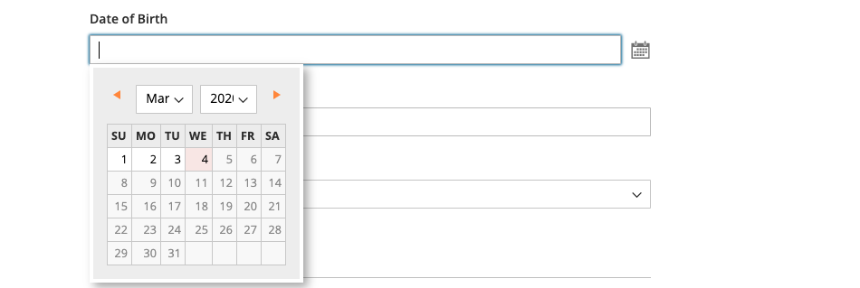

# 顧客名および住所のオプション

_名前と住所のオプション_ は、顧客がストアで [&#x200B; アカウント &#x200B;](../customers/account-create.md) を作成する際に、名前と住所のフォームに含まれるフィールドを決定します。

{width="500" zoomable="yes"}

名前とアドレスのオプションを設定する手順は、Adobe CommerceとMagento Open Sourceでは異なります。

## Adobe Commerceの名前とアドレスのオプションを設定

アカウントの作成時にストアフロントで顧客に提示される名前と住所のオプションを設定できます。

### 手順 1：設定の範囲を設定する

1. _管理者_ サイドバーで、**[!UICONTROL Stores]**/_[!UICONTROL Settings]_/**[!UICONTROL Configuration]**&#x200B;に移動します。

1. 左側のパネルで「**[!UICONTROL Customers]**」を展開し、「**[!UICONTROL Customer Configuration]**」を選択します。

1. 「**[!UICONTROL Name and Address Options]**」セクションを展開します。

   >[!INFO]
   >
   >name オプションと address オプションの範囲は、`website` レベルで適用されることに注意してください。

1. ページの上部までスクロールし、設定の範囲を次のいずれかに設定します。

   - `Default Config`
   - `Main Website` （またはマルチサイトインストールの場合は特定のサイト）

   >[!INFO]
   >
   >範囲が `Default Store View` に設定されている場合、_[!UICONTROL Name and Address Options]_&#x200B;セクションは表示されません。

   {width="700" zoomable="yes"}

### 手順 2：名前とアドレスのオプションを設定する

1. Customer Configuration ページの [!UICONTROL _Name and Address Options_] セクションに戻ります。

   >[!INFO]
   >
   > `Default config` 範囲設定を使用しない場合は、値を変更する前に、各フィールドの「`Use Default`」チェックボックスをオフにする必要があります。

   {width="600" zoomable="yes"}

1. **[!UICONTROL Prefix Dropdown Options]**: リストに表示するプレフィックスをセミコロンで区切って入力します。

   >[!IMPORTANT]
   >
   >最初の値の前にセミコロンを入れると、リストの先頭に空白の値が表示されます。

1. **[!UICONTROL Suffix Dropdown Options]**：一覧に表示する各接尾辞をセミコロンで区切って入力します。

1. カスタマーフォームで以下のフィールドを含めるには、それぞれの値を、必要に応じて `Optional` または `Required` に設定します。

   - **[!UICONTROL Show Telephone]**
   - **[!UICONTROL Show Company]**
   - **[!UICONTROL Show Fax]**

### 手順 3：保存と更新

1. 完了したら、「**[!UICONTROL Save Config]**」をクリックします。

1. ページ上部のメッセージで、「**[!UICONTROL Cache Management]**」をクリックし、無効な各キャッシュを [&#x200B; 更新 &#x200B;](../systems/cache-management.md) します。

## Magento Open Sourceの名前とアドレスのオプションを設定

アカウントの作成時にストアフロントで顧客に提示する名前および住所のオプションを設定します。

{width="500" zoomable="yes"}

### 手順 1：設定の範囲を設定する

1. _管理者_ サイドバーで、**[!UICONTROL Stores]**/_[!UICONTROL Settings]_/**[!UICONTROL Configuration]**&#x200B;に移動します。

1. 左側のパネルで「**[!UICONTROL Customers]**」を展開し、「**[!UICONTROL Customer Configuration]**」を選択します。

1. 「**[!UICONTROL Name and Address Options]**」セクションを展開します。

   >[!IMPORTANT]
   >
   > name オプションと address オプションの範囲は、`website` レベルで適用されることに注意してください。

   {width="600" zoomable="yes"}

1. ページの上部までスクロールして戻り、設定の範囲を次のいずれかに設定します。

   - `Default Config`
   - `Main Website` （またはマルチサイトインストールの場合は特定のサイト）

   >[!NOTE]
   >
   >範囲が `Default Store View` に設定されている場合、[_名前とアドレスのオプション_] セクションは表示されません。

   {width="600" zoomable="yes"}

### 手順 2：名前とアドレスのオプションを設定する

1. Customer Configuration ページの [!UICONTROL _Name and Address Options_] セクションに戻ります。

   >[!INFO]
   >
   >`Default config` 範囲設定を使用しない場合は、値を変更する前に、各フィールドの「`Use Default`」チェックボックスをオフにする必要があります。

1. **番地の行数** には、1 ～ 4 の数値を入力します。

   >[!WARNING]
   >
   >デフォルトでは、住所は 3 行です。

1. 名前の一部にプレフィックス（Mr や Ms など）を含めるには、**プレフィックスを表示** を `Yes` に設定します。

   {width="600" zoomable="yes"}

   >[!INFO]
   >
   >**プレフィックスのドロップダウンオプション** については、リストに表示する各プレフィックスをセミコロンで区切って入力します。 最初の値の前にセミコロンを付けると、リストの先頭に空白の値が表示されます。

1. 顧客のミドルネームまたはイニシャルにオプションのフィールドを含めるには、**[!UICONTROL Show Middle Name (initial)]** を `Yes` に設定します。

1. 接尾辞（Jr など）を含めるには または Sr.）を使用して、お客様の名前の後に **[!UICONTROL Show Suffix]** を次のいずれかに設定します。

   - `Optional`
   - `Required`

   >[!INFO]
   >
   >**サフィックス ドロップダウン オプション** には、リストに表示するサフィックスをセミコロンで区切って入力します。 最初の値の前にセミコロンを付けると、リストの先頭に空白の値が表示されます。

1. 生年月日を含めるには、**[!UICONTROL Show Date of Birth]** を次のいずれかに設定します。

   - `Optional`
   - `Required`

   >[!INFO]
   >
   >現在のセキュリティおよびプライバシーのベストプラクティスに従い、顧客の完全な生年月日（月、日、年）を他の個人識別子と保存することに関連して、法的およびセキュリティ上の潜在的なリスクがあることを認識しておいてください。 顧客の完全な生年月日の保存を制限し、代替として顧客の生年月日の使用を提案することをお勧めします。

   顧客はフィールドの後にカレンダーアイコンを使用して、ポップアップカレンダーから生年月日を選択できます。

   {width="600" zoomable="yes"}

1. 顧客が税金または [VAT](../stores-purchase/vat.md) 番号を入力できるようにするには、**[!UICONTROL Show Tax/VAT Number]** を次のいずれかに設定します。

   - `Optional`
   - `Required`

1. 顧客フォームに性別のフィールドを含めるには、**[!UICONTROL Show Gender]** を次のいずれかに設定します。

   - `Optional`
   - `Required`

   {width="600" zoomable="yes"}

1. カスタマーフォームで以下のフィールドを含めるには、それぞれの値を、必要に応じて `Optional` または `Required` に設定します。

   - **[!UICONTROL Show Telephone]**
   - **[!UICONTROL Show Company]**
   - **[!UICONTROL Show Fax]**

### 手順 3：保存と更新

1. 完了したら、「**[!UICONTROL Save Config]**」をクリックします。

1. ページ上部のメッセージで、「**[!UICONTROL Cache Management]**」をクリックし、無効な各キャッシュを [&#x200B; 更新 &#x200B;](../systems/cache-management.md) します。
