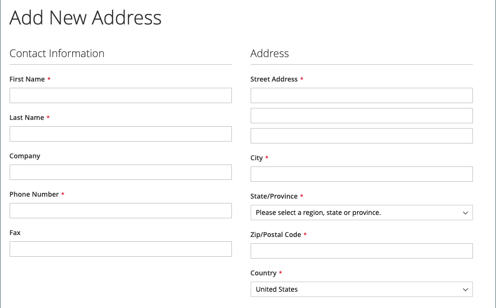
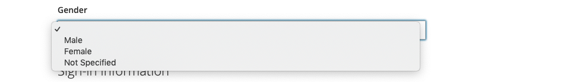

# 顧客の名前と住所のオプション

顧客がストアで[ アカウント ](../customers/account-create.md)を作成する際に、_名前と住所のオプション_&#x200B;によって、名前と住所のフォームに含まれるフィールドが決まります。

{width="500" zoomable="yes"}

Adobe CommerceとMagento Open Sourceでは、名前と住所のオプションを設定する手順が異なります。

## Adobe Commerceの名前と住所のオプションの設定

ストアフロントで顧客がアカウントを作成したときに表示される名前と住所のオプションを設定できます。

### 手順1：設定の範囲の設定

1. _管理者_ サイドバーで、**[!UICONTROL Stores]** > _[!UICONTROL Settings]_>**[!UICONTROL Configuration]**に移動します。

1. 左側のパネルで、**[!UICONTROL Customers]**&#x200B;を展開し、**[!UICONTROL Customer Configuration]**&#x200B;を選択します。

1. **[!UICONTROL Name and Address Options]** セクションを展開します。

   >[!INFO]
   >
   >名前と住所オプションの範囲は、`website` レベルで適用されます。

1. ページの上部までスクロールし、設定の範囲を次のいずれかに設定します。

   - `Default Config`
   - `Main Website` （またはマルチサイト インストール用の特定のサイト）

   >[!INFO]
   >
   >スコープが`Default Store View`に設定されている場合、_[!UICONTROL Name and Address Options]_セクションは表示されません。

   {width="700" zoomable="yes"}

### 手順2：名前と住所のオプションを設定する

1. 顧客設定ページの「[!UICONTROL _名前と住所オプション_]」セクションに戻ります。

   >[!INFO]
   >
   > `Default config` スコープ設定を使用していない場合は、値を変更する前に、各フィールドの`Use Default` チェックボックスをオフにする必要があります。

   {width="600" zoomable="yes"}

1. **[!UICONTROL Prefix Dropdown Options]**&#x200B;の場合、リストに表示する各プレフィックスをセミコロンで区切って入力します。

   >[!IMPORTANT]
   >
   >最初の値の前にセミコロンを配置して、リストの上部に空白の値を表示します。

1. **[!UICONTROL Suffix Dropdown Options]**&#x200B;には、リストに表示するサフィックスをそれぞれセミコロンで区切って入力します。

1. 顧客フォームに次のフィールドを含めるには、必要に応じて、それぞれの値を`Optional`または`Required`に設定します。

   - **[!UICONTROL Show Telephone]**
   - **[!UICONTROL Show Company]**
   - **[!UICONTROL Show Fax]**

### ステップ 3：保存して更新

1. 完了したら、**[!UICONTROL Save Config]**&#x200B;をクリックします。

1. ページ上部のメッセージで、無効なキャッシュごとに&#x200B;**[!UICONTROL Cache Management]**&#x200B;と[更新](../systems/cache-management.md)をクリックします。

## Magento Open Sourceの名前と住所のオプションの設定

ストアフロントで顧客がアカウントを作成したときに表示される名前と住所のオプションを設定します。

{width="500" zoomable="yes"}

### 手順1：設定の範囲の設定

1. _管理者_ サイドバーで、**[!UICONTROL Stores]** > _[!UICONTROL Settings]_>**[!UICONTROL Configuration]**に移動します。

1. 左側のパネルで、**[!UICONTROL Customers]**&#x200B;を展開し、**[!UICONTROL Customer Configuration]**&#x200B;を選択します。

1. **[!UICONTROL Name and Address Options]** セクションを展開します。

   >[!IMPORTANT]
   >
   > 名前と住所オプションの範囲は、`website` レベルで適用されます。

   {width="600" zoomable="yes"}

1. ページの上部までスクロールし、設定の範囲を次のいずれかに設定します。

   - `Default Config`
   - `Main Website` （またはマルチサイト インストール用の特定のサイト）

   >[!NOTE]
   >
   >スコープが`Default Store View`に設定されている場合、_名前と住所のオプション_ セクションは表示されません。

   {width="600" zoomable="yes"}

### 手順2：名前と住所のオプションを設定する

1. 顧客設定ページの「[!UICONTROL _名前と住所オプション_]」セクションに戻ります。

   >[!INFO]
   >
   >`Default config` スコープ設定を使用していない場合は、値を変更する前に、各フィールドの`Use Default` チェックボックスをオフにする必要があります。

1. **住所の行数**&#x200B;に、1 ～ 4の数値を入力します。

   >[!WARNING]
   >
   >デフォルトでは、住所は3行です。

1. 接頭辞（Mr.やMs.など）を含めるには 名前の一部として、**プレフィックスを表示**&#x200B;から`Yes`に設定します。

   {width="600" zoomable="yes"}

   >[!INFO]
   >
   >**プレフィックスドロップダウンオプション**&#x200B;に、リストに表示する各プレフィックスをセミコロンで区切って入力します。 最初の値の前にセミコロンを配置すると、リストの上部に空白の値を表示できます。

1. 顧客のミドルネームまたはイニシャルのオプション フィールドを含めるには、**[!UICONTROL Show Middle Name (initial)]**&#x200B;を`Yes`に設定します。

1. 接尾辞（Jrなど）を含めるには、 またはシニア） 顧客名の後に、**[!UICONTROL Show Suffix]**&#x200B;を次のいずれかに設定します。

   - `Optional`
   - `Required`

   >[!INFO]
   >
   >「**サフィックス ドロップダウンオプション**」に、リストに表示する各サフィックスをセミコロンで区切って入力します。 最初の値の前にセミコロンを配置すると、リストの上部に空白の値を表示できます。

1. 生年月日を含めるには、**[!UICONTROL Show Date of Birth]**&#x200B;を次のいずれかに設定します。

   - `Optional`
   - `Required`

   >[!INFO]
   >
   >現在のセキュリティとプライバシーのベストプラクティスに従って、顧客の生年月日（月、日、年）を他の個人識別子と保管することに関連する潜在的な法的およびセキュリティリスクを認識してください。 お客様の生年月日の保存を制限し、お客様の生年月日を代替手段として使用することをお勧めします。

   顧客は、フィールドの後にあるカレンダーアイコンを使用して、ポップアップカレンダーから生年月日を選択できます。

   {width="600" zoomable="yes"}

1. お客様が税金または[VAT](../stores-purchase/vat.md)番号を入力できるようにするには、**[!UICONTROL Show Tax/VAT Number]**&#x200B;を次のいずれかに設定します。

   - `Optional`
   - `Required`

1. 顧客フォームに性別のフィールドを含めるには、**[!UICONTROL Show Gender]**&#x200B;を次のいずれかに設定します。

   - `Optional`
   - `Required`

   顧客サインアップフォームの{width="600" zoomable="yes"}

1. 顧客フォームに次のフィールドを含めるには、必要に応じて、それぞれの値を`Optional`または`Required`に設定します。

   - **[!UICONTROL Show Telephone]**
   - **[!UICONTROL Show Company]**
   - **[!UICONTROL Show Fax]**

### ステップ 3：保存して更新

1. 完了したら、**[!UICONTROL Save Config]**&#x200B;をクリックします。

1. ページ上部のメッセージで、無効なキャッシュごとに&#x200B;**[!UICONTROL Cache Management]**&#x200B;と[更新](../systems/cache-management.md)をクリックします。
