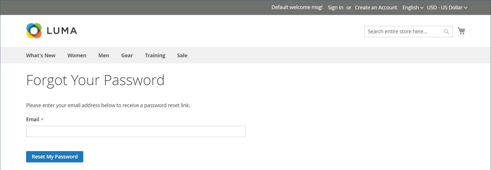

# 顧客パスワードのリセット

顧客は通常、_[!UICONTROL Forgot Your Password?]_をクリックして、ストアフロントからパスワードをリセットします。 ただし、ストア管理者は、管理者からパスワードリセットまたは強制ログインを開始できます。

| 関数 | 説明 |
| --- | --- |
| パスワードのリセット | パスワードリセット用の電子メールがお客様の電子メールアカウントに直接送信されます。 ストア管理者は、お客様のパスワードにアクセスできません。 |
| 強制ログイン | 顧客アカウントに関連付けられているOAuth アクセストークンを取り消します。 これは、Web API [統合](../systems/integrations.md)の一部として、OAuth トークンが割り当てられている顧客アカウントでのみ使用できます。 詳しくは、開発者ドキュメントの[OAuth ベースの認証](https://developer.adobe.com/commerce/webapi/get-started/authentication/gs-authentication-oauth/)を参照してください。    ストアフロントまたは管理者から作成された標準のお客様アカウントには、OAuth トークンがありません。 |

{style="table-layout:auto"}

## ストアフロントからパスワードをリセットする

1. ログインページで、顧客は&#x200B;**[!UICONTROL Forgot Your Password?]**&#x200B;をクリックします。

1. プロンプトが表示されたら、アカウントに関連付けられている&#x200B;**[!UICONTROL Email Address]**&#x200B;を入力し、**[!UICONTROL Reset My Password]**&#x200B;をクリックします。

   {width="600" zoomable="yes"}

   >[!INFO]
   >
   >入力したメールアドレスがアカウントに関連付けられているメールアドレスと一致した場合、パスワードをリセットするためのリンクが記載されたパスワードリセット確認メールをお客様に送信します。

1. 電子メールが届くと、お客様は&#x200B;_パスワードのリセット_ リンクをクリックし、プロンプトが表示されたら&#x200B;**[!UICONTROL New Password]**&#x200B;に入力します。

1. 確認するために再度入力し、**[!UICONTROL Reset Password]**&#x200B;をクリックします。

   >[!IMPORTANT]
   >
   >新しいパスワードは、スペースなしで6文字以上の長さである必要があります。 パスワードが更新されたという確認を受け取ると、新しいパスワードを使用してアカウントにログインできます。 デフォルトでは、_パスワードのリセット_ リンクは24時間有効です。

## 管理者からのパスワードのリセット

1. _管理者_ サイドバーで、**[!UICONTROL Customers]** > **[!UICONTROL All Customers]**&#x200B;に移動します。

1. グリッドで顧客アカウントを見つけ、_アクション_&#x200B;列の&#x200B;**[!UICONTROL Edit]**&#x200B;をクリックします。

1. ページの上部にあるオプションのセットで、**[!UICONTROL Reset Password]**&#x200B;をクリックします。

   1時間以内に許可されるパスワードリセット要求の数は、[設定](../configuration-reference/customers/customer-configuration.md) トピックで設定されます。

## 顧客のOAuth トークンを取り消す

>[!IMPORTANT]
>
>API認証について十分に理解していない限り、続行しないでください。

1. _管理者_ サイドバーで、**[!UICONTROL Customers]** > **[!UICONTROL All Customers]**&#x200B;に移動します。

1. グリッドで顧客アカウントを見つけ、_アクション_&#x200B;列の&#x200B;**[!UICONTROL Edit]**&#x200B;をクリックします。

1. ページの上部にあるオプションのセットで、**[!UICONTROL Force Sign In]**&#x200B;をクリックします。

1. 確認を求められたら、**OK**&#x200B;をクリックします。
