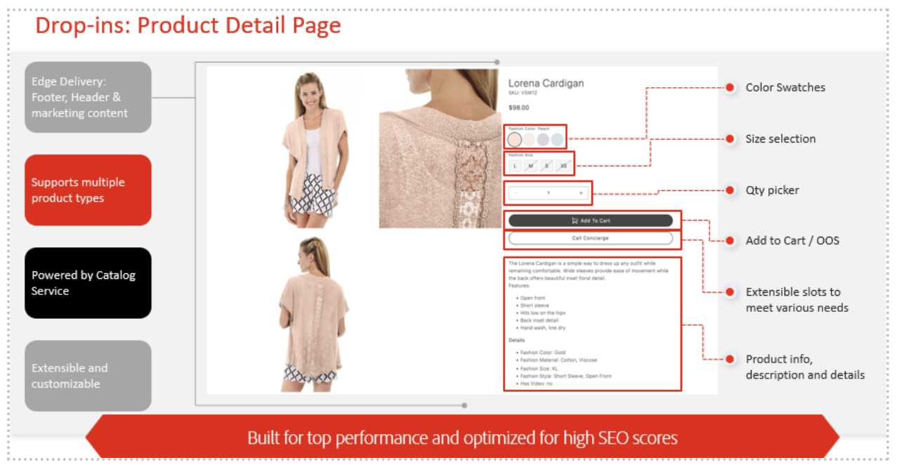

# 魅力的でパーソナライズされた体験を大規模に構築

Adobe [!DNL Commerce]は、あらゆる顧客接点をパーソナライズし、買い物客のエンゲージメント、コンバージョン、売上を向上させるための強力なツールキットを提供します。

主な内容：

- パーソナライゼーションとは？
- パーソナライゼーションを実現するためには、どのようなデータが必要ですか？
- Adobe [!DNL Commerce]でパーソナライゼーションを活用するには、どうすればよいですか？
- 利用可能なパーソナライゼーションのユースケース

## パーソナライゼーションとは？

Personalizationとは、それぞれの顧客のニーズ、状況、嗜好に合わせて、購買体験の側面をカスタマイズすることを意味します。 Personalizationのコンテンツは、サイト上のコンテンツや最適な商品をレコメンドするだけでなく、カスタマージャーニー全体のあらゆる顧客接点を網羅しています。

- **キャンペーンとコミュニケーション** - キャンペーンとコミュニケーションを通じて、関連性の高い一貫したメッセージを配信
- **製品の発見** – 適切な製品を適切な顧客にタイミングよく表示
- **プロモーションとオファー** – 各顧客のコンバージョンを促進するためのプロモーションとオファーをターゲットにする
- **コンテンツエクスペリエンス** – それぞれの顧客とそのジャーニーに対して非常に関連性があると感じられるよう、サイトコンテンツを調整します

{width="700" zoomable="yes"}

顧客接点やチャネルをまたいで、数千人または数百万人の顧客を対象に大規模にパーソナライズできます。しかし、こうしたパーソナライズされた体験をリアルタイムで提供するのは、不可能に思えます。 次の節では、Adobe [!DNL Commerce]とAdobe Experience Cloudがどのように役立つかについて説明します。

## パーソナライゼーションを実現するためには、どのようなデータが必要ですか？

効果的にパーソナライズするには、顧客に関する情報を提供し、顧客体験を調整するためのコンテキストやシグナルが必要です。 次の表は、様々なデータ型と、そのデータの収集とアクティブ化をサポートする際にAdobe [!DNL Commerce]が果たす役割を示しています。

| データタイプ | ストアフロントデータ（行動イベント） | バックオフィスデータ（サーバーサイドイベント） | 顧客プロファイルデータとセグメントデータ |
|---|---|---|---|
| **定義** | 顧客がサイトで実行するクリック数やアクション数。 | 各注文のライフサイクルと詳細に関する情報（過去と現在）。 | 顧客が誰であり、その適格性を判断するセグメントは何か。 |
| **Adobe Commerceによってキャプチャされたイベント** | [pageView](https://experienceleague.adobe.com/en/docs/commerce/data-connection/event-forwarding/events#pageview) [productPageView](https://experienceleague.adobe.com/en/docs/commerce/data-connection/event-forwarding/events) [searchRequestSent](https://experienceleague.adobe.com/en/docs/commerce/data-connection/event-forwarding/events#searchrequestsent) [searchResponseReceived](https://experienceleague.adobe.com/en/docs/commerce/data-connection/event-forwarding/events#searchresponsereceived) [addToCart](https://experienceleague.adobe.com/en/docs/commerce/data-connection/event-forwarding/events#addtocart) [openCart](https://experienceleague.adobe.com/en/docs/commerce/data-connection/event-forwarding/events#opencart) [signIn](https://experienceleague.adobe.com/en/docs/commerce/data-connection/event-forwarding/events#signin) [signOut](https://experienceleague.adobe.com/en/docs/commerce/data-connection/event-forwarding/events#signout) [startCheckout](https://experienceleague.adobe.com/en/docs/commerce/data-connection/event-forwarding/events#startcheckout) [completeCheckout](https://experienceleague.adobe.com/en/docs/commerce/data-connection/event-forwarding/events#completecheckout) [&#128279;](https://experienceleague.adobe.com/en/docs/commerce/data-connection/event-forwarding/events#createrequisitionlist)createRequisitionList [To sitionList](https://experienceleague.adobe.com/en/docs/commerce/data-connection/event-forwarding/events#addtorequisitionlist) [removeFromRequisitionList](https://experienceleague.adobe.com/en/docs/commerce/data-connection/event-forwarding/events#removefromrequisitionlist) | **注文ステータス**: [orderPlaced](https://experienceleague.adobe.com/en/docs/commerce/data-connection/event-forwarding/events-backoffice#orderplaced) [orderItemsReturnedInitiated](https://experienceleague.adobe.com/en/docs/commerce/data-connection/event-forwarding/events-backoffice#orderitemsreturnedinitiated) [orderItemsShipped](https://experienceleague.adobe.com/en/docs/commerce/data-connection/event-forwarding/events-backoffice#orderitemsshipped) [orderCanceled](https://experienceleague.adobe.com/en/docs/commerce/data-connection/event-forwarding/events-backoffice#ordercancelled) [**注文履歴**](https://experienceleague.adobe.com/en/docs/commerce/data-connection/fundamentals/connect-data#send-historical-order-data): - SKU、名前、価格数量、割引  – 製品カテゴリ   – 支払い金額、種類、通貨  – 配送方法および金額  – 払い戻しID、金額、  – 解決策 - アドレス  - メール | [**プロファイルレコード**](https://experienceleague.adobe.com/en/docs/commerce/data-connection/event-forwarding/events-profilerecord): （名前、性別、住所、ロイヤルティステータス、電話番号、電子メールアドレス）  **アカウントステータス**: [accountCreated](https://experienceleague.adobe.com/en/docs/commerce/data-connection/event-forwarding/events-backoffice#accountcreated) [accountUpdated](https://experienceleague.adobe.com/en/docs/commerce/data-connection/event-forwarding/events-backoffice#accountupdated) [accountDeleted](https://experienceleague.adobe.com/en/docs/commerce/data-connection/event-forwarding/events-backoffice#accountdeleted) |

このように豊富な1st パーティ [!DNL Commerce]のデータを活用して、買い物客の体験をターゲットし、パーソナライズすることができます。 次の節では、[!DNL Commerce]とAdobe Experience Cloudがどのようにパーソナライズされたエクスペリエンスの作成に役立つのか、およびアクティベートできるユースケースについて説明します。

## Adobe [!DNL Commerce]は、パーソナライゼーションにどのように役立ちますか？

Adobe [!DNL Commerce] Data Sharingを使用すると、前の表のデータタイプを収集して他のAdobe Experience Cloud製品と共有し、統合された顧客プロファイルとオーディエンス、パーソナライズされたキャンペーン、および豊富な分析とインサイトを強化できます。

{width="700" zoomable="yes"}

Adobe [!DNL Commerce] Data Sharingには、次の2つの主要なコンポーネントが含まれています。

1. [Data Connection](https://experienceleague.adobe.com/en/docs/commerce/data-connection/overview): Adobe [!DNL Commerce]のストアフロント、バックオフィス、顧客プロファイルデータをAdobe Experience Platform Edge Networkに共有し、Adobe Experience Cloud アプリケーション全体で使用します。次のデータを含みます。

   - [Adobe [!DNL Real-Time CDP]](https://experienceleague.adobe.com/en/docs/experience-platform/rtcdp/intro/rtcdp-intro/overview)：複数のソース（ERP、CRM、POS）からの顧客データをつなぎ合わせて統合プロファイルを作成し、ルールベースまたはAI ベースのセグメントを作成します。
   - [Adobe [!DNL Journey Optimizer]](https://experienceleague.adobe.com/en/docs/journey-optimizer/using/get-started/get-started)：電子メールキャンペーン、SMS、プッシュ通知など、パーソナライズされたオムニチャネルジャーニーを開始します。
   - [Customer Journey Analytics](https://experienceleague.adobe.com/en/docs/analytics-platform/using/cja-overview/cja-overview)および[Adobe [!DNL Analytics]](https://experienceleague.adobe.com/en/docs/analytics/analyze/admin-overview/analytics-overview)：お客様とビジネスに関する洞察を得ます。
   - [Adobe [!DNL Target]](https://experienceleague.adobe.com/en/docs/target/using/introduction/intro): コンテンツ、おすすめの商品、オファー、ナビゲーションなどをテストして最適化します。

1. [[!DNL Audience Activation]](https://experienceleague.adobe.com/en/docs/commerce-admin/customers/audience-activation): [!DNL Real-Time CDP]人のオーディエンスを使用して、Adobe [!DNL Commerce] サイトの動的コンテンツブロック、プロモーション、および関連商品ルールをパーソナライズします。

### あらゆるチャネルをまたいで、大規模にパーソナライズされたストアフロント体験

Adobe [!DNL Commerce]は、[Edge Delivery Services](https://experienceleague.adobe.com/developer/commerce/storefront/)と呼ばれる高性能なストアフロントを活用して、AI機能を中核に据え、基盤としてスピードを高めながら、あらゆるチャネルをまたいでパーソナライズされたエクスペリエンスを提供できます。

Edge Delivery Servicesでは、次のことが可能です。

- **パーソナライズされたコンテンツを作成**：ドキュメントベースのオーサリング、生成AIのテキストと画像のバリエーションによるネイティブの実験を利用して、エクスペリエンスを大規模にパーソナライズします。 Assetsと生成AI コンテンツ制作を活用して、商品とマーケティングの画像を大規模に制作します。

- **バリエーションの生成**: Adobe Fireflyを使用すると、コンテンツ作成者は生成AIを使用して、AIを活用してパーソナライズされた大量の[&#x200B; テキストコンテンツと画像バリエーション &#x200B;](https://experienceleague.adobe.com/en/docs/experience-manager-learn/sites/generative-ai/generate-variations)を作成できます。

- **Edge Delivery Services Storefrontを介したデプロイ**: ドロップインコンポーネントを活用したEdgeおよびCommerce機能のコンテンツを使用して、オーディエンス向けにカスタマイズされたショッパブルなエクスペリエンスを作成します。

- **CommerceとAdobe Experience Manager Assets**：生成AIによる商品アセットの大規模な制作とバリエーション。 あらゆるチャネルをまたいでコンテンツ配信を構築、配信、監視できます。

{width="700" zoomable="yes"}

### すぐに使えるPersonalization:Adobe [!DNL Commerce]のネイティブ機能を使い始めましょう

Adobe [!DNL Commerce]は、ネイティブのすぐに使用できる機能を備えた強力なパーソナライズ機能を提供します。 次の表は、パーソナライゼーションジャーニーを開始するためにすぐにアクティブ化できる[!DNL Commerce]機能について説明します。

| カテゴリ | 機能 |
|---|---|
| パーソナライズされた商品発見 | [[!DNL Live Search]](https://experienceleague.adobe.com/en/docs/commerce/live-search/overview)：買い物客のサイト内の行動アクションと、AIを活用した検索との親和性にもとづいて、検索結果をパーソナライズおよび最適化します。 [&#x200B; インテリジェントなカテゴリーマーチャンダイジング &#x200B;](https://experienceleague.adobe.com/en/docs/commerce/live-search/live-search-admin/category-merch)：買い物客のサイト内での行動アクションと親和性にもとづいて、カテゴリーページ上で、AIを活用した商品ランキングを実行します。 [商品レコメンデーション &#x200B;](https://experienceleague.adobe.com/en/docs/commerce/product-recommendations/guide-overview)：買い物客の行動、トレンド、好感度にもとづいて、AIを活用した商品レコメンデーションを提供します。 [関連製品ルール &#x200B;](https://experienceleague.adobe.com/en/docs/commerce-admin/marketing/promotions/product-relationships/product-related-rules): カタログの製品を表示するためのカスタムルールを定義して、クロスセルとアップセルを促進します。 |
| パーソナライズされたサイトコンテンツ | [動的コンテンツブロック &#x200B;](https://experienceleague.adobe.com/en/docs/commerce-admin/content-design/elements/dynamic-blocks/dynamic-blocks): Adobe Commerceの顧客セグメントに基づいて、パーソナライズされたコンテンツブロック（バナーなど）を表示します。 |
| パーソナライズされたオファーとプロモーション | [買い物かご価格規則](https://experienceleague.adobe.com/en/docs/commerce-admin/marketing/promotions/cart-rules/price-rules-cart): Adobe [!DNL Commerce]のお客様セグメントを含む一連の条件に基づいて、買い物かご内の商品に割引を適用します。 |
| インサイトと測定 | [Adobe [!DNL Commerce]  インテリジェンス &#x200B;](https://experienceleague.adobe.com/en/docs/commerce-business-intelligence/mbi/getting-started): パーソナライゼーション戦略の効果を理解し、時間の経過とともに改善します。 |

## 重要なパーソナライゼーションのユースケース

Adobe [!DNL Commerce]のお客様は、標準の機能を使用し、様々なユースケースでAdobe Experience Cloudにデータを共有しています。 次の節では、最も重要なユースケースを取り上げ、Adobe [!DNL Commerce]のみ、または[!DNL Commerce]とExperience Cloud アプリを使用して、それらを実装する方法について説明します。

### パーソナライズされたキャンペーンとコミュニケーション

| ユースケース | Solution |
|---|---|
| **カート放棄と参照** – 顧客が高いエンゲージメントを示した後にカートまたは閲覧セッションを放棄した場合、パーソナライズされたリエンゲージメントメールまたは通知を配信します | **Adobe [!DNL Commerce] Only**: [電子メールリマインダー](https://experienceleague.adobe.com/en/docs/commerce-admin/marketing/communications/email-reminders/email-reminder-rules) **Adobe [!DNL Commerce] with Adobe Journey Optimizer**: [!DNL Commerce] dataは、オムニチャネルの放棄ジャーニーのトリガーとして機能します。 顧客の属性、放棄した商品、その他のショッピング行動、過去の購入履歴などにもとづいて、ジャーニーをパーソナライズします。 CommerceとAdobe Journey OptimizerおよびReal-Time CDP：統合された顧客プロファイルと一元管理されたオーディエンスに基づいて、放棄率の高いオーディエンスを作成するなど、放棄率の高い施策をカスタマイズします。 |
| **一元的なオーディエンス作成** - サイト内の行動、過去の購入履歴、プロファイル属性、カテゴリーの親和性、ロイヤルティステータス、顧客価値などに基づいて、ルールベースまたはAIを活用したオーディエンスを作成します | **Adobe [!DNL Commerce]のみ**: お客様がアカウントを作成する際に、お客様のプロファイル情報を収集します。 [!DNL Commerce]ルールベースの[顧客セグメント &#x200B;](https://experienceleague.adobe.com/en/docs/commerce-admin/customers/segments/customer-segments)と顧客グループを作成して、コンテンツとプロモーションをパーソナライズします。 **Adobe [!DNL Commerce] （Adobe Real-Time CDP**: ） [&#x200B; データソースとチャネル全体からの統合プロファイル &#x200B;](https://experienceleague.adobe.com/en/docs/experience-platform/segmentation/home)。ルールベースまたはAIを活用したオーディエンス。 |
| **買い物客の行動に基づいてパーソナライズされた電子メール/SMS オファー** – 過去の購入履歴や買い物客の行動に基づいて、ターゲットを絞った電子メールを介して、顧客にパーソナライズされたオファーを送信します。例えば、顧客が閲覧またはエンゲージメントした商品やカテゴリーのオファーを送信します。 | **Adobe [!DNL Commerce]のみ**: MA ソリューションで使用するデータを書き出します。 **Adobe [!DNL Commerce]とAdobe Journey OptimizerおよびReal-Time CDP**: [!DNL Commerce] データは、メールまたはSMS オファーのトリガーとして機能し、基づいてパーソナライズするためのシグナル（買い物客の行動）を提供します。 Real-Time CDPは必須ではありませんが、一般的に、これらのオファーと施策はオーディエンスを中心に作成され、Real-Time CDPで作成、管理されます。 |
| **クロスセルまたはアップセル互換性のある製品/ブランド** – 顧客が互換性のある製品またはブランドを購入するか、別の製品またはブランドに対する親和性が高い場合は、クロスセルのコンバージョンを促進するキャンペーン（メール/SMS）を送信します。 | **Adobe [!DNL Commerce] Only**: Adobe [!DNL Commerce] [商品レコメンデーション &#x200B;](https://experienceleague.adobe.com/en/docs/commerce/product-recommendations/guide-overview)を使用して、サイト上の特定の商品をレコメンデーションします。 [関連製品ルール &#x200B;](https://experienceleague.adobe.com/en/docs/commerce-admin/marketing/promotions/product-relationships/product-related-rules)を使用して、他の製品を提案することもできます。 **[!DNL Commerce] [!DNL Target]**: Adobe [!DNL Target]には、カテゴリーの親和性などの強力な機能を備えた製品レコメンデーションエンジンも組み込まれています。 これは、クロスセルまたはアップセルに使用できます。 **[!DNL Commerce] Adobe Journey Optimizer**: では、[!DNL Target]または[!DNL Commerce]を使用して、お勧めの商品を決定し、Adobe Journey Optimizer経由で配信します。 |

### パーソナライズされたサイト体験

| ユースケース | Solution |
|---|---|
| **パーソナライズされたサイトコンテンツ** – 商品の閲覧やカテゴリーの親和性など、買い物客の行動に基づいて、サイトバナーやその他のページコンテンツをパーソナライズします。 A/B テストの結果やビジネス目標にもとづいて、最適なコンテンツを展開できます。 | **Adobe [!DNL Commerce]のみ**:  セグメント固有の[動的コンテンツブロック &#x200B;](https://experienceleague.adobe.com/en/docs/commerce-admin/content-design/elements/dynamic-blocks/dynamic-blocks). **[!DNL Commerce]をデプロイ Real-Time CDP &#x200B;**: Audience Activation[&#128279;](https://experienceleague.adobe.com/en/docs/commerce-admin/customers/audience-activation)を使用して、Real-Time CDPでプロファイルとオーディエンスを一元管理しながら、リアルタイムのアクションと統合顧客プロファイルデータに対応する、オーディエンス固有の動的コンテンツブロックをデプロイします。 **[!DNL Commerce] [!DNL Target]**: Adobe [!DNL Target]のAdobe [!DNL Commerce] データを使用して、コンテンツ、ナビゲーション項目、ページ全体のレイアウトなど、サイトエクスペリエンスのあらゆる部分をパーソナライズします。 A/B テスト コンテンツを使用して、各顧客に最適なコンテンツを自動的に選択してデプロイします。 **[!DNL Commerce] AEM Assets &#x200B;**: すべてのコンテンツをAdobe Experience Manager Assetsに保存します。 Adobe Commerceからネイティブにアクセスできます。 生成AIを利用して、様々なセグメントやオーディエンス向けにパーソナライズするコンテンツのバリエーションを作成できます。 |
| **行動に基づいてパーソナライズされたオンサイトオファー** – 商品の閲覧やカテゴリーの親和性など、買い物客の行動に基づいてプロモーションをパーソナライズします。 A/B テストの結果やビジネス目標にもとづいて、次善のオファーを展開できます。 | **Adobe [!DNL Commerce]のみ**:  セグメント固有のカタログと[&#x200B; カート価格ルール &#x200B;](https://experienceleague.adobe.com/en/docs/commerce-admin/marketing/promotions/cart-rules/price-rules-cart)をデプロイします。 **Adobe [!DNL Commerce] with Real-Time CDP**: Real-Time CDPでプロファイルやオーディエンスを一元管理しながら、[Audience Activation](https://experienceleague.adobe.com/en/docs/commerce-admin/customers/audience-activation)を使用してオーディエンス固有のオファーをデプロイします。 **Commerce with[!DNL Target]**: オファー決定を使用して、デプロイするオファーを決定します。A/B テストを実行するか、Adobe Commerceでデプロイされるオファーをガイドするビジネス目標を設定します。 |

### 分析とインサイト

| ユースケース | Solution |
|---|---|
| **チャネル別の顧客行動** – 各チャネル（web、対面、アプリなど）における顧客のエンゲージメントの詳細を把握して、各チャネルのマーケティング戦略に影響を与えます。また、買い物客のfunnelと顧客体験の改善点についても把握します。 | **Adobe [!DNL Commerce] Only**: [Adobe [!DNL Commerce] Intelligence](https://experienceleague.adobe.com/en/docs/commerce-business-intelligence/mbi/getting-started)は、デジタル [!DNL Commerce] チャネルで豊富な分析機能を提供しますが、チャネルやカスタマージャーニーのより広範な部分では提供しません。 **Adobe [!DNL Commerce] with Customer Journey Analytics**: [!DNL Commerce] data feeds data dashboards：顧客体験のあらゆる段階（チャネル間）に関する詳細を詳細に表示します。 あらゆる顧客接点と大規模なfunnelを把握し、カスタマージャーニーにおいて顧客が離脱する可能性のある弱点を特定します。 |
| **購入トレンド** – 特定の時間枠における購入行動を把握する（買い物客の買い物かご分析、商品分析など）。過去の購入パターンにもとづいてトレンドを特定し、季節性を把握し、マーケティングを最適化します。 | **Adobe [!DNL Commerce] Only**: [Adobe [!DNL Commerce] Intelligence](https://experienceleague.adobe.com/en/docs/commerce-business-intelligence/mbi/getting-started)は、デジタル [!DNL Commerce] チャネルで豊富な分析機能を提供しますが、チャネルやカスタマージャーニーのより広範な部分では提供しません。 **Adobe [!DNL Commerce] with Customer Journey Analytics**: [!DNL Commerce] data feeds data dashboards：顧客体験のあらゆる段階（チャネル間）に関する詳細を詳細に表示します。 あらゆる顧客接点と大規模なfunnelを把握し、カスタマージャーニーにおいて顧客が離脱する可能性のある弱点を特定します。 |

## 使用例

- Adobe Journey Optimizerを使用して、[&#x200B; カート放棄メールを送信](https://experienceleague.adobe.com/en/docs/commerce/data-connection/use-cases/using-ajo)する方法について説明します。
- Adobe [!DNL Commerce]で買い物かごの価格ルールを通知するために、[Real-Time CDP](https://experienceleague.adobe.com/en/docs/commerce/data-connection/use-cases/create-audience)でオーディエンスを作成する方法について説明します。
