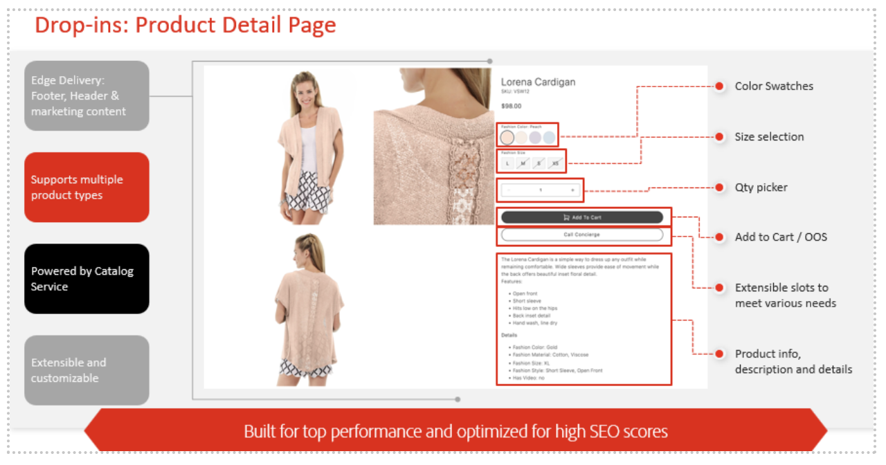

# 魅力的でパーソナライズされたエクスペリエンスを大規模に作成

Adobe [!DNL Commerce] は、すべての顧客タッチポイントをパーソナライズし、買い物客のエンゲージメント、コンバージョン、売上高を向上させる強力なツールキットを提供します。

この記事では、次の内容について説明します。

- パーソナライゼーションとは
- パーソナライゼーションを実現するには、どのようなデータが必要ですか？
- Adobe方法 [!DNL Commerce] パーソナライゼーションのロックを解除
- 利用可能なパーソナライゼーションのユースケース

## パーソナライゼーションとは

パーソナライゼーションとは、顧客の固有のニーズ、コンテキスト、好みに合わせて各顧客の購入体験の側面を調整することを意味します。 パーソナライゼーションは、サイト上のコンテンツや最適な製品の推奨に限定されるものではなく、カスタマージャーニー全体にわたるすべてのタッチポイントを包含します。これには以下が含まれます。

- **キャンペーンと通信** - キャンペーンとコミュニケーションを通じて、関連性が高く一貫性のあるメッセージを配信する
- **製品の検出**  – 適切な製品を適切なタイミングで適切な顧客に表示する
- **プロモーションとオファー**  – 各顧客のコンバージョンを促進するターゲティングプロモーションとオファー
- **コンテンツエクスペリエンス**  – 各顧客とそのジャーニーとの関連性が高いと感じるようにサイトコンテンツを調整する

{width="700" zoomable="yes"}

このようなパーソナライズされたエクスペリエンスは、少数の顧客に対しては実現可能と思われますが、すべてのタッチポイントとチャネルで数千または数百万の顧客に対して大規模にパーソナライズすると、すべてリアルタイムで実現が不可能と感じることがあります。 次の節では、Adobeの方法について説明します [!DNL Commerce] Adobe Experience Cloudも役に立ちます。

## パーソナライゼーションを実現するには、どのようなデータが必要ですか？

効果的なパーソナライゼーションには、顧客に関する情報を提供するコンテキストまたはシグナルが必要で、それを使用してエクスペリエンスを変更できます。 次の表に、様々なデータタイプとそのAdobeの役割を示します [!DNL Commerce] そのデータの収集とアクティブ化をサポートする役割を果たします。

| データタイプ | ストアフロントデータ（行動イベント） | バックオフィスデータ（サーバーサイドイベント） | 顧客プロファイルとセグメントデータ |
|---|---|---|---|
| **定義** | サイトに対する顧客のクリックまたはアクション。 | 各注文のライフサイクルと詳細（過去および現在）に関する情報。 | 買い物客は誰で、どのようなセグメントに該当するか。 |
| **Adobe Commerceでキャプチャされたイベント** | [pageView](https://experienceleague.adobe.com/en/docs/commerce-merchant-services/data-connection/event-forwarding/events#pageview) [productPageView](https://experienceleague.adobe.com/en/docs/commerce-merchant-services/data-connection/event-forwarding/events) [searchRequestSent](https://experienceleague.adobe.com/en/docs/commerce-merchant-services/data-connection/event-forwarding/events#searchrequestsent) [searchResponseReceived](https://experienceleague.adobe.com/en/docs/commerce-merchant-services/data-connection/event-forwarding/events#searchresponsereceived) [addToCart](https://experienceleague.adobe.com/en/docs/commerce-merchant-services/data-connection/event-forwarding/events#addtocart) [openCart](https://experienceleague.adobe.com/en/docs/commerce-merchant-services/data-connection/event-forwarding/events#opencart) [ログイン](https://experienceleague.adobe.com/en/docs/commerce-merchant-services/data-connection/event-forwarding/events#signin) [signOut](https://experienceleague.adobe.com/en/docs/commerce-merchant-services/data-connection/event-forwarding/events#signout) [startCheckout](https://experienceleague.adobe.com/en/docs/commerce-merchant-services/data-connection/event-forwarding/events#startcheckout) [completeCheckout](https://experienceleague.adobe.com/en/docs/commerce-merchant-services/data-connection/event-forwarding/events#completecheckout) [createRequisitionList](https://experienceleague.adobe.com/en/docs/commerce-merchant-services/data-connection/event-forwarding/events#createrequisitionlist) [addToRequisitionList](https://experienceleague.adobe.com/en/docs/commerce-merchant-services/data-connection/event-forwarding/events#addtorequisitionlist) [removeFromRequisitionList](https://experienceleague.adobe.com/en/docs/commerce-merchant-services/data-connection/event-forwarding/events#removefromrequisitionlist) | **注文ステータス**: [orderPlaced](https://experienceleague.adobe.com/en/docs/commerce-merchant-services/data-connection/event-forwarding/events-backoffice#orderplaced) [orderItemsReturnedInitiated](https://experienceleague.adobe.com/en/docs/commerce-merchant-services/data-connection/event-forwarding/events-backoffice#orderitemsreturnedinitiated) [orderItemsShipped](https://experienceleague.adobe.com/en/docs/commerce-merchant-services/data-connection/event-forwarding/events-backoffice#orderitemsshipped) [orderCancelled](https://experienceleague.adobe.com/en/docs/commerce-merchant-services/data-connection/event-forwarding/events-backoffice#ordercancelled) [**注文履歴**](https://experienceleague.adobe.com/en/docs/commerce-merchant-services/data-connection/fundamentals/connect-data#send-historical-order-data): - SKU、名前、価格数量、割引  – 製品カテゴリ  – 支払い金額、タイプ、通貨 ・配送方法および金額  – 払戻 ID、金額、通貨  – 戻り値の理由、条件、解決策  – 住所 - メール | [**プロファイルレコード**](https://experienceleague.adobe.com/en/docs/commerce-merchant-services/data-connection/event-forwarding/events-profilerecord):（名前、性別、住所、ロイヤルティステータス、電話番号、メールアドレス） **アカウントステータス**: [accountCreated](https://experienceleague.adobe.com/en/docs/commerce-merchant-services/data-connection/event-forwarding/events-backoffice#accountcreated) [accountUpdated](https://experienceleague.adobe.com/en/docs/commerce-merchant-services/data-connection/event-forwarding/events-backoffice#accountupdated) [accountDeleted](https://experienceleague.adobe.com/en/docs/commerce-merchant-services/data-connection/event-forwarding/events-backoffice#accountdeleted) |

このすべての金持ちのファーストパーティで [!DNL Commerce] データを使用すると、買い物客のエクスペリエンスをターゲットにしてパーソナライズする準備が整います。 次の節では、その方法を説明します [!DNL Commerce] とAdobe Experience Cloudは、パーソナライズされたエクスペリエンスと、アクティブ化できるユースケースの作成に役立ちます。

## Adobe方法 [!DNL Commerce] パーソナライゼーションを強化しますか？

Adobe [!DNL Commerce] データ共有を使用すると、前のテーブルのデータタイプを収集して他のAdobe Experience Cloud製品と共有し、統合された顧客プロファイルとオーディエンス、パーソナライズされたキャンペーンおよび豊富な分析とインサイトを強化できます。

{width="700" zoomable="yes"}

Adobe [!DNL Commerce] データ共有には、次の 2 つの主要なコンポーネントが含まれます。

1. [データ接続](https://experienceleague.adobe.com/en/docs/commerce-merchant-services/data-connection/overview):Adobeからストアフロント、バックオフィス、顧客プロファイルデータを共有する [!DNL Commerce] Adobe Experience Platform edge network に接続して、次のようなAdobe Experience Cloud アプリケーション全体で使用できるようにします。

   - [Adobe [!DNL Real-Time CDP]](https://experienceleague.adobe.com/en/docs/experience-platform/rtcdp/intro/rtcdp-intro/overview)：複数のソース（ERP、CRM、POS）からの顧客データを統合されたプロファイルに結び付け、ルールベースまたは AI ベースのセグメントを作成します。
   - [Adobe [!DNL Journey Optimizer]](https://experienceleague.adobe.com/en/docs/journey-optimizer/using/get-started/get-started)：メールキャンペーン、SMS、プッシュ通知など、パーソナライズされたオムニチャネルジャーニーを開始します。
   - [Customer Journey Analytics](https://experienceleague.adobe.com/en/docs/analytics-platform/using/cja-overview/cja-overview) および [Adobe [!DNL Analytics]](https://experienceleague.adobe.com/en/docs/analytics/analyze/admin-overview/analytics-overview)：顧客とビジネスに関するインサイトを得ます。
   - [Adobe [!DNL Target]](https://experienceleague.adobe.com/en/docs/target/using/introduction/intro)：コンテンツ、推奨製品、オファー、ナビゲーションなどをテストして最適化します。

1. [[!DNL Audience Activation]](https://experienceleague.adobe.com/en/docs/commerce-admin/customers/audience-activation)：を使用 [!DNL Real-Time CDP] オーディエンス :Adobe上の動的コンテンツブロック、プロモーションおよび関連する製品ルールをパーソナライズします [!DNL Commerce] サイト。

### あらゆるチャネルにわたって規模に応じてパーソナライズされたストアフロントエクスペリエンス

Adobe [!DNL Commerce] という高性能ストアフロントを活用できる [Edge Delivery Services](https://experienceleague.adobe.com/developer/commerce/storefront/)を使用すると、コアに AI 機能を搭載し、基盤として迅速に対応しながら、すべてのチャネルにわたってパーソナライズされたエクスペリエンスを提供できます。

Edge Delivery Servicesを使用すると、次のことができます。

- **パーソナライズされたコンテンツの作成**：エクスペリエンスを大規模にパーソナライズするには、ドキュメントベースのオーサリング、生成 AI テキストおよび画像バリエーションのネイティブ実験を使用します。 アセットとジェネレーティブ AI コンテンツ作成を使用して、製品およびマーケティング画像を大規模に生成します。

- **バリエーションを生成**：コンテンツ作成者がジェネレーティブ AI を使用して、パーソナライズされた AI 駆動型のコンテンツを大量に作成できるようにします [テキストコンテンツと画像バリエーション](https://experienceleague.adobe.com/en/docs/experience-manager-learn/sites/generative-ai/generate-variations) Adobe Fireflyで。

- **Edge Delivery Services ストアフロントを介したデプロイ**：ドロップインコンポーネントを活用した Edge およびCommerce上のコンテンツで、オーディエンス向けにカスタムのショッパブルエクスペリエンスを作成します。

- **CommerceとAdobe Experience Manager Assets**：大規模なジェネレーティブ AI 製品アセットの作成とバリエーション。 任意のチャネルをまたいだコンテンツ配信を作成、配信、監視します。

{width="700" zoomable="yes"}

### 標準のパーソナライゼーション：ネイティブAdobeの概要 [!DNL Commerce] の機能

Adobe [!DNL Commerce] は、すぐに使用できるネイティブの機能で、強力なパーソナライゼーションを提供します。 以下の表で説明します [!DNL Commerce] の機能を即座にアクティベートして、パーソナライゼーションジャーニーを開始できます。

| カテゴリ | 機能 |
|---|---|
| パーソナライズされた製品検出 | [[!DNL Live Search]](https://experienceleague.adobe.com/en/docs/commerce-merchant-services/live-search/overview):AI を利用した検索で、買い物客のオンサイト行動アクションと親和性に基づいて検索結果をパーソナライズし最適化します。 [インテリジェントカテゴリマーチャンダイジング](https://experienceleague.adobe.com/en/docs/commerce-merchant-services/live-search/live-search-admin/category-merch)：買い物客のオンサイトでの行動とアフィニティに基づく、カテゴリページに関する AI 主導の製品ランキング。 [製品のRecommendations](https://experienceleague.adobe.com/en/docs/commerce-merchant-services/product-recommendations/guide-overview)：買い物客の行動、トレンド、親和性に基づく、AI を活用した製品のレコメンデーション。 [関連する製品ルール](https://experienceleague.adobe.com/en/docs/commerce-admin/marketing/promotions/product-relationships/product-related-rules)：カスタムルールを定義して、カタログの製品を表示し、クロスセルとアップセルを促進します。 |
| パーソナライズされたサイトコンテンツ | [動的コンテンツブロック](https://experienceleague.adobe.com/en/docs/commerce-admin/content-design/elements/dynamic-blocks/dynamic-blocks):Adobe Commerceの顧客セグメントに基づいて、パーソナライズされたコンテンツブロック（例：バナー）を表示します。 |
| パーソナライズされたオファーとプロモーション | [買い物かご価格ルール](https://experienceleague.adobe.com/en/docs/commerce-admin/marketing/promotions/cart-rules/price-rules-cart):Adobeの顧客セグメントなど、一連の条件に基づいて、買い物かご内の商品に割引を適用します [!DNL Commerce]. |
| インサイトと測定 | [Adobe [!DNL Commerce] 情報](https://experienceleague.adobe.com/en/docs/commerce-business-intelligence/mbi/getting-started)：パーソナライゼーション戦略の仕組みを理解し、時間の経過と共に改善する。 |

## 上位のパーソナライゼーションユースケース

Adobe [!DNL Commerce] お客様は、標準搭載の機能を使用し、様々なユースケースのためにデータをAdobe Experience Cloudに共有しています。 以下の節では、上位のユースケースを重点的に取り上げ、Adobeを使用してそれらの実装方法について説明します [!DNL Commerce] Only or [!DNL Commerce] とExperience Cloudアプリ。

### パーソナライズされたキャンペーンとコミュニケーション

| ユースケース | 解決策 |
|---|---|
| **放棄された買い物かごと参照**  – 高いエンゲージメントを示した後に顧客が買い物かごや閲覧セッションを放棄した場合に、パーソナライズされた再エンゲージメントのメールまたは通知を配信する | **Adobe [!DNL Commerce] のみ**: [Email Reminders](https://experienceleague.adobe.com/en/docs/commerce-admin/marketing/communications/email-reminders/email-reminder-rules) **Adobe [!DNL Commerce] （Adobe Journey Optimizerを使用）**: [!DNL Commerce] データは、オムニチャネル離脱ジャーニーのトリガーとして機能します。 顧客属性、破棄した内容、その他の買い物行動、過去の購入に基づいて、ジャーニーをパーソナライズします。 Adobe Journey OptimizerとReal-Time CDPのCommerce：統合された顧客プロファイルと一元管理されたオーディエンスに基づいて放棄キャンペーンをカスタマイズします。例えば、高い放棄率のオーディエンスを作成します。 |
| **一元的なオーディエンスの作成** - オンサイト行動、購入歴、プロファイル属性、カテゴリへの親和性、ロイヤルティステータス、顧客価値などに基づいて、ルールベースまたは AI を活用したオーディエンスを作成します | **Adobe [!DNL Commerce] のみ**: 顧客プロファイル情報の収集 [!DNL Commerce] 顧客はアカウントを作成します。 ルールベースの作成 [顧客セグメント](https://experienceleague.adobe.com/en/docs/commerce-admin/customers/segments/customer-segments) および顧客グループを使用して、コンテンツとプロモーションをパーソナライズします。 **Adobe [!DNL Commerce] （Adobe Real-Time CDPを使用）**:  [統合プロファイル](https://experienceleague.adobe.com/en/docs/experience-platform/segmentation/home) 様々なデータソースやチャネルから、ルールベースまたは AI を活用したオーディエンスまで。 |
| **買い物客の行動に基づいてパーソナライズされたメール/SMS オファー**  – 過去の購入と買い物客の行動に基づいて、ターゲットメールを使用してパーソナライズされたオファーを顧客に送信します。例えば、顧客が閲覧または関与した製品やカテゴリのオファーを送信します。 | **Adobe [!DNL Commerce] のみ**: マーケティング自動化ソリューションで使用するデータの書き出し。 **Adobe [!DNL Commerce] Adobe Journey OptimizerとReal-Time CDPの使用**: [!DNL Commerce] データは、メールまたは SMS オファーのトリガーとして機能し、に基づいてパーソナライズするシグナル（買い物客の行動）を提供します。 Real-Time CDPは必須ではありませんが、通常、これらのオファーとキャンペーンは、Real-Time CDP内で作成および管理されるオーディエンスを中心に作成されます。 |
| **クロスセルまたはアップセル対応の製品/ブランド**  – 顧客が互換性のある製品やブランドを購入した場合、または別の製品やブランドに対する親和性が高いことを示した場合は、キャンペーン（メール/SMS）を送信してクロスセルコンバージョンを促進します。 | **Adobe [!DNL Commerce] のみ**: Adobeを使用 [!DNL Commerce] [製品のRecommendations](https://experienceleague.adobe.com/en/docs/commerce-merchant-services/product-recommendations/guide-overview) サイト上の特定の製品を推奨します。 を使用することもできます。 [関連する製品ルール](https://experienceleague.adobe.com/en/docs/commerce-admin/marketing/promotions/product-relationships/product-related-rules) 他の商品を提案するため。 **[!DNL Commerce] （を使用） [!DNL Target]**: Adobe [!DNL Target] また、には、カテゴリ親和性などの強力な機能を備えた製品レコメンデーションエンジンが組み込まれています。 これは、クロスまたはアップセルに使用できます。 **[!DNL Commerce] （Adobe Journey Optimizerを使用）**: 使用方法 [!DNL Target] または [!DNL Commerce] お勧めの商品を決めるには、Adobe Journey Optimizerを使用して配信します。 |

### パーソナライズされたサイトエクスペリエンス

| ユースケース | 解決策 |
|---|---|
| **パーソナライズされたサイトコンテンツ** - サイトのバナーやその他のページコンテンツを、買い物客のアクション（製品の参照やカテゴリへの親和性など）に基づいてパーソナライズします。 A/B テストの結果やビジネス目標に基づいて、最適なコンテンツをデプロイします。 | **Adobe [!DNL Commerce] のみ**: セグメント固有のデプロイ [動的コンテンツブロック](https://experienceleague.adobe.com/en/docs/commerce-admin/content-design/elements/dynamic-blocks/dynamic-blocks). **[!DNL Commerce] （Real-Time CDPを使用）**: 使用方法 [Audience Activation](https://experienceleague.adobe.com/en/docs/commerce-admin/customers/audience-activation) Real-Time CDPでプロファイルとオーディエンスを一元的に管理しながら、リアルタイムのアクションおよび統合された顧客プロファイルデータに対応する、オーディエンス固有の動的コンテンツブロックをデプロイする場合。 **[!DNL Commerce] （を使用）[!DNL Target]**: Adobeを使用して、コンテンツ、ナビゲーション項目、フルページレイアウトなど、サイトエクスペリエンスのあらゆる部分をパーソナライズします [!DNL Commerce] Adobe内のデータ [!DNL Target]. コンテンツの A/B テストを行い、顧客ごとに勝者コンテンツを自動的に選択してデプロイします。 **[!DNL Commerce] （AEM Assetsを使用）**: コンテンツをすべてAdobe Experience Manager Assetsに保存します。 Adobe Commerce内からそのコンテンツにネイティブにアクセスします。 ジェネレーティブ AI を使用して、コンテンツのバリエーションを作成し、様々なセグメントやオーディエンスに合わせてパーソナライズします。 |
| **行動に基づいてパーソナライズされたオンサイトオファー**  – 製品の閲覧やカテゴリへの親和性など、買い物客のアクションに基づいてプロモーションをパーソナライズします。 A/B テストの結果やビジネス目標に基づいて、次善のオファーをデプロイします。 | **Adobe [!DNL Commerce] のみ**: セグメント固有のカタログのデプロイ [買い物かご価格ルール](https://experienceleague.adobe.com/en/docs/commerce-admin/marketing/promotions/cart-rules/price-rules-cart). **Adobe [!DNL Commerce] （Real-Time CDPを使用）**: 使用方法 [Audience Activation](https://experienceleague.adobe.com/en/docs/commerce-admin/customers/audience-activation) Real-Time CDPでプロファイルやオーディエンスを一元的に管理しながら、オーディエンス固有のオファーをデプロイします。 **とのCommerce[!DNL Target]**:offer decisioningを使用して、Adobe Commerceにデプロイされたオファーをガイドするために、デプロイするオファー、A/B テストまたはビジネス目標を決定します。 |

### 分析とインサイト

| ユースケース | 解決策 |
|---|---|
| **チャネル別の顧客行動**  – 顧客が各チャネル（web、対面、アプリなど）にどのように関与して各チャネルのマーケティング戦略に影響を与えるかのニュアンスを理解します。買い物客ファネルとカスタマーエクスペリエンスの弱点を理解します。 | **Adobe [!DNL Commerce] のみ**: [Adobe [!DNL Commerce] 情報](https://experienceleague.adobe.com/en/docs/commerce-business-intelligence/mbi/getting-started) デジタルに関する豊富な分析を提供 [!DNL Commerce] チャネル（チャネルやカスタマージャーニーの広範な部分をまたいだものではありません）。 **Adobe [!DNL Commerce] Customer Journey Analyticsで**: [!DNL Commerce] データフィード データダッシュボードでは、（チャネルをまたいで）顧客体験のすべての段階に関する豊富な詳細が提供されます。 すべてのタッチポイントとより広範なファネルを理解して、顧客がフォールオフする可能性のあるカスタマージャーニーの弱点を特定します。 |
| **購入トレンド**  – 特定の時間枠での購入行動（買い物客バスケット分析、製品分析など）を把握し、トレンド、季節性を特定し、過去の購入パターンに基づいてマーケティングを最適化します。 | **Adobe [!DNL Commerce] のみ**: [Adobe [!DNL Commerce] 情報](https://experienceleague.adobe.com/en/docs/commerce-business-intelligence/mbi/getting-started) デジタルに関する豊富な分析を提供 [!DNL Commerce] チャネル（チャネルやカスタマージャーニーの広範な部分をまたいだものではありません）。 **Adobe [!DNL Commerce] Customer Journey Analyticsで**: [!DNL Commerce] データフィード データダッシュボードでは、（チャネルをまたいで）顧客体験のすべての段階に関する豊富な詳細が提供されます。 すべてのタッチポイントとより広範なファネルを理解して、顧客がフォールオフする可能性のあるカスタマージャーニーの弱点を特定します。 |

## 使用例

- Adobe Journey Optimizerを使用して以下を行う方法について説明します [放棄された買い物かごのメールの送信](https://experienceleague.adobe.com/en/docs/commerce-merchant-services/data-connection/use-cases/using-ajo).
- 方法を学ぶ [Real-Time CDPでのオーディエンスの作成](https://experienceleague.adobe.com/en/docs/commerce-merchant-services/data-connection/use-cases/create-audience) Adobeで買い物かごの価格ルールを通知するには [!DNL Commerce].
