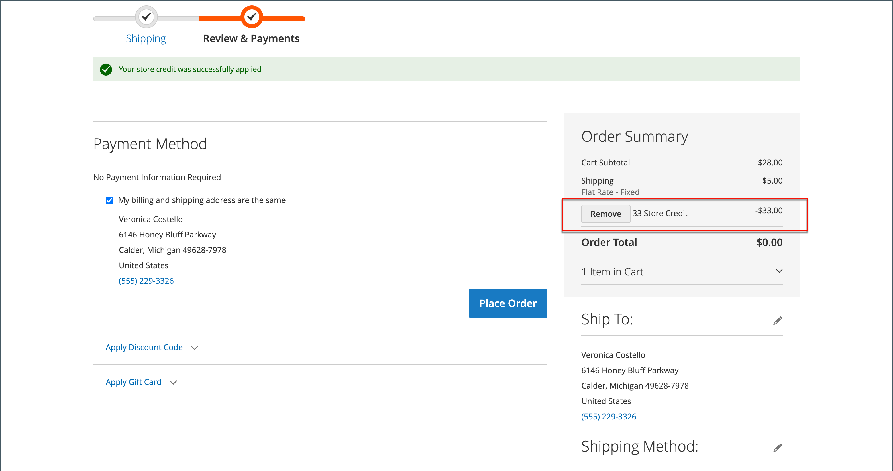

# ストアクレジットを適用

{{ee-feature}}

ストア管理者は、顧客アカウントからクレジット残高と履歴を表示し、ストアクレジットを購入に適用することもできます。

{width="600" zoomable="yes"}

## クレジット残高の表示

1. _管理者_ サイドバーで、**[!UICONTROL Customers]** > **[!UICONTROL All Customers]**&#x200B;に移動します。

1. グリッド内の顧客を検索します。

1. _アクション_&#x200B;列で、**[!UICONTROL Edit]**&#x200B;をクリックします。

1. _[!UICONTROL Customer View]_&#x200B;ページをスクロールし、下部の&#x200B;**[!UICONTROL Store Credit Balance]**&#x200B;を表示します。

{width="600" zoomable="yes"}

## ストアのクレジット残高の更新

1. _管理者_ サイドバーで、**[!UICONTROL Customers]** > _操作_ > **[!UICONTROL All Customers]**&#x200B;に移動します。

1. グリッド内の顧客を検索します。

1. _アクション_&#x200B;列で、**[!UICONTROL Edit]**&#x200B;をクリックします。

1. 左側のパネルで、**[!UICONTROL Store Credit]**&#x200B;を選択します。

1. 残高に関連付けるweb サイト（ストアフロント）を選択します。

1. **[!UICONTROL Update Balance]**&#x200B;に新しい値を入力します。

1. 残高の更新を顧客に通知するには、**[!UICONTROL Notify Customer by Email]** チェックボックスを選択し、**[!UICONTROL Send Email Notification From the Following Store View]**&#x200B;からストアビューを選択します。

1. 変更について&#x200B;**[!UICONTROL Comment]**&#x200B;を入力してください。

1. 更新が完了したら、**[!UICONTROL Save and Continue Edit]**&#x200B;または&#x200B;**[!UICONTROL Save Customer]**&#x200B;をクリックします。

更新された残高は&#x200B;**[!UICONTROL Balance History]**&#x200B;に表示されます。

## ストア管理者として注文にクレジット残高を適用する

ストア管理者は、注文の送信など、顧客に代わって様々な操作を行うことができます。 [注文を作成](../stores-purchase/customer-account-create-order.md)する場合、お客様が支払うべきストアクレジット残高を適用できます。 使用可能な残高は、_支払いと配送情報_ セクションに表示されます。 残高を適用するには、**[!UICONTROL Use Store Credit]** チェックボックスを選択します。注文合計が少ない場合は、残高の一部を適用します。

{width="500" zoomable="yes"}

## チェックアウト時にストアクレジットを適用する

サイトにクレジット残高がある場合、顧客はストアフロントで注文する前に、注文残高にストアクレジットを適用できます。

1. 顧客は、利用可能なストアクレジットの金額を表示します。

   _確認と支払い_&#x200B;の手順では、使用可能な金額は&#x200B;_[!UICONTROL Store Credit]_&#x200B;の下に表示されます。

1. 金額を注文に適用するには、**[!UICONTROL Use Store Credit]**&#x200B;をクリックします。

   >[!INFO]
   >
   >注文合計が再計算され、適用される店舗クレジットの金額が&#x200B;_[!UICONTROL Order Summary]_&#x200B;に表示されます。

   {width="700" zoomable="yes"}

1. 準備ができたら、**[!UICONTROL Place Order]**&#x200B;をクリックします。
