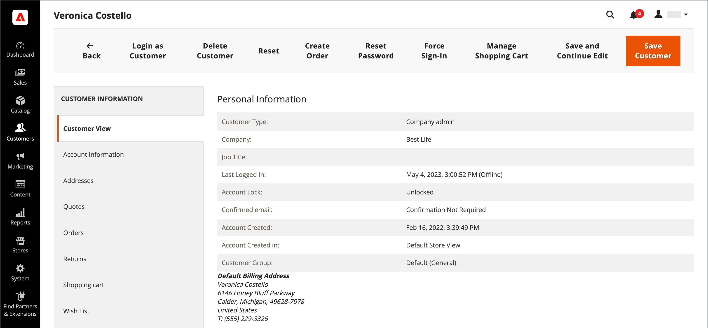
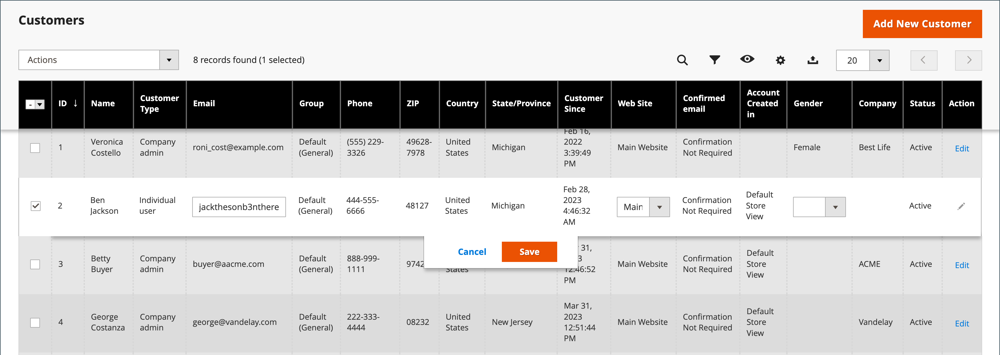

# 顧客プロファイルの更新

_[!UICONTROL Customer Information]_ページの左側のパネルには、顧客のアクティビティ、住所、注文統計、最近の注文、ショッピングカートの内容、製品レビュー、ニュースレターの購読に関する情報が含まれています。

{width="700" zoomable="yes"}

## 顧客アカウントの編集

方法1: **_クイック編集_**

1. 最初の列で、編集する顧客アカウントのチェックボックスを選択します。

1. **[!UICONTROL Actions]**&#x200B;列を`Edit`に設定します。

   >[!INFO]
   >
   >更新できる各値の値は、テキストボックスに表示されます。 選択した顧客レコードの一部の値のみがグリッドから編集できます。

   {width="700" zoomable="yes"}

1. 必要に応じて、次のいずれかの値を更新します。

   * **[!UICONTROL Email]**
   * **[!UICONTROL Web Site]**
   * **[!UICONTROL Tax/VAT Number]**
   * **[!UICONTROL Gender]**

1. **[!UICONTROL Save]**&#x200B;をクリックします。

方法2: **_完全編集_**

1. グリッドで、編集する顧客レコードを見つけます。

1. 右端の&#x200B;_アクション_&#x200B;列で、**[!UICONTROL Edit]**&#x200B;をクリックします。

1. 会社情報に必要な変更を加えます。

   >[!INFO]
   >
   >詳しくは、[顧客プロファイルの更新](../customers/update-account.md)を参照してください。

1. 完了したら、**[!UICONTROL Save Customer]**&#x200B;をクリックします。

>[!INFO]
>
>保存前にすべての編集内容を元に戻す場合は、上部のボタンバーの「**[!UICONTROL Reset]**」をクリックして、最後に保存したバージョンに対するすべての変更を返します。

## ユーザー情報

### [!UICONTROL Customer View]

「_顧客像_」タブには、**[!UICONTROL Personal Information]**、**[!UICONTROL Reward Points Balance]**、**[!UICONTROL Store Credit Balance]**&#x200B;など、顧客に関する情報が一覧表示されます。

### [!UICONTROL Account Information]

「[ アカウント情報](../customers/account-dashboard-account-information.md)」タブには、お客様に関する詳細な情報が表示されます。管理者ユーザーは、個人情報、電子メール、リモートショッピング支援、生年月日、お客様をweb サイトまたは会社に添付できます。

### [!UICONTROL Addresses]

「[ アドレス ](../customers/account-dashboard-address-book.md)」タブには、顧客のデフォルトの請求先住所と配送先住所、および顧客が頻繁に使用する追加の住所が含まれています。

### [!UICONTROL Orders]

[Orders](../stores-purchase/orders.md) グリッドには、現在の顧客注文のリストが含まれており、管理者は進行状況を追跡できます。

### [!UICONTROL Returns]

{{ee-feature}}

「[返品](../stores-purchase/returns.md)」タブには、現在の返品済み顧客要求が一覧表示されます。

### [!UICONTROL Shopping cart]

「[ ショッピングカート ](../stores-purchase/cart.md)」タブには、現在カートに入っている商品が表示されますが、何らかの理由で購入が完了しませんでした。

### [!UICONTROL Wish List]

[欲しいものリスト ](../stores-purchase/wishlists.md)には、お客様が後でカートに転送できる商品のリストが表示されます。

### [!UICONTROL Gift Registry]

{{ee-feature}}

「[ ギフトレジストリ ](../merchandising-promotions/gift-registry-storefront.md)」セクションには、お客様の現在のギフトレジストリと関連するイベントが一覧表示されます。

### [!UICONTROL Store Credit]

{{ee-feature}}

「[ ストアクレジット ](../customers/store-credit.md)」タブには、顧客アカウントに復元された金額が表示されます。管理者はこの値を管理できます。

### [!UICONTROL Newsletter]

「[ ニュースレター](../merchandising-promotions/newsletters.md)」タブには、現在の顧客に送信されたすべてのメールが表示されます。

### [!UICONTROL Billing Agreements]

「[請求契約書](../stores-purchase/paypal-billing-agreements.md)」タブには、ストアとお客様との間のすべてのPayPal請求契約書が一覧表示されます。

### [!UICONTROL Product Reviews]

「[製品レビュー](../catalog/settings-advanced-product-reviews.md)」タブには、この顧客が送信したすべてのレビューが表示されます。

### [!UICONTROL Reward Points]

{{ee-feature}}

[報酬ポイント ](../merchandising-promotions/rewards-loyalty.md) セクションには、顧客の現在の報酬ポイント残高が表示されます。 管理者ユーザーは、この値を管理できます。

## ボタンバー

| ボタン | 説明 |
|----------|--------------|
| **[!UICONTROL Back]** | 変更を保存せずに顧客ページに戻ります。 |
| **[!UICONTROL Login as Customer]** | 販売者が顧客としてログインできるようにします。 |
| **[!UICONTROL Delete Customer]** | 顧客アカウントを削除します。 |
| **[!UICONTROL Reset]** | 顧客フォームの未保存の変更を以前の値にリセットします。 |
| **[!UICONTROL Create Order]** | [顧客アカウントに関連付けられた注文](../stores-purchase/customer-account-create-order.md)を作成します。 |
| **[!UICONTROL Reset Password]** | お客様のパスワードをリセットします。 |
| **[!UICONTROL Force Sign-In]** | お客様のパスワードに関連付けられているトークンをクリアし、管理者にアカウントへのアクセス権を付与します。 |
| **[!UICONTROL Manage Shopping Cart]** | 顧客のショッピングカートへのアクセスを提供します。 |
| **[!UICONTROL Save and Continue Edit]** | 変更を保存し、顧客アカウントをオープンな状態に保ちます。 |
| **[!UICONTROL Save Customer]** | 変更を保存し、顧客アカウントを閉じます。 |

{style="table-layout:auto"}
