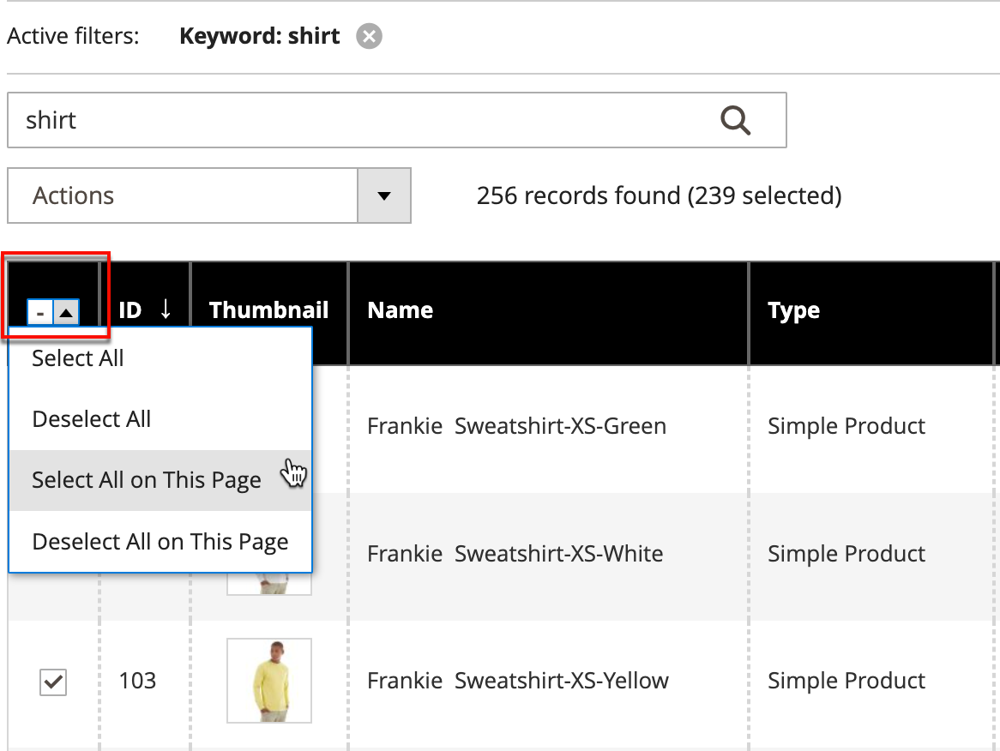

# アクション制御

グリッド内のレコードのコレクションを操作する場合、操作コントロールを使用して 1 つまたは複数のレコードに操作を適用できます。 アクション コントロールには、特定のタイプのデータで使用可能な各操作が一覧表示されます。 例えば、アクション コントロールを使用して、選択した製品の属性を更新し、ステータスを次の値から変更できます `Disabled` 対象： `Enabled`または、データベースからレコードを削除します。

必要な数の変更を行ってから、1 回の手順でレコードを更新できます。 製品ごとに個別に設定を変更するよりも効率的です。 レコードのバッチに編集を適用する操作は非同期操作であり、バックグラウンドで実行されるので、操作が完了するのを待たずに管理者で作業を続行できます。 タスクが完了すると、メッセージが表示されます。

使用可能なアクションの選択はリストによって異なり、選択したアクションによっては、追加のオプションが表示される場合があります。 例えば、レコードのグループのステータスを変更する場合、 _[!UICONTROL Status]_ボックスがアクション コントロールの横に表示され、オプションが追加されます。

## 手順 1：レコードの選択

リストの最初の列のチェックボックスは、アクションのターゲットである各レコードを識別します。 この [フィルターコントロール](admin-grid-controls.md) アクションのターゲットとするレコードにリストを絞り込むために使用できます。

1. 必要に応じて、各列の上部にあるフィルターを設定して、含めるレコードのみを表示します。

1. アクションのターゲットである各レコードのチェックボックスを選択するか、列セレクターを使用して一括選択を選択します。

{width="500"}

## 手順 2：選択したレコードへのアクションの適用

1. を **[!UICONTROL Actions]** 適用する操作を制御します。

   **_例：_** 属性を更新

   - リストで、更新する各レコードのチェックボックスを選択します。

   - を **[!UICONTROL Actions]** コントロール先 `Update Attributes`.

     {width="450"}

   - クリック **[!UICONTROL Submit]**.

     属性を更新ページには、使用可能なすべての属性がグループ別に左側のパネルに一覧表示されます。

     {width="700" zoomable="yes"}

   - 「」を選択します **[!UICONTROL Change]** 各属性の横にあるチェックボックスをオンにして、必要な変更を行います。

   - クリック **[!UICONTROL Save]** 選択したレコードのグループの属性を更新します。

1. 完了したら、 **[!UICONTROL Submit]**.

## チェックボックスアクション

| アクション | 説明 |
|--- |--- |
| [!UICONTROL Select All] | リストのすべてのレコードのチェックボックスを選択します。 |
| [!UICONTROL Unselect All] | リスト内のすべてのレコードのチェックボックスをクリアします。 |
| [!UICONTROL Select All on This Page] | 現在のページに表示されるレコードのチェックボックスを選択します。 |
| [!UICONTROL Deselect All on This Page] | 現在のページに表示されているレコードのチェックボックスをクリアします。 |

{style="table-layout:auto"}
