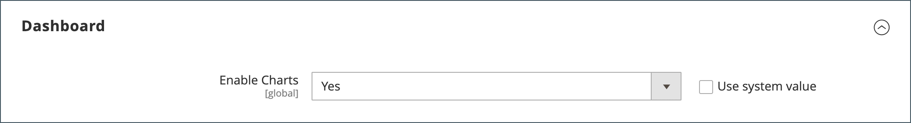

# 管理ダッシュボード

ダッシュボードは、通常、_管理者_ にログインしたときに表示される最初のページであり、販売と顧客アクティビティの概要をリアルタイムで提供できます。 ダッシュボードデータは、ライフタイム販売、平均注文額、最近の注文、検索語句のスナップショットを提供します。 グラフには、選択した日付範囲の完了済み注文と金額が表示され、動的、リアルタイム データ、または過去の集計データから生成できます。 下部のタブには、最も売れた製品、最も多く閲覧された製品、新規顧客、最も多く購入した顧客のクイックレポートが表示されます。

処理するデータが大量にある場合は、パフォーマンスを向上させるためにグラフをオフにできます。 次の例のダッシュボードは、リアルタイムデータを使用するように設定されており、過去 24 時間の完了済み注文を時間別に表示します。 グラフは、完了した注文ごとに更新されます。

{zoomable="yes"}

[ 詳細レポート ](business-intelligence.md#advanced-reporting) 製品、注文、顧客のデータに基づいてパーソナライズされたダッシュボードを表示します。

{zoomable="yes"}

## ダッシュボードの設定

1. _管理者_ サイドバーで、**[!UICONTROL Stores]**/_[!UICONTROL Settings]_/**[!UICONTROL Configuration]**&#x200B;に移動し、次のいずれかの設定を行います。

1. 設定が完了したら、「**[!UICONTROL Save Config]**」をクリックします。

1. 変更を保存したら、「**[!UICONTROL Cache Management]**」をクリックして、無効なキャッシュをすべて更新します。

### グラフを有効にする

処理するデータが大量にある場合は、パフォーマンスを向上させるためにグラフの表示をオフにできます。 有効になっていない場合は、グラフの代わりに「データが見つかりません」というメッセージが表示されますが、下の概要合計は引き続き生成されます。

1. 左側のナビゲーションパネルの **[!UICONTROL Advanced]** の下で、「**[!UICONTROL Admin]**」を選択します。

1. 必要に応じて、「**[!UICONTROL Dashboard]**」セクションを展開します。

   {width="600"}

1. デフォルト値を変更するには、「**[!UICONTROL Use system value]**」チェックボックスをオフにします。

1. **グラフを有効にする** を `Yes` に設定します。

Admin Configuration オプションについては、[Configuration Reference Guide](../configuration-reference/advanced/admin.md) を参照してください。

### スタートアップページの変更

ダッシュボードは管理者のデフォルトの [ 起動ページ ](../configuration-reference/advanced/admin.md) ですが、別の起動ページを設定することもできます。

1. 管理設定オプションを開いていない場合は、左側のナビゲーションパネルの _[!UICONTROL Advanced]_&#x200B;の下にある&#x200B;**[!UICONTROL Admin]**&#x200B;を選択します。

1. **スタートアップページ** セクションをクリックして展開します。

   {width="600"}

1. **[!UICONTROL Use system value]** チェックボックスをオフにして、管理者にログインしたときに表示される **スタートアップページ** を選択します。

### 開始日を選択

1. **[!UICONTROL General]** の下の左側のナビゲーションパネルで、「**レポート**」を選択します。

1. ページで、「**[!UICONTROL Dashboard]**」セクションを展開します。

1. 日付設定の **[!UICONTROL Use system value]** のチェックボックスをオフにして、次の手順を実行します。

   - **年累計開始日** を **月** および **日** に設定します。

   - **今月の開始日** を **日** に設定します。

   {width="600"}

[!UICONTROL Reports] 設定オプションについて詳しくは、[_設定リファレンスガイド_](../configuration-reference/general/reports.md) を参照してください。

### データソースの設定

ダッシュボードグラフは、リアルタイムで生成することも、履歴の集計データを使用して生成することもできます。 パフォーマンスに問題がある場合は、集計データを使用して処理を高速化できます。

1. 左側のナビゲーションパネルで、「**Sales**」をクリックして展開し、その下の「**Sales**」を選択します。

1. ページで、「**[!UICONTROL Dashboard]**」セクションを展開します。

   {width="600"}

1. 「**[!UICONTROL Use system value]**」チェックボックスをオフにして、**[!UICONTROL Use Aggregated Data]** を次のいずれかに設定します。

   - 履歴データと集計データには、「`Yes`」を選択します。
   - リアルタイムデータの場合は、「`No`」を選択します。

## グラフセクション

| セクション | 説明 |
|--- |--- |
| [!UICONTROL Orders] | このタブには、現在の店舗表示と指定した期間について、完了したすべての注文のリアルタイムグラフが表示されます。 |
| [!UICONTROL Amounts] | このタブには、現在の店舗表示と指定した期間について、完了したすべての注文金額のリアルタイムグラフが表示されます。 |
| [!UICONTROL Time Range] | 以下のグラフおよび概要の合計で表されるデータを決定します。 オプション：`Last 7 Days`/`Current Month`/`YTD`/`2YTD` |
| [!UICONTROL Summary Totals] | グラフの下の収益、税、出荷、数量の合計は、グラフのデータと現在の時間範囲設定に基づいています。 |

{style="table-layout:auto"}

## スナップショットデータ

| セクション | 説明 |
|--- |--- |
| [!UICONTROL Lifetime Sales] | 店舗の有効期間中の集計総売上高。 |
| [!UICONTROL Average Order] | ストアの有効期間中の平均注文額。 |
| [!UICONTROL Last Orders] | 最後に行われた 5 件の注文の概要。 |
| [!UICONTROL Last Search Terms] | 最後の 5 つの検索語句。 |
| [!UICONTROL Top Search Terms] | 最もよく使用される 5 つの検索用語。 |

{style="table-layout:auto"}

## 「レポート」タブ

| セクション | 説明 |
|--- |--- |
| [!UICONTROL Bestsellers] | 指定された期間内に最も売れた 5 つの製品。 |
| [!UICONTROL Most Viewed Products] | その期間に閲覧された商品が最も多かったのは、5 つの商品です。 |
| [!UICONTROL New Customers] | 指定した期間にアカウントに登録した最新の 5 人の顧客。 |
| [!UICONTROL Customers] | 指定した期間内に処理を完了した注文の最後の 5 人の顧客。 |

{style="table-layout:auto"}

## ダッシュボードボタン

| ボタン | 説明 |
|--- |--- |
| [!UICONTROL Reload Data] | ダッシュボードデータを更新します。 |
| [!UICONTROL Go to Advanced Reporting] | 製品、注文および顧客データに基づいて、動的グラフおよびレポートのパーソナライズされたダッシュボードを表示します。 詳細な分析については、[ 詳細レポート ](business-intelligence.md#advanced-reporting) を参照してください。 |

{style="table-layout:auto"}
