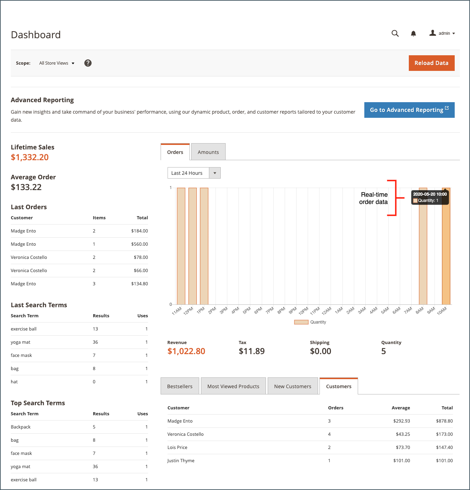
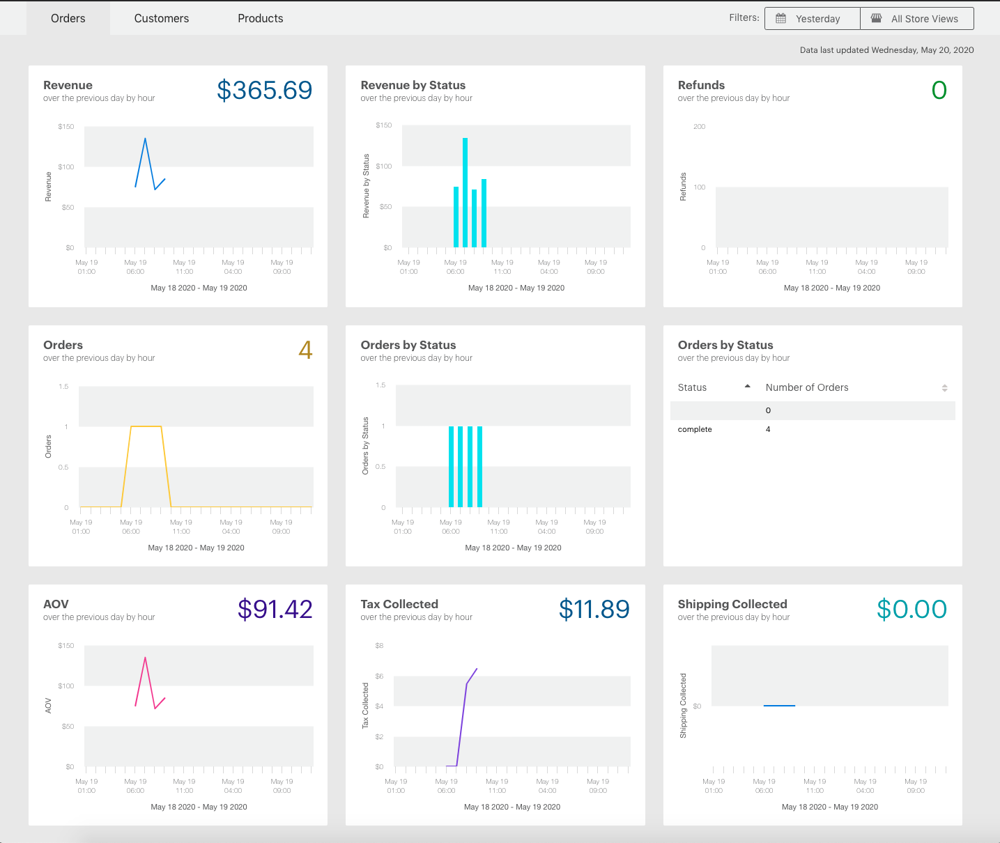
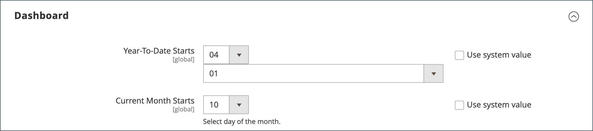

# 管理者ダッシュボード

ダッシュボードは通常、_管理者_&#x200B;にログインしたときに最初に表示されるページで、営業活動と顧客活動の概要をリアルタイムで提供できます。 ダッシュボードデータには、生涯売上、平均注文額、最近の注文、検索語のスナップショットが表示されます。 チャートには、選択した日付範囲の完了した注文と金額が表示され、動的データ、リアルタイムデータ、または過去の集計データから生成できます。 下部のタブには、ベストセラー商品、最も閲覧された商品、新規顧客、最も多く購入した顧客などのクイックレポートが表示されます。

処理するデータの量が多い場合は、グラフをオフにしてパフォーマンスを向上させることができます。 次の例のダッシュボードは、リアルタイムデータを使用するように設定されており、過去24時間の時間ごとに完了した注文を表示します。 完了した注文ごとにチャートが更新されます。

{zoomable="yes"}

[詳細レポート &#x200B;](business-intelligence.md#advanced-reporting)には、商品、注文、顧客データに基づいて、パーソナライズされたダッシュボードが表示されます。

{zoomable="yes"}

## ダッシュボードの設定

1. _管理者_ サイドバーで、**[!UICONTROL Stores]** > _[!UICONTROL Settings]_>**[!UICONTROL Configuration]**&#x200B;に移動し、次のいずれかの設定を完了します。

1. 設定が完了したら、**[!UICONTROL Save Config]**&#x200B;をクリックします。

1. 変更を保存したら、**[!UICONTROL Cache Management]**&#x200B;をクリックし、無効なすべてのキャッシュを更新します。

### グラフを有効にする

処理するデータ量が多い場合は、グラフの表示をオフにしてパフォーマンスを向上させることができます。 有効になっていない場合は、「データが見つかりません」というメッセージがグラフの代わりに表示されますが、以下の要約の合計は引き続き生成されます。

1. **[!UICONTROL Advanced]**&#x200B;の下の左側のナビゲーションパネルで、**[!UICONTROL Admin]**&#x200B;を選択します。

1. 必要に応じて、**[!UICONTROL Dashboard]** セクションを展開します。

   {width="600"}

1. デフォルト値を変更するには、**[!UICONTROL Use system value]** チェックボックスをオフにします。

1. **チャートを有効にする**&#x200B;を`Yes`に設定します。

管理者設定オプションについて詳しくは、[設定リファレンスガイド &#x200B;](../configuration-reference/advanced/admin.md)を参照してください。

### スタートアップページの変更

ダッシュボードは、管理者のデフォルトの[&#x200B; スタートアップページ &#x200B;](../configuration-reference/advanced/admin.md)ですが、別のスタートアップページを設定できます。

1. 管理者設定オプションをまだ開いていない場合は、左側のナビゲーションパネルの&#x200B;_[!UICONTROL Advanced]_&#x200B;で「**[!UICONTROL Admin]**」を選択します。

1. クリックして、**スタートアップページ** セクションを展開します。

   {width="600"}

1. **[!UICONTROL Use system value]** チェックボックスをオフにして、管理者にログインしたときに表示する&#x200B;**スタートアップ ページ**&#x200B;を選択します。

### 開始日の選択

1. **[!UICONTROL General]**&#x200B;の下の左側のナビゲーションパネルで、**レポート**&#x200B;を選択します。

1. ページで、**[!UICONTROL Dashboard]** セクションを展開します。

1. 日付設定の&#x200B;**[!UICONTROL Use system value]** チェックボックスをオフにして、次の操作を行います。

   - **年から日付までの開始**&#x200B;を&#x200B;**か月**&#x200B;と&#x200B;**日**&#x200B;に設定します。

   - **今月の開始日**&#x200B;を&#x200B;**日**&#x200B;に設定します。

   {width="600"}

[!UICONTROL Reports]設定オプションについて詳しくは、[_設定リファレンスガイド_](../configuration-reference/general/reports.md)&#x200B;を参照してください。

### データソースの設定

ダッシュボードチャートは、リアルタイムで生成することも、過去のデータを集計して生成することもできます。 パフォーマンスに問題がある場合は、集約データを利用することで、処理を迅速化できます。

1. 左側のナビゲーションパネルで、クリックして&#x200B;**Sales**&#x200B;を展開し、下の&#x200B;**Sales**&#x200B;を選択します。

1. ページで、**[!UICONTROL Dashboard]** セクションを展開します。

   {width="600"}

1. **[!UICONTROL Use system value]** チェックボックスをオフにして、**[!UICONTROL Use Aggregated Data]**&#x200B;を次のいずれかに設定します。

   - 過去の集計データの場合は、`Yes`を選択します。
   - リアルタイムデータの場合は、`No`を選択します。

## チャートセクション

| セクション | 説明 |
|--- |--- |
| [!UICONTROL Orders] | このタブには、現在のストアビューと指定した期間に完了したすべての注文のリアルタイムチャートが表示されます。 |
| [!UICONTROL Amounts] | このタブには、現在のストアビューと指定した期間に完了したすべての注文金額のリアルタイムチャートが表示されます。 |
| [!UICONTROL Time Range] | グラフに表示されるデータと、以下の集計の概要を指定します。 オプション：`Last 7 Days` / `Current Month` / `YTD` / `2YTD` |
| [!UICONTROL Summary Totals] | チャートの下の収益、税金、送料、数量の合計は、チャートデータと現在の時間範囲設定に基づいています。 |

{style="table-layout:auto"}

## スナップショットデータ

| セクション | 説明 |
|--- |--- |
| [!UICONTROL Lifetime Sales] | ストアの期間中の総売上。 |
| [!UICONTROL Average Order] | ストアの期間中の平均注文金額。 |
| [!UICONTROL Last Orders] | 過去5回の注文の概要。 |
| [!UICONTROL Last Search Terms] | 最後の5つの検索語。 |
| [!UICONTROL Top Search Terms] | 最もよく使用される5つの検索語。 |

{style="table-layout:auto"}

## レポートタブ

| セクション | 説明 |
|--- |--- |
| [!UICONTROL Bestsellers] | 特定の期間中に最も売れた5つの商品。 |
| [!UICONTROL Most Viewed Products] | 5つの製品は、指定された期間中に最も閲覧されました。 |
| [!UICONTROL New Customers] | 指定した期間内にアカウントに登録した最新の5人の顧客。 |
| [!UICONTROL Customers] | 指定した期間内に処理を完了した注文を持つ最後の5人の顧客。 |

{style="table-layout:auto"}

## ダッシュボードボタン

| ボタン | 説明 |
|--- |--- |
| [!UICONTROL Reload Data] | ダッシュボードデータを更新します。 |
| [!UICONTROL Go to Advanced Reporting] | 製品、注文、顧客データにもとづいた、動的なチャートとレポートのパーソナライズされたダッシュボードを表示します。 詳細な分析については、[高度なレポート &#x200B;](business-intelligence.md#advanced-reporting)を参照してください。 |

{style="table-layout:auto"}
