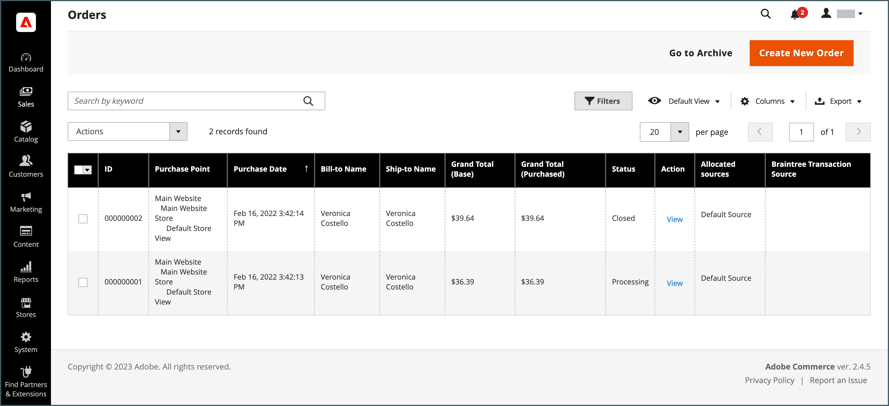
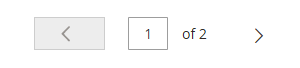

# 管理者グリッドコントロール

データを管理する管理ページでは、グリッドにレコードのコレクションが表示されます。 各列の上部にあるコントロールを使用して、データを並べ替えることができます。 現在の並べ替え順序は、列ヘッダーの昇順または降順の矢印で示されます。 グリッドに表示する列を指定し、それらを別の位置にドラッグできます。 後で使用できるビューとして、別の列の配置を保存することもできます。 **[!UICONTROL Action]**&#x200B;列には、個々のレコードに適用できる操作が一覧表示されます。 さらに、ほとんどのグリッドの現在のビューからの日付は、[CSV](../systems/data-csv.md)またはXML ファイルに書き出すことができます。

{width="700" zoomable="yes"}

## リストの並べ替え

1. 任意の列ヘッダーをクリックします。

   矢印は、現在の順序を昇順または降順で示します。

1. ページネーション コントロールを使用して、コレクション内の追加のページを表示します。

   {width="300"}

## リストのページネーション

1. **[!UICONTROL Pagination]** コントロールを、ページごとに表示するレコードの数に設定します。

1. 「**[!UICONTROL Next]**」と「**[!UICONTROL Previous]**」をクリックしてリストを閲覧するか、特定の「**[!UICONTROL Page Number]**」を入力します。

## リストをフィルター

1. **[!UICONTROL Filters]**&#x200B;をクリックします。

1. 検索するレコードを記述するために、必要な数のフィルターを実行します。

1. **[!UICONTROL Apply Filters]**&#x200B;をクリックします。

   {width="700" zoomable="yes"}

## データの書き出し

1. 書き出すレコードを選択します。

   >[!NOTE]
   >
   >商品データをグリッドから書き出すことはできません。 詳しくは、[書き出し](../systems/data-export.md)を参照してください。

1. 右上隅の&#x200B;_書き出し_ （）メニューで、次のいずれかのファイル形式を選択します。

   - `CSV`
   - `Excel XML`

   {width="700" zoomable="yes"}

1. **[!UICONTROL Export]**&#x200B;をクリックします。

1. 書き出されたデータのダウンロード済みファイルを、ブラウザーがダウンロードに使用する場所で探します。

## グリッドレイアウト

グリッド内の列とその順序の選択は、好みに応じて変更し、_ビュー_&#x200B;として保存できます。 グリッドに表示する属性は、個々の属性設定で制御できます。 プロダクトグリッドに多くの属性が表示されると、管理者の読み込み時間とパフォーマンスに影響する場合があります。

{width="700" zoomable="yes"}

### 列の選択範囲を変更する

1. 右上隅で、_列_ （） コントロールをクリックします。

1. 列の選択を変更します。

   - グリッドに追加する任意の列のチェックボックスをオンにします。
   - グリッドから削除する列のチェックボックスをオフにします。
   - 既定のグリッド ビューを返すには、**[!UICONTROL Reset]**&#x200B;をクリックします。

利用可能なすべての列を表示するには、必ず下にスクロールします。

### 列の移動

1. 列のヘッダーをクリックして保持します。

1. 列を新しい位置にドラッグして解除します。

### グリッドビューを保存

1. _表示_ （） コントロールをクリックします。

1. **[!UICONTROL Save Current View]**&#x200B;をクリックします。

1. ビューの&#x200B;**[!UICONTROL name]**&#x200B;を入力します。

1. すべての変更を保存するには、_矢印_ （）をクリックします。

   ビューの名前が現在のビューとして表示されます。

### グリッド表示の変更

1. _表示_ （） コントロールをクリックします。

1. 次のいずれかの操作を行います。

   - 別のビューを使用するには、ビューの名前をクリックします。
   - ビューの名前を変更するには、_編集_ （）アイコンをクリックし、名前を更新します。
   - ビューを削除するには、_編集_ （）アイコンをクリックし、_削除_ （）アイコンをクリックします。
