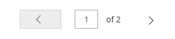

# 管理グリッドコントロール

データを管理する管理ページには、グリッド内のレコードのコレクションが表示されます。 各列の上部にあるコントロールを使用して、データを並べ替えることができます。 現在の並べ替え順は、列ヘッダー内の昇順または降順の矢印で示されます。 グリッドに表示する列を指定し、異なる位置にドラッグできます。 異なる列の配置をビューとして保存し、後で使用することもできます。 The **[!UICONTROL Action]** 列には、個々のレコードに適用できる操作が一覧表示されます。 また、ほとんどのグリッドの現在のビューの日付を [CSV](../systems/data-csv.md) または XML ファイル。

{width="700" zoomable="yes"}

## リストの並べ替え

1. 任意の列ヘッダーをクリックします。

   矢印は、現在の順序を昇順または降順に示します。

1. コレクション内の追加のページを表示するには、ページネーションコントロールを使用します。

   {width="300"}

## リストをページ番号付け

1. を設定します。 **[!UICONTROL Pagination]** コントロールを使用して、1 ページに表示するレコードの数を指定できます。

1. クリック **[!UICONTROL Next]** および **[!UICONTROL Previous]** をクリックしてリスト内を移動するか、特定の **[!UICONTROL Page Number]**.

## リストをフィルター

1. クリック **[!UICONTROL Filters]**.

1. 検索するレコードを記述するために必要な数のフィルターを設定します。

1. クリック **[!UICONTROL Apply Filters]**.

   {width="700" zoomable="yes"}

## データを書き出し

1. エクスポートするレコードを選択します。

   >[!NOTE]
   >
   >製品データをグリッドから書き出すことはできません。 詳しくは、 [書き出し](../systems/data-export.md).

1. 次の日： _書き出し_ () メニューを使用して、次のファイル形式のいずれかを選択します。

   - `CSV`
   - `Excel XML`

   {width="700" zoomable="yes"}

1. クリック **[!UICONTROL Export]**.

1. ブラウザーによるダウンロードで使用された場所で、書き出されたデータのダウンロードされたファイルを探します。

## グリッドレイアウト

グリッド内の列の選択と順序は、好みに応じて変更でき、 _表示_. 個々の属性設定の下でグリッドに表示する属性を制御できます。 製品グリッドに多くの属性を表示すると、管理者の読み込み時間とパフォーマンスに影響を与える可能性があります。

{width="700" zoomable="yes"}

### 列の選択を変更

1. 右上隅で、 _列_ () コントロールを使用します。

1. 列の選択を変更します。

   - グリッドに追加する列のチェックボックスをオンにします。
   - グリッドから削除する列のチェックボックスをオフにします。
   - 既定のグリッドビューに戻すには、 **[!UICONTROL Reset]**.

必ず下にスクロールして、使用可能な列をすべて表示します。

### 列の移動

1. 列のヘッダーをクリックして保持します。

1. 列を新しい位置にドラッグし、離します。

### グリッドビューを保存する

1. 次をクリック： _表示_ () コントロールを使用します。

1. クリック **[!UICONTROL Save Current View]**.

1. を入力します。 **[!UICONTROL name]** ビューの。

1. すべての変更を保存するには、 _矢印_ () をクリックします。

   ビューの名前が現在のビューとして表示されます。

### グリッドビューを変更する

1. 次をクリック： _表示_ () コントロールを使用します。

1. 次のいずれかの操作を行います。

   - 別のビューを使用するには、ビューの名前をクリックします。
   - ビューの名前を変更するには、 _編集_ () アイコンをクリックし、名前を更新します。
   - ビューを削除するには、 _編集_ () アイコンをクリックし、 _削除_ () アイコンをクリックします。
