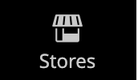

# 管理者サイドバー

左側のサイドバーは、ストア _管理者_&#x200B;のメインメニューで、デスクトップとモバイルデバイスの両方に対応しています。 フライアウトメニューでは、毎日ストアを管理するために使用するすべてのツールにアクセスできます。

| メニューアイコン | リンク | 説明 |
| --------- | ---- | ----------- |
|  | **[管理者起動ページ](../configuration-reference/advanced/admin.md)** | デフォルトでダッシュボードとなる管理者起動ページを表示します。 |
|  | **[[!UICONTROL Dashboard]](admin-dashboard.md)** | ダッシュボードには、ストアでの販売と顧客のアクティビティの概要が表示されます。通常、管理者にログインすると最初に表示されるページです。 |
|  | **[[!UICONTROL Sales]](../stores-purchase/sales-menu.md)** | [!UICONTROL Sales] メニューには、注文、請求書、出荷、クレジットメモ、トランザクションの処理に関連するあらゆる情報が表示されます。 |
|  | **[[!UICONTROL Catalog]](../catalog/catalog-menu.md)** | [!UICONTROL Catalog] メニューは、製品の作成とカテゴリの定義に使用されます。 |
|  | **[[!UICONTROL Customers]](../customers/customers-introduction.md)** | [!UICONTROL Customers] メニューでは、顧客アカウントを管理し、現在オンラインになっている顧客を確認できます。 |
|  | **[[!UICONTROL Marketing]](../merchandising-promotions/marketing-menu.md)** | [!UICONTROL Marketing] メニューでは、カタログと買い物かごの価格ルールとクーポンを設定できます。 価格ルール特定の条件が満たされた場合のトリガーアクション。 |
|  | **[[!UICONTROL Content]](../content-design/content-menu.md)** | [!UICONTROL Content] メニューは、ストアのコンテンツ要素とデザインを管理する場所です。 ページ、ブロック、フロントエンドアプリの作成およびストアのプレゼンテーションの管理方法について説明します。 |
|  | **[[!UICONTROL Reports]](reports-menu.md)** | [!BADGE PaaSのみ]{type=Informative url="https://experienceleague.adobe.com/en/docs/commerce/user-guides/product-solutions" tooltip="Adobe Commerce on Cloud プロジェクト（Adobeで管理されるPaaS インフラストラクチャ）とオンプレミス プロジェクトにのみ適用されます。"} [!UICONTROL Reports] メニューには、売上、ショッピングカート、商品、お客様、タグ、レビュー、検索キーワード、[&#x200B; サイト全体の分析ツール &#x200B;](https://experienceleague.adobe.com/en/docs/commerce-operations/tools/site-wide-analysis-tool/intro)からの24時間年中無休のリアルタイムパフォーマンスモニタリングとレコメンデーションなど、ストアのあらゆる側面に関するinsightを提供する幅広いレポートが用意されています。 |
|  | **[[!UICONTROL Stores]](../stores-purchase/stores-menu.md)** | [!UICONTROL Stores] メニューには、マルチサイトのインストール設定、税金、通貨、製品属性、顧客グループなど、ストアのあらゆる側面を設定および管理するためのツールが含まれています。 |
|  | **[[!UICONTROL System]](../systems/system-menu.md)** | [!UICONTROL System] メニューには、システム操作の管理、拡張機能のインストール、他のアプリケーションとの統合のためのweb サービスの管理ツールが含まれています。 |
|  | **[[!UICONTROL Find Partners & Extensions]](commerce-marketplace.md)** | [!BADGE PaaSのみ]{type=Informative url="https://experienceleague.adobe.com/en/docs/commerce/user-guides/product-solutions" tooltip="Adobe Commerce on Cloud プロジェクト（Adobeで管理されるPaaS インフラストラクチャ）とオンプレミス プロジェクトにのみ適用されます。"} [!DNL Commerce Marketplace]は、お客様のストアのAdobe CommerceおよびMagento Open Source ソリューションを検索できる場所です。 |

{style="table-layout:auto"}
