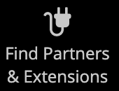

# 管理者サイドバー

左側のサイドバーは、ストアのメインメニューです _Admin_ およびは、デスクトップとモバイルデバイスの両方に対応するように設計されています。 フライアウトメニューを使用すると、ストアを毎日管理するために使用するすべてのツールにアクセスできます。

| メニューアイコン | リンク | 説明 |
| --------- | ---- | ----------- |
|  | **[管理スタートアップページ](../configuration-reference/advanced/admin.md)** | 管理者の起動ページが表示されます。このページはデフォルトでダッシュボードになっています。 |
|  | **[[!UICONTROL Dashboard]](admin-dashboard.md)** | ダッシュボードには、ストアでの販売と顧客のアクティビティの概要がすばやく表示されます。通常は、管理者にログインしたときに最初に表示されるページです。 |
|  | **[[!UICONTROL Sales]](../stores-purchase/sales-menu.md)** | この [!UICONTROL Sales] メニューでは、受注、請求書、出荷、クレジット・メモおよび取引の処理に関連するすべてを検索できます。 |
|  | **[[!UICONTROL Catalog]](../catalog/catalog-menu.md)** | この [!UICONTROL Catalog] メニューは、製品の作成とカテゴリの定義に使用されます。 |
|  | **[[!UICONTROL Customers]](../customers/customers-introduction.md)** | この [!UICONTROL Customers] メニューでは、顧客アカウントを管理し、現在オンラインになっている顧客を確認できます。 |
|  | **[[!UICONTROL Marketing]](../merchandising-promotions/marketing-menu.md)** | この [!UICONTROL Marketing] メニューは、カタログと買い物かごの価格ルールおよびクーポンを設定する場所です。 価格ルール一連の特定の条件が満たされた場合のトリガーアクション。 |
|  | **[[!UICONTROL Content]](../content-design/content-menu.md)** | この [!UICONTROL Content] メニューでは、ストアのコンテンツ要素とデザインを管理します。 ページ、ブロック、フロントエンドアプリを作成する方法、およびストアのプレゼンテーションを管理する方法について説明します。 |
|  | **[[!UICONTROL Reports]](reports-menu.md)** | この [!UICONTROL Reports] メニューには、販売、買い物かご、製品、顧客、タグ、レビュー、検索語句、24 時間 365 日のリアルタイムのパフォーマンス監視やレコメンデーションなど、ストアのあらゆる側面に関するインサイトを提供する様々なレポートが用意されています [サイト全体分析ツール](https://experienceleague.adobe.com/en/docs/commerce-operations/tools/site-wide-analysis-tool/intro). |
|  | **[[!UICONTROL Stores]](../stores-purchase/stores-menu.md)** | この [!UICONTROL Stores] メニューには、マルチサイトインストール設定、税金、通貨、製品属性、顧客グループなど、ストアのあらゆる側面を設定および管理するツールが含まれています。 |
|  | **[[!UICONTROL System]](../systems/system-menu.md)** | この [!UICONTROL System] メニューには、システム操作の管理、拡張機能のインストール、他のアプリケーションと統合するための web サービスの管理を行うためのツールが含まれています。 |
|  | **[[!UICONTROL Find Partners & Extensions]](commerce-marketplace.md)** | この [!DNL Commerce Marketplace] は、お客様のストアに適したAdobe CommerceおよびMagento Open Sourceのソリューションを見つける場所です。 |

{style="table-layout:auto"}
