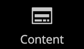

# 管理者のサイドバー

左側のサイドバーは、そのストアのメインメニューです _管理者_ およびは、デスクトップとモバイルデバイスの両方に対して設計されています。 フライアウトメニューを使用すると、ストアを毎日管理するために使用するすべてのツールにアクセスできます。

| メニューアイコン | リンク | 説明 |
| --------- | ---- | ----------- |
|  | **[[ 管理 ] [ 起動 ] ページ](../configuration-reference/advanced/admin.md)** | [ 管理 ] 起動ページが表示されます。これは、既定では [ ダッシュボード ] です。 |
|  | **[[!UICONTROL Dashboard]](admin-dashboard.md)** | ダッシュボードは、ストアの販売と顧客のアクティビティの概要をすばやく示し、通常は管理者にログインする際に表示される最初のページです。 |
|  | **[[!UICONTROL Sales]](../stores-purchase/sales-menu.md)** | The [!UICONTROL Sales] メニューでは、処理オーダー、請求書、出荷、クレジット・メモおよびトランザクションの処理に関連するすべての情報を確認できます。 |
|  | **[[!UICONTROL Catalog]](../catalog/catalog-menu.md)** | The [!UICONTROL Catalog] メニューは、製品の作成やカテゴリの定義に使用します。 |
|  | **[[!UICONTROL Customers]](../customers/customers-introduction.md)** | The [!UICONTROL Customers] メニューでは、顧客アカウントを管理し、どの顧客が現在オンラインになっているかを確認できます。 |
|  | **[[!UICONTROL Marketing]](../merchandising-promotions/marketing-menu.md)** | The [!UICONTROL Marketing] メニューは、カタログと買い物かごの価格ルールとクーポンを設定する場所です。 価格ルールトリガー：特定の条件のセットが満たされた場合のアクション。 |
|  | **[[!UICONTROL Content]](../content-design/content-menu.md)** | The [!UICONTROL Content] メニューでは、コンテンツ要素とストアのデザインを管理できます。 ページ、ブロック、フロントエンドアプリを作成し、ストアのプレゼンテーションを管理する方法について説明します。 |
|  | **[[!UICONTROL Reports]](reports-menu.md)** | The [!UICONTROL Reports] メニューでは、販売、買い物かご、製品、顧客、タグ、レビュー、検索語句など、店舗のあらゆる側面を把握できる様々なレポートを提供します。 |
|  | **[[!UICONTROL Stores]](../stores-purchase/stores-menu.md)** | The [!UICONTROL Stores] メニューには、マルチサイトインストール設定、税金、通貨、製品属性、顧客グループなど、ストアのあらゆる側面を設定および管理するツールが含まれています。 |
|  | **[[!UICONTROL System]](../systems/system-menu.md)** | The [!UICONTROL System] メニューには、システム操作の管理、拡張機能のインストール、他のアプリケーションとの統合のための web サービスの管理をおこなうツールが含まれています。 |
|  | **[[!UICONTROL Find Partners & Extensions]](commerce-marketplace.md)** | The [!DNL Commerce Marketplace] は、お客様のストアのAdobe CommerceおよびMagento Open Sourceソリューションを検索できる場所です。 |

{style="table-layout:auto"}
