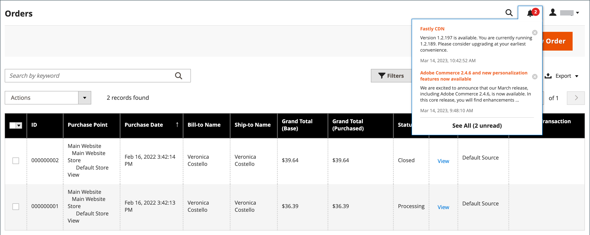
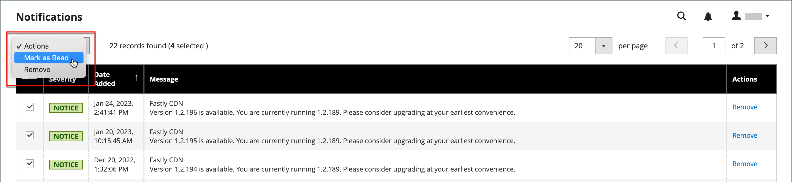

# 管理メッセージの受信トレイ

ストアは、Adobeから定期的にメッセージを受け取ります。 メッセージは重要度によって評価され、システムのアップデート、パッチ、新しいリリース、スケジュールされたメンテナンス、または今後のイベントを指す場合があります。 ヘッダーのベルアイコンは、受信トレイ内の未読メッセージの数を示します。

{width="700" zoomable="yes"}

_[!UICONTROL Notifications]_&#x200B;ページには、日付でランク付けされたすべてのメッセージが一覧表示されます。_[!UICONTROL Action]_ コマンドを使用すると、個々のメッセージを読み取り済みとしてマークしたり、詳細情報を表示したり、受信トレイからメッセージを削除したりできます。

設定によって、受信トレイの更新頻度とメッセージの配信方法が決まります。 ストア管理者が安全なURLを持っている場合、通知はHTTPS経由で配信する必要があります。

## 新しい受信メッセージの表示

1. ヘッダーの&#x200B;**[!UICONTROL Notification]** アイコンをクリックして、概要を読みます。

1. 次のいずれかの操作を行います。

   - 必要に応じて、メッセージをクリックしてフルテキストを表示します。
   - メッセージを削除するには、メッセージの右側にある削除アイコンをクリックします。
   - 完全な通知リストを表示するには、**[!UICONTROL See All]**&#x200B;をクリックします。

## 重要なメッセージに対応する

重要なメッセージの場合は、次のいずれかの操作を行います。

- **[!UICONTROL Read Details]**&#x200B;をクリックします。
- 警告ボックスを閉じてもメッセージをアクティブのままにするには、**[!UICONTROL Close]**&#x200B;をクリックします。

## 通知の管理

1. 次のいずれかの操作を行って、通知ページを開きます。

   - ヘッダーの&#x200B;**[!UICONTROL Notification]** アイコンをクリックします。 1つ以上の新しいメッセージが表示されている場合は、**[!UICONTROL See All]**&#x200B;をクリックします。

   - _管理者_ サイドバーで、**[!UICONTROL System]** > _[!UICONTROL Other Settings]_>**[!UICONTROL Notifications]**&#x200B;に移動します。

1. **[!UICONTROL Action]**&#x200B;列で、次のいずれかの操作を行います。

   - 詳細については、**[!UICONTROL Read Details]**&#x200B;をクリックして、リンクされたページを新しいウィンドウで開きます。

   - メッセージを受信トレイに残すには、**[!UICONTROL Mark As Read]**&#x200B;をクリックします。

     {width="700" zoomable="yes"}

   - メッセージを削除するには、**[!UICONTROL Remove]**&#x200B;をクリックします。

1. 複数のメッセージにアクションを適用するには、次のいずれかの操作を行います。

   - 管理する各メッセージの最初の列のチェックボックスを選択します。
   - 複数のメッセージを選択するには、必要に応じて&#x200B;**[!UICONTROL Mass Actions]** コントロールを設定します。

1. **[!UICONTROL Actions]** コントロールを次のいずれかに設定します。

   - `Mark as Read`
   - `Remove`

1. **[!UICONTROL Submit]**&#x200B;をクリックしてプロセスを完了します。

## 通知の設定

1. _管理者_ サイドバーで、**[!UICONTROL Stores]** > _[!UICONTROL Settings]_>**[!UICONTROL Configuration]**&#x200B;に移動します。

1. 左側のナビゲーションパネルで、**[!UICONTROL Advanced]**&#x200B;を展開し、**[!UICONTROL System]**&#x200B;を選択します。

1.  「**[!UICONTROL Notifications]**」セクションを展開します。

   {width="600"}

1. ストア管理者が[&#x200B; セキュア URL](../stores-purchase/store-urls.md)を使用している場合は、**[!UICONTROL Use HTTPS to Get Feed]**&#x200B;を`Yes`に設定します。

1. 受信トレイの更新頻度を決定するには、**[!UICONTROL Update Frequency]**&#x200B;を設定します。

   間隔は1～24時間です。

1. 完了したら、**[!UICONTROL Save Config]**&#x200B;をクリックします。

[!UICONTROL System]設定オプションについて詳しくは、[_設定リファレンスガイド_](../configuration-reference/advanced/system.md)&#x200B;を参照してください。
